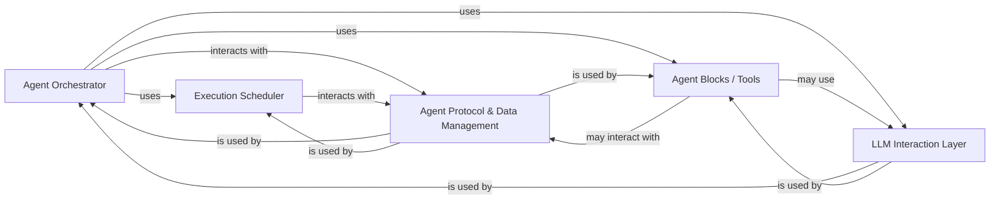

## Component Details

This section details the core components responsible for orchestrating the execution of agent graphs within the AutoGPT platform. It covers the central decision-making, task management, interaction with external capabilities, and data handling that define an agent's operational flow.

### Agent Orchestrator

The central "brain" of the agent. It is responsible for high-level decision-making, planning, and managing the overall execution flow. It interprets the agent's goals, determines the next best action, selects appropriate tools/components, and guides the task progression.

**Related Classes/Methods**:

- <a href="https://github.com/Significant-Gravitas/AutoGPT/blob/master/autogpt_platform/backend/backend/executor/manager.py#L0-L0" target="_blank" rel="noopener noreferrer">`autogpt_platform.backend.backend.executor.manager` (0:0)</a>

- <a href="https://github.com/Significant-Gravitas/AutoGPT/blob/master/classic/forge/forge/agent/forge_agent.py#L0-L0" target="_blank" rel="noopener noreferrer">`classic.forge.forge.agent.forge_agent` (0:0)</a>

### Execution Scheduler

Specifically found in the `autogpt_platform` backend, this component manages the sequence and timing of tasks or steps within an agent's execution graph. It ensures that operations are performed in a logical and efficient order, especially in complex, multi-step workflows.

**Related Classes/Methods**:

- <a href="https://github.com/Significant-Gravitas/AutoGPT/blob/master/autogpt_platform/backend/backend/executor/scheduler.py#L0-L0" target="_blank" rel="noopener noreferrer">`autogpt_platform.backend.backend.executor.scheduler` (0:0)</a>

### Agent Blocks / Tools

These are modular capabilities and integrations that the Agent Orchestrator utilizes to perform specific tasks. They encapsulate functionalities like code execution, file management, web browsing, interacting with external APIs (e.g., Discord, GitHub, Google services), and more. They are the "hands and feet" of the agent.

**Related Classes/Methods**:

- <a href="https://github.com/Significant-Gravitas/AutoGPT/blob/master/autogpt_platform/backend/backend/blocks/code_executor.py#L0-L0" target="_blank" rel="noopener noreferrer">`autogpt_platform.backend.backend.blocks.code_executor` (0:0)</a>

- <a href="https://github.com/Significant-Gravitas/AutoGPT/blob/master/autogpt_platform/backend/backend/blocks/search.py#L0-L0" target="_blank" rel="noopener noreferrer">`autogpt_platform.backend.backend.blocks.search` (0:0)</a>

- <a href="https://github.com/Significant-Gravitas/AutoGPT/blob/master/autogpt_platform/backend/backend/blocks/discord.py#L0-L0" target="_blank" rel="noopener noreferrer">`autogpt_platform.backend.backend.blocks.discord` (0:0)</a>

- `classic.forge.forge.components.code_executor` (0:0)

- `classic.forge.forge.components.file_manager` (0:0)

- `classic.forge.forge.components.web` (0:0)

### LLM Interaction Layer

This component is dedicated to managing all communications with Large Language Models. It handles prompt construction, selects the appropriate LLM provider (e.g., OpenAI, Anthropic, Groq), sends API requests, and parses the responses. It ensures the agent can effectively leverage the intelligence of LLMs for reasoning and generation.

**Related Classes/Methods**:

- `classic.forge.forge.llm.prompting` (0:0)

- `classic.forge.forge.llm.providers` (0:0)

- <a href="https://github.com/Significant-Gravitas/AutoGPT/blob/master/autogpt_platform/backend/backend/blocks/llm.py#L0-L0" target="_blank" rel="noopener noreferrer">`autogpt_platform.backend.backend.blocks.llm` (0:0)</a>

### Agent Protocol & Data Management

This component defines the communication standards and handles the persistence of agent-related data. It manages the storage and retrieval of tasks, execution steps, and generated artifacts, ensuring statefulness and the ability to resume operations. It also facilitates communication between different parts of the agent system or with external services.

**Related Classes/Methods**:

- <a href="https://github.com/Significant-Gravitas/AutoGPT/blob/master/classic/forge/forge/agent/protocols.py#L0-L0" target="_blank" rel="noopener noreferrer">`classic.forge.forge.agent.protocols` (0:0)</a>

- <a href="https://github.com/Significant-Gravitas/AutoGPT/blob/master/autogpt_platform/backend/backend/executor/database.py#L0-L0" target="_blank" rel="noopener noreferrer">`autogpt_platform.backend.backend.executor.database` (0:0)</a>

### [FAQ](https://github.com/CodeBoarding/GeneratedOnBoardings/tree/main?tab=readme-ov-file#faq)