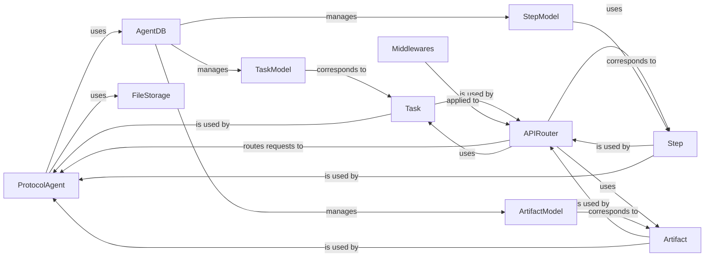

## Component Details

The Agent Protocol Interface subsystem in `forge/agent_protocol` provides a standardized API for interacting with AI agents, adhering to the Agent Protocol specification. It manages tasks, artifacts, and communication.

### ProtocolAgent

This is the core business logic component of the Agent Protocol. It orchestrates the creation, execution, and management of tasks and steps, and handles artifact storage and retrieval. It acts as the bridge between incoming API requests and the underlying agent's capabilities.

**Related Classes/Methods**:

- `ProtocolAgent` (0:0)

### APIRouter

This component defines all the API endpoints for the Agent Protocol, mapping specific HTTP methods and URLs to the corresponding handler functions within the `ProtocolAgent`. It's built using FastAPI's `APIRouter` and serves as the public-facing interface for the Agent Protocol.

**Related Classes/Methods**:

- `APIRouter` (0:0)

### AgentDB

This class manages the database connection and provides an abstraction layer for performing CRUD operations on tasks, steps, and artifacts. It ensures that the state of the Agent Protocol entities is persistently stored.

**Related Classes/Methods**:

- `AgentDB` (0:0)

### TaskModel

This is an SQLAlchemy ORM model that defines the database schema for tasks, including fields like task ID, input, and status.

**Related Classes/Methods**:

- `TaskModel` (0:0)

### StepModel

This is an SQLAlchemy ORM model that defines the database schema for steps, including fields like step ID, task ID, input, and status.

**Related Classes/Methods**:

- `StepModel` (0:0)

### ArtifactModel

This is an SQLAlchemy ORM model that defines the database schema for artifacts, including fields like artifact ID, task ID, step ID, and file path.

**Related Classes/Methods**:

- `ArtifactModel` (0:0)

### Task

This is a Pydantic model that defines the data structure for tasks as specified by the Agent Protocol. It's used for request and response validation and serialization in the API.

**Related Classes/Methods**:

- <a href="https://github.com/Significant-Gravitas/AutoGPT/blob/master/classic/forge/forge/agent_protocol/models/task.py#L21-L45" target="_blank" rel="noopener noreferrer">`Task` (21:45)</a>

### Step

This is a Pydantic model that defines the data structure for steps as specified by the Agent Protocol. It's used for request and response validation and serialization in the API.

**Related Classes/Methods**:

- `Step` (0:0)

### Artifact

This is a Pydantic model that defines the data structure for artifacts as specified by the Agent Protocol. It's used for request and response validation and serialization in the API.

**Related Classes/Methods**:

- <a href="https://github.com/Significant-Gravitas/AutoGPT/blob/master/classic/forge/forge/agent_protocol/models/artifact.py#L5-L33" target="_blank" rel="noopener noreferrer">`Artifact` (5:33)</a>

### Middlewares

This module contains middleware functions that are applied to the FastAPI application for cross-cutting concerns like authentication, logging, or global error handling.

**Related Classes/Methods**:

- <a href="https://github.com/Significant-Gravitas/AutoGPT/blob/master/classic/forge/forge/agent_protocol/middlewares.py#L0-L0" target="_blank" rel="noopener noreferrer">`Middlewares` (0:0)</a>

### FileStorage

A component responsible for managing and storing artifacts.

**Related Classes/Methods**: _None_

### [FAQ](https://github.com/CodeBoarding/GeneratedOnBoardings/tree/main?tab=readme-ov-file#faq)