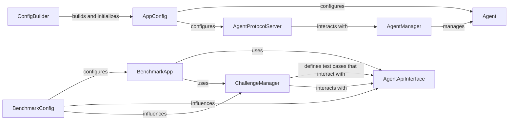

## Component Details

This component encompasses the original standalone AutoGPT application logic and a comprehensive framework for systematically running and evaluating AI agents against predefined challenges. It integrates the core agent behavior with a robust benchmarking system.

### Agent

The central autonomous entity responsible for task execution, decision-making, and interaction with its environment. It is the "brain" of the AutoGPT application.

**Related Classes/Methods**:

- <a href="https://github.com/Significant-Gravitas/AutoGPT/blob/master/classic/original_autogpt/autogpt/agents/agent.py#L86-L312" target="_blank" rel="noopener noreferrer">`autogpt.agents.agent.Agent` (86:312)</a>

### AgentManager

Oversees the lifecycle and operations of `Agent` instances, handling their creation, execution, and termination. It acts as an orchestrator for single or multiple agent runs.

**Related Classes/Methods**:

- <a href="https://github.com/Significant-Gravitas/AutoGPT/blob/master/classic/original_autogpt/autogpt/agents/agent_manager.py#L10-L45" target="_blank" rel="noopener noreferrer">`autogpt.agents.agent_manager.AgentManager` (10:45)</a>

### AppConfig

Manages the global configuration settings for the entire AutoGPT application, including parameters for agents, tools, API keys, and overall system behavior.

**Related Classes/Methods**:

- <a href="https://github.com/Significant-Gravitas/AutoGPT/blob/master/classic/original_autogpt/autogpt/app/config.py#L26-L101" target="_blank" rel="noopener noreferrer">`autogpt.app.config.AppConfig` (26:101)</a>

### ConfigBuilder

A utility module responsible for constructing and initializing the `AppConfig` instance by loading configurations from various sources like environment variables, `.env` files, and command-line arguments.

**Related Classes/Methods**:

- <a href="https://github.com/Significant-Gravitas/AutoGPT/blob/master/classic/original_autogpt/autogpt/app/config.py#L104-L127" target="_blank" rel="noopener noreferrer">`autogpt.app.config.ConfigBuilder` (104:127)</a>

### AgentProtocolServer

Handles communication protocols for agents, acting as an API server that allows external services or other components (like the benchmarking framework) to interact with and manage agents.

**Related Classes/Methods**:

- <a href="https://github.com/Significant-Gravitas/AutoGPT/blob/master/classic/original_autogpt/autogpt/app/agent_protocol_server.py#L42-L476" target="_blank" rel="noopener noreferrer">`autogpt.app.agent_protocol_server.AgentProtocolServer` (42:476)</a>

### BenchmarkApp

The central application logic for running the benchmarking process. It orchestrates the execution of challenges, interacts with the agent under test, and manages the overall flow of the benchmark.

**Related Classes/Methods**:

- <a href="https://github.com/Significant-Gravitas/AutoGPT/blob/master/classic/benchmark/agbenchmark/app.py#L1-L1" target="_blank" rel="noopener noreferrer">`agbenchmark.app` (1:1)</a>

- <a href="https://github.com/Significant-Gravitas/AutoGPT/blob/master/classic/benchmark/agbenchmark/main.py#L1-L1" target="_blank" rel="noopener noreferrer">`agbenchmark.main` (1:1)</a>

- <a href="https://github.com/Significant-Gravitas/AutoGPT/blob/master/classic/benchmark/agbenchmark/__main__.py#L1-L1" target="_blank" rel="noopener noreferrer">`agbenchmark.__main__` (1:1)</a>

### ChallengeManager

Manages the various types of challenges used in the benchmarking framework. It defines the structure for challenges (e.g., `BaseChallenge`, `BuiltinChallenge`, `WebArenaChallenge`) and provides mechanisms for their execution and evaluation.

**Related Classes/Methods**:

- <a href="https://github.com/Significant-Gravitas/AutoGPT/blob/master/classic/benchmark/agbenchmark/challenges/base.py#L34-L106" target="_blank" rel="noopener noreferrer">`agbenchmark.challenges.base.BaseChallenge` (34:106)</a>

- <a href="https://github.com/Significant-Gravitas/AutoGPT/blob/master/classic/benchmark/agbenchmark/challenges/builtin.py#L99-L420" target="_blank" rel="noopener noreferrer">`agbenchmark.challenges.builtin.BuiltinChallenge` (99:420)</a>

- <a href="https://github.com/Significant-Gravitas/AutoGPT/blob/master/classic/benchmark/agbenchmark/challenges/webarena.py#L276-L467" target="_blank" rel="noopener noreferrer">`agbenchmark.challenges.webarena.WebArenaChallenge` (276:467)</a>

### AgentApiInterface

Defines a standardized interface for the benchmarking framework to interact with the AI agent being tested. This abstraction allows the benchmark to be run against different agent implementations without modifying the core benchmark logic.

**Related Classes/Methods**:

- <a href="https://github.com/Significant-Gravitas/AutoGPT/blob/master/classic/benchmark/agbenchmark/agent_api_interface.py#L1-L1" target="_blank" rel="noopener noreferrer">`agbenchmark.agent_api_interface` (1:1)</a>

- <a href="https://github.com/Significant-Gravitas/AutoGPT/blob/master/classic/benchmark/agbenchmark/agent_interface.py#L1-L1" target="_blank" rel="noopener noreferrer">`agbenchmark.agent_interface` (1:1)</a>

### BenchmarkConfig

Manages the configuration settings specific to the benchmarking process, such as test parameters, report generation options, and paths to agent implementations.

**Related Classes/Methods**:

- <a href="https://github.com/Significant-Gravitas/AutoGPT/blob/master/classic/benchmark/agbenchmark/config.py#L1-L1" target="_blank" rel="noopener noreferrer">`agbenchmark.config` (1:1)</a>

### [FAQ](https://github.com/CodeBoarding/GeneratedOnBoardings/tree/main?tab=readme-ov-file#faq)