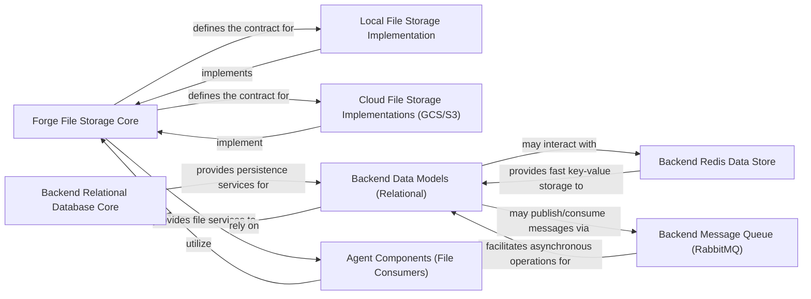

## Component Details

The Data Persistence Layer provides a unified and abstracted interface for all persistent data operations across the platform. It manages various data types, including user information, API keys, agent graphs, execution logs, and integration configurations, abstracting the underlying storage mechanisms (e.g., PostgreSQL, Redis, local filesystem, cloud storage).

### Forge File Storage Core

This component defines the abstract interface for file storage operations within the forge framework. It provides a standardized contract that concrete storage implementations must adhere to, ensuring that autonomous agents can interact with various file storage backends uniformly.

**Related Classes/Methods**:

- <a href="https://github.com/Significant-Gravitas/AutoGPT/blob/master/classic/forge/forge/file_storage/base.py#L0-L0" target="_blank" rel="noopener noreferrer">`forge.file_storage.base.FileStorage` (0:0)</a>

- <a href="https://github.com/Significant-Gravitas/AutoGPT/blob/master/classic/forge/forge/file_storage/base.py#L0-L0" target="_blank" rel="noopener noreferrer">`forge.file_storage.base.FileSyncHandler` (0:0)</a>

### Local File Storage Implementation

A concrete implementation of the Forge File Storage Core, responsible for managing files on the local filesystem. This provides the default and most accessible file persistence mechanism for agents.

**Related Classes/Methods**:

- <a href="https://github.com/Significant-Gravitas/AutoGPT/blob/master/classic/forge/forge/file_storage/local.py#L0-L0" target="_blank" rel="noopener noreferrer">`forge.file_storage.local.LocalFileStorage` (0:0)</a>

### Cloud File Storage Implementations (GCS/S3)

These components provide concrete implementations of the Forge File Storage Core for managing files on Google Cloud Storage (GCS) and Amazon S3. They extend the platform's file persistence capabilities to scalable, robust, and distributed cloud environments.

**Related Classes/Methods**:

- <a href="https://github.com/Significant-Gravitas/AutoGPT/blob/master/classic/forge/forge/file_storage/gcs.py#L0-L0" target="_blank" rel="noopener noreferrer">`forge.file_storage.gcs.GCSFileStorage` (0:0)</a>

- <a href="https://github.com/Significant-Gravitas/AutoGPT/blob/master/classic/forge/forge/file_storage/s3.py#L0-L0" target="_blank" rel="noopener noreferrer">`forge.file_storage.s3.S3FileStorage` (0:0)</a>

### Backend Relational Database Core

This is the central component for managing relational database connections and Object-Relational Mapping (ORM) within the autogpt_platform backend. It serves as the primary interface for structured data persistence, typically interacting with a PostgreSQL database.

**Related Classes/Methods**:

- <a href="https://github.com/Significant-Gravitas/AutoGPT/blob/master/autogpt_platform/backend/backend/data/db.py#L0-L0" target="_blank" rel="noopener noreferrer">`autogpt_platform.backend.backend.data.db` (0:0)</a>

### Backend Data Models (Relational)

This collection of modules defines the specific data structures (models) and provides the persistence logic for various platform entities that are stored in the relational database. This includes data related to analytics, API keys, costs, execution logs, agent graphs, integrations, notifications, and user profiles.

**Related Classes/Methods**:

- <a href="https://github.com/Significant-Gravitas/AutoGPT/blob/master/autogpt_platform/backend/backend/data/analytics.py#L0-L0" target="_blank" rel="noopener noreferrer">`autogpt_platform.backend.backend.data.analytics` (0:0)</a>

- <a href="https://github.com/Significant-Gravitas/AutoGPT/blob/master/autogpt_platform/backend/backend/data/api_key.py#L0-L0" target="_blank" rel="noopener noreferrer">`autogpt_platform.backend.backend.data.api_key` (0:0)</a>

- <a href="https://github.com/Significant-Gravitas/AutoGPT/blob/master/autogpt_platform/backend/backend/data/block.py#L0-L0" target="_blank" rel="noopener noreferrer">`autogpt_platform.backend.backend.data.block` (0:0)</a>

- <a href="https://github.com/Significant-Gravitas/AutoGPT/blob/master/autogpt_platform/backend/backend/data/block_cost_config.py#L0-L0" target="_blank" rel="noopener noreferrer">`autogpt_platform.backend.backend.data.block_cost_config` (0:0)</a>

- <a href="https://github.com/Significant-Gravitas/AutoGPT/blob/master/autogpt_platform/backend/backend/data/cost.py#L0-L0" target="_blank" rel="noopener noreferrer">`autogpt_platform.backend.backend.data.cost` (0:0)</a>

- <a href="https://github.com/Significant-Gravitas/AutoGPT/blob/master/autogpt_platform/backend/backend/data/credit.py#L0-L0" target="_blank" rel="noopener noreferrer">`autogpt_platform.backend.backend.data.credit` (0:0)</a>

- <a href="https://github.com/Significant-Gravitas/AutoGPT/blob/master/autogpt_platform/backend/backend/data/execution.py#L0-L0" target="_blank" rel="noopener noreferrer">`autogpt_platform.backend.backend.data.execution` (0:0)</a>

- <a href="https://github.com/Significant-Gravitas/AutoGPT/blob/master/autogpt_platform/backend/backend/data/graph.py#L0-L0" target="_blank" rel="noopener noreferrer">`autogpt_platform.backend.backend.data.graph` (0:0)</a>

- <a href="https://github.com/Significant-Gravitas/AutoGPT/blob/master/autogpt_platform/backend/backend/data/includes.py#L0-L0" target="_blank" rel="noopener noreferrer">`autogpt_platform.backend.backend.data.includes` (0:0)</a>

- <a href="https://github.com/Significant-Gravitas/AutoGPT/blob/master/autogpt_platform/backend/backend/data/integrations.py#L0-L0" target="_blank" rel="noopener noreferrer">`autogpt_platform.backend.backend.data.integrations` (0:0)</a>

- <a href="https://github.com/Significant-Gravitas/AutoGPT/blob/master/autogpt_platform/backend/backend/data/model.py#L0-L0" target="_blank" rel="noopener noreferrer">`autogpt_platform.backend.backend.data.model` (0:0)</a>

- <a href="https://github.com/Significant-Gravitas/AutoGPT/blob/master/autogpt_platform/backend/backend/data/notifications.py#L0-L0" target="_blank" rel="noopener noreferrer">`autogpt_platform.backend.backend.data.notifications` (0:0)</a>

- <a href="https://github.com/Significant-Gravitas/AutoGPT/blob/master/autogpt_platform/backend/backend/data/onboarding.py#L0-L0" target="_blank" rel="noopener noreferrer">`autogpt_platform.backend.backend.data.onboarding` (0:0)</a>

- <a href="https://github.com/Significant-Gravitas/AutoGPT/blob/master/autogpt_platform/backend/backend/data/user.py#L0-L0" target="_blank" rel="noopener noreferrer">`autogpt_platform.backend.backend.data.user` (0:0)</a>

### Backend Redis Data Store

This component handles interactions with a Redis instance, primarily used for high-speed key-value storage, caching, and potentially session management within the backend. It complements the relational database for specific performance-critical use cases.

**Related Classes/Methods**:

- <a href="https://github.com/Significant-Gravitas/AutoGPT/blob/master/autogpt_platform/backend/backend/data/redis.py#L0-L0" target="_blank" rel="noopener noreferrer">`autogpt_platform.backend.backend.data.redis` (0:0)</a>

### Backend Message Queue (RabbitMQ)

This component manages interactions with RabbitMQ, facilitating asynchronous communication and task queuing within the backend. It enables decoupled processing of tasks and events, improving scalability and responsiveness.

**Related Classes/Methods**:

- <a href="https://github.com/Significant-Gravitas/AutoGPT/blob/master/autogpt_platform/backend/backend/data/rabbitmq.py#L0-L0" target="_blank" rel="noopener noreferrer">`autogpt_platform.backend.backend.data.rabbitmq` (0:0)</a>

- <a href="https://github.com/Significant-Gravitas/AutoGPT/blob/master/autogpt_platform/backend/backend/data/queue.py#L0-L0" target="_blank" rel="noopener noreferrer">`autogpt_platform.backend.backend.data.queue` (0:0)</a>

### Agent Components (File Consumers)

Various components within the forge agent framework that directly interact with the Forge File Storage Core to perform file-related operations (read, write, manage) during the execution of autonomous agents.

**Related Classes/Methods**:

- <a href="https://github.com/Significant-Gravitas/AutoGPT/blob/master/classic/forge/forge/agent_protocol/agent.py#L30-L192" target="_blank" rel="noopener noreferrer">`forge.agent_protocol.agent.ProtocolAgent` (30:192)</a>

- <a href="https://github.com/Significant-Gravitas/AutoGPT/blob/master/classic/forge/forge/components/code_executor/code_executor.py#L68-L432" target="_blank" rel="noopener noreferrer">`forge.components.code_executor.code_executor.CodeExecutorComponent` (68:432)</a>

- <a href="https://github.com/Significant-Gravitas/AutoGPT/blob/master/classic/forge/forge/components/context/context.py#L43-L162" target="_blank" rel="noopener noreferrer">`forge.components.context.context.ContextComponent` (43:162)</a>

- <a href="https://github.com/Significant-Gravitas/AutoGPT/blob/master/classic/forge/forge/components/file_manager/file_manager.py#L31-L185" target="_blank" rel="noopener noreferrer">`forge.components.file_manager.file_manager.FileManagerComponent` (31:185)</a>

- <a href="https://github.com/Significant-Gravitas/AutoGPT/blob/master/classic/forge/forge/components/image_gen/image_gen.py#L37-L266" target="_blank" rel="noopener noreferrer">`forge.components.image_gen.image_gen.ImageGeneratorComponent` (37:266)</a>

### [FAQ](https://github.com/CodeBoarding/GeneratedOnBoardings/tree/main?tab=readme-ov-file#faq)