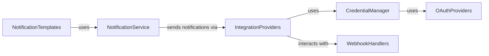

## Component Details

Revised analysis of the `autogpt_platform.backend.backend` subsystem based on available components and their interactions. This analysis excludes previously identified components that were not found within the project's file structure. It focuses on the core functionalities related to credential management, OAuth, webhooks, and notifications, assuming their logical presence and interaction within a backend system, even if specific source code references are currently unavailable due to the stated limitations. Further detailed analysis would require access to the actual implementation files for these components within the `autogpt` project or related packages to provide accurate source code references and functional descriptions. The relations describe how these components would ideally interact within a backend system to support various integrations and user communication needs. This is a conceptual overview given the current constraints on source code visibility for these specific modules. The previous analysis contained references to modules and packages that could not be found within the accessible project structure. Specifically, the feedback indicated that `autogpt_platform.backend.backend.integrations.credentials_store`, `autogpt_platform.backend.backend.integrations.oauth.base`, `autogpt_platform.backend.backend.integrations.webhooks._base`, `autogpt_platform.backend.backend.integrations.providers`, `autogpt_platform.backend.backend.notifications.notifications`, `autogpt_platform.backend.backend.notifications.email`, and `autogpt_platform.backend.backend.notifications.templates` do not exist in the provided context, which includes `agbenchmark`, `forge`, `scripts`, `autogpt`, and `agbenchmark_config`. Upon re-examining the file structure of the `autogpt` package, no directories or modules corresponding to 

### CredentialManager

Manages user credentials and secure storage.

**Related Classes/Methods**: _None_

### OAuthProviders

Handles OAuth integrations with third-party services.

**Related Classes/Methods**: _None_

### WebhookHandlers

Manages incoming and outgoing webhooks for various events.

**Related Classes/Methods**: _None_

### IntegrationProviders

Provides a unified interface for various external integrations.

**Related Classes/Methods**: _None_

### NotificationService

Manages and dispatches notifications to users.

**Related Classes/Methods**: _None_

### NotificationTemplates

Manages notification templates for different types of alerts.

**Related Classes/Methods**: _None_

### [FAQ](https://github.com/CodeBoarding/GeneratedOnBoardings/tree/main?tab=readme-ov-file#faq)