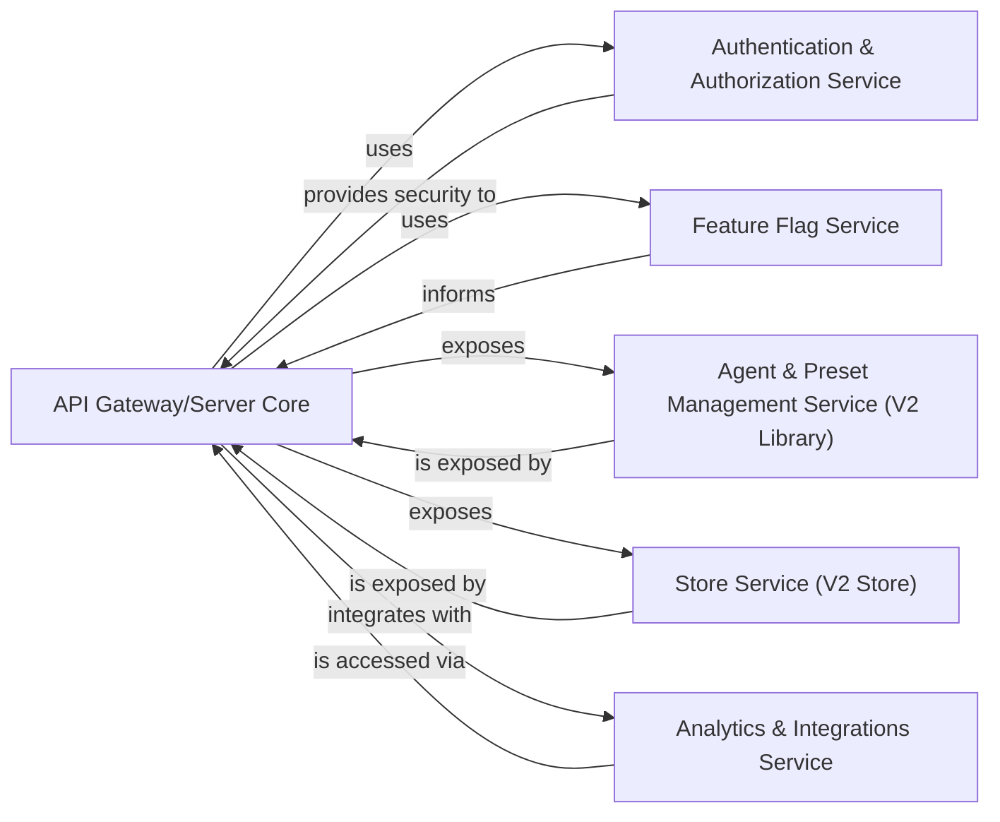

## Component Details

The Platform Backend & API serves as the central hub for user interaction and platform management. It exposes REST and WebSocket APIs, handles user authentication and authorization, manages agent and preset definitions, and controls feature availability.

### API Gateway/Server Core

The primary entry point for all client interactions, managing both RESTful and WebSocket communication. It handles request routing, connection management, and acts as an orchestrator for various backend services.

**Related Classes/Methods**:

- <a href="https://github.com/Significant-Gravitas/AutoGPT/blob/master/autogpt_platform/backend/backend/server/rest_api.py#L0-L0" target="_blank" rel="noopener noreferrer">`autogpt_platform/backend/backend/server/rest_api.py` (0:0)</a>

- <a href="https://github.com/Significant-Gravitas/AutoGPT/blob/master/autogpt_platform/backend/backend/server/ws_api.py#L0-L0" target="_blank" rel="noopener noreferrer">`autogpt_platform/backend/backend/server/ws_api.py` (0:0)</a>

- <a href="https://github.com/Significant-Gravitas/AutoGPT/blob/master/autogpt_platform/backend/backend/server/conn_manager.py#L0-L0" target="_blank" rel="noopener noreferrer">`autogpt_platform/backend/backend/server/conn_manager.py` (0:0)</a>

- <a href="https://github.com/Significant-Gravitas/AutoGPT/blob/master/autogpt_platform/backend/backend/server/routers/v1.py#L0-L0" target="_blank" rel="noopener noreferrer">`autogpt_platform/backend/backend/server/routers/v1.py` (0:0)</a>

- <a href="https://github.com/Significant-Gravitas/AutoGPT/blob/master/autogpt_platform/backend/backend/server/routers/analytics.py#L0-L0" target="_blank" rel="noopener noreferrer">`autogpt_platform/backend/backend/server/routers/analytics.py` (0:0)</a>

- <a href="https://github.com/Significant-Gravitas/AutoGPT/blob/master/autogpt_platform/backend/backend/server/external/api.py#L0-L0" target="_blank" rel="noopener noreferrer">`autogpt_platform/backend/backend/server/external/api.py` (0:0)</a>

- <a href="https://github.com/Significant-Gravitas/AutoGPT/blob/master/autogpt_platform/backend/backend/server/external/middleware.py#L0-L0" target="_blank" rel="noopener noreferrer">`autogpt_platform/backend/backend/server/external/middleware.py` (0:0)</a>

- <a href="https://github.com/Significant-Gravitas/AutoGPT/blob/master/autogpt_platform/backend/backend/server/external/routes/v1.py#L0-L0" target="_blank" rel="noopener noreferrer">`autogpt_platform/backend/backend/server/external/routes/v1.py` (0:0)</a>

### Authentication & Authorization Service

Responsible for user authentication, token validation (e.g., JWT), and enforcing access control policies across the platform's APIs.

**Related Classes/Methods**:

- <a href="https://github.com/Significant-Gravitas/AutoGPT/blob/master/autogpt_platform/autogpt_libs/autogpt_libs/auth/__init__.py#L0-L0" target="_blank" rel="noopener noreferrer">`autogpt_platform/autogpt_libs/autogpt_libs/auth/__init__.py` (0:0)</a>

- <a href="https://github.com/Significant-Gravitas/AutoGPT/blob/master/autogpt_platform/autogpt_libs/autogpt_libs/auth/config.py#L0-L0" target="_blank" rel="noopener noreferrer">`autogpt_platform/autogpt_libs/autogpt_libs/auth/config.py` (0:0)</a>

- <a href="https://github.com/Significant-Gravitas/AutoGPT/blob/master/autogpt_platform/autogpt_libs/autogpt_libs/auth/depends.py#L0-L0" target="_blank" rel="noopener noreferrer">`autogpt_platform/autogpt_libs/autogpt_libs/auth/depends.py` (0:0)</a>

- <a href="https://github.com/Significant-Gravitas/AutoGPT/blob/master/autogpt_platform/autogpt_libs/autogpt_libs/auth/jwt_utils.py#L0-L0" target="_blank" rel="noopener noreferrer">`autogpt_platform/autogpt_libs/autogpt_libs/auth/jwt_utils.py` (0:0)</a>

- <a href="https://github.com/Significant-Gravitas/AutoGPT/blob/master/autogpt_platform/autogpt_libs/autogpt_libs/auth/middleware.py#L0-L0" target="_blank" rel="noopener noreferrer">`autogpt_platform/autogpt_libs/autogpt_libs/auth/middleware.py` (0:0)</a>

- <a href="https://github.com/Significant-Gravitas/AutoGPT/blob/master/autogpt_platform/autogpt_libs/autogpt_libs/auth/models.py#L0-L0" target="_blank" rel="noopener noreferrer">`autogpt_platform/autogpt_libs/autogpt_libs/auth/models.py` (0:0)</a>

### Feature Flag Service

Manages the dynamic activation and deactivation of features within the platform, enabling A/B testing and controlled rollouts.

**Related Classes/Methods**:

- <a href="https://github.com/Significant-Gravitas/AutoGPT/blob/master/autogpt_platform/autogpt_libs/autogpt_libs/feature_flag/__init__.py#L0-L0" target="_blank" rel="noopener noreferrer">`autogpt_platform/autogpt_libs/autogpt_libs/feature_flag/__init__.py` (0:0)</a>

- <a href="https://github.com/Significant-Gravitas/AutoGPT/blob/master/autogpt_platform/autogpt_libs/autogpt_libs/feature_flag/client.py#L0-L0" target="_blank" rel="noopener noreferrer">`autogpt_platform/autogpt_libs/autogpt_libs/feature_flag/client.py` (0:0)</a>

- <a href="https://github.com/Significant-Gravitas/AutoGPT/blob/master/autogpt_platform/autogpt_libs/autogpt_libs/feature_flag/config.py#L0-L0" target="_blank" rel="noopener noreferrer">`autogpt_platform/autogpt_libs/autogpt_libs/feature_flag/config.py` (0:0)</a>

### Agent & Preset Management Service (V2 Library)

Provides API endpoints and business logic for managing autonomous agent configurations and predefined presets, specifically for the V2 API.

**Related Classes/Methods**:

- <a href="https://github.com/Significant-Gravitas/AutoGPT/blob/master/autogpt_platform/backend/backend/server/v2/library/__init__.py#L0-L0" target="_blank" rel="noopener noreferrer">`autogpt_platform/backend/backend/server/v2/library/__init__.py` (0:0)</a>

- <a href="https://github.com/Significant-Gravitas/AutoGPT/blob/master/autogpt_platform/backend/backend/server/v2/library/db.py#L0-L0" target="_blank" rel="noopener noreferrer">`autogpt_platform/backend/backend/server/v2/library/db.py` (0:0)</a>

- <a href="https://github.com/Significant-Gravitas/AutoGPT/blob/master/autogpt_platform/backend/backend/server/v2/library/model.py#L0-L0" target="_blank" rel="noopener noreferrer">`autogpt_platform/backend/backend/server/v2/library/model.py` (0:0)</a>

- <a href="https://github.com/Significant-Gravitas/AutoGPT/blob/master/autogpt_platform/backend/backend/server/v2/library/routes/agents.py#L0-L0" target="_blank" rel="noopener noreferrer">`autogpt_platform/backend/backend/server/v2/library/routes/agents.py` (0:0)</a>

- <a href="https://github.com/Significant-Gravitas/AutoGPT/blob/master/autogpt_platform/backend/backend/server/v2/library/routes/presets.py#L0-L0" target="_blank" rel="noopener noreferrer">`autogpt_platform/backend/backend/server/v2/library/routes/presets.py` (0:0)</a>

### Store Service (V2 Store)

Manages functionalities related to a digital store, including data persistence, media handling, and potentially image generation, as part of the V2 API.

**Related Classes/Methods**:

- <a href="https://github.com/Significant-Gravitas/AutoGPT/blob/master/autogpt_platform/backend/backend/server/v2/store/__init__.py#L0-L0" target="_blank" rel="noopener noreferrer">`autogpt_platform/backend/backend/server/v2/store/__init__.py` (0:0)</a>

- <a href="https://github.com/Significant-Gravitas/AutoGPT/blob/master/autogpt_platform/backend/backend/server/v2/store/db.py#L0-L0" target="_blank" rel="noopener noreferrer">`autogpt_platform/backend/backend/server/v2/store/db.py` (0:0)</a>

- <a href="https://github.com/Significant-Gravitas/AutoGPT/blob/master/autogpt_platform/backend/backend/server/v2/store/exceptions.py#L0-L0" target="_blank" rel="noopener noreferrer">`autogpt_platform/backend/backend/server/v2/store/exceptions.py` (0:0)</a>

- <a href="https://github.com/Significant-Gravitas/AutoGPT/blob/master/autogpt_platform/backend/backend/server/v2/store/image_gen.py#L0-L0" target="_blank" rel="noopener noreferrer">`autogpt_platform/backend/backend/server/v2/store/image_gen.py` (0:0)</a>

- <a href="https://github.com/Significant-Gravitas/AutoGPT/blob/master/autogpt_platform/backend/backend/server/v2/store/media.py#L0-L0" target="_blank" rel="noopener noreferrer">`autogpt_platform/backend/backend/server/v2/store/media.py` (0:0)</a>

- <a href="https://github.com/Significant-Gravitas/AutoGPT/blob/master/autogpt_platform/backend/backend/server/v2/store/model.py#L0-L0" target="_blank" rel="noopener noreferrer">`autogpt_platform/backend/backend/server/v2/store/model.py` (0:0)</a>

- <a href="https://github.com/Significant-Gravitas/AutoGPT/blob/master/autogpt_platform/backend/backend/server/v2/store/routes.py#L0-L0" target="_blank" rel="noopener noreferrer">`autogpt_platform/backend/backend/server/v2/store/routes.py` (0:0)</a>

### Analytics & Integrations Service

Handles the collection and processing of analytics data and facilitates integrations with external third-party services (e.g., email providers like Postmark).

**Related Classes/Methods**:

- <a href="https://github.com/Significant-Gravitas/AutoGPT/blob/master/autogpt_platform/backend/backend/server/routers/analytics.py#L0-L0" target="_blank" rel="noopener noreferrer">`autogpt_platform/backend/backend/server/routers/analytics.py` (0:0)</a>

### [FAQ](https://github.com/CodeBoarding/GeneratedOnBoardings/tree/main?tab=readme-ov-file#faq)