```mermaid

graph LR

    Platform_Backend_API["Platform Backend & API"]

    Agent_Core_Execution["Agent Core & Execution"]

    Data_Persistence_Layer["Data Persistence Layer"]

    External_Integrations_Notifications["External Integrations & Notifications"]

    Classic_AutoGPT_Benchmarking["Classic AutoGPT & Benchmarking"]

    Agent_Protocol_Interface["Agent Protocol Interface"]

    Platform_Backend_API -- "Uses" --> Data_Persistence_Layer

    Platform_Backend_API -- "Initiates" --> Agent_Core_Execution

    Agent_Core_Execution -- "Interacts with" --> Data_Persistence_Layer

    Agent_Core_Execution -- "Utilizes" --> External_Integrations_Notifications

    Data_Persistence_Layer -- "Provides Data storage and retrieval services to" --> Platform_Backend_API

    Data_Persistence_Layer -- "Stores Agent graph definitions and execution logs for" --> Agent_Core_Execution

    External_Integrations_Notifications -- "Provides Integration and notification services to" --> Agent_Core_Execution

    External_Integrations_Notifications -- "Interacts with" --> Data_Persistence_Layer

    Classic_AutoGPT_Benchmarking -- "Utilizes" --> Agent_Core_Execution

    Classic_AutoGPT_Benchmarking -- "Interacts with" --> Data_Persistence_Layer

    Agent_Protocol_Interface -- "Provides A standardized API for" --> Classic_AutoGPT_Benchmarking

    Agent_Protocol_Interface -- "Uses" --> Data_Persistence_Layer

    click Platform_Backend_API href "https://github.com/Significant-Gravitas/AutoGPT/blob/master/.codeboarding//Platform_Backend_API.md" "Details"

    click Agent_Core_Execution href "https://github.com/Significant-Gravitas/AutoGPT/blob/master/.codeboarding//Agent_Core_Execution.md" "Details"

    click Data_Persistence_Layer href "https://github.com/Significant-Gravitas/AutoGPT/blob/master/.codeboarding//Data_Persistence_Layer.md" "Details"

    click External_Integrations_Notifications href "https://github.com/Significant-Gravitas/AutoGPT/blob/master/.codeboarding//External_Integrations_Notifications.md" "Details"

    click Classic_AutoGPT_Benchmarking href "https://github.com/Significant-Gravitas/AutoGPT/blob/master/.codeboarding//Classic_AutoGPT_Benchmarking.md" "Details"

    click Agent_Protocol_Interface href "https://github.com/Significant-Gravitas/AutoGPT/blob/master/.codeboarding//Agent_Protocol_Interface.md" "Details"

```

## Component Details

Final architecture analysis for AutoGPT, consolidating insights from the Control Flow Graph (CFG) and Source Code analysis into a high-level overview.

### Platform Backend & API

Serves as the central hub for user interaction and platform management. It exposes REST and WebSocket APIs, handles user authentication and authorization, manages agent and preset definitions, and controls feature availability.

**Related Classes/Methods**:

- `All files in autogpt_platform/backend/backend/server/` (1:1)

- `All files in autogpt_platform/autogpt_libs/autogpt_libs/auth/` (1:1)

- `All files in autogpt_platform/autogpt_libs/autogpt_libs/feature_flag/` (1:1)

- `All files in autogpt_platform/backend/backend/server/v2/library/` (1:1)

- `All files in autogpt_platform/backend/backend/server/v2/store/` (1:1)

### Agent Core & Execution

The brain of the AutoGPT platform, responsible for orchestrating the execution of agent graphs. It manages the flow between different agent blocks, schedules tasks, tracks execution progress, and facilitates interactions with Large Language Models (LLMs) and external tools.

**Related Classes/Methods**:

- `All files in autogpt_platform/backend/backend/executor/` (1:1)

- `All files in autogpt_platform/backend/backend/blocks/` (1:1)

- `All files in classic/forge/forge/agent/` (1:1)

- `All files in classic/forge/forge/components/` (1:1)

- `All files in classic/forge/forge/llm/` (1:1)

### Data Persistence Layer

Provides a unified and abstracted interface for all persistent data operations across the platform. It manages various data types, including user information, API keys, agent graphs, execution logs, and integration configurations, abstracting the underlying storage mechanisms (e.g., PostgreSQL, Redis, local filesystem, cloud storage).

**Related Classes/Methods**:

- `All files in autogpt_platform/backend/backend/data/` (1:1)

- `All files in classic/forge/forge/file_storage/` (1:1)

### External Integrations & Notifications

Manages connections to various external services and handles the dispatch of notifications. It securely stores and retrieves integration credentials, manages OAuth flows, processes webhooks, and sends out user notifications (e.g., email, in-app messages).

**Related Classes/Methods**:

- `All files in autogpt_platform/backend/backend/integrations/` (1:1)

- `All files in autogpt_platform/backend/backend/notifications/` (1:1)

### Classic AutoGPT & Benchmarking

Encompasses the original standalone AutoGPT application logic, including its command-line interface, configuration, and core agent behavior. It also includes the comprehensive framework for systematically running and evaluating AI agents against predefined challenges, generating reports, and analyzing performance.

**Related Classes/Methods**:

- `All files in classic/original_autogpt/autogpt/app/` (1:1)

- `All files in classic/original_autogpt/autogpt/agents/` (1:1)

- `All files in classic/benchmark/agbenchmark/` (1:1)

### Agent Protocol Interface

Implements the Agent Protocol specification, providing a standardized API for external clients or benchmarking tools to interact with AI agents. It handles task management, artifact storage, and communication according to the protocol.

**Related Classes/Methods**:

- `All files in classic/forge/forge/agent_protocol/` (1:1)

### [FAQ](https://github.com/CodeBoarding/GeneratedOnBoardings/tree/main?tab=readme-ov-file#faq)