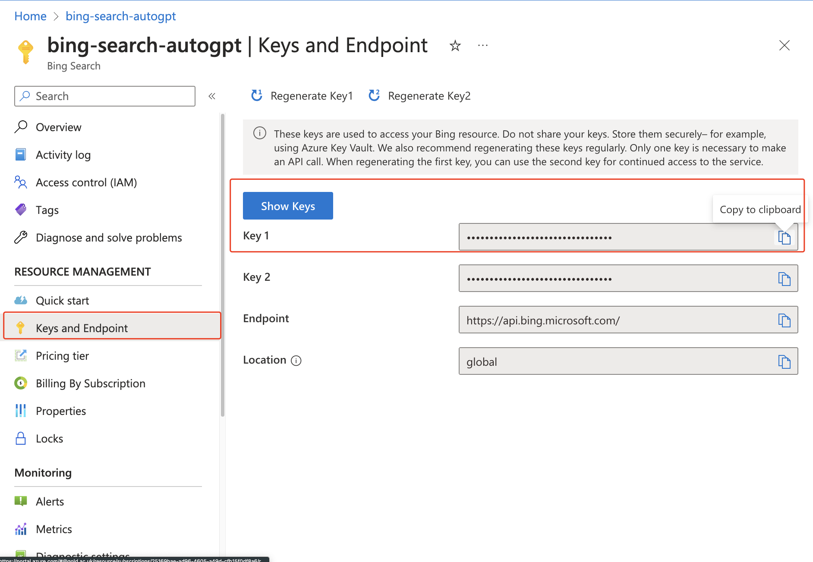

# Auto-GPT 必应搜索插件

语言: [English](https://github.com/Significant-Gravitas/Auto-GPT-Plugins/tree/master/src/autogpt_plugins/bing_search/README.md) | [中文](https://github.com/Significant-Gravitas/Auto-GPT-Plugins/tree/master/src/autogpt_plugins/bing_search/README.zh.md)

Auto-GPT 必应搜索插件是基础项目 Auto-GPT 的一个实用插件。为了扩展搜索选项，此搜索插件将必应搜索引擎集成到 Auto-GPT 中，补充了原有的 Google 搜索和 DuckDuckGo 搜索。

## 主要功能：
- 必应搜索：使用必应搜索引擎进行搜索查询。

## 工作原理：
如果设置了搜索引擎（`SEARCH_ENGINE`）和Bing API密钥(`BING_API_KEY`)的环境变量，搜索引擎将设置为必应

## 安装:
1. 以 ZIP 文件格式下载 Auto-GPT 必应搜索插件存储库。
2. 将 ZIP 文件复制到 Auto-GPT 项目的 "plugins" 文件夹中。

### Bing API 密钥和必应搜索配置:
1. 访问 [Bing Web Search API](https://www.microsoft.com/en-us/bing/apis/bing-web-search-api)。
2. 登录您的 Microsoft Azure 帐户，如果没有帐户，请创建一个新帐户。
3. 设置帐户后，转到 "Keys and Endpoint" 部分。
4. 从那里复制密钥并将其添加到项目目录中的 .env 文件中。
5. 将环境变量命名为 `BING_API_KEY`。



`.env` 文件示例：
```
SEARCH_ENGINE=bing
BING_API_KEY=your_bing_api_key
```

请将 `your_bing_api_key` 替换为从 Microsoft Azure 获取的实际 API 密钥。
