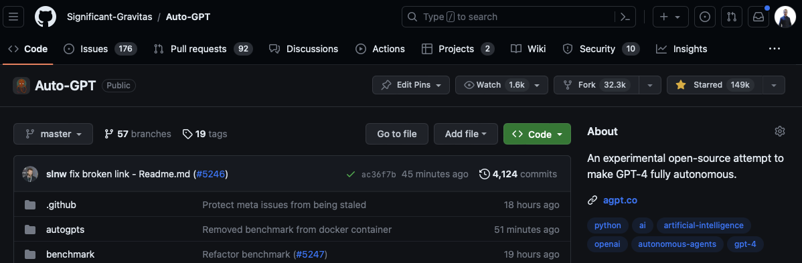
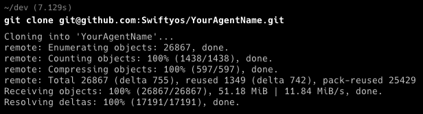
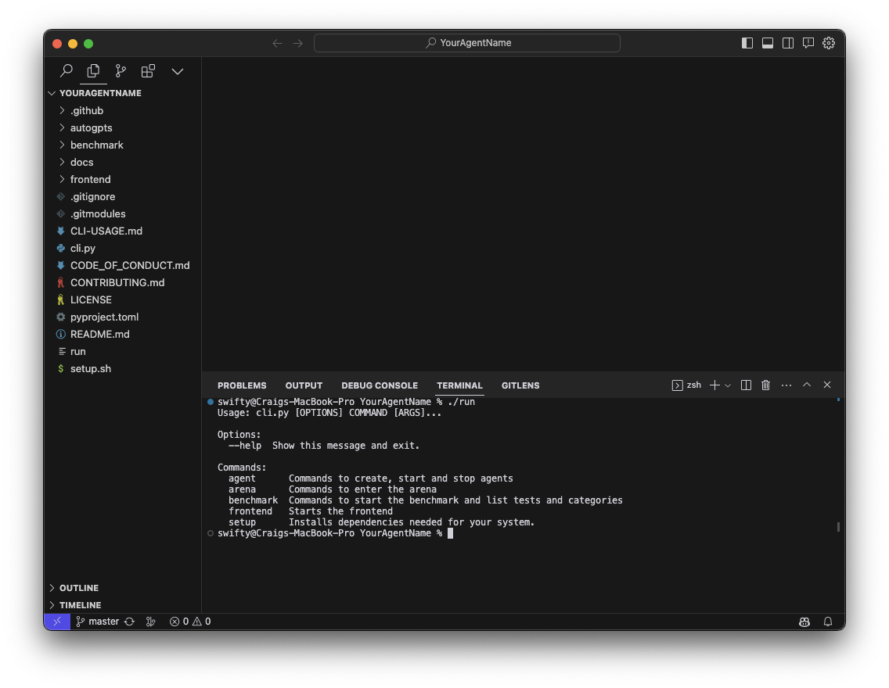
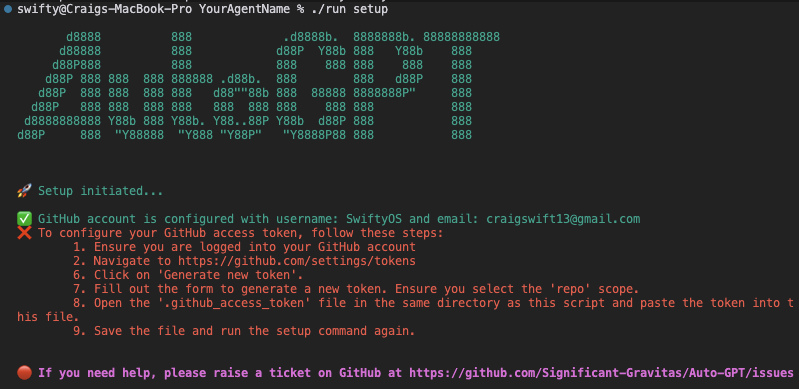
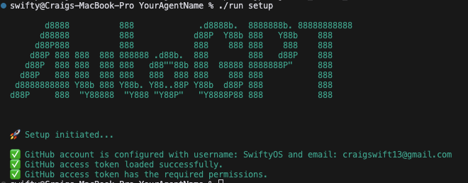
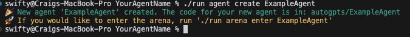
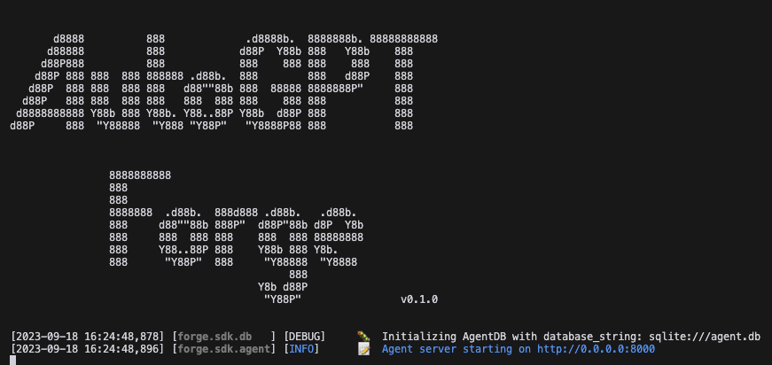
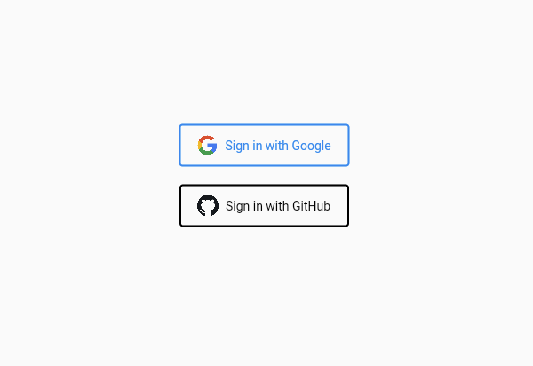
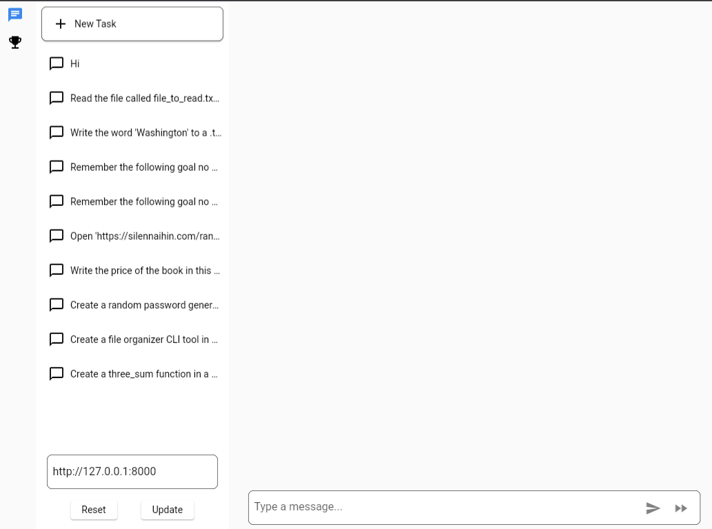

# Quickstart Guide

> For the complete getting started [tutorial series](https://aiedge.medium.com/autogpt-forge-e3de53cc58ec) <- click here

Welcome to the Quickstart Guide! This guide will walk you through the process of setting up and running your own AutoGPT agent. Whether you're a seasoned AI developer or just starting out, this guide will provide you with the necessary steps to jumpstart your journey in the world of AI development with AutoGPT.

## System Requirements

This project supports Linux (Debian based), Mac, and Windows Subsystem for Linux (WSL). If you are using a Windows system, you will need to install WSL. You can find the installation instructions for WSL [here](https://learn.microsoft.com/en-us/windows/wsl/).


## Getting Setup
1. **Fork the Repository**
   To fork the repository, follow these steps:
   - Navigate to the main page of the repository.

   
   - In the top-right corner of the page, click Fork.

   
   - On the next page, select your GitHub account to create the fork under.
   - Wait for the forking process to complete. You now have a copy of the repository in your GitHub account.

2. **Clone the Repository**
   To clone the repository, you need to have Git installed on your system. If you don't have Git installed, you can download it from [here](https://git-scm.com/downloads). Once you have Git installed, follow these steps:
   - Open your terminal.
   - Navigate to the directory where you want to clone the repository.
   - Run the git clone command for the fork you just created

   

   - Then open your project in your ide

   

4. **Setup the Project**
    Next we need to setup the required dependencies. We have a tool for helping you do all the tasks you need to on the repo.
    It can be accessed by running the `run` command by typing `./run` in the terminal.

    The first command you need to use is `./run setup` This will guide you through the process of setting up your system.
    Initially you will get instructions for installing flutter, chrome and setting up your github access token like the following image:
    
    

### For Windows Users

If you're a Windows user and experience issues after installing WSL, follow the steps below to resolve them. 

#### Update WSL 
Run the following command in Powershell or Command Prompt to:
1. Enable the optional WSL and Virtual Machine Platform components.
2. Download and install the latest Linux kernel.
3. Set WSL 2 as the default.
4. Download and install the Ubuntu Linux distribution (a reboot may be required).

```shell
wsl --install
```

For more detailed information and additional steps, refer to [Microsoft's WSL Setup Environment Documentation](https://learn.microsoft.com/en-us/windows/wsl/setup/environment).

#### Resolve FileNotFoundError or "No such file or directory" Errors
When you run `./run setup`, if you encounter errors like `No such file or directory` or `FileNotFoundError`, it might be because Windows-style line endings (CRLF - Carriage Return Line Feed) are not compatible with Unix/Linux style line endings (LF - Line Feed).

To resolve this, you can use the `dos2unix` utility to convert the line endings in your script from CRLF to LF. Here’s how to install and run `dos2unix` on the script:

```shell
sudo apt update
sudo apt install dos2unix
dos2unix ./run
```

After executing the above commands, running `./run setup` should work successfully. 

#### Store Project Files within the WSL File System
If you continue to experience issues, consider storing your project files within the WSL file system instead of the Windows file system. This method avoids issues related to path translations and permissions and provides a more consistent development environment.

You can keep running the command to get feedback on where you are up to with your setup. 
When setup has been completed, the command will return an output like this:



## Creating Your Agent

After completing the setup, the next step is to create your agent template.
Execute the command `./run agent create YOUR_AGENT_NAME`, where `YOUR_AGENT_NAME` should be replaced with a name of your choosing.

Tips for naming your agent:
* Give it its own unique name, or name it after yourself
* Include an important aspect of your agent in the name, such as its purpose

Examples: `SwiftyosAssistant`, `PwutsPRAgent`, `MySuperAgent`



## Running your Agent

Your agent can be started using the command: `./run agent start YOUR_AGENT_NAME`

This starts the agent on the URL: `http://localhost:8000/`



The frontend can be accessed from `http://localhost:8000/`, you will first need to login using either a google account or your github account.



Upon logging in you will get a page that looks something like this. With your task history down the left hand side of the page and the 'chat' window to send tasks to your agent.



When you have finished with your agent, or if you just need to restart it, use Ctl-C to end the session then you can re-run the start command.

If you are having issues and want to ensure the agent has been stopped there is a `./run agent stop` command which will kill the process using port 8000, which should be the agent. 

## Benchmarking your Agent

The benchmarking system can also be accessed using the cli too:

```bash
agpt % ./run benchmark
Usage: cli.py benchmark [OPTIONS] COMMAND [ARGS]...

  Commands to start the benchmark and list tests and categories

Options:
  --help  Show this message and exit.

Commands:
  categories  Benchmark categories group command
  start       Starts the benchmark command
  tests       Benchmark tests group command
agpt % ./run benchmark categories     
Usage: cli.py benchmark categories [OPTIONS] COMMAND [ARGS]...

  Benchmark categories group command

Options:
  --help  Show this message and exit.

Commands:
  list  List benchmark categories command
agpt % ./run benchmark tests      
Usage: cli.py benchmark tests [OPTIONS] COMMAND [ARGS]...

  Benchmark tests group command

Options:
  --help  Show this message and exit.

Commands:
  details  Benchmark test details command
  list     List benchmark tests command
```

The benchmark has been split into different categories of skills you can test your agent on. You can see what categories are available with
```bash
./run benchmark categories list
# And what tests are available with
./run benchmark tests list
```


Finally you can run the benchmark with

```bash
./run benchmark start YOUR_AGENT_NAME

```

>
