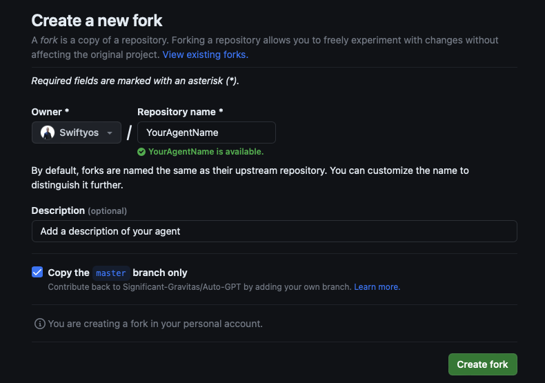
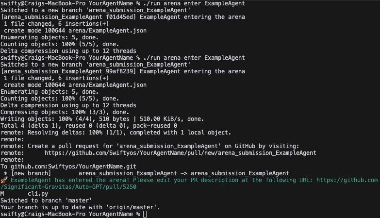

# Quickstart Guide

## Getting Setup
1. **Fork the Repository**
   To fork the repository, follow these steps:
   - Navigate to the main page of the repository.

   
   - In the top-right corner of the page, click Fork.

   
   - On the next page, select your GitHub account to create the fork under.
   - Wait for the forking process to complete. You now have a copy of the repository in your GitHub account.

2. **Clone the Repository**
   To clone the repository, you need to have Git installed on your system. If you don't have Git installed, you can download it from [here](https://git-scm.com/downloads). Once you have Git installed, follow these steps:
   - Open your terminal.
   - Navigate to the directory where you want to clone the repository.
   - Run the git clone command for the fork you just created

   

   - Then open your project in your ide

   

4. **Setup the Project**
    Next we need to setup the required dependencies. We have a tool for helping you do all the tasks you need to on the repo.
    It can be accessed by running the `run` command by typing `./run` in the terminal.

    The first command you need to use is `./run setup` This will guide you through the process of settin up your system.
    Intially you will get instructions for installing flutter, chrome and setting up your github access token like the following image:

    > Note: for advanced users. The github access token is only needed for the ./run arena enter command so the system can automatically create a PR

    
    
    
    You can keep running the commaand to get feedback on where you are up to with your setup. 
    When setup has been completed, the command will return an output like this:

   

## Creating Your Agent

    Now setup has been completed its time to create your agent template. 
    Do so by running the `./run agent create YOUR_AGENT_NAME` replacing YOUR_AGENT_NAME with a name of your choice. Examples of valid names: swiftyosgpt or SwiftyosAgent or swiftyos_agent

   

    Upon creating your agent its time to offically enter the Arena!
    Do so by running `./run arena enter YOUR_AGENT_NAME`

   

   > Note: for adavanced yours, create a new branch and create a file called YOUR_AGENT_NAME.json in the arena directory. Then commit this and create a PR to merge into the main repo. Only single file entries will be permitted. The json file needs the following format. 
   ```json
   {
    "github_repo_url": "https://github.com/Swiftyos/YourAgentName",
    "timestamp": "2023-09-18T10:03:38.051498",
    "commit_hash_to_benchmark": "ac36f7bfc7f23ad8800339fa55943c1405d80d5e",
    "branch_to_benchmark": "master"
   }
    ```
   - github_repo_url: the url to your fork
   - timestamp: timestamp of the last update of this file
   - commit_hash_to_benchmark: the commit hash of your entry. You update each time you have an something ready to be offically entered into the hackathon
   - branch_to_benchmark: the branch you are using to develop your agent on, default is master.
