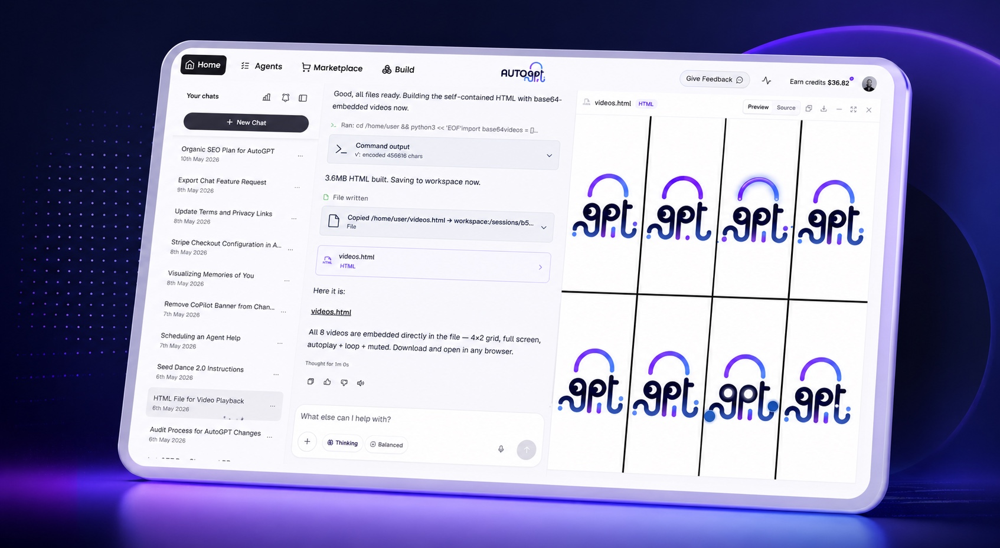
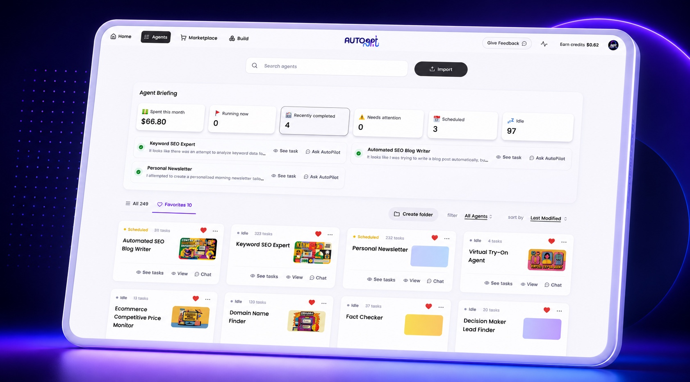
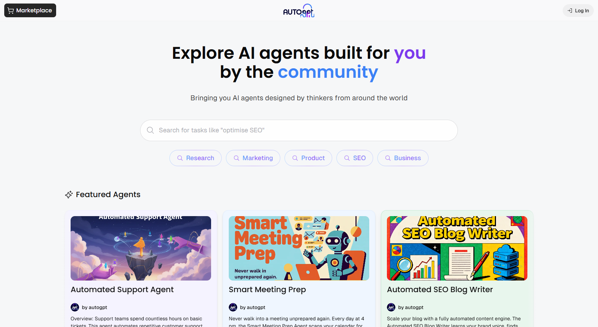
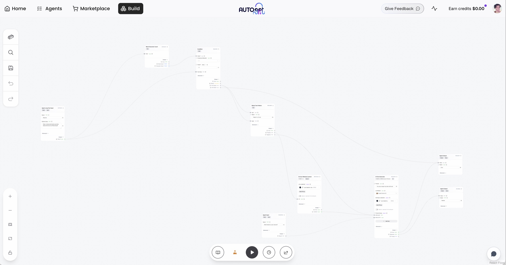

<p align="center">
  <a href="https://platform.agpt.co/signup?utm_source=github&amp;utm_medium=referral&amp;utm_campaign=autogpt_readme&amp;utm_content=hero_banner">
    
  </a>
</p>

<h1 align="center">AutoGPT — 真正交付成果的 AI 智能体平台</h1>

<p align="center">
  <a href="README.md">English</a> · <b>简体中文</b>
</p>

<p align="center">
  <strong>每周为你节省 10 小时工作时间。</strong><br />
  只需用自然语言描述目标，AutoGPT 即可自动构建智能体、自主执行任务并向你汇报结果。
</p>

<p align="center">
  <a href="https://platform.agpt.co/signup?utm_source=github&amp;utm_medium=referral&amp;utm_campaign=autogpt_readme&amp;utm_content=header_get_started"><strong>立即开始</strong></a>
  ·
  <a href="https://platform.agpt.co/tour?utm_source=github&amp;utm_medium=referral&amp;utm_campaign=autogpt_readme&amp;utm_content=tour_header">产品导览</a>
  ·
  <a href="https://agpt.co/pricing?utm_source=github&amp;utm_medium=referral&amp;utm_campaign=autogpt_readme&amp;utm_content=header_pricing">价格方案</a>
  ·
  <a href="https://docs.agpt.co">官方文档</a>
  ·
  <a href="https://discord.gg/autogpt">Discord 社区</a>
  ·
  <a href="#私有化自托管-self-host-autogpt">私有化部署</a>
</p>

<p align="center">
  <a href="https://discord.gg/autogpt">
    
  </a>
  <a href="https://docs.agpt.co">
    
  </a>
</p>

---

## 开源 AI 智能体全栈平台

AutoGPT 让你可以构建、部署和运行能够自主执行完整工作流的 AI 智能体。无论是用自然语言描述目标，还是在可视化构建器中精准设计每一个执行步骤，智能体都能按需触发、定时调度或由外部事件联动运行。

**GitHub Star 185,000+。业界领袖高度评价：**

| 评语 | 评价者 |
|---|---|
| “在我看来，提示词工程的下一个前沿就是：‘AutoGPTs’。” | **Andrej Karpathy**，OpenAI 创始成员 |
| “只要有一台手机就能运行 AutoGPT，你甚至完全不需要学习编程。” | **Amjad Masad**，Replit 联合创始人兼 CEO |
| “AutoGPT 很可能是人工智能领域的下一个重大飞跃。” | **Lior Alexander**，AlphaSignal CEO |

---

## 四大核心模块，统一平台体验

<table>
  <tr>
    <td width="50%" align="center" valign="top">
      <a href="https://agpt.co/product/autopilot/?utm_source=github&amp;utm_medium=referral&amp;utm_campaign=autogpt_readme&amp;utm_content=autopilot">
        
      </a>
      <br /><strong><a href="https://agpt.co/product/autopilot/?utm_source=github&amp;utm_medium=referral&amp;utm_campaign=autogpt_readme&amp;utm_content=autopilot">AutoPilot (自动驾驶)</a></strong>
      <br />用自然语言对话描述任务，直接将对话转化为可立即执行的生产级智能体。
    </td>
    <td width="50%" align="center" valign="top">
      <a href="https://agpt.co/product/agents/?utm_source=github&amp;utm_medium=referral&amp;utm_campaign=autogpt_readme&amp;utm_content=agents">
        
      </a>
      <br /><strong><a href="https://agpt.co/product/agents/?utm_source=github&amp;utm_medium=referral&amp;utm_campaign=autogpt_readme&amp;utm_content=agents">Agents (智能体管控台)</a></strong>
      <br />集中监控每一个智能体的运行状态、执行日志、Token 成本以及需要人工介入的操作。
    </td>
  </tr>
  <tr>
    <td width="50%" align="center" valign="top">
      <a href="https://agpt.co/product/marketplace/?utm_source=github&amp;utm_medium=referral&amp;utm_campaign=autogpt_readme&amp;utm_content=marketplace">
        
      </a>
      <br /><strong><a href="https://agpt.co/product/marketplace/?utm_source=github&amp;utm_medium=referral&amp;utm_campaign=autogpt_readme&amp;utm_content=marketplace">Marketplace (应用市场)</a></strong>
      <br />从经过社区验证的成熟智能体模板起步，一键添加到个人库并按需定制。
    </td>
    <td width="50%" align="center" valign="top">
      <a href="https://agpt.co/product/build/?utm_source=github&amp;utm_medium=referral&amp;utm_campaign=autogpt_readme&amp;utm_content=build">
        
      </a>
      <br /><strong><a href="https://agpt.co/product/build/?utm_source=github&amp;utm_medium=referral&amp;utm_campaign=autogpt_readme&amp;utm_content=build">Build (可视化工作流构建器)</a></strong>
      <br />通过拖拽、连线、分支逻辑与模块检查，获得对智能体每一步执行细节的绝对控制权。
    </td>
  </tr>
</table>

---

## 快速上手

### AutoGPT 官方托管云平台（免运维托管）

官方托管平台面向公众开放。由官方团队统一管理算力基础设施、模型接入、鉴权凭据、高可用运维与版本更新，让你专注于智能体本身的业务价值。

**[立即开启 AutoGPT 云平台体验 →](https://platform.agpt.co/signup?utm_source=github&utm_medium=referral&utm_campaign=autogpt_readme&utm_content=platform_get_started)**

[查看交互式产品导览 →](https://platform.agpt.co/tour?utm_source=github&utm_medium=referral&utm_campaign=autogpt_readme&utm_content=tour_get_started)

- 包含 AutoPilot、Agents、Marketplace 与 Build 全套能力
- 预置对接 45+ 外部平台与数百种主流大模型
- 无需自行配置大模型 API Key 与服务器基础设施
- 支持按需触发、Cron 定时任务与 Webhook 事件驱动

托管平台为付费服务，根据智能体实际运行量计费。[对比套餐与定价 →](https://agpt.co/pricing?utm_source=github&utm_medium=referral&utm_campaign=autogpt_readme&utm_content=platform_pricing)

### 私有化自托管 (Self-host AutoGPT)

> [!NOTE]
> 私有化自托管是完全免费的开源路径。由你自行提供服务器基础设施与大模型 API 密钥，并自行维护部署环境。如果希望零配置立即使用，建议选择 [官方托管云平台](https://platform.agpt.co/signup?utm_source=github&utm_medium=referral&utm_campaign=autogpt_readme&utm_content=self_host_note)。

**macOS 与 Linux 一键安装：**

```bash
curl -fsSL https://setup.agpt.co/install.sh -o install.sh && bash install.sh
```

**Windows PowerShell 一键安装：**

```powershell
powershell -c "iwr https://setup.agpt.co/install.bat -o install.bat; ./install.bat"
```

[阅读完整私有化部署指南 →](https://docs.agpt.co/platform/getting-started)

---

## 托管云平台 vs. 私有化自托管 对比

| 对比项 | **AutoGPT 官方云平台** | **私有化自托管 (Self-hosted)** |
|---|---|---|
| **接入方式** | 注册账号即可使用 | 克隆代码库并本地部署 |
| **费用成本** | 订阅套餐 + 实际使用量计费 | **无软件授权费**；仅需支付自备基础设施与模型 API 费用 |
| **环境搭建** | 全托管零配置 | 需配置 Docker 环境与配置文件 |
| **模型访问** | 平台内置提供 | 自行提供 API Key（OpenAI / Claude / 自建模型等） |
| **运维与升级** | AutoGPT 官方团队自动更新 | 由使用者自行维护与升级 |
| **构建器与运行时** | 完整包含 | 完整包含 |
| **数据与算力掌控** | 托管于 AutoGPT 云端 | 完全运行在自有服务器/私有云基础设施中 |
| **技术支持** | 根据订阅等级提供专属支持 | 开源社区技术支持 |

两种路径共享同一套核心代码库。追求即开即用请选官方云平台；对数据主权与物理基础设施控制有严格要求请选私有化部署。

---

## 典型自动化应用场景

| 业务领域 | 场景示例 |
|---|---|
| **管理运营 (Executive)** | 自动汇聚内外部业务信号，每日生成晨报摘要 |
| **销售拓展 (Sales)** | 在次日会议前，自动完成目标客户公司的全方位背景调研 |
| **市场营销 (Marketing)** | 将产品发布 Brief 一键拆解为覆盖多社交渠道的推广方案草案 |
| **工程技术 (Engineering)** | 自动化排查线上故障告警，并给出首选根本原因分析 |
| **客户服务 (Support)** | 自动起草工单回复、搜集上下文背景并标记需升级处理的问题 |
| **行业研究 (Research)** | 持续监控信源动态，当指标或内容异动时输出结构化深度报告 |

---

## 外部生态与集成 (Integrations)

连接你的核心业务工具。AutoGPT 支持接入数百种大模型，并内置对接 45+ 热门企业级平台，包括：

`Gmail` · `Google Calendar` · `Google Docs` · `Google Sheets` · `GitHub` · `Slack` · `Discord` · `Notion` · `HubSpot` · `Linear` · `Airtable` · `Jira` · `Salesforce` · `Stripe` · `Webflow`

[浏览全部集成生态 →](https://agpt.co/docs/integrations)

---

## 社区与技术支持

| 资源渠道 | 链接 |
|---|---|
| Discord 社区 | [加入 AutoGPT 官方 Discord](https://discord.gg/autogpt) |
| 官方文档 | [docs.agpt.co](https://docs.agpt.co) |
| 问题反馈 | [GitHub Issues](https://github.com/Significant-Gravitas/AutoGPT/issues/new/choose) |
| 功能建议 | [GitHub Discussions](https://github.com/Significant-Gravitas/AutoGPT/discussions) |
| 贡献指南 | [CONTRIBUTING.md](CONTRIBUTING.md) |

---

## 开源协议 (License)

| 核心组件 | 开源许可证 | 权限说明 |
|---|---|---|
| `autogpt_platform/` | [Polyform Shield](https://polyformproject.org/licenses/shield/1.0.0) | 个人与企业内部业务使用完全免费；不得将其包装为竞争性托管云服务进行商业转售 |
| `classic/` 及所有其他代码 | [MIT](LICENSE) | 极其宽松的自由开源协议 |

---

## AutoGPT Classic (经典版本)

正在寻找最早的单体命令行版 AutoGPT？它依然完好保留在 [`classic/`](classic/) 目录中，遵循 MIT 开源许可证：

- [使用 Forge 快速开发智能体](classic/FORGE-QUICKSTART.md)
- [使用 `agbenchmark` 评测智能体基准](https://pypi.org/project/agbenchmark/)
- [探索 AutoGPT Classic 经典工程](classic/README.md)

---

## 贡献者致谢 (Contributors)

<a href="https://github.com/Significant-Gravitas/AutoGPT/graphs/contributors">
  
</a>

<p align="center">
  <a href="https://platform.agpt.co/signup?utm_source=github&amp;utm_medium=referral&amp;utm_campaign=autogpt_readme&amp;utm_content=footer_get_started"><strong>立即开启 AutoGPT 体验 →</strong></a>
</p>

---

> 💡 **文档维护说明**：本中文文档由社区志愿者（@JasonYeYuhe）翻译维护，最后同步更新于 2026年8月31日。如发现内容与官方英文原版存在差异或新特性滞后，欢迎提交 PR 共同完善！
