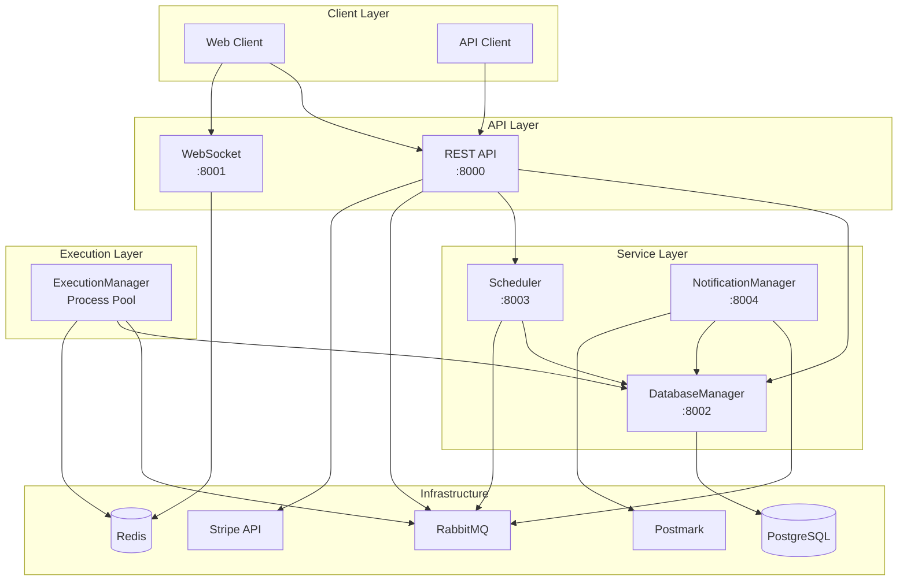
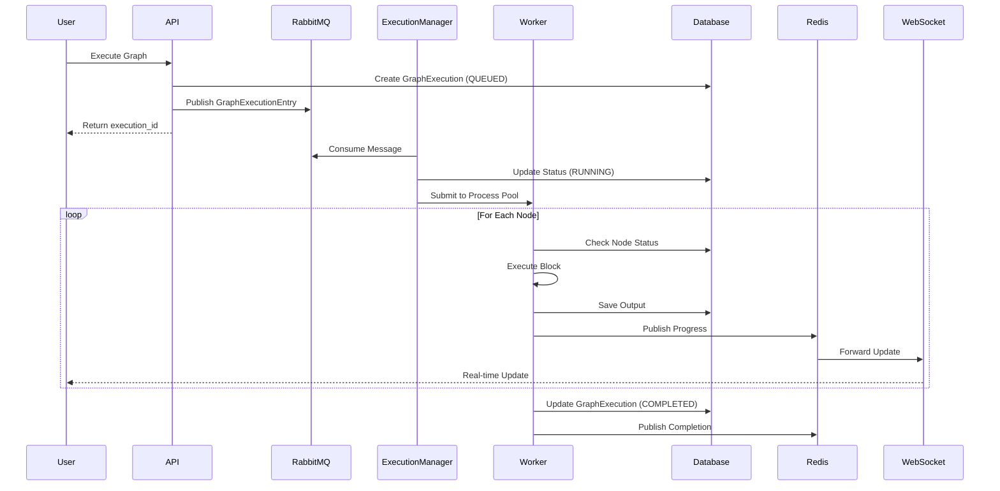
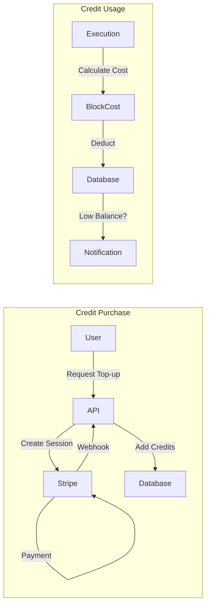
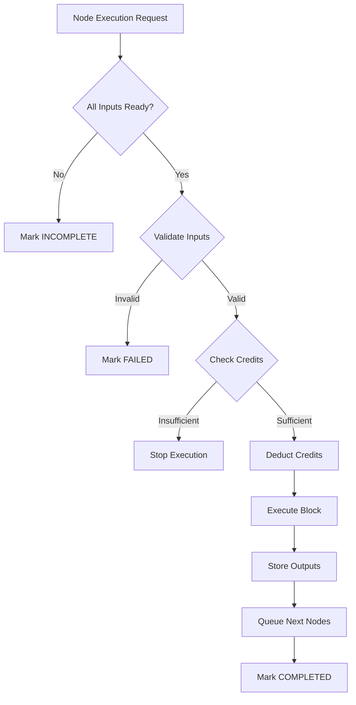
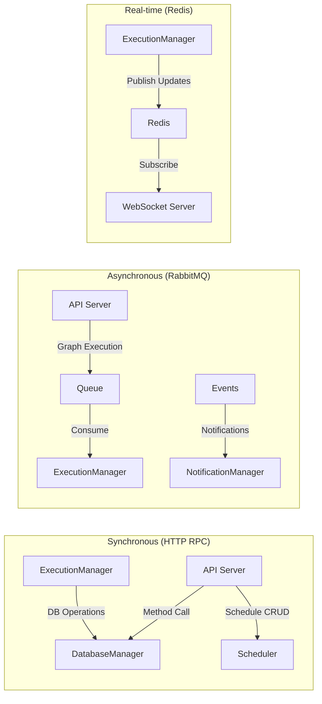
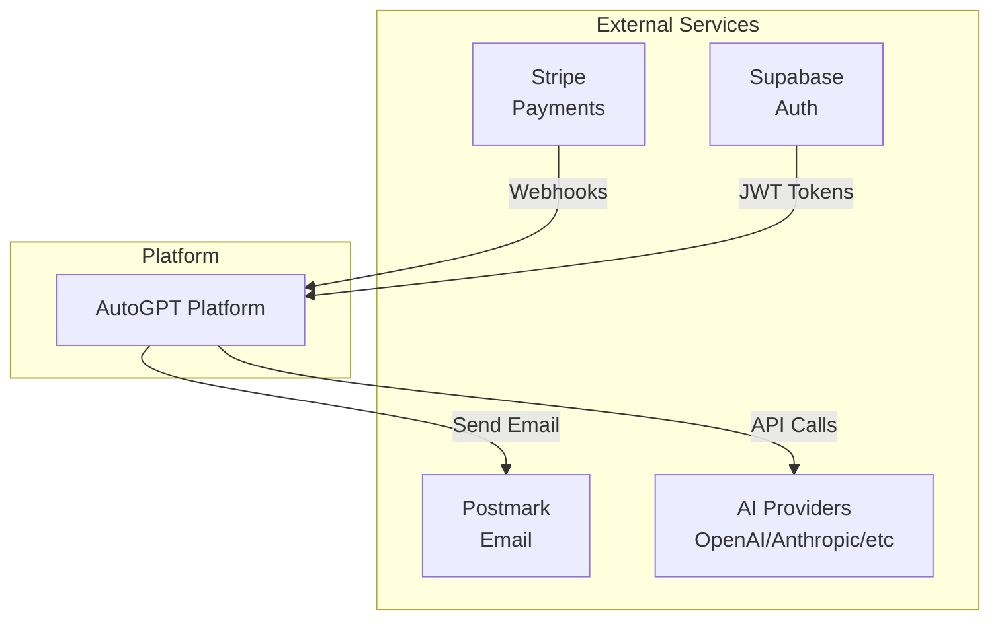

# AutoGPT Platform Architecture

## Table of Contents

- [Overview](#overview) 
- [System Architecture](#system-architecture)
- [Key Components](#key-components)
- [Core Data Models](#core-data-models)
- [Key Data Flows](#key-data-flows)
- [Business Logic Summary](#business-logic-summary)
- [System Constraints](#system-constraints)
- [Key Integration Points](#key-integration-points)
- [Communication Mechanisms](#communication-mechanisms)
- [Architecture Diagram](#architecture-diagram)
- [Key Differences: AppService vs AppProcess](#key-differences-appservice-vs-appprocess)
- [Communication Patterns](#communication-patterns)
- [Security Considerations](#security-considerations)
- [Performance Features](#performance-features)
- [Comprehensive List of Internal Service Endpoints](#comprehensive-list-of-internal-service-endpoints)
- [RabbitMQ Queues and Message Structures](#rabbitmq-queues-and-message-structures)
- [Redis Event Bus - Execution Updates](#redis-event-bus---execution-updates)
- [Configuration Variables](#configuration-variables)
- [REST API Endpoints (Public-Facing)](#rest-api-endpoints-public-facing)
- [Graph Execution Algorithm](#graph-execution-algorithm)
- [Credentials Management System](#credentials-management-system)
- [Notification System](#notification-system)
- [WebSocket Service](#websocket-service)
- [Credit and Cost System](#credit-and-cost-system)
- [Scheduler Service](#scheduler-service)


## Overview

The AutoGPT platform uses a hybrid microservices architecture with multiple IPC (Inter-Process Communication) mechanisms. The system consists of several key components that communicate through different channels depending on the use case.


## System Architecture



## Key Components

### 1. API Server (FastAPI)
- Main REST API serving client requests
- Entry point for graph executions
- Handles authentication and authorization

### 2. ExecutionManager (AppProcess)
- Consumes execution requests from RabbitMQ
- Manages a process pool of graph executors
- NOT an AppService - runs as a standalone process

### 3. Database Services
- **DatabaseManager** (AppService): HTTP-based service wrapping all database operations
- **DatabaseManagerClient/AsyncClient**: Service clients used by other components

### 4. Scheduler Service (AppService)
- Manages cron-based scheduled executions
- Uses APScheduler with SQLAlchemy job store

### 5. Notification Service (AppService)
- Handles user notifications and alerts via email
- Processes notification batches with different delivery strategies
- Integrates with Postmark for email delivery

## Core Data Models

### Graph & Execution Models

| Model | Purpose | Key Fields |
|-------|---------|------------|
| **Graph** | Workflow definition | `nodes[]`, `links[]`, `version` |
| **Node** | Single operation in workflow | `id`, `block_id`, `input_schema`, `output_schema` |
| **Link** | Data flow between nodes | `source_id`, `sink_id`, `is_static` |
| **GraphExecution** | Running instance of graph | `graph_id`, `status`, `user_id` |
| **NodeExecution** | Running instance of node | `node_id`, `status`, `input`, `output` |

### User & Credits Models

| Model | Purpose | Key Fields |
|-------|---------|------------|
| **User** | User account | `id`, `email`, `credits_balance` |
| **CreditTransaction** | Credit usage/purchase | `amount`, `balance`, `type`, `metadata` |
| **Block** | Reusable operation | `id`, `name`, `input_schema`, `costs[]` |
| **BlockCost** | Pricing configuration | `cost_amount`, `cost_type`, `cost_filter` |

## Key Data Flows

### 1. Graph Execution Flow



### 2. Credit Flow



### 3. Node Execution Algorithm



## Core Algorithms

### Graph Execution Algorithm

1. **Starting Nodes**: Nodes with no incoming links OR type=INPUT
2. **Execution Order**: Determined by data availability (event-driven)
3. **Next Node Logic**:
   ```
   for each output link from completed node:
       if all required inputs available for target node:
           queue target node for execution
   ```

### Cost Calculation

```python
# Cost Types
RUN:    cost_amount * 1         # Fixed per execution
BYTE:   cost_amount * data_size # Per byte processed  
SECOND: cost_amount * run_time  # Per second of execution

# Cost Filtering
if input matches cost_filter:
    apply this cost
else:
    check next cost configuration
```

### Recovery Mechanism

| State | On Restart | Action |
|-------|------------|--------|
| QUEUED | Re-delivered by RabbitMQ | Normal execution |
| RUNNING | Detected as already running | Continue from last state |
| INCOMPLETE | Waiting for inputs | Re-evaluate when inputs arrive |
| COMPLETED | Skip | No action |
| FAILED | Skip | Manual intervention needed |

## Service Communication



## Business Logic Summary

### Execution Rules
- **Credits Required**: Pre-execution balance check
- **Concurrent Execution**: Multiple nodes run in parallel when possible
- **Static Links**: Output persists across executions
- **Dynamic Links**: New output per execution

### Scheduling Rules
- **User Isolation**: Users can only manage own schedules
- **Cron-based**: Standard cron expressions
- **Static Inputs**: Schedule stores input snapshot

### Notification Rules
- **Batching**: Similar notifications grouped (1hr window)
- **User Preferences**: Opt-in/out per notification type
- **Delivery Strategy**: Immediate, Batch, or Summary

### Credit Rules
- **No Overdraft**: Execution stops at 0 credits
- **Auto Top-up**: Optional threshold-based refill
- **Refunds**: < $10 automatic, ≥ $10 needs approval

## System Constraints

| Constraint | Value | Impact |
|------------|-------|--------|
| Max Graph Size | ~1000 nodes | Memory limits |
| Max Execution Time | No hard limit | Monitoring alerts at 5min |
| Credit Precision | Integer only | No fractional credits |
| Concurrent Executions | Based on worker pool | Default: CPU count |
| Message Retention | Until acknowledged | RabbitMQ persistence |

## Key Integration Points




## Communication Mechanisms

### 1. HTTP-Based RPC (AppService Framework)

The platform implements a custom HTTP-based RPC framework in `backend/util/service.py`:

```python
# Service Definition
class DatabaseManager(AppService):
    @expose
    def get_graph_execution(self, ...):
        # Method exposed via HTTP
        
# Client Usage
db_client = get_service_client(DatabaseManagerClient)
result = db_client.get_graph_execution(...)  # Converts to HTTP POST
```

**Characteristics:**
- Services extend `AppService` base class
- Methods decorated with `@expose` become HTTP endpoints
- `AppServiceClient` dynamically converts method calls to HTTP POST requests
- Automatic serialization with Pydantic models
- Built-in retry logic and health checks
- Each service runs on a dedicated port

### 2. Message Queue (RabbitMQ)

Used for asynchronous task distribution between API server and ExecutionManager:

**Queues:**
- `graph_execution_queue`: Direct exchange for execution requests
- `graph_execution_cancel_queue`: Fanout exchange for cancellation broadcasts

**Flow:**
1. API Server receives execution request at `/graphs/{graph_id}/execute`
2. Server calls `execution_utils.add_graph_execution()`
3. Function publishes message to RabbitMQ queue
4. ExecutionManager consumes messages and distributes to worker processes

**Implementation in ExecutionManager:**
```python
class ExecutionManager(AppProcess):  # Note: AppProcess, not AppService
    def run(self):
        # Connects to RabbitMQ
        rabbitmq = SyncRabbitMQ()
        # Consumes from execution queue
        rabbitmq.consume(queue_name=GRAPH_EXECUTION_QUEUE_NAME, 
                        on_message_callback=self._on_graph_execution_request)
```

### 3. Event Bus (Redis)

Real-time event streaming for execution updates:

**Components:**
- `AsyncRedisExecutionEventBus`: Publishes execution status updates
- WebSocket server subscribes to Redis channels
- Enables real-time UI updates

**Event Types:**
- Execution started/completed/failed
- Node execution progress
- Output data updates

### 4. Process Pool Execution

ExecutionManager uses multiprocessing for graph execution:

```python
# In ExecutionManager
self.executor = ProcessPoolExecutor(
    max_workers=settings.num_graph_workers,
    initializer=on_graph_executor_start
)
```

**Characteristics:**
- Each graph runs in isolated process
- Workers initialized with separate event loops
- Graceful cancellation support
- Prometheus metrics for monitoring

### 5. Database as Shared State

PostgreSQL serves as the central state store:
- All services access via DatabaseManager HTTP API
- Execution state, user data, graph definitions
- Prisma ORM for type-safe access

## Architecture Diagram

```
┌─────────────────┐     HTTP API    ┌──────────────────┐
│   API Server    │────────────────→│ DatabaseManager  │
│   (FastAPI)     │                 │   (AppService)   │
└────────┬────────┘                 └──────────────────┘
         │                                    ↑
         │ RabbitMQ                          │ HTTP
         ↓                                   │
┌─────────────────┐                          │
│ExecutionManager │                          │
│  (AppProcess)   │──────────────────────────┤
└────────┬────────┘                          │
         │                                   │
         │ Process Pool                      │
         ↓                                   │
┌─────────────────┐                          │
│ Worker Process  │──────────────────────────┘
│ (Graph Executor)│
└─────────────────┘
         │
         │ Redis Events
         ↓
┌─────────────────┐
│ WebSocket Server│
│ (Real-time UI)  │
└─────────────────┘
```

## Key Differences: AppService vs AppProcess

### AppService
- Extends `AppService` base class
- Automatically exposes methods as HTTP endpoints
- Used for: DatabaseManager, Scheduler, NotificationManager
- Communication via HTTP RPC

### AppProcess
- Extends `AppProcess` base class
- Standalone process with custom run loop
- Used for: ExecutionManager
- Communication via RabbitMQ message consumption

## Communication Patterns

### Synchronous Operations
- API calls to DatabaseManager for queries
- Health checks between services
- Direct HTTP calls for immediate responses

### Asynchronous Operations
- Graph execution via RabbitMQ
- Status updates via Redis pub/sub
- Batch notification processing

### Service Discovery
- Environment variables: `{SERVICE_NAME}_HOST` and ports
- Fallback to localhost for same-host services
- Configuration in `backend/util/settings.py`

## Security Considerations

1. **Credentials Management**: 
   - IntegrationCredentialsManager with Redis locks
   - Prevents concurrent use of same credentials

2. **Process Isolation**:
   - Each graph execution in separate process
   - Limited resource access per worker

3. **Authentication**:
   - JWT tokens at API layer
   - Service-to-service communication within trusted network

## Performance Features

1. **Connection Pooling**: HTTP clients with connection reuse
2. **Retry Logic**: Automatic retries with exponential backoff
3. **Process Pool**: Configurable worker count for parallel execution
4. **Caching**: Thread-cached service clients
5. **Metrics**: Prometheus metrics for monitoring

This architecture provides scalability, reliability, and clear separation of concerns while supporting both synchronous and asynchronous communication patterns.

## Comprehensive List of Internal Service Endpoints

This section documents all internal service endpoints exposed by AppService implementations. These are separate from the public REST API endpoints documented in openapi.spec.

### 1. DatabaseManager Service Endpoints

**Port:** `config.database_api_port`  
**Base URL:** `http://{host}:{port}`

All endpoints use HTTP POST method with JSON body.

#### Execution Management Endpoints
- `/get_graph_execution` - Retrieves a specific graph execution
- `/get_graph_executions` - Lists graph executions with filtering
- `/get_graph_execution_meta` - Gets metadata for a graph execution
- `/create_graph_execution` - Creates a new graph execution
- `/get_node_execution` - Retrieves a specific node execution
- `/get_node_executions` - Lists node executions
- `/get_latest_node_execution` - Gets the most recent node execution
- `/update_node_execution_status` - Updates the status of a node execution
- `/update_node_execution_status_batch` - Batch updates node execution statuses
- `/update_graph_execution_start_time` - Updates when a graph execution started
- `/update_graph_execution_stats` - Updates statistics for a graph execution
- `/update_node_execution_stats` - Updates statistics for a node execution
- `/upsert_execution_input` - Inserts or updates execution input data
- `/upsert_execution_output` - Inserts or updates execution output data
- `/get_execution_kv_data` - Retrieves key-value data for an execution
- `/set_execution_kv_data` - Sets key-value data for an execution

#### Graph Management Endpoints
- `/get_node` - Retrieves a specific node from a graph
- `/get_graph` - Retrieves a complete graph
- `/get_connected_output_nodes` - Gets nodes connected to outputs
- `/get_graph_metadata` - Retrieves metadata for a graph

#### Credits Management Endpoints
- `/spend_credits` - Deducts credits from user account
  - Parameters: `user_id: str`, `cost: int`, `metadata: UsageTransactionMetadata`
  - Returns: `int` (remaining balance)
- `/get_credits` - Gets user credit balance
  - Parameters: `user_id: str`
  - Returns: `int` (credit balance)

#### User Management Endpoints
- `/get_user_metadata` - Retrieves user metadata
- `/update_user_metadata` - Updates user metadata
- `/get_user_integrations` - Gets user integration settings
- `/update_user_integrations` - Updates user integration settings

#### User Communications Endpoints
- `/get_active_user_ids_in_timerange` - Gets active users within a time period
- `/get_user_email_by_id` - Retrieves user email by user ID
- `/get_user_email_verification` - Checks if user email is verified
- `/get_user_notification_preference` - Gets user notification preferences

#### Notifications Endpoints
- `/create_or_add_to_user_notification_batch` - Creates or adds to a notification batch
- `/empty_user_notification_batch` - Clears a user's notification batch
- `/get_all_batches_by_type` - Retrieves all batches by notification type
- `/get_user_notification_batch` - Gets a specific user's notification batch
- `/get_user_notification_oldest_message_in_batch` - Gets oldest message in batch

#### Health Check
- `/health_check` - Service health check endpoint

### 2. Scheduler Service Endpoints

**Port:** `config.execution_scheduler_port`  
**Base URL:** `http://{host}:{port}`

- `/add_graph_execution_schedule` - Schedules a graph for recurring execution
  - Parameters:
    - `user_id: str`
    - `graph_id: str`
    - `graph_version: int`
    - `cron: str` (cron syntax)
    - `input_data: BlockInput`
    - `input_credentials: dict[str, CredentialsMetaInput]`
    - `name: Optional[str]`
  - Returns: `GraphExecutionJobInfo`

- `/delete_graph_execution_schedule` - Deletes a scheduled execution
  - Parameters: `schedule_id: str`, `user_id: str`
  - Returns: `GraphExecutionJobInfo`

- `/get_graph_execution_schedules` - Lists scheduled executions
  - Parameters: `graph_id: Optional[str]`, `user_id: Optional[str]`
  - Returns: `list[GraphExecutionJobInfo]`

- `/execute_process_existing_batches` - Manually triggers batch processing
  - Parameters: `kwargs: dict`

- `/execute_process_weekly_summary` - Manually triggers weekly summary

- `/execute_report_late_executions` - Reports late/stuck executions

- `/health_check` - Service health check endpoint

### 3. NotificationManager Service Endpoints

**Port:** `settings.config.notification_service_port`  
**Base URL:** `http://{host}:{port}`

- `/queue_weekly_summary` - Queues weekly summary notifications
  - No parameters
  - Runs in background via ProcessPoolExecutor

- `/process_existing_batches` - Processes aged notification batches
  - Parameters: `notification_types: list[NotificationType]`
  - Runs in background via ProcessPoolExecutor

- `/discord_system_alert` - Sends system alert to Discord
  - Parameters: `content: str`
  - Note: This is an async endpoint

- `/health_check` - Service health check endpoint

### Service Client Usage Examples

```python
# DatabaseManager client
from backend.executor.database import DatabaseManagerClient
from backend.util.service import get_service_client

db_client = get_service_client(DatabaseManagerClient)
execution = db_client.get_graph_execution(execution_id="...")

# Scheduler client
from backend.executor.scheduler import SchedulerClient

scheduler = get_service_client(SchedulerClient)
job_info = await scheduler.add_graph_execution_schedule(
    user_id="...",
    graph_id="...",
    cron="0 0 * * *",  # Daily at midnight
    ...
)

# NotificationManager client
from backend.notifications.notifications import NotificationManagerClient

notif_client = get_service_client(NotificationManagerClient)
notif_client.queue_weekly_summary()
```

### RabbitMQ Queues and Message Structures

These are message queues consumed by services, not HTTP endpoints:

#### 1. Graph Execution Queue

**Queue:** `graph_execution_queue`  
**Exchange:** `graph_execution` (DIRECT type)  
**Routing Key:** `graph_execution.run`  
**Consumer:** ExecutionManager

**Message Structure - `GraphExecutionEntry`:**
```python
{
    "user_id": "str",
    "graph_exec_id": "str", 
    "graph_id": "str",
    "graph_version": "int",
    "nodes_input_masks": "Optional[dict[str, dict[str, JsonValue]]]"
}
```

**Publishing Flow:**
1. API endpoint `/graphs/{graph_id}/execute` receives request
2. Calls `execution_utils.add_graph_execution()`
3. Creates database records and publishes to queue
4. ExecutionManager consumes and submits to process pool

#### 2. Graph Execution Cancel Queue

**Queue:** `graph_execution_cancel_queue`  
**Exchange:** `graph_execution_cancel` (FANOUT type)  
**Routing Key:** "" (empty for fanout)  
**Consumer:** ExecutionManager

**Message Structure - `CancelExecutionEvent`:**
```python
{
    "graph_exec_id": "str"
}
```

**Publishing Flow:**
1. API endpoint `/graphs/{graph_id}/executions/{graph_exec_id}/stop` called
2. Calls `execution_utils.stop_graph_execution()`
3. Publishes cancellation event to fanout exchange
4. All ExecutionManager instances receive the cancellation

#### 3. Notification Queues

**Exchange:** `notifications` (TOPIC type)  
**Dead Letter Exchange:** `dead_letter` (TOPIC type)  
**Consumer:** NotificationManager

##### Immediate Notifications Queue
**Queue:** `immediate_notifications`  
**Routing Key:** `notification.immediate.#`  
**Use Case:** Password reset, email verification, critical alerts

##### Admin Notifications Queue
**Queue:** `admin_notifications`  
**Routing Key:** `notification.admin.#`  
**Use Case:** Refund requests, system alerts

##### Batch Notifications Queue
**Queue:** `batch_notifications`  
**Routing Key:** `notification.batch.#`  
**Use Case:** Grouped notifications sent after delay

##### Summary Notifications Queue
**Queue:** `summary_notifications`  
**Routing Key:** `notification.summary.#`  
**Use Case:** Daily/weekly summaries

##### Failed Notifications Queue (DLQ)
**Queue:** `failed_notifications`  
**Routing Key:** `failed.#`  
**Use Case:** Messages that failed processing

**Base Message Structure - `NotificationEventModel`:**
```python
{
    "type": "NotificationType",
    "user_id": "str",
    "created_at": "datetime",
    "data": {
        # Varies by notification type - see below
    }
}
```

**Notification Data Types:**

1. **AgentRunData** (agent execution completed):
```python
{
    "agent_id": "str",
    "agent_name": "str",
    "ended_at": "datetime",
    "graph_run_id": "str",
    "run_link": "str",
    "success": "bool"
}
```

2. **LowBalanceData** (credit balance warning):
```python
{
    "current_balance": "int",
    "low_balance_threshold": "int"
}
```

3. **BlockExecutionFailedData** (block execution error):
```python
{
    "agent_name": "str",
    "block_name": "str",
    "error_message": "str",
    "graph_run_id": "str",
    "run_link": "str"
}
```

4. **DailySummaryData** (daily activity summary):
```python
{
    "credits_spent": "int",
    "agents_created_count": "int",
    "agents_run_count": "int",
    "agents_ran": "list[AgentSummary]"
}
```

5. **WeeklySummaryData** (weekly activity summary):
```python
{
    "period_start": "datetime",
    "period_end": "datetime",
    "total_credits_spent": "int",
    "total_agents_created": "int",
    "total_agents_run": "int",
    "agents_summary": "list[AgentSummary]"
}
```

6. **RefundRequestData** (admin refund notification):
```python
{
    "user_id": "str",
    "transaction_key": "str",
    "reason": "str",
    "amount": "int",
    "timestamp": "datetime"
}
```

**Publishing Flow:**
1. Service calls `queue_notification()` or `queue_notification_async()`
2. Function determines routing key based on notification type and strategy
3. Message published to appropriate queue
4. NotificationManager consumes and processes based on queue type

#### 4. Internal Process Queues (Not RabbitMQ)

**Node Execution Queue** (In-memory within graph executor process):
- Uses Python's `asyncio.Queue` or similar
- Message Type: `NodeExecutionEntry`
- Contains node-level execution details within a graph

```python
{
    "user_id": "str",
    "graph_exec_id": "str",
    "graph_id": "str",
    "node_exec_id": "str",
    "node_id": "str",
    "block_id": "str",
    "inputs": "BlockInput"
}
```

### Redis Event Bus - Execution Updates

The platform uses Redis pub/sub for real-time execution status updates. This is separate from RabbitMQ and provides real-time updates to WebSocket clients.

#### Execution Event Publishers

**Components:** `RedisExecutionEventBus` and `AsyncRedisExecutionEventBus`  
**Channel Pattern:** Based on execution IDs

**Published Events:**

1. **Graph Execution Updates** (`GraphExecution`):
   - Published when graph execution status changes
   - Contains full graph execution details including status

2. **Node Execution Results** (`NodeExecutionResult`):
   - Published after each node completes execution
   - Contains node outputs and execution metadata

**Publishing Flow:**

1. **Node Output Storage and Broadcasting**:
   ```python
   # In ExecutionManager._process_node_output()
   # 1. Store output in database
   await db_client.upsert_execution_output(
       node_exec_id=output.node_exec_id,
       output_name=name,
       output_data=data
   )
   
   # 2. Get updated execution record
   exec_update = await db_client.get_node_execution(output.node_exec_id)
   
   # 3. Publish to Redis for real-time updates
   await send_async_execution_update(exec_update)
   ```

2. **Graph Status Updates**:
   - Published via `send_execution_update()` when:
     - Graph execution starts
     - Graph execution completes/fails/terminates
     - Node execution status changes

3. **WebSocket Consumption**:
   - WebSocket server subscribes to Redis channels
   - Forwards updates to connected clients in real-time
   - Enables live execution progress in UI

**Event Flow Summary:**
```
Node Execution → Database Update → Redis Publish → WebSocket Server → Client UI
```

This provides real-time visibility into:
- Which nodes are running
- Node execution outputs as they complete
- Overall graph execution progress
- Error messages and failures

### Configuration Variables

Key ports and hosts:
- `config.database_api_port` - DatabaseManager port
- `config.execution_scheduler_port` - Scheduler port  
- `config.notification_service_port` - NotificationManager port
- `config.pyro_host` - Default host for all services (usually "0.0.0.0")
- `{SERVICE_NAME}_HOST` - Override host for specific service

## REST API Endpoints (Public-Facing)

The main API server exposes 100 REST endpoints, with 90 requiring authentication and 10 being public. These are separate from the internal service endpoints documented above.

### API Endpoint Summary by Section

| Section | Total | Authenticated | Unauthenticated |
|---------|-------|---------------|-----------------|
| Analytics | 2 | 2 | 0 |
| API Keys | 6 | 6 | 0 |
| Auth | 4 | 4 | 0 |
| Blocks | 2 | 2 | 0 |
| Credits | 12 | 11 | 1 |
| Email | 2 | 1 | 1 |
| Executions | 3 | 3 | 0 |
| Graphs | 14 | 14 | 0 |
| Integrations | 13 | 12 | 1 |
| Library | 14 | 14 | 0 |
| Onboarding | 4 | 4 | 0 |
| Otto | 1 | 1 | 0 |
| Schedules | 2 | 2 | 0 |
| Store | 19 | 14 | 5 |
| Turnstile | 1 | 0 | 1 |
| Other | 1 | 0 | 1 |
| **TOTAL** | **100** | **90** | **10** |

### Key REST API Endpoints

#### Graph Management & Execution
- `GET /api/graphs` - List user graphs
- `POST /api/graphs` - Create new graph
- `PUT /api/graphs/{graph_id}` - Update graph version
- `POST /api/graphs/{graph_id}/execute/{graph_version}` - Execute graph (triggers RabbitMQ message)
- `GET /api/graphs/{graph_id}/executions` - Get graph executions
- `POST /api/graphs/{graph_id}/executions/{graph_exec_id}/stop` - Stop execution (publishes to cancel queue)

#### Scheduling
- `POST /api/graphs/{graph_id}/schedules` - Create execution schedule
- `GET /api/schedules` - List execution schedules
- `DELETE /api/schedules/{schedule_id}` - Delete schedule

#### Credits & Billing
- `GET /api/credits` - Get user credits
- `POST /api/credits` - Request credit top up
- `POST /api/credits/stripe_webhook` - Stripe webhook (unauthenticated)
- `POST /api/credits/auto-top-up` - Configure auto top-up

#### Integrations
- `GET /api/integrations/providers` - List integration providers
- `POST /api/integrations/{provider}/credentials` - Create credentials
- `POST /api/integrations/{provider}/webhooks/{webhook_id}/ingress` - Webhook ingress (unauthenticated)

#### Store (Marketplace)
- `GET /api/store/agents` - List store agents (public)
- `GET /api/store/agents/{username}/{agent_name}` - Get specific agent (public)
- `POST /api/store/submissions` - Create store submission
- `GET /api/store/download/agents/{store_listing_version_id}` - Download agent (public)

#### Library (User's Agent Collection)
- `GET /api/library/agents` - List user's library agents
- `POST /api/library/agents` - Add marketplace agent to library
- `POST /api/library/agents/{library_agent_id}/fork` - Fork library agent

#### Authentication & User
- `POST /api/auth/user` - Get or create user
- `GET /api/auth/user/preferences` - Get notification preferences
- `POST /api/auth/user/email` - Update user email

### Unauthenticated Endpoints

These 10 endpoints can be accessed without authentication:

1. `POST /api/credits/stripe_webhook` - Stripe payment webhooks
2. `POST /api/email/unsubscribe` - Email unsubscribe
3. `POST /api/integrations/{provider}/webhooks/{webhook_id}/ingress` - External webhook ingress
4. `GET /api/store/agents` - Browse marketplace agents
5. `GET /api/store/agents/{username}/{agent_name}` - View specific marketplace agent
6. `GET /api/store/creator/{username}` - View creator profile
7. `GET /api/store/creators` - List marketplace creators
8. `GET /api/store/download/agents/{store_listing_version_id}` - Download agent file
9. `POST /api/turnstile/verify` - Cloudflare Turnstile verification
10. `GET /health` - Health check

### Authentication

Most endpoints require JWT authentication via:
- Bearer token in Authorization header
- Supabase session management
- API keys for programmatic access (when using API key endpoints)

For complete API documentation including request/response schemas, see the OpenAPI specification at `/frontend/src/app/api/openapi.json`.

## Graph Execution Algorithm

This section explains how the AutoGPT platform executes graphs, manages data flow between nodes, and determines execution order.

### Graph Execution Overview

Graphs are directed acyclic graphs (DAGs) where:
- **Nodes** represent operations (blocks) to execute
- **Links** represent data flow between nodes
- **Execution** flows from starting nodes through the graph based on data availability

### 1. Starting Node Identification

Graphs begin execution at "starting nodes", which are determined by:

```python
@property
def starting_nodes(self) -> list[NodeModel]:
    outbound_nodes = {link.sink_id for link in self.links}
    input_nodes = {
        node.id for node in self.nodes if node.block.block_type == BlockType.INPUT
    }
    return [
        node for node in self.nodes
        if node.id not in outbound_nodes or node.id in input_nodes
    ]
```

**Starting nodes are**:
- Nodes with no incoming links (no other node outputs to them)
- OR nodes of type `BlockType.INPUT` (always start nodes, even with incoming links)

### 2. Execution Flow

```
1. Graph execution request → RabbitMQ queue
2. ExecutionManager consumes request → Process pool
3. Starting nodes → Node execution queue
4. For each completed node → Enqueue downstream nodes
5. Continue until all reachable nodes execute
```

**Key characteristics**:
- **Parallel execution**: Multiple nodes execute concurrently when inputs ready
- **Event-driven**: Node completion triggers downstream node evaluation
- **Resilient**: Failed nodes don't stop the graph; other paths continue

### 3. Input/Output Data Flow

Data flows between nodes via **Links**:

```python
class Link:
    source_id: str      # Node producing output
    source_name: str    # Output pin name
    sink_id: str        # Node consuming input
    sink_name: str      # Input pin name
    is_static: bool     # Static vs dynamic data
```

**Data flow process**:
1. Node executes and produces outputs
2. Each output is stored in the database
3. System finds all links from this output pin
4. Data is routed to corresponding input pins of downstream nodes
5. Downstream nodes are evaluated for execution readiness

### 4. Next Node Determination Algorithm

The `_enqueue_next_nodes` function implements the core algorithm:

```python
# Simplified algorithm
for link in node.output_links:
    next_node = get_node(link.sink_id)
    
    # Add output data to next node's inputs
    next_node_input = upsert_execution_input(
        node_id=next_node_id,
        input_name=link.sink_name,
        input_data=output_data
    )
    
    # Validate if all required inputs are present
    if validate_exec(next_node, next_node_input):
        # Queue node for execution
        execution_queue.add(next_node)
```

**Node execution readiness**:
- All required input pins must have data
- Optional inputs can be missing
- Input validation must pass
- Node must be in INCOMPLETE or QUEUED state

### 5. Input Collection and Validation

**Input collection process**:

1. **Incomplete Executions**: Nodes can have multiple partial executions waiting for different inputs
2. **Upsert Logic**: New inputs are added to the earliest incomplete execution
3. **Static Link Completion**: Missing static inputs are copied from previous executions
4. **Input Overrides**: Runtime masks can override any input value

**Validation** (`validate_exec`):
- Merges provided inputs with node defaults
- Resolves dynamic pins (e.g., `$.propertyName` references)
- Converts data types to match schema
- Validates against block's Pydantic input model
- Returns validated data or error message

### 6. Static vs Dynamic Links

**Dynamic Links** (default):
- Each output creates a new downstream execution
- Data flows once per execution
- Used for regular data flow

**Static Links** (`is_static=True`):
- Output data persists across executions
- Downstream nodes reuse the data
- When updated, ALL waiting executions are re-evaluated
- Common uses:
  - Configuration values
  - Constants
  - Outputs from `ValueBlock`, `DictionaryBlock`

**Static link behavior**:
```python
if node_link.is_static:
    # Find ALL incomplete executions waiting for this input
    for incomplete_exec in get_incomplete_executions(next_node_id):
        # Update with new static data
        incomplete_exec.inputs[link.sink_name] = output_data
        # Re-evaluate for execution
        if validate_exec(next_node, incomplete_exec.inputs):
            execution_queue.add(incomplete_exec)
```

### 7. Execution States

Nodes progress through states:

```
QUEUED → INCOMPLETE → RUNNING → COMPLETED/FAILED
```

- **QUEUED**: Ready to execute, waiting for worker
- **INCOMPLETE**: Waiting for more inputs
- **RUNNING**: Currently executing
- **COMPLETED**: Successfully finished
- **FAILED**: Execution error occurred

### 8. Special Execution Features

**Concurrent Execution**:
- Process pool with configurable workers
- Nodes execute in parallel when possible
- Redis locks prevent race conditions on shared data

**Error Handling**:
- Failed nodes output an "error" pin
- Other graph paths continue executing
- Errors are captured in execution stats

**Cancellation**:
- Cancel events broadcast via RabbitMQ fanout
- Running nodes are terminated
- Graph marked as TERMINATED

**Cost Tracking**:
- Each node execution has associated costs
- Credits deducted based on block type and usage
- Insufficient credits stop execution

**Input Masking**:
- Runtime overrides for any node input
- Used for parameterized graph execution
- Precedence: mask > dynamic input > static input > default

### Example Execution Trace

```
1. Graph with nodes A→B→C and A→D
2. Starting nodes: [A]
3. Execute A → outputs: {"result": 42}
4. Find links from A: [A.result→B.input, A.result→D.value]
5. Update B.input=42, D.value=42
6. Validate B: needs more inputs (INCOMPLETE)
7. Validate D: all inputs ready (QUEUED)
8. Execute D → outputs: {"processed": 84}
9. Find links from D: [D.processed→B.other_input]
10. Update B.other_input=84
11. Validate B: all inputs ready (QUEUED)
12. Execute B → outputs: {"final": 126}
13. Continue until no more nodes to execute
```

This execution model enables complex data processing workflows with automatic parallelization, robust error handling, and flexible data routing.

## Credentials Management System

This section explains how the AutoGPT platform manages credentials for integrations, decides between system and user credentials, and securely exposes them to the execution system.

### Credentials Overview

The platform supports multiple credential types for various integrations:
- **OAuth2**: For services like Google, GitHub, Discord
- **API Key**: For services like OpenAI, Anthropic, Replicate
- **User/Password**: For basic authentication
- **Host-scoped**: For self-hosted services with custom endpoints

### 1. Credential Storage Architecture

**User Credentials** (Database):
```python
class UserIntegrations:
    user_id: str
    credentials: dict[str, Credentials]  # provider -> credentials
    oauth_state: dict[str, OAuthState]   # state for OAuth flows
```

**System Credentials** (Environment):
```python
# In credentials_store.py
# Individual credential objects are defined:
openai_credentials = APIKeyCredentials(
    id="53c25cb8-e3ee-465c-a4d1-e75a4c899c2a",
    provider="openai",
    api_key=SecretStr(settings.secrets.openai_api_key),
    title="Use Credits for OpenAI",
    expires_at=None,
)

anthropic_credentials = APIKeyCredentials(
    id="24e5d942-d9e3-4798-8151-90143ee55629",
    provider="anthropic",
    api_key=SecretStr(settings.secrets.anthropic_api_key),
    title="Use Credits for Anthropic",
    expires_at=None,
)
# ... more credential objects

DEFAULT_CREDENTIALS = [
    ollama_credentials,
    openai_credentials,
    anthropic_credentials,
    # ... all other credentials
]
```

### 2. System vs User Credentials Logic

The platform uses a hierarchical approach:

```python
async def get_all_creds(self, user_id: str) -> list[Credentials]:
    # 1. Get user's personal credentials
    users_credentials = (await self._get_user_integrations(user_id)).credentials
    all_credentials = users_credentials
    
    # 2. Always add ollama (doesn't require real API key)
    all_credentials.append(ollama_credentials)
    
    # 3. Conditionally add system credentials if API keys are configured
    if settings.secrets.openai_api_key:
        all_credentials.append(openai_credentials)
    if settings.secrets.anthropic_api_key:
        all_credentials.append(anthropic_credentials)
    # ... check for each provider
    
    return all_credentials
```

**Key points**:
1. **System credentials are always appended** - They don't check for duplicates
2. **Both user and system credentials can coexist** - A user might see multiple credentials for the same provider
3. **Selection happens at usage time** - When executing a graph, users choose which credential ID to use
4. **Empty API keys are filtered** - System credentials only added if the environment variable is set

**Credential Selection**:
- During graph creation, users see all available credentials (both personal and system)
- Users explicitly select which credential to use via its unique ID
- System credentials have fixed IDs (e.g., OpenAI: `53c25cb8-e3ee-465c-a4d1-e75a4c899c2a`)
- This allows users to choose between their own API key or platform credits

### 3. Credentials in Graph Execution

**Block Declaration**:
```python
class MyAIBlock(Block):
    Input = BlockSchema(
        credentials=CredentialsMetaInput(
            provider="openai",
            required_scopes=["api_key"]
        ),
        prompt=str
    )
```

**Execution Flow**:

1. **Graph Validation**: Check all required credentials exist
```python
# In validate_node_input_credentials
for field_name, cred_meta in node.input_schema.get_credentials_fields():
    credentials = await get_credentials_by_id(user_id, cred_meta.id)
    if not credentials:
        raise ValueError(f"Unknown credentials #{cred_meta.id}")
```

2. **Just-in-Time Acquisition**:
```python
# In execute_node
for field_name, input_type in input_model.get_credentials_fields().items():
    credentials_meta = input_type(**input_data[field_name])
    # Acquire with exclusive lock
    credentials, lock = await creds_manager.acquire(
        user_id, credentials_meta.id
    )
    # Pass actual credentials object to block
    extra_exec_kwargs[field_name] = credentials
```

3. **Block Execution**:
```python
# Block receives credentials object, not just metadata
async def run(self, input_data: Input, *, credentials: OpenAICredentials):
    api_key = credentials.api_key.get_secret_value()
    # Use the API key for integration
```

### 4. Security Mechanisms

**Two-Tier Locking System**:

1. **Modification Lock** (Wide):
   - Prevents credential deletion/type changes during use
   - Acquired when credentials are being used
   - Multiple readers allowed

2. **Refresh Lock** (Narrow):
   - Prevents concurrent OAuth token refreshes
   - Exclusive access for token updates
   - Shorter duration than modification lock

```python
async def acquire(self, user_id: str, credential_id: str):
    # Get latest credentials
    credentials = await self._refresh_if_needed(user_id, credential_id)
    
    # Acquire read lock to prevent modifications
    lock_key = f"credentials:{user_id}:{provider}:modify"
    lock = await self.locks.acquire_lock(lock_key, holder="node_execution")
    
    return credentials, lock
```

**OAuth2 Token Refresh**:
```python
async def _refresh_if_needed(self, credentials: OAuth2Credentials):
    if credentials.access_token_expires_at < time.time() + 300:  # 5 min buffer
        async with self.locks.acquire_lock(f"{key}:refresh"):
            # Double-check after acquiring lock
            fresh_creds = await self.store.get_creds(user_id, credential_id)
            if still_needs_refresh(fresh_creds):
                new_tokens = await refresh_oauth_token(
                    credentials.refresh_token,
                    provider_config
                )
                await self.store.update_creds(user_id, credential_id, new_tokens)
```

### 5. Credential Input Schema

**In Graph Definition**:
```python
class GraphModel:
    def aggregate_credentials_inputs(self) -> dict[str, tuple[type, list]]:
        """Collects all credential requirements from all nodes"""
        # Returns: {
        #   "openai_creds": (OpenAICredentials, [(node1_id, "credentials")]),
        #   "github_creds": (GitHubCredentials, [(node2_id, "credentials")])
        # }
```

**Runtime Credential Mapping**:
```python
# User provides credential IDs for each requirement
graph_credentials_input = {
    "openai_creds": CredentialsMetaInput(
        id="user_cred_123",
        provider="openai",
        type="api_key"
    )
}

# System maps these to actual node inputs
node_credentials_map = make_node_credentials_input_map(
    graph, graph_credentials_input
)
# Result: {node1_id: {"credentials": {...}}, node2_id: {"credentials": {...}}}
```

### 6. Special Features

**Credential Caching**:
- 5-minute cache for frequently used credentials
- Automatic cache invalidation on updates
- Reduces database load during graph execution

**Provider-Specific Handling**:
- OAuth2 providers have custom token endpoints
- Some providers (e.g., Google) require special scopes handling
- API key rotation support for security

**Audit Trail**:
- All credential access is logged
- Failed authentication attempts tracked
- Usage metrics for system credentials

### 7. Best Practices

1. **Always use CredentialsMetaInput** for credential fields in blocks
2. **Never log or persist actual credential values**
3. **Release locks in finally blocks** to prevent deadlocks
4. **Use system credentials** for common AI services
5. **Validate scopes** match provider capabilities

### Example: OpenAI Block with Credentials

```python
class OpenAIBlock(Block):
    Input = BlockSchema(
        credentials=CredentialsMetaInput(
            provider="openai",
            required_scopes=["api_key"]
        ),
        prompt=str,
        model=str
    )
    
    async def run(
        self,
        input_data: Input,
        *,
        credentials: OpenAICredentials,
        **kwargs
    ):
        client = AsyncOpenAI(
            api_key=credentials.api_key.get_secret_value()
        )
        response = await client.chat.completions.create(
            model=input_data.model,
            messages=[{"role": "user", "content": input_data.prompt}]
        )
        yield "response", response.choices[0].message.content
```

This credentials system provides a secure, flexible way to manage integrations while maintaining user control and platform-wide access to essential services.

## Notification System

The AutoGPT platform implements a comprehensive notification system that handles both email notifications and real-time updates. The system supports multiple delivery strategies, user preferences, and various notification types.

### Notification System Overview

The notification system consists of several key components:

1. **NotificationManager** (AppService): Core service that processes notification queues
2. **RabbitMQ Queues**: Message queues with different processing strategies
3. **Email Templates**: Jinja2-based HTML templates for email rendering
4. **Database Models**: Stores notification events and batches
5. **WebSocket Server**: Provides real-time updates to connected clients

### Notification Types

The platform supports the following notification types:

```python
class NotificationType(Enum):
    AGENT_RUN = "agent_run"                          # Agent execution completed
    ZERO_BALANCE = "zero_balance"                    # Credits depleted
    LOW_BALANCE = "low_balance"                      # Credits running low
    BLOCK_EXECUTION_FAILED = "block_execution_failed" # Block failed during execution
    CONTINUOUS_AGENT_ERROR = "continuous_agent_error" # Repeated agent failures
    DAILY_SUMMARY = "daily_summary"                  # Daily activity summary
    WEEKLY_SUMMARY = "weekly_summary"                # Weekly activity summary
    MONTHLY_SUMMARY = "monthly_summary"              # Monthly activity summary
    REFUND_REQUEST = "refund_request"                # Admin: refund requested
    REFUND_PROCESSED = "refund_processed"            # User: refund completed
```

### Notification Strategies

Each notification type is mapped to a delivery strategy:

1. **IMMEDIATE**: Sent right away (password reset, email verification, critical alerts)
   - Queue: `immediate_notifications`
   - Routing: `notification.immediate.#`
   
2. **BATCH**: Accumulated and sent when batch ages out (default: 1 hour)
   - Queue: `batch_notifications`
   - Routing: `notification.batch.#`
   - Example: Agent execution notifications
   
3. **SUMMARY**: Sent on schedule (daily/weekly)
   - Queue: `summary_notifications`
   - Routing: `notification.summary.#`
   
4. **ADMIN**: Sent to admin email immediately
   - Queue: `admin_notifications`
   - Routing: `notification.admin.#`
   - Example: Refund requests
   
5. **BACKOFF**: Sent with exponential backoff strategy
   - Currently not actively used

### Notification Flow

```
1. Event Generation
   ↓
2. Queue Selection (based on notification type)
   ↓
3. RabbitMQ Publishing
   ↓
4. NotificationManager Processing
   ↓
5. Email Rendering & Delivery
```

#### 1. Event Generation

Notifications are triggered from various parts of the system:

```python
# Example from ExecutionManager after agent completion
queue_notification(
    NotificationEventModel(
        type=NotificationType.AGENT_RUN,
        user_id=user_id,
        created_at=datetime.now(timezone.utc),
        data=AgentRunData(
            agent_name=graph_name,
            credits_used=total_cost,
            execution_time=duration,
            node_count=node_count,
            graph_id=graph_id,
            outputs=outputs
        )
    )
)
```

#### 2. Queue Routing

The `queue_notification()` function determines the appropriate queue:

```python
def get_routing_key(event_type: NotificationType) -> str:
    strategy = NotificationTypeOverride(event_type).strategy
    if strategy == QueueType.IMMEDIATE:
        return f"notification.immediate.{event_type.value}"
    elif strategy == QueueType.BATCH:
        return f"notification.batch.{event_type.value}"
    # ... other strategies
```

#### 3. NotificationManager Processing

The NotificationManager runs multiple consumer loops:

```python
# Process different queues with appropriate strategies
asyncio.create_task(process_immediate_notifications())  # Send immediately
asyncio.create_task(process_batch_notifications())      # Batch for delay
asyncio.create_task(process_summary_notifications())    # Scheduled sending
asyncio.create_task(process_admin_notifications())      # Admin alerts
```

#### 4. Batch Processing

For batched notifications, the system:
1. Creates or updates a `UserNotificationBatch` in the database
2. Adds individual `NotificationEvent` records to the batch
3. Processes batches when they "age out" (default: 1 hour old)
4. Sends a single email with all batched events

```python
# Batch aging check
batch_age = datetime.now(timezone.utc) - batch.created_at
if batch_age > get_batch_delay(notification_type):
    process_and_send_batch(batch)
```

#### 5. Email Rendering

Emails are rendered using Jinja2 templates with a consistent structure:

```python
email_sender = EmailSender(
    postmark_api_key=settings.secrets.postmark_api_key,
    from_email=settings.config.from_email,
    agent_url=settings.config.agent_dashboard_url
)

# Render and send email
await email_sender.send_notification(
    to_email=user_email,
    notification_type=notification_type,
    notification_data=data,
    user_preferences=preferences
)
```

### Database Schema

**UserNotificationBatch**:
- Groups notifications for batch sending
- Unique constraint: (userId, type) - one active batch per user per type
- Contains multiple NotificationEvents

**NotificationEvent**:
- Individual notification instances
- Stores notification type and JSON data
- Can be linked to a batch or standalone

### Email Templates

Located in `/backend/notifications/templates/`:
- `base.html.jinja2`: Common layout and styling
- `agent_run.html.jinja2`: Agent execution results
- `low_balance.html.jinja2`: Credit warnings
- `weekly_summary.html.jinja2`: Activity summaries
- Additional templates for each notification type

### User Preferences

Users can configure notification preferences:
- Enable/disable specific notification types
- Set email delivery preferences
- Managed via `/auth/user/preferences` endpoints

### Real-time Updates via WebSocket

In addition to email notifications, the system provides real-time updates:

1. **Execution Events** are published to Redis
2. **WebSocket Server** subscribes to Redis channels
3. **Connected Clients** receive live updates
4. Enables real-time UI updates for running agents

### Dead Letter Queue

Failed notifications are routed to a dead letter queue:
- Exchange: `dead_letter`
- Queue: `failed_notifications`
- Allows for debugging and manual retry of failed notifications

### Security Features

1. **Unsubscribe Links**: All emails include personalized unsubscribe links
2. **Email Verification**: Only verified emails receive notifications
3. **Rate Limiting**: Batch processing prevents email flooding
4. **Admin Segregation**: Admin notifications use separate queues

### Integration Points

**From ExecutionManager**:
- Sends `AGENT_RUN` notifications after successful executions
- Sends `LOW_BALANCE` notifications when credits insufficient

**From Scheduler**:
- Triggers weekly summary generation
- Processes aged notification batches

**From API Server**:
- Password reset and email verification (immediate)
- User preference management

### Best Practices

1. **Use appropriate notification types** - Choose based on urgency and user value
2. **Include actionable information** - Links to dashboards, specific error details
3. **Respect user preferences** - Always check notification settings
4. **Handle failures gracefully** - Use dead letter queues for retry logic
5. **Test email templates** - Ensure responsive design and proper rendering

This notification system provides a scalable, user-friendly way to keep users informed about their agent activities while respecting their communication preferences and preventing notification fatigue through intelligent batching.

## WebSocket Service

The AutoGPT platform includes a real-time WebSocket service that provides live updates for graph executions. This service enables clients to monitor execution progress without polling the REST API.

### WebSocket Service Overview

The WebSocket service consists of:

1. **WebSocket Server** (`ws_api.py`): FastAPI-based WebSocket server
2. **Connection Manager** (`conn_manager.py`): Manages active connections and subscriptions
3. **Event Broadcaster**: Listens to Redis events and forwards to subscribers
4. **Message Models** (`model.py`): Defines WebSocket message schemas

### Architecture

```
┌─────────────────┐      WebSocket       ┌─────────────────┐
│   Web Client    │◄────────────────────►│ WebSocket Server│
│                 │      /ws endpoint     │   (ws_api.py)   │
└─────────────────┘                      └────────┬────────┘
                                                  │
                                                  │ Subscribe/
                                                  │ Unsubscribe
                                                  ▼
                                         ┌─────────────────┐
                                         │ Connection      │
                                         │ Manager         │
                                         └────────┬────────┘
                                                  │
                                                  │ Listen
                                                  ▼
┌─────────────────┐     Redis Pub/Sub    ┌─────────────────┐
│ Execution       │─────────────────────►│ Event           │
│ Manager         │   Execution Events   │ Broadcaster     │
└─────────────────┘                      └─────────────────┘
```

### Connection Flow

1. **Client Connection**:
   ```javascript
   // Client connects with optional JWT token
   const ws = new WebSocket('ws://localhost:8001/ws?token=<jwt_token>');
   ```

2. **Authentication**:
   - If auth enabled: JWT token validated from query params
   - If auth disabled: Uses DEFAULT_USER_ID
   - Failed auth closes connection with specific error codes:
     - 4001: Missing token
     - 4002: Invalid token (no user_id)
     - 4003: Token validation failed

3. **Connection Acceptance**:
   ```python
   async def connect_socket(self, websocket: WebSocket):
       await websocket.accept()
       self.active_connections.add(websocket)
   ```

### Message Protocol

All WebSocket messages follow the `WSMessage` schema:

```python
class WSMessage:
    method: WSMethod              # Message type/method
    data: Optional[dict | list | str]  # Message payload
    success: Optional[bool]       # Operation result
    channel: Optional[str]        # Subscription channel
    error: Optional[str]          # Error message if failed
```

### Available Methods

#### Client → Server Methods:

1. **HEARTBEAT** (`heartbeat`):
   - Keeps connection alive
   - Server responds with "pong"

2. **SUBSCRIBE_GRAPH_EXEC** (`subscribe_graph_execution`):
   - Subscribe to specific execution updates
   - Data: `{"graph_exec_id": "exec_123"}`
   - Returns channel key on success

3. **SUBSCRIBE_GRAPH_EXECS** (`subscribe_graph_executions`):
   - Subscribe to all executions of a graph
   - Data: `{"graph_id": "graph_456"}`
   - Returns channel key on success

4. **UNSUBSCRIBE** (`unsubscribe`):
   - Unsubscribe from execution updates
   - Data: `{"graph_exec_id": "exec_123"}`

#### Server → Client Methods:

1. **GRAPH_EXECUTION_EVENT** (`graph_execution_event`):
   - Graph execution status updates
   - Contains full `GraphExecutionEvent` data

2. **NODE_EXECUTION_EVENT** (`node_execution_event`):
   - Individual node execution updates
   - Contains `NodeExecutionEvent` with outputs

3. **ERROR** (`error`):
   - Error messages
   - Contains error description

### Subscription Model

The service uses a channel-based subscription model:

1. **Channel Keys**:
   ```python
   # Specific execution channel
   "{user_id}|graph_exec#{graph_exec_id}"
   
   # All executions of a graph
   "{user_id}|graph#{graph_id}|executions"
   ```

2. **Subscription Management**:
   - Multiple WebSockets can subscribe to same channel
   - WebSocket can have multiple subscriptions
   - Disconnection removes all subscriptions

### Event Broadcasting

The Event Broadcaster continuously listens to Redis:

```python
async def event_broadcaster(manager: ConnectionManager):
    event_queue = AsyncRedisExecutionEventBus()
    async for event in event_queue.listen("*"):
        await manager.send_execution_update(event)
```

**Event Flow**:
1. ExecutionManager publishes events to Redis
2. Event Broadcaster receives events
3. ConnectionManager routes to subscribed WebSockets
4. Clients receive real-time updates

### Example Client Implementation

```javascript
// Connect to WebSocket
const ws = new WebSocket('ws://localhost:8001/ws?token=<token>');

// Handle connection
ws.onopen = () => {
    console.log('Connected to WebSocket');
    
    // Subscribe to graph execution
    ws.send(JSON.stringify({
        method: 'subscribe_graph_execution',
        data: { graph_exec_id: 'exec_123' }
    }));
};

// Handle messages
ws.onmessage = (event) => {
    const message = JSON.parse(event.data);
    
    switch(message.method) {
        case 'graph_execution_event':
            console.log('Graph update:', message.data);
            break;
        case 'node_execution_event':
            console.log('Node update:', message.data);
            break;
        case 'error':
            console.error('Error:', message.error);
            break;
    }
};

// Heartbeat to keep connection alive
setInterval(() => {
    ws.send(JSON.stringify({ method: 'heartbeat' }));
}, 30000);
```

### Error Handling

The WebSocket service includes comprehensive error handling:

1. **Message Validation Errors**:
   - Invalid JSON format
   - Missing required fields
   - Invalid method types

2. **Subscription Errors**:
   - Missing subscription data
   - Invalid graph/execution IDs
   - Access denied (when auth implemented)

3. **Connection Errors**:
   - Automatic cleanup on disconnect
   - Graceful handling of Redis failures

### Performance Considerations

1. **Connection Pooling**:
   - Active connections stored in memory
   - Efficient set operations for add/remove

2. **Message Broadcasting**:
   - Single Redis listener for all events
   - Efficient routing based on channel keys
   - Batch sending to multiple subscribers

3. **Memory Management**:
   - Automatic cleanup on disconnect
   - Channel pruning when no subscribers

### Security Features

1. **Authentication**:
   - JWT-based authentication
   - User isolation for subscriptions
   - Token validation on connection

2. **Authorization** (planned):
   - Graph access verification
   - User can only subscribe to own executions

3. **Rate Limiting** (considerations):
   - Message frequency limits
   - Subscription count limits

### Integration with Frontend

The frontend uses the WebSocket service for:
- Live execution progress bars
- Real-time node status updates
- Immediate error notifications
- Output streaming as nodes complete

### WebSocket Server Configuration

```python
# Environment variables
WS_SERVER_HOST = "0.0.0.0"
WS_SERVER_PORT = 8001

# CORS configuration
ALLOWED_ORIGINS = ["http://localhost:3000"]

# Redis connection for events
REDIS_HOST = "localhost"
REDIS_PORT = 6379
```

### Monitoring and Debugging

1. **Connection Tracking**:
   - Active connection count
   - Subscription metrics
   - Channel distribution

2. **Event Metrics**:
   - Events broadcasted per second
   - Message delivery success rate
   - Average latency

3. **Debug Logging**:
   - Connection lifecycle events
   - Subscription changes
   - Error details with user context

### Best Practices

1. **Client Implementation**:
   - Implement reconnection logic
   - Handle all message types
   - Use heartbeat to detect stale connections

2. **Subscription Management**:
   - Unsubscribe when no longer needed
   - Avoid duplicate subscriptions
   - Handle subscription failures gracefully

3. **Error Handling**:
   - Parse error messages for user feedback
   - Implement exponential backoff for reconnection
   - Log WebSocket errors for debugging

This WebSocket service provides efficient, real-time updates for graph executions, enabling responsive user interfaces and live monitoring of agent activities.

## Credit and Cost System

The AutoGPT platform implements a comprehensive credit-based billing system where users purchase credits and blocks consume them during execution. The system supports flexible pricing models, automatic top-ups, and refunds.

### Credit System Overview

Credits are the platform's virtual currency:
- **1 credit = $0.01** (100 credits = $1.00)
- Users purchase credits via Stripe
- Blocks consume credits based on usage
- Insufficient credits halt execution

### System Components

1. **UserCredit** (`credit.py`): Core credit management class
2. **Block Cost Configuration** (`block_cost_config.py`): Per-block pricing
3. **Cost Calculator** (`utils.py`): Runtime cost calculation
4. **Transaction Tracking**: Complete audit trail with running balances
5. **Payment Processing**: Stripe integration for purchases and refunds

### Cost Types

The system supports three cost models:

```python
class BlockCostType(Enum):
    RUN = "run"        # Fixed cost per execution
    BYTE = "byte"      # Cost per byte of data processed
    SECOND = "second"  # Cost per second of execution time
```

Most blocks use the **RUN** type with fixed costs per execution.

### Block Cost Configuration

Block costs are defined in `BLOCK_COSTS` dictionary:

```python
# Example LLM model costs (in credits)
MODEL_COST = {
    LlmModel.GPT4O_MINI: 1,      # $0.01 per call
    LlmModel.GPT4O: 3,            # $0.03 per call
    LlmModel.CLAUDE_3_5_SONNET: 4,# $0.04 per call
    LlmModel.CLAUDE_4_OPUS: 21,   # $0.21 per call
    LlmModel.O1: 16,              # $0.16 per call
    # ... more models
}

# Block-specific costs
BLOCK_COSTS = {
    AITextGeneratorBlock: [
        BlockCost(cost_amount=MODEL_COST[LlmModel.GPT4O], 
                 cost_filter={"model": "gpt-4o"})
    ],
    AIImageGeneratorBlock: [
        BlockCost(cost_amount=10)  # $0.10 per image
    ],
    # ... more blocks
}
```

### Cost Calculation Algorithm

The `block_usage_cost()` function determines costs at runtime:

```python
def block_usage_cost(block, input_data, data_size=0, run_time=0):
    # 1. Get block's cost configurations
    block_costs = BLOCK_COSTS.get(type(block))
    
    # 2. Find matching cost filter
    for block_cost in block_costs:
        if _is_cost_filter_match(block_cost.cost_filter, input_data):
            # 3. Calculate based on cost type
            if block_cost.cost_type == BlockCostType.RUN:
                return block_cost.cost_amount
            elif block_cost.cost_type == BlockCostType.SECOND:
                return int(run_time * block_cost.cost_amount)
            elif block_cost.cost_type == BlockCostType.BYTE:
                return int(data_size * block_cost.cost_amount)
```

### Cost Filtering

Cost filters enable conditional pricing based on input:

```python
# Different costs for different models
BlockCost(cost_amount=3, cost_filter={"model": "gpt-4o"})
BlockCost(cost_amount=1, cost_filter={"model": "gpt-4o-mini"})

# Filter matching rules:
# - Filters are subsets of input data
# - Empty/null values are considered equal
# - First matching filter wins
```

### Transaction Types

```python
class CreditTransactionType(Enum):
    USAGE = "usage"          # Block execution deduction
    TOP_UP = "top_up"        # Credit purchase
    REFUND = "refund"        # Refunded credits
    GRANT = "grant"          # Admin-granted credits
    CARD_CHECK = "card_check"# $1 test charge (refunded)
```

### Credit Deduction Flow

1. **Pre-execution Check**:
   ```python
   # In ExecutionManager._charge_usage()
   current_balance = await db_client.get_credits(user_id)
   if current_balance < cost:
       raise InsufficientBalanceError()
   ```

2. **Deduction with Metadata**:
   ```python
   remaining = await db_client.spend_credits(
       user_id=user_id,
       cost=cost,
       metadata=UsageTransactionMetadata(
           graph_id=graph_id,
           graph_exec_id=graph_exec_id,
           node_id=node_id,
           block_id=block_id,
           block=block_name,
           input=input_data
       )
   )
   ```

3. **Low Balance Notification**:
   ```python
   if remaining < LOW_CREDIT_THRESHOLD:
       queue_notification(LOW_BALANCE)
   ```

### Credit Purchase Flow

1. **Checkout Session Creation**:
   ```python
   # User requests top-up
   POST /api/credits
   {
       "credit_amount": 1000  # $10 worth
   }
   
   # Creates Stripe checkout session
   session = stripe.checkout.Session.create(
       line_items=[{
           "price": price_id,
           "quantity": credit_amount
       }],
       metadata={"user_id": user_id}
   )
   ```

2. **Webhook Processing**:
   ```python
   # Stripe sends webhook on payment
   POST /api/credits/stripe_webhook
   
   # System adds credits
   await credit_manager.top_up_credits(
       user_id=user_id,
       amount=credit_amount
   )
   ```

### Auto Top-Up Feature

Users can configure automatic credit replenishment:

```python
class AutoTopUpConfig:
    enabled: bool
    threshold_amount: int  # Trigger when balance < this
    top_up_amount: int     # Amount to add
    
# When balance falls below threshold:
if auto_top_up.enabled and balance < auto_top_up.threshold_amount:
    create_auto_top_up_session(user_id, auto_top_up.top_up_amount)
```

### Refund System

Two-tier refund system based on amount:

1. **Small Refunds** (< $10):
   - Processed automatically
   - Credits returned immediately
   
2. **Large Refunds** (≥ $10):
   - Requires admin approval
   - Creates `CreditRefundRequest`
   - Admin notification sent
   - Manual processing via Stripe dashboard

```python
# Refund request
POST /api/credits/{transaction_key}/refund
{
    "reason": "Accidental purchase"
}

# Admin processes via:
- Review in admin panel
- Process in Stripe dashboard
- System updates refund status
```

### Transaction History

Complete audit trail with running balances:

```python
class CreditTransaction:
    user_id: str
    stripe_checkout_session_id: str
    stripe_payment_intent_id: str
    amount: int                    # Credits added/removed
    balance: int                   # Balance after transaction
    type: CreditTransactionType
    metadata: Json                 # Block execution details
    created_at: datetime
```

### Dispute Handling

Automated evidence submission for chargebacks:

```python
# On dispute webhook from Stripe
evidence = {
    "customer_name": user.name,
    "customer_email": user.email,
    "receipt": receipt_url,
    "service_date": transaction.created_at,
    "service_documentation": transaction_history,
    "uncategorized_text": "Virtual credits for AI agent platform..."
}
stripe.Dispute.modify(dispute_id, evidence=evidence)
```

### Cost Tracking Best Practices

1. **Block Implementation**:
   ```python
   # Register block costs in BLOCK_COSTS
   BLOCK_COSTS[MyNewBlock] = [
       BlockCost(cost_amount=5)  # 5 credits per run
   ]
   ```

2. **Dynamic Costs**:
   ```python
   # Use cost filters for variable pricing
   BlockCost(cost_amount=10, cost_filter={"quality": "high"})
   BlockCost(cost_amount=5, cost_filter={"quality": "standard"})
   ```

3. **Provider Integration**:
   ```python
   # SDK providers can define base costs
   class MyProvider(ProviderBase):
       base_costs = [BlockCost(cost_amount=2)]
   ```

### System Limitations and Assumptions

1. **Minimum Balance**: 0 credits (no negative balances)
2. **Maximum Transaction**: Limited by Stripe ($999,999)
3. **Precision**: Integer credits only (no fractional credits)
4. **Currency**: USD only
5. **Price Changes**: Existing credits retain value
6. **Concurrency**: Optimistic locking prevents double-spending
7. **Refund Window**: 90 days (Stripe limitation)

### Monitoring and Analytics

Key metrics tracked:
- Credit balance distribution
- Top-up frequency and amounts
- Block cost breakdown
- Refund rates
- Failed payment attempts
- Auto top-up success rate

### Security Considerations

1. **Payment Security**: All payments via Stripe (PCI compliant)
2. **Webhook Validation**: Stripe signature verification
3. **Admin Actions**: Logged and audited
4. **Balance Protection**: Database constraints prevent negative balances
5. **Transaction Immutability**: No editing of historical transactions

### Error Handling

1. **Insufficient Balance**:
   - Execution halts gracefully
   - User notified with balance and required amount
   - Link to top-up page provided

2. **Payment Failures**:
   - Webhook retries from Stripe
   - User notified of failed payment
   - Manual reconciliation tools available

3. **Refund Failures**:
   - Admin notified
   - Manual intervention required
   - Status tracked in database

This credit system provides a flexible, secure foundation for monetizing AI agent executions while maintaining transparency and user control over spending.

## Scheduler Service

The Scheduler Service is a dedicated AppService that manages recurring graph executions and system maintenance tasks using APScheduler. It enables users to schedule their agent workflows to run automatically based on cron expressions.

### Scheduler Service Overview

Key features:
- **Cron-based Scheduling**: Uses standard cron expressions for flexible scheduling
- **Persistent Job Storage**: Stores schedules in PostgreSQL via SQLAlchemy
- **Multi-tenant Support**: Users can only manage their own schedules
- **System Task Management**: Handles notifications and monitoring tasks
- **Isolated Service**: Runs on dedicated port (8003) as an AppService

### Architecture

```
┌─────────────────┐     HTTP RPC      ┌─────────────────┐
│   API Server    │──────────────────►│ Scheduler       │
│                 │   Schedule CRUD    │ Service         │
└─────────────────┘                   └────────┬────────┘
                                               │
                                               │ APScheduler
                                               ▼
                                      ┌─────────────────┐
                                      │ Job Stores      │
                                      │ (PostgreSQL)    │
                                      └────────┬────────┘
                                               │
                                               │ Cron Trigger
                                               ▼
                                      ┌─────────────────┐
                                      │ Execute Graph   │
                                      │ (RabbitMQ)      │
                                      └─────────────────┘
```

### APScheduler Configuration

The service uses APScheduler 3.11.0 with multiple job stores:

```python
scheduler = BlockingScheduler(
    jobstores={
        # User graph execution schedules
        "execution": SQLAlchemyJobStore(
            engine=create_engine(db_url),
            metadata=MetaData(schema=db_schema),
            tablename="apscheduler_jobs"
        ),
        # Notification batch processing
        "batched_notifications": SQLAlchemyJobStore(
            tablename="apscheduler_jobs_batched_notifications"
        ),
        # Weekly summaries (non-persistent)
        "weekly_notifications": MemoryJobStore()
    }
)
```

### Job Stores

1. **EXECUTION** (SQLAlchemy):
   - Stores user-created graph execution schedules
   - Persists across service restarts
   - Table: `apscheduler_jobs`

2. **BATCHED_NOTIFICATIONS** (SQLAlchemy):
   - Stores notification processing schedules
   - Currently commented out in production
   - Table: `apscheduler_jobs_batched_notifications`

3. **WEEKLY_NOTIFICATIONS** (Memory):
   - Temporary storage for system tasks
   - Does not persist across restarts
   - Used for weekly summary processing

### Schedule Management

#### Creating a Schedule

```python
# API endpoint
POST /graphs/{graph_id}/schedules
{
    "cron": "0 9 * * MON-FRI",  # 9 AM weekdays
    "graph_version": 1,
    "input_data": {...},
    "input_credentials": {...},
    "name": "Daily Report"
}

# Service method
scheduler.add_graph_execution_schedule(
    user_id=user_id,
    graph_id=graph_id,
    graph_version=graph_version,
    cron=cron,
    input_data=input_data,
    input_credentials=credentials
)
```

#### Schedule Execution Flow

1. **Cron Trigger Fires** → APScheduler detects it's time to run
2. **execute_graph() Called** → Job function is invoked with stored parameters
3. **Graph Execution Queued** → Calls `execution_utils.add_graph_execution()`
4. **RabbitMQ Message** → Execution request sent to queue
5. **ExecutionManager Processes** → Normal graph execution flow begins

#### Listing Schedules

```python
# Get all schedules for a user
schedules = scheduler.get_graph_execution_schedules(user_id=user_id)

# Get schedules for a specific graph
schedules = scheduler.get_graph_execution_schedules(graph_id=graph_id)
```

#### Deleting Schedules

```python
# Requires user authorization
scheduler.delete_graph_execution_schedule(
    schedule_id=schedule_id,
    user_id=user_id  # Must match schedule owner
)
```

### System Tasks

The scheduler manages three system tasks:

1. **Weekly Summary Processing**:
   ```python
   # Runs hourly to check if weekly summaries need sending
   scheduler.add_job(
       process_weekly_summary,
       CronTrigger.from_crontab("0 * * * *"),  # Every hour
       id="process_weekly_summary",
       jobstore="weekly_notifications"
   )
   ```

2. **Late Execution Monitoring**:
   ```python
   # Checks for stuck executions every 5 minutes
   scheduler.add_job(
       report_late_executions,
       trigger="interval",
       seconds=300,  # 5 minutes
       jobstore="execution"
   )
   ```

3. **Batch Notification Processing** (Disabled):
   ```python
   # Would process aged notification batches
   # Currently commented out in production
   ```

### Late Execution Detection

The system monitors for executions that remain in QUEUED status too long:

```python
def report_late_executions():
    # Find executions queued > 5 minutes ago
    late_executions = get_graph_executions(
        statuses=[ExecutionStatus.QUEUED],
        created_time_lte=now() - timedelta(seconds=300)
    )
    
    if late_executions:
        # Send Discord alert
        # Log to Sentry
        # Return diagnostic info
```

### Data Models

**GraphExecutionJobArgs**:
```python
class GraphExecutionJobArgs:
    user_id: str
    graph_id: str
    graph_version: int
    cron: str                    # Cron expression
    input_data: BlockInput       # Graph inputs
    input_credentials: dict      # Credential mappings
```

**GraphExecutionJobInfo** (Response):
```python
class GraphExecutionJobInfo(GraphExecutionJobArgs):
    id: str                      # APScheduler job ID
    name: str                    # Human-readable name
    next_run_time: str          # ISO format datetime
```

### Cron Expression Support

Uses standard cron syntax:
- `"0 9 * * *"` - Daily at 9 AM
- `"0 0 * * MON"` - Weekly on Mondays
- `"*/15 * * * *"` - Every 15 minutes
- `"0 0 1 * *"` - Monthly on the 1st

APScheduler's `CronTrigger.from_crontab()` parses expressions.

### Service Endpoints

The Scheduler exposes these methods via HTTP RPC:

1. **add_graph_execution_schedule**: Create new schedule
2. **delete_graph_execution_schedule**: Remove schedule (with auth check)
3. **get_graph_execution_schedules**: List schedules (filtered)
4. **execute_process_existing_batches**: Manual batch trigger
5. **execute_process_weekly_summary**: Manual summary trigger
6. **execute_report_late_executions**: Manual late check

### Error Handling

1. **Job Execution Failures**:
   - Logged via job listener
   - Execution continues for other schedules
   - No automatic retry (relies on next cron trigger)

2. **Invalid Cron Expressions**:
   - Rejected at schedule creation time
   - Returns validation error to user

3. **Missing Graphs**:
   - Execution fails gracefully
   - Schedule remains active for future attempts

### Security Considerations

1. **User Isolation**: Users can only view/modify their own schedules
2. **Authorization Checks**: Delete operations verify ownership
3. **Input Validation**: Cron expressions and inputs validated
4. **Credential Security**: Stored credentials referenced by ID only

### Configuration

Key settings in `Settings`:
- `execution_scheduler_port`: 8003 (default)
- `scheduler_db_pool_size`: 3 (default)
- `execution_late_notification_threshold_secs`: 300 (5 minutes)
- `execution_late_notification_checkrange_secs`: 3600 (1 hour)

### Best Practices

1. **Schedule Naming**: Use descriptive names for schedules
2. **Version Pinning**: Specify exact graph versions
3. **Input Validation**: Ensure inputs remain valid over time
4. **Monitoring**: Check for failed executions regularly
5. **Time Zones**: Cron expressions use server time (UTC)

### Limitations

1. **No Catch-up**: Missed executions aren't retroactively run
2. **No Dynamic Inputs**: Input data is static per schedule
3. **Single Time Zone**: All schedules use server time
4. **No Execution History**: Schedule execution history not tracked separately
5. **Manual Cleanup**: Failed job entries may need manual removal

This Scheduler Service provides reliable, cron-based automation for graph executions while maintaining user isolation and system monitoring capabilities.