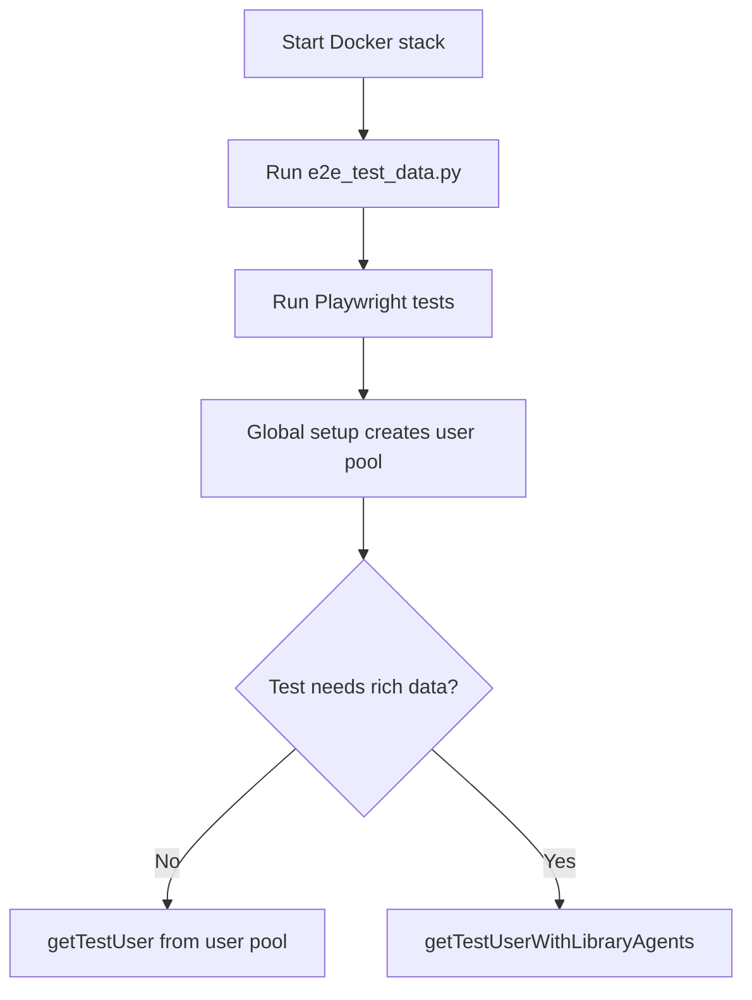

# Frontend Testing 🧪

## Quick Start (local) 🚀

1. Start the backend + Supabase stack:
   - From `autogpt_platform`: `docker compose --profile local up deps_backend -d`
   - Or run the full stack: `docker compose up -d`
2. Seed rich E2E data (creates `test123@gmail.com` with library agents):
   - From `autogpt_platform/backend`: `poetry run python test/e2e_test_data.py`
3. Run Playwright:
   - From `autogpt_platform/frontend`: `pnpm test` or `pnpm test-ui`

## How Playwright setup works 🎭

- Playwright runs from `frontend/playwright.config.ts` with a global setup step.
- The global setup creates a user pool via the real signup UI and stores it in `frontend/.auth/user-pool.json`.
- Most tests call `getTestUser()` (from `src/tests/utils/auth.ts`) which pulls a random user from that pool.
  - these users do not contain library agents, it's user that just "signed up" on the platform, hence some tests to make use of users created via script (see below) with more data

## Test users 👤

- **User pool (basic users)**  
  Created automatically by the Playwright global setup through `/signup`.  
  Used by `getTestUser()` in `src/tests/utils/auth.ts`.

- **Rich user with library agents**  
  Created by `backend/test/e2e_test_data.py`.  
  Accessed via `getTestUserWithLibraryAgents()` in `src/tests/credentials/index.ts`.

Use the rich user when a test needs existing library agents (e.g. `library.spec.ts`).

## Resetting or wiping the DB 🔁

If you reset the Docker DB and logins start failing:

1. Delete `frontend/.auth/user-pool.json` so the pool is regenerated.
2. Re-run the E2E data script to recreate the rich user + library agents:
   - `poetry run python test/e2e_test_data.py`

## Storybook 📚

## Flow diagram 🗺️

- `pnpm storybook` – Run Storybook locally
- `pnpm build-storybook` – Build a static Storybook
- CI runner: `pnpm test-storybook`
- When changing components in `src/components`, update or add stories and verify in Storybook/Chromatic.
