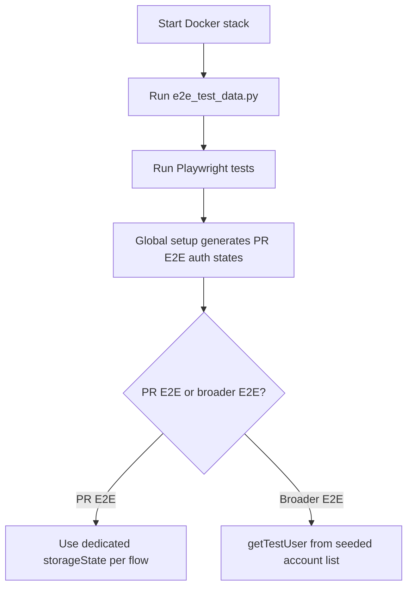

# Frontend Testing 🧪

## Quick Start (local) 🚀

1. Start the backend + Supabase stack:
   - From `autogpt_platform`: `docker compose --profile local up deps_backend -d`
   - Or run the full stack: `docker compose up -d`
2. Seed deterministic E2E data (creates the shared Playwright QA accounts and library agents):
   - From `autogpt_platform/backend`: `poetry run python test/e2e_test_data.py`
3. Run Playwright:
   - From `autogpt_platform/frontend`: `pnpm test` or `pnpm test-ui`
   - PR E2E happy-path suite only: `pnpm test:pr-e2e` or `pnpm test:pr-e2e:no-build`

## How Playwright setup works 🎭

- Playwright runs from `frontend/playwright.config.ts` with a global setup step.
- It also logs in a small set of seeded PR E2E accounts once and stores reusable auth states in `frontend/.auth/states`.
- Most tests call `getTestUser()` (from `src/tests/utils/auth.ts`) which pulls directly from the deterministic seeded account list.
- PR E2E happy-path tests use dedicated storage states so they skip repeated login and stay parallel without colliding.

## Test users 👤

- **Deterministic seeded QA accounts**  
  Created by `backend/test/e2e_test_data.py`.  
  Used by `getTestUser()` in `src/tests/utils/auth.ts`.

- **Reusable PR E2E auth states**  
  Generated by Playwright global setup from seeded accounts defined in `src/tests/credentials/accounts.ts`.  
  Used by the `src/tests/*-happy-path.spec.ts` PR-gating flows.

## Resetting or wiping the DB 🔁

If you reset the Docker DB and logins start failing:

1. Delete `frontend/.auth/states` so the stored auth states are regenerated.
2. Re-run the E2E data script to recreate the seeded QA users + library agents:
   - `poetry run python test/e2e_test_data.py`

## Storybook 📚

## Flow diagram 🗺️

```mermaid
flowchart TD
  A[Start Docker stack] --> B[Run e2e_test_data.py]
  B --> C[Run Playwright tests]
  C --> D[Global setup generates PR E2E auth states]
  D --> E{PR E2E or broader E2E?}
  E -->|PR E2E| F[Use dedicated storageState per flow]
  E -->|Broader E2E| G[getTestUser from seeded account list]
```

- `pnpm storybook` – Run Storybook locally
- `pnpm build-storybook` – Build a static Storybook
- CI runner: `pnpm test-storybook`
- When changing components in `src/components`, update or add stories and verify in Storybook/Chromatic.
