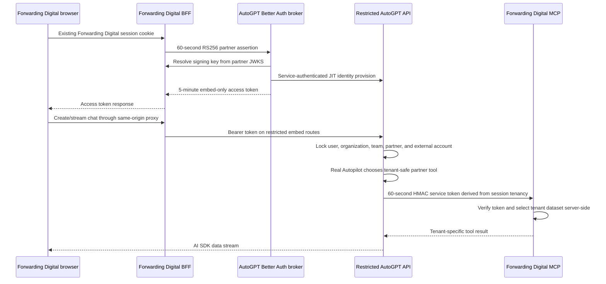

# Partner-embedded AutoGPT chat PoC

This project demonstrates Forwarding Digital users opening an AutoGPT-powered chat without creating or signing into an AutoGPT account. The host application remains the identity authority, while AutoGPT issues a five-minute token that is valid only for the restricted partner chat API and one mapped customer tenant.

## Run it

From `autogpt_platform`:

```bash
docker compose \
  -f docker-compose.yml \
  -f partner_embed_poc/docker-compose.poc.yml \
  -f partner_embed_poc/docker-compose.isolation.yml \
  up -d --build
```

Open <http://127.0.0.1:8787> for the minimal React host, sign in as the mock Forwarding Digital user, and send a message to the Forwarding Assistant.

Open <http://127.0.0.1:8788> for the full multi-tenant partner application. It has partner-owned users, organizations, memberships, active-tenant switching, a persistent SQLite sync ledger, and a view of the JIT-provisioned AutoGPT IDs.

Open <http://127.0.0.1:8789> for the separate Angular 22 host. It uses the publishable `@autogpt/embedded-chat-element` custom element and the same BFF, token exchange, tenant mapping, real Autopilot, and MCP path.

The compose overlay explicitly disables `CHAT_TEST_MODE`. This checkout selects a user-owned Codex credential through `PARTNER_EMBED_CODEX_CREDENTIAL_ID`; the credential must exist in AutoGPT's credential store for the mapped partner user. It is never committed to the repository. A production deployment would supply its managed model transport instead.

The first build compiles the full AutoGPT platform and can take several minutes. Only these loopback ports are published; the mock MCP service is Docker-internal:

| URL                     | Purpose                                     |
| ----------------------- | ------------------------------------------- |
| `http://127.0.0.1:8787` | Minimal React Forwarding Digital host + BFF |
| `http://127.0.0.1:8788` | Multi-tenant React host + BFF               |
| `http://127.0.0.1:8789` | Multi-tenant Angular host + BFF             |
| `http://127.0.0.1:3000` | AutoGPT Better Auth and token exchange      |
| `http://127.0.0.1:8006` | AutoGPT backend diagnostics                 |

Stop this isolated stack with the same files:

```bash
docker compose \
  -f docker-compose.yml \
  -f partner_embed_poc/docker-compose.poc.yml \
  -f partner_embed_poc/docker-compose.isolation.yml \
  down
```

The overlay uses dedicated Docker networks and does not reuse or restart unrelated AutoGPT or RabbitMQ containers.

## Trust flow



The partner assertion contains `sub`, `account_id`, `email`, `name`, `account_name`, `roles`, `jti`, `iss`, `aud`, `iat`, and `exp`. AutoGPT verifies the signature through the configured JWKS, requires the configured issuer and `autogpt-partner-exchange` audience, and maps immutable partner subject/account IDs to deterministic internal IDs. Email is profile data, not an identity key.

The resulting AutoGPT token uses a separate `autogpt-partner-embed` audience, `partner_embed` token type, and `embed:chat` scope. A normal AutoGPT user token cannot call these routes, and request bodies cannot select another organization, team, user, or partner.

## Components

- `packages/embed-react` builds the publishable `@autogpt/embedded-chat` React package. It owns chat state and AI SDK streaming but delegates token retrieval to the host.
- `packages/embed-element` builds the publishable `@autogpt/embedded-chat-element` custom element. Angular and other frameworks assign an `accessTokenProvider` property and brand it through attributes and CSS variables.
- `apps/mock-forwarding-digital` is the minimal representative freight dashboard and partner BFF.
- `apps/mock-forwarding-digital-multitenant` owns partner users, organizations, role/tool memberships, sessions, and a durable mapping ledger. Switching tenant remounts chat, and its BFF checks every chat token against the active user and organization before proxying.
- `apps/mock-forwarding-digital-angular` is a separate Angular 22 host using the custom-element package.
- `apps/mock-forwarding-digital-mcp` is an internal Streamable HTTP MCP server with three tools and separate Northstar/Harbour datasets.
- Each host uses an opaque, HTTP-only partner session cookie. The browser never receives a partner signing key and never signs into AutoGPT.
- `frontend/src/app/api/embed/token` is the Better Auth-side assertion exchange and token broker.
- `backend/api/features/partner_embed` is the restricted FastAPI façade, deterministic JIT provisioning, external-account session anchor, and user-owned model-credential selector.
- `backend/copilot/tools/forwarding_digital.py` is the Autopilot-to-MCP bridge. The model selects only a report; the server derives the tenant.
- `docker-compose.poc.yml` disables the dummy engine and joins the hosts and internal MCP service to the platform network.
- `docker-compose.isolation.yml` avoids global container names, dedicated network collisions, and nonessential host ports.

## Consume the component

The host application supplies its own BFF token callback:

```tsx
import { AutoGPTEmbeddedChat } from "@autogpt/embedded-chat";
import "@autogpt/embedded-chat/styles.css";

async function getAccessToken() {
  const response = await fetch("/api/autogpt/token", { method: "POST" });
  if (!response.ok) throw new Error("Assistant authorization failed");
  const body = (await response.json()) as { access_token: string };
  return body.access_token;
}

export function AssistantPanel() {
  return (
    <AutoGPTEmbeddedChat
      apiBaseURL=""
      brandName="Forwarding Digital"
      getAccessToken={getAccessToken}
      title="Forwarding Assistant"
    />
  );
}
```

Angular and other framework hosts use the custom element:

```ts
import "@autogpt/embedded-chat-element";

export class App {
  readonly accessTokenProvider = async () => {
    const response = await fetch("/api/autogpt/token", { method: "POST" });
    if (!response.ok) throw new Error("Assistant authorization failed");
    const body = (await response.json()) as { access_token: string };
    return body.access_token;
  };
}
```

```html
<autogpt-embedded-chat
  api-base-url=""
  brand-name="Forwarding Digital"
  chat-title="Forwarding Assistant"
  tenant-key="partner-user:partner-account"
  [accessTokenProvider]="accessTokenProvider"
></autogpt-embedded-chat>
```

The callback is invoked for session creation and every chat turn, so the host can refresh short-lived tokens without exposing partner signing keys to the browser. The `apiBaseURL` can be empty for a same-origin BFF or point at an explicitly allowed API origin.

Build, test, or prepare a registry artifact independently:

```bash
cd partner_embed_poc
corepack pnpm install
corepack pnpm test
corepack pnpm build
corepack pnpm --filter @autogpt/embedded-chat pack
corepack pnpm --filter @autogpt/embedded-chat-element pack
```

No package is published by this PoC.

## Production work after the PoC

1. Replace the environment-configured issuer allowlist with a managed partner registry containing issuer, JWKS URL, audiences, allowed algorithms, status, and key-rotation metadata.
2. Store consumed assertion `jti` values in Redis or Postgres until `exp` and reject replay atomically across broker replicas.
3. Replace in-memory partner sessions and the ephemeral demo signing key with Forwarding Digital's real session store and managed signing keys.
4. Add customer and user lifecycle hooks for suspension, account moves, offboarding, role changes, and audit export. JIT provisioning must not grant permissions beyond the partner assertion.
5. Add per-partner/account/user rate limits, concurrency limits, budget enforcement, and metering in customer language such as completed runs or document pages.
6. Add the scheduling façade only after its separate scopes, approval model, idempotency, run history, cancellation, and budget caps are defined. The PoC deliberately does not mint a schedule permission.
7. Replace the three-tool mock MCP with Forwarding Digital's 72-tool production server and a managed token-exchange trust relationship. Preserve the same rule: AutoGPT derives tenancy from the authenticated session, while Forwarding Digital remains authoritative for role and tool permissions on every call.
8. Add production TLS, CSP and allowed-origin configuration, structured audit events, secret rotation, availability targets, data retention controls, and incident revocation.

## Deliberate PoC limitations

- Three mock hosts represent one partner. The multi-tenant React and Angular apps seed two customer accounts and two users but are not a full production forwarding system.
- Partner signing keys remain ephemeral. The minimal app uses in-memory sessions; the multi-tenant app persists sessions and sync mappings in SQLite.
- No distributed `jti` replay store yet; assertions expire after 60 seconds.
- Chat only. Scheduling and the real 72-tool Forwarding Digital MCP remain architectural follow-ons; the PoC MCP implements summary, arrivals, and exceptions.
- Real Autopilot calls use a locally imported user-owned Codex credential. Production must use managed organization credentials, budgets, metering, and rotation.
- Both component packages are built and packable but are not published to npm.
