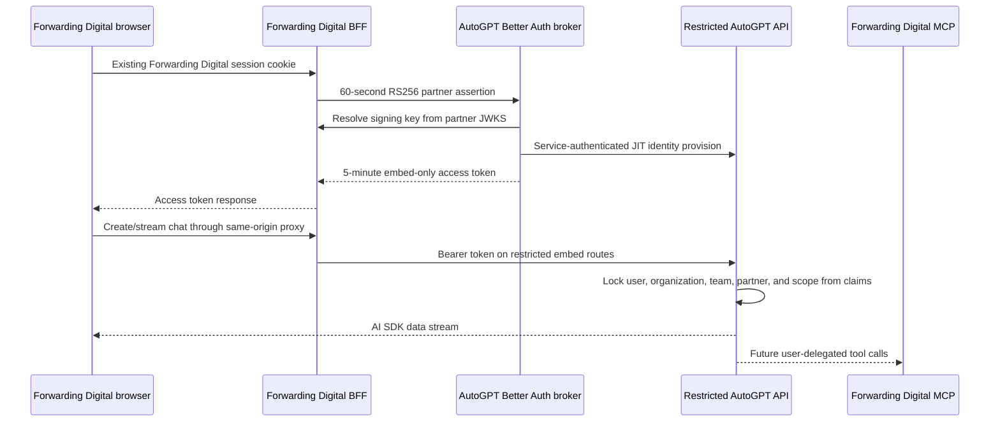

# Partner-embedded AutoGPT chat PoC

This project demonstrates Forwarding Digital users opening an AutoGPT-powered chat without creating or signing into an AutoGPT account. The host application remains the identity authority, while AutoGPT issues a five-minute token that is valid only for the restricted partner chat API and one mapped customer tenant.

## Run it

From `autogpt_platform`:

```bash
docker compose \
  -f docker-compose.yml \
  -f partner_embed_poc/docker-compose.poc.yml \
  -f partner_embed_poc/docker-compose.isolation.yml \
  up -d --build
```

Open <http://127.0.0.1:8787>, sign in as the mock Forwarding Digital user, and send a message to the Forwarding Assistant. The local compose overlay uses AutoGPT's deterministic copilot test engine, so this path does not need an LLM key or spend tokens.

Open <http://127.0.0.1:8788> for the full multi-tenant partner application. It has partner-owned users, organizations, memberships, active-tenant switching, a persistent SQLite sync ledger, and a view of the JIT-provisioned AutoGPT IDs.

The first build compiles the full AutoGPT platform and can take several minutes. Only these loopback ports are published:

| URL                     | Purpose                                        |
| ----------------------- | ---------------------------------------------- |
| `http://127.0.0.1:8787` | Mock Forwarding Digital host and BFF           |
| `http://127.0.0.1:8788` | Multi-tenant Forwarding Digital host and BFF   |
| `http://127.0.0.1:3000` | AutoGPT Better Auth and token exchange         |
| `http://127.0.0.1:8006` | AutoGPT backend; exposed for local diagnostics |

Stop this isolated stack with the same files:

```bash
docker compose \
  -f docker-compose.yml \
  -f partner_embed_poc/docker-compose.poc.yml \
  -f partner_embed_poc/docker-compose.isolation.yml \
  down
```

The overlay uses dedicated Docker networks and does not reuse or restart unrelated AutoGPT or RabbitMQ containers.

## Trust flow



The partner assertion contains `sub`, `account_id`, `email`, `name`, `account_name`, `roles`, `jti`, `iss`, `aud`, `iat`, and `exp`. AutoGPT verifies the signature through the configured JWKS, requires the configured issuer and `autogpt-partner-exchange` audience, and maps immutable partner subject/account IDs to deterministic internal IDs. Email is profile data, not an identity key.

The resulting AutoGPT token uses a separate `autogpt-partner-embed` audience, `partner_embed` token type, and `embed:chat` scope. A normal AutoGPT user token cannot call these routes, and request bodies cannot select another organization, team, user, or partner.

## Components

- `packages/embed-react` builds the publishable `@autogpt/embedded-chat` React package. It owns chat state and AI SDK streaming but delegates token retrieval to the host.
- `apps/mock-forwarding-digital` is the minimal representative freight dashboard and partner BFF.
- `apps/mock-forwarding-digital-multitenant` owns partner users, organizations, role/tool memberships, sessions, and a durable mapping ledger. Switching tenant remounts chat, and its BFF checks every chat token against the active user and organization before proxying.
- Each host uses an opaque, HTTP-only partner session cookie. The browser never receives a partner signing key and never signs into AutoGPT.
- `frontend/src/app/api/embed/token` is the Better Auth-side assertion exchange and token broker.
- `backend/api/features/partner_embed` is the restricted FastAPI façade plus deterministic JIT provisioning.
- `docker-compose.poc.yml` enables the credential-free copilot test engine and joins the mock partner to the platform network.
- `docker-compose.isolation.yml` avoids global container names, dedicated network collisions, and nonessential host ports.

## Consume the component

The host application supplies its own BFF token callback:

```tsx
import { AutoGPTEmbeddedChat } from "@autogpt/embedded-chat";
import "@autogpt/embedded-chat/styles.css";

async function getAccessToken() {
  const response = await fetch("/api/autogpt/token", { method: "POST" });
  if (!response.ok) throw new Error("Assistant authorization failed");
  const body = (await response.json()) as { access_token: string };
  return body.access_token;
}

export function AssistantPanel() {
  return (
    <AutoGPTEmbeddedChat
      apiBaseURL=""
      brandName="Forwarding Digital"
      getAccessToken={getAccessToken}
      title="Forwarding Assistant"
    />
  );
}
```

The callback is invoked for session creation and every chat turn, so the host can refresh short-lived tokens without exposing partner signing keys to the browser. The `apiBaseURL` can be empty for a same-origin BFF or point at an explicitly allowed API origin.

Build, test, or prepare a registry artifact independently:

```bash
cd partner_embed_poc
corepack pnpm install
corepack pnpm test
corepack pnpm build
corepack pnpm --filter @autogpt/embedded-chat pack
```

No package is published by this PoC.

## Production work after the PoC

1. Replace the environment-configured issuer allowlist with a managed partner registry containing issuer, JWKS URL, audiences, allowed algorithms, status, and key-rotation metadata.
2. Store consumed assertion `jti` values in Redis or Postgres until `exp` and reject replay atomically across broker replicas.
3. Replace in-memory partner sessions and the ephemeral demo signing key with Forwarding Digital's real session store and managed signing keys.
4. Add customer and user lifecycle hooks for suspension, account moves, offboarding, role changes, and audit export. JIT provisioning must not grant permissions beyond the partner assertion.
5. Add per-partner/account/user rate limits, concurrency limits, budget enforcement, and metering in customer language such as completed runs or document pages.
6. Add the scheduling façade only after its separate scopes, approval model, idempotency, run history, cancellation, and budget caps are defined. The PoC deliberately does not mint a schedule permission.
7. Connect Forwarding Digital's MCP using user-delegated credentials. AutoGPT memory and model output are never an authority source; every tool call must still pass Forwarding Digital's role and tool permission checks.
8. Add production TLS, CSP and allowed-origin configuration, structured audit events, secret rotation, availability targets, data retention controls, and incident revocation.

## Deliberate PoC limitations

- Two mock hosts represent one partner. The multi-tenant app seeds two customer accounts and two users but is not a full production forwarding system.
- Partner signing keys remain ephemeral. The minimal app uses in-memory sessions; the multi-tenant app persists sessions and sync mappings in SQLite.
- No distributed `jti` replay store yet; assertions expire after 60 seconds.
- Chat only. Scheduling and the real 72-tool Forwarding Digital MCP are architectural follow-ons.
- AutoGPT's deterministic local test response stands in for a billable model call.
- The component package is built and packable but is not published to npm.
