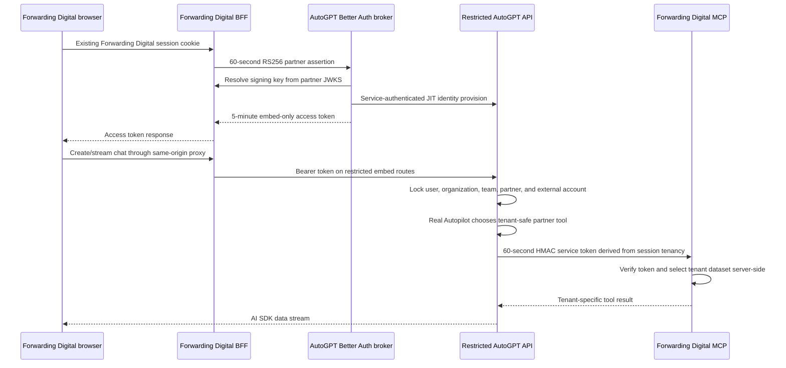

# Partner-embedded AutoGPT chat PoC

This project demonstrates Forwarding Digital users opening an AutoGPT-powered chat without creating or signing into an AutoGPT account. The host application remains the identity authority, while AutoGPT issues a five-minute token that is valid only for the restricted partner chat API and one mapped customer tenant.

## Run it

The compose overlay explicitly disables `CHAT_TEST_MODE`. For local development it runs AutoGPT's Claude Agent SDK using a Claude Code subscription login. From `autogpt_platform`, create a private writable copy of your Claude config and then start the stack:

```bash
partner_claude_dir="$(mktemp -d)"
install -m 600 ~/.claude/.credentials.json "$partner_claude_dir/.credentials.json"
export PARTNER_CLAUDE_CONFIG_DIR="$partner_claude_dir"

docker compose \
  -f docker-compose.yml \
  -f partner_embed_poc/docker-compose.poc.yml \
  -f partner_embed_poc/docker-compose.isolation.yml \
  up -d --build
```

The copy lets Claude refresh OAuth without modifying the desktop credential file. It must never be committed. A production deployment would use managed organization credentials, budgets, metering, and rotation instead of a personal subscription.

Open <http://127.0.0.1:8787> for the minimal React host, sign in as the mock Forwarding Digital user, and send a message to the Forwarding Assistant.

Open <http://127.0.0.1:8788> for the full multi-tenant partner application. It has partner-owned users, organizations, memberships, active-tenant switching, a persistent SQLite sync ledger, and a view of the JIT-provisioned AutoGPT IDs.

Open <http://127.0.0.1:8789> for the separate Angular 22 host. It uses the publishable `@autogpt/embedded-chat-element` custom element and the same BFF, token exchange, tenant mapping, real Autopilot, and MCP path.

The first build compiles the full AutoGPT platform and can take several minutes. Only these loopback ports are published; the mock MCP service is Docker-internal:

The mock user picker is not authentication. Do not publish these hosts to a LAN or the internet. An explicit temporary LAN override for phone testing assumes every client on that network is trusted and must be removed after testing; production requires the partner's real authentication, TLS, secure cookies, rate limits, and budget controls.

| URL                     | Purpose                                     |
| ----------------------- | ------------------------------------------- |
| `http://127.0.0.1:8787` | Minimal React Forwarding Digital host + BFF |
| `http://127.0.0.1:8788` | Multi-tenant React host + BFF               |
| `http://127.0.0.1:8789` | Multi-tenant Angular host + BFF             |
| `http://127.0.0.1:3000` | AutoGPT Better Auth and token exchange      |
| `http://127.0.0.1:8006` | AutoGPT backend diagnostics                 |

Stop this isolated stack with the same files:

```bash
docker compose \
  -f docker-compose.yml \
  -f partner_embed_poc/docker-compose.poc.yml \
  -f partner_embed_poc/docker-compose.isolation.yml \
  down
```

The overlay uses dedicated Docker networks and does not reuse or restart unrelated AutoGPT or RabbitMQ containers.

## Trust flow



The partner assertion contains `sub`, `account_id`, `name`, `account_name`, `roles`, `capabilities`, `jti`, `iss`, `aud`, `iat`, and `exp`. AutoGPT verifies the signature through the configured JWKS, requires the configured issuer and `autogpt-partner-exchange` audience, and maps immutable partner subject/account IDs to account-scoped deterministic internal IDs. Partner email remains in the partner application and is not sent to AutoGPT.

The resulting AutoGPT token uses a separate `autogpt-partner-embed` audience, `partner_embed` token type, and `embed:chat` scope. A normal AutoGPT user token cannot call these routes, and request bodies cannot select another organization, team, user, or partner.

## Capability and session boundary

Forwarding Digital assigns capabilities from its own user membership. They are signed into the partner assertion, copied into the short-lived embed token, frozen onto the AutoGPT chat session, and checked again before either AutoPilot or the MCP server exposes a tool. The PoC uses these capability names:

- `jobs.read` enables arrivals and exceptions MCP reports.
- `reports.read` enables the operations summary MCP report.
- `documents.read` enables workspace reads and the session artifact list/download APIs.
- `documents.write` enables workspace file creation.
- `agents.create` enables the native guided create/edit agent flow.
- `agents.run` enables immediate runs of allowed agent graphs.
- `agents.schedule` enables recurring agent runs plus schedule listing/deletion.
- `autogpt:block:<block-id-or-name>` enables only that AutoGPT block plus the find/run/continue block tools.
- `autogpt:tool:<tool-name>` explicitly enables one additional AutoPilot tool.

Capabilities are part of session identity, not mutable UI preferences. A token with a different partner, organization, account, team, user, or capability set cannot resume the session. Each partner registry entry defines AutoGPT's maximum allowed capabilities, and the exchange rejects signed claims outside that ceiling. The MCP service independently verifies the tenant and capability set in its 60-second service token, filters `tools/list`, and rejects an unauthorized `tools/call` even if a model attempts it.
Agent creation, edits, immediate runs, preset runs, and schedules re-check every node in the flattened graph against the session's `autogpt:block:*` allowlist. The seeded Northstar manager receives all three lifecycle grants plus the generic input, output, and calculator blocks; operator memberships do not.

The restricted BFF/API surface used by the component is:

| Method | Route                                                              | Purpose                                     |
| ------ | ------------------------------------------------------------------ | ------------------------------------------- |
| `POST` | `/api/embed/v1/sessions`                                           | Create a capability-bound chat session      |
| `GET`  | `/api/embed/v1/sessions`                                           | List the signed-in user's matching sessions |
| `GET`  | `/api/embed/v1/sessions/:sessionId`                                | Restore sanitized messages and capabilities |
| `POST` | `/api/embed/v1/sessions/:sessionId/stream`                         | Stream a real AutoPilot turn                |
| `GET`  | `/api/embed/v1/sessions/:sessionId/artifacts`                      | List session-owned artifacts                |
| `GET`  | `/api/embed/v1/sessions/:sessionId/artifacts/:artifactId/download` | Download a session-owned artifact           |

The UI renders persisted and streaming Markdown, reasoning disclosures, native-style tool call cards, session navigation, and artifact downloads. Artifact access additionally requires `documents.read`; paths are checked against the selected session before download.

## Components

- `packages/embed-react` builds the publishable `@autogpt/embedded-chat` React package. It owns chat state and AI SDK streaming but delegates token retrieval to the host.
- `packages/embed-element` builds the publishable `@autogpt/embedded-chat-element` custom element. Angular and other frameworks assign an `accessTokenProvider` property and brand it through attributes and CSS variables.
- `apps/mock-forwarding-digital` is the minimal representative freight dashboard and partner BFF.
- `apps/mock-forwarding-digital-multitenant` owns partner users, organizations, role/tool memberships, sessions, and a durable mapping ledger. Switching tenant remounts chat, and its BFF checks every chat token against the active user and organization before proxying.
- `apps/mock-forwarding-digital-angular` is a separate Angular 22 host using the custom-element package.
- `apps/mock-forwarding-digital-mcp` is an internal Streamable HTTP MCP server with three tools and separate Northstar/Harbour datasets.
- Each host uses an opaque, HTTP-only partner session cookie. The browser never receives a partner signing key and never signs into AutoGPT.
- `frontend/src/app/api/embed/token` is the Better Auth-side assertion exchange and token broker.
- `backend/api/features/partner_embed` is the restricted FastAPI façade, deterministic JIT provisioning, external-account session anchor, and server-owned model-transport selector.
- `backend/copilot/tools/forwarding_digital.py` is the Autopilot-to-MCP bridge. The model selects only a report; the server derives the tenant.
- `docker-compose.poc.yml` disables the dummy engine and joins the hosts and internal MCP service to the platform network.
- `docker-compose.isolation.yml` avoids global container names, dedicated network collisions, and nonessential host ports.

## Consume the component

The host application supplies its own BFF token callback:

```tsx
import { AutoGPTEmbeddedChat } from "@autogpt/embedded-chat";
import "@autogpt/embedded-chat/styles.css";

async function getAccessToken() {
  const response = await fetch("/api/autogpt/token", { method: "POST" });
  if (!response.ok) throw new Error("Assistant authorization failed");
  const body = (await response.json()) as { access_token: string };
  return body.access_token;
}

export function AssistantPanel() {
  return (
    <AutoGPTEmbeddedChat
      apiBaseURL=""
      brandName="Forwarding Digital"
      getAccessToken={getAccessToken}
      title="Forwarding Assistant"
    />
  );
}
```

Angular and other framework hosts use the custom element:

```ts
import "@autogpt/embedded-chat-element";

export class App {
  readonly accessTokenProvider = async () => {
    const response = await fetch("/api/autogpt/token", { method: "POST" });
    if (!response.ok) throw new Error("Assistant authorization failed");
    const body = (await response.json()) as { access_token: string };
    return body.access_token;
  };
}
```

```html
<autogpt-embedded-chat
  api-base-url=""
  brand-name="Forwarding Digital"
  chat-title="Forwarding Assistant"
  tenant-key="partner-user:partner-account"
  [accessTokenProvider]="accessTokenProvider"
></autogpt-embedded-chat>
```

The callback is invoked for session creation and every chat turn, so the host can refresh short-lived tokens without exposing partner signing keys to the browser. The `apiBaseURL` can be empty for a same-origin BFF or point at an explicitly allowed API origin.

### Theming and feature switches

React hosts can enable the session/artifact surfaces independently and use either the light/dark defaults or a typed semantic theme:

```tsx
<AutoGPTEmbeddedChat
  apiBaseURL=""
  getAccessToken={getAccessToken}
  sessionsEnabled
  artifactsEnabled
  appearance="light"
  theme={{
    background: "#f5f7f2",
    accent: "#087f5b",
    radius: "14px",
  }}
/>
```

The custom element exposes the same switches without framework coupling:

- `appearance`, `sessions-enabled`, and `artifacts-enabled` configure presentation.
- `api-base-url`, `brand-name`, `chat-title`, and `tenant-key` configure the host integration and remount boundary.

Both packages accept `--agpt-embed-background`, `--agpt-embed-foreground`, `--agpt-embed-surface`, `--agpt-embed-surface-muted`, `--agpt-embed-accent`, `--agpt-embed-accent-foreground`, `--agpt-embed-border`, `--agpt-embed-danger`, `--agpt-embed-radius`, `--agpt-embed-font`, and `--agpt-embed-shadow` CSS variables.

```css
autogpt-embedded-chat {
  --agpt-embed-accent: #005b96;
  --agpt-embed-radius: 12px;
}
```

Stable `data-slot`, `data-role`, and `data-state` attributes are available for host-level testing and carefully scoped overrides. Capability switches still come only from the signed identity chain; hiding a UI surface never grants or revokes a server permission.

Build, test, or prepare a registry artifact independently:

```bash
cd partner_embed_poc
corepack pnpm install
corepack pnpm test
corepack pnpm build
corepack pnpm --filter @autogpt/embedded-chat pack
corepack pnpm --filter @autogpt/embedded-chat-element pack
```

No package is published by this PoC.

## Production work after the PoC

1. Replace the environment-configured issuer allowlist with a managed partner registry containing issuer, JWKS URL, audiences, allowed algorithms, status, and key-rotation metadata.
2. Store consumed assertion `jti` values in Redis or Postgres until `exp` and reject replay atomically across broker replicas.
3. Replace in-memory partner sessions and the ephemeral demo signing key with Forwarding Digital's real session store and managed signing keys.
4. Add customer and user lifecycle hooks for suspension, account moves, offboarding, role changes, and audit export. JIT provisioning must not grant permissions beyond the partner assertion.
5. Add per-partner/account/user rate limits, concurrency limits, budget enforcement, and metering in customer language such as completed runs or document pages.
6. Promote scheduling into a dedicated partner façade and run-history UI only after its approval model, idempotency, cancellation, and budget caps are defined. The PoC currently schedules allowed native agent graphs through capability-gated chat tools.
7. Replace the three-tool mock MCP with Forwarding Digital's 72-tool production server and a managed token-exchange trust relationship. Preserve the same rule: AutoGPT derives tenancy from the authenticated session, while Forwarding Digital remains authoritative for role and tool permissions on every call.
8. Add production TLS, CSP and allowed-origin configuration, structured audit events, secret rotation, availability targets, data retention controls, and incident revocation.

## Deliberate PoC limitations

- Three mock hosts represent one partner. The multi-tenant React and Angular apps seed two customer accounts and two users but are not a full production forwarding system.
- Partner signing keys remain ephemeral. The minimal app uses in-memory sessions; the multi-tenant app persists sessions and sync mappings in SQLite.
- Assertion `jti` values are not yet consumed atomically, so the same 60-second assertion can be exchanged more than once. Embed-token lifetime is capped by the remaining assertion lifetime and exchange responses are non-cacheable.
- Interactive chat, session history, artifacts, and manager-only create/run/schedule flows are implemented. Scheduled graphs are deliberately limited to the three seeded safe blocks; scheduled Forwarding Digital MCP automations and the real 72-tool server remain architectural follow-ons.
- Real local Autopilot calls use the private Claude subscription config copy supplied through `PARTNER_CLAUDE_CONFIG_DIR`. Partner sessions replace Claude Code's built-in identity-bearing prompt preset so the subscription account profile does not enter model context. Production must still use managed organization credentials, budgets, metering, and rotation.
- Both component packages are built and packable but are not published to npm.
