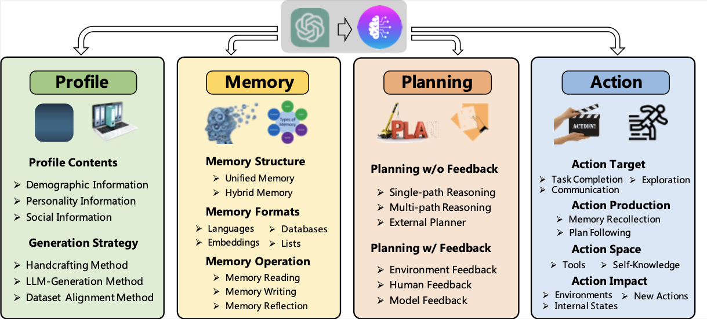
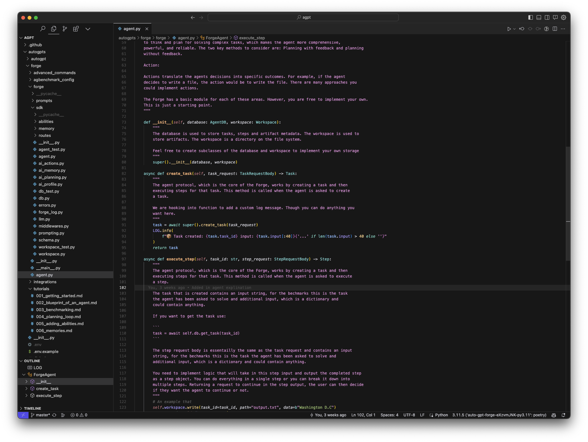

# AutoGPT Forge: The Blueprint of an AI Agent

**Craig Swift**  
Craig Swift  
*8 min read*  
·  
*Just now*  

---

Hello there, fellow pioneers of the AI frontier!  

If you’ve landed here, chances are you’ve been bitten by the AI bug, eager to harness the incredible power of Large Language Models (LLMs) to build your own intelligent agents, commonly known as AutoGPTs. Remember the thrill when we set up our first project in the initial tutorial? Well, buckle up, because things are about to get even more exciting!  

In this tutorial — the sequel to our AI adventure — we’re going to embark on a journey into the very heart of an AI agent. Imagine peeling back the layers of an onion, but instead of tears, there’s a wealth of knowledge waiting at each layer. We’ll explore the intricate web of components that make these agents tick, take a guided tour of the revered AutoGPT Forge’s project structure, and yes, get our hands back into the coding trenches to enhance the step function.  

By the time we wrap up, you won’t just have a working LLM-powered agent; you’ll have one that passes the essential “write file” test, a testament to your growing prowess in the world of AI development.  

So, my fellow agent developers, are you ready to leap into this world where code meets cognition? Let the exploration begin!  

## What are LLM-Based AI Agents?

Large Language Models (LLMs) are state-of-the-art machine learning models that harness vast amounts of web knowledge. But what happens when you blend these LLMs with autonomous agents? You get LLM-based AI agents — a new breed of artificial intelligence that promises more human-like decision-making.  

Traditional autonomous agents operated with limited knowledge, often confined to specific tasks or environments. They were like calculators — efficient but limited to predefined functions. LLM-based agents, on the other hand, are akin to having an encyclopedia combined with a calculator. They don’t just compute; they understand, reason, and then act, drawing from a vast reservoir of information.  

The Agent Landscape Survey underscores this evolution, detailing the remarkable potential LLMs have shown in achieving human-like intelligence. They’re not just about more data; they represent a more holistic approach to AI, bridging gaps between isolated task knowledge and expansive web information.  

Further expanding on this, *The Rise and Potential of Large Language Model Based Agents: A Survey* portrays LLMs as the foundational blocks for the next generation of AI agents. These agents sense, decide, and act, all backed by the comprehensive knowledge and adaptability of LLMs. It is an incredible source of knowledge on AI Agent Research with almost 700 papers referenced and organized by research area.  

## The Anatomy of an LLM-Based AI Agent

Diving deep into the core of an LLM-based AI agent, we find it’s structured much like a human, with distinct components akin to personality, memory, thought process, and abilities. Let’s break these down:  

Anatomy of an Agent from the Agent Landscape Survey  

1. **Profile**  
When we humans focus on various tasks, we condition ourselves for those tasks. Whether we’re writing, chopping vegetables, driving, or playing sports, we concentrate and even adopt different mindsets. This adaptability is what the concept of profile alludes to when discussing agents. Research has shown that simply informing an agent that it is an expert in a specific task can enhance its performance.  
The profiling module has potential applications beyond just prompt engineering. It could be used to adjust an agent’s memory functions, available actions, or even the underlying large language model (LLM) that drives the agent.  
2. **Memory**  
Memory, for an agent, is more than just storage — it’s the bedrock of its identity, capabilities and fundamental for it to learn. Just as our memories inform our decisions, reactions, and even our very personalities, an agent’s memory serves as its cumulative record of past interactions, learnings, and feedback. Two primary types of memories shape an agent’s cognition: long-term and short-term.  
The Long-Term Memory is akin to the agent’s foundational knowledge, a vast reservoir that encompasses data and interactions spanning extended periods. It’s the agent’s historical archive, guiding its core behaviors and understanding.  
On the other hand, the Short-Term (or Working) Memory focuses on the immediate, handling transient memories much like our recollection of recent events. While essential for real-time tasks, not all short-term memories make it to the agent’s long-term storage.  
An emerging concept in this realm is Memory Reflection. Here, the agent doesn’t just store memories but actively revisits them. This introspection allows the agent to reassess, prioritize, or even discard information, akin to a human reminiscing and learning from past experiences.  
3. **Planning**  
Planning is the agent’s roadmap to problem-solving. When faced with a complex challenge, humans instinctively break it down into bite-sized, manageable tasks — a strategy mirrored in LLM-based agents. This methodical approach enables agents to navigate problems with a structured mindset, ensuring comprehensive and systematic solutions.  
There are two dominant strategies in the agent’s planning toolkit. The first, Planning with Feedback, is an adaptive approach. Here, the agent refines its strategy based on outcomes, much like iterating through versions of a design based on user feedback.  
The second, Planning without Feedback, sees the agent as a strategist, relying solely on its pre-existing knowledge and foresight. It’s a game of chess, with the agent anticipating challenges and preparing several moves in advance.  
4. **Action**  
After the introspection of memory and the strategizing of planning, comes the finale: Action. This is where the agent’s cognitive processes manifest into tangible outcomes using the agents Abilities. Every decision, every thought, culminates in the action phase, translating abstract concepts into definitive results.  
Whether it’s penning a response, saving a file, or initiating a new process, the action component is the culmination of the agent’s decision-making journey. It’s the bridge between digital cognition and real-world impact, turning the agent’s electronic impulses into meaningful and purposeful outcomes.  

## The Agent Protocol: The Linguistics of AI Communication

After diving deep into the anatomy of an agent, understanding its core components, there emerges a pivotal question: How do we effectively communicate with these diverse, intricately-designed agents? The answer lies in the Agent Protocol.  

### Understanding the Agent Protocol

At its essence, the Agent Protocol is a standardized communication interface, a universal “language” that every AI agent, regardless of its underlying structure or design, can comprehend. Think of it as the diplomatic envoy that ensures smooth conversations between agents and their developers, tools, or even other agents.  

In an ecosystem where every developer might have their unique approach to crafting agents, the Agent Protocol acts as a unifying bridge. It’s akin to a standardized plug fitting into any socket or a universal translator decoding myriad languages.  

## AutoGPT Forge: A Peek Inside the LLM Agent Template

Now we understand the architecture of an agent lets look inside the Forge. It’s a well-organized template, meticulously architected to cater to the needs of agent developers. Let

#### Forge’s Project Structure: A Bird’s-Eye View

The Forge’s directory structure can be likened to a well-organized library, where every book (file or directory) has its designated place:  
- **agent.py**: The heart of the Forge, where the agent's logic resides.  
- **prompts**: A treasure trove of predefined templates, instrumental for guiding the LLM's responses.  
- **sdk**: The boilerplate code and the foundational bedrock of the Forge.  

Let’s examine these core sections.  

#### Unraveling the SDK

The sdk directory is the Forge's control center. Think of it as the engine room of a ship, containing the gears and mechanisms that drive the entire vessel. Here's what it encapsulates:  
- **Core Components**: The SDK hosts the integral parts of the Forge, like Memory, Abilities, and Planning. These components are fundamental to an agent’s cognition and actions.  
- **Agent Protocol Routes**: Within the routes sub-directory, you'll find the implementation of our previously discussed Agent Protocol. It's here that the standard communication interface is brought to life.  
- **Database (db.py)**: The agent's memory bank. It's where experiences, learnings, and other crucial data get stored.  
- **Prompting Engine (prompting.py)**: This engine utilizes the templates from the prompts directory to formulate queries for the LLM, ensuring consistent and apt interactions.  
- **Agent Class**: Acts as a bridge, connecting the agent’s logic with the Agent Protocol routes.  

#### Configurations and Environment

Configuration is key to ensuring our agent runs seamlessly. The .env.example file provides a template for setting up the necessary environment variables. Before diving into the Forge, developers need to copy this to a new .env file and adjust the settings:  
- **API Key**: `OPENAI_API_KEY` is where you plug in your OpenAI API key.  
- **Log Level**: With `LOG_LEVEL`, control the verbosity of the logs.  
- **Database Connection**: `DATABASE_STRING` determines where and how the agent's data gets stored.  
- **Port**: `PORT` specifies the listening port for the agent's server.  
- **Workspace**: `AGENT_WORKSPACE` points to the agent's working directory.  

## Wrapping Up: From Blueprint to Reality

And there we have it — a comprehensive dive into the world of AutoGPTs. We’ve traversed the intricate pathways of agent anatomy, understood how the Agent Protocol fits in, and peeked under the hood of the Forge, understanding its core components and structure.  

If this tutorial was a journey, think of it as a hike up a mountain. We started at the base, with a broad view of LLM-based AI agents, understanding their significance and potential. As we climbed, the trail led us to the anatomy of these agents, dissecting their structure and functionality. Nearing the summit, we delved into the Agent Protocol, understanding its pivotal role in standardizing communication. And finally, standing at the peak, we had a bird’s-eye view of the Forge, observing its organized layout and appreciating its design intricacies.  

But remember, every mountain peak is the bottom of another adventure. Having grasped the theoretical aspects, it’s time to transition from blueprint to reality.Now the foundations have laid, our next steps involve breathing life into these concepts, turning lines of code into intelligent, responsive agents.  

To all the budding agent developers out there, gear up for the next phase of our expedition — the hands-on time! Until then, keep the AI flame burning bright and never stop exploring.  