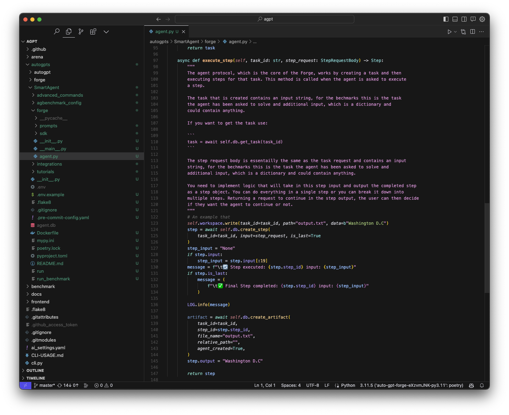
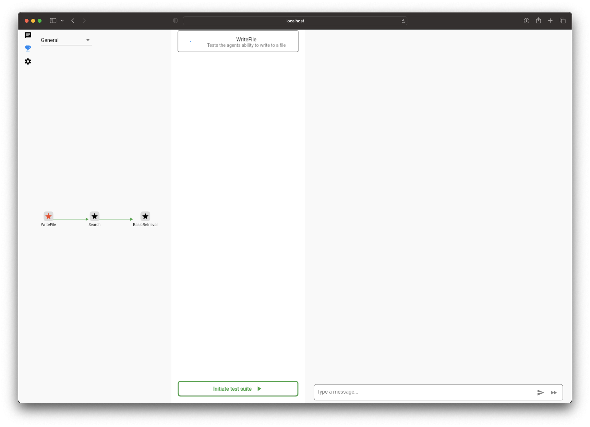

# AutoGPT Forge: Crafting Intelligent Agent Logic


Greetings, AI enthusiasts! Today, we're about to embark on an enlightening journey of crafting intelligent agent logic. This is part 3 in a tutorial series on using the AutoGPT Forge, you can find the earlier parts here:

Part 1: AutoGPT Forge: A Comprehensive Guide to Your First Step
Part 2: AutoGPT Forge: The Blueprint of an AI Agent

Alright, folks, let's dive right into the fun part: coding! We're about to set up a nifty system that showcases how to use an LLM as the brainpower behind our agent. The mission? To tackle the simple task of jotting down the capital of the United States into a txt file. The coolest part? We won't spoon-feed our agent the steps. Instead, we'll just hand over the task: "Write the word 'Washington' to a .txt file," and watch in awe as it figures out the 'how-to' all by itself, then swiftly executes the necessary commands. How cool is that?

---
## Setting Up Your Smart Agent Project

Before diving in, ensure you've prepped your project and crafted an agent as detailed in our kick-off tutorial. Missed that step? No worries! Just hop over to the project setup by clicking here. Once you're all set, come back and we'll hit the ground running.
In the following screenshot, you'll notice I've crafted an agent named "SmartAgent" and then accessed the agent.py file located in the 'forge' subfolder. This will be our workspace for integrating the LLM-driven logic. While our previous tutorial touched upon the project layout and agent operations, don't fret! I'll highlight the essentials as we delve into the logic implementation.



---

## The Task Lifecycle

The lifecycle of a task, from its creation to execution, is outlined in the agent protocol. In simple terms: a task is initiated, its steps are systematically executed, and it concludes once completed.

Want your agent to perform an action? Start by dispatching a create_task request. This crucial step involves specifying the task details, much like how you'd send a prompt to ChatGPT, using the input field. If you're giving this a shot on your own, the UI is your best friend; it effortlessly handles all the API calls on your behalf.

Once your agent receives this, it triggers the create_task function. The method super().create_task(task_request) effortlessly manages all the requisite protocol record keeping on your behalf. Subsequently, it simply logs  the task's creation. For the scope of this tutorial, there's no need to tweak this function.

```python
async def create_task(self, task_request: TaskRequestBody) -> Task:
    """
    The agent protocol, which is the core of the Forge, works by creating a task and then
    executing steps for that task. This method is called when the agent is asked to create
    a task.

    We are hooking into function to add a custom log message. Though you can do anything you
    want here.
    """
    task = await super().create_task(task_request)
    LOG.info(
        f"📦 Task created: {task.task_id} input: {task.input[:40]}{'...' if len(task.input) > 40 else ''}"
    )
    return task
```

Once a task is initiated, the execute_step function is invoked repeatedly until the very last step is executed. Below is the initial look of the execute_step, and note that I've omitted the lengthy docstring explanation for the sake of brevity, but you'll encounter it in your project.

```python
async def execute_step(self, task_id: str, step_request: StepRequestBody) -> Step:
    # An example that
      step = await self.db.create_step(
          task_id=task_id, input=step_request, is_last=True
      )

      self.workspace.write(task_id=task_id, path="output.txt", data=b"Washington D.C")

      await self.db.create_artifact(
          task_id=task_id,
          step_id=step.step_id,
          file_name="output.txt",
          relative_path="",
          agent_created=True,
      )
      
      step.output = "Washington D.C"

      LOG.info(f"\t✅ Final Step completed: {step.step_id}")

      return step
```

Here's what you're witnessing: a clever way to pass the 'write file' test, broken down into four clear-cut stages:

1. Database Step Creation: The first stage is all about creating a step within the database, an essential aspect of the agent protocol. You'll observe that while setting up this step, we've flagged it with is_last=True. This signals to the agent protocol that no more steps are pending. For the purpose of this guide, let's work under the assumption that our agent will only tackle single-step tasks. However, hang tight for future tutorials, where we'll level up and let the agent determine its completion point.

2. File Writing: Next, we pen down "Washington D.C." using the workspace.write function. Simple, right?

3. Artifact Database Update: Once the file is written, it's time to record this file in the agent's artifact database, ensuring everything's documented.

4. Step Output Setting & Logging: To wrap things up, we align the step output with what we've penned in the file, jot down in the logs that our step has been executed, and then bring the step object into play.

Now that we've demystified the process to ace the 'write file' test, it's time to crank things up a notch. Let's mold this into a truly intelligent agent, empowering it to navigate and conquer the challenge autonomously. Ready to dive in?

---

## Building the Foundations For Our Smart Agent

Alright, first order of business: Let's remove the hardcoded solution from the execute_step() function and have it work on the provided request instead. 

To bridge this knowledge gap, we'll summon the task details using the task_id provided. Here's the code magic to make it happen:

```python
task = await self.db.get_task(task_id)
Additionally, we're not forgetting the crucial step of creating a database record. As we did previously, we'll emphasize this is a one-off task with is_last=True:
step = await self.db.create_step(
    task_id=task_id, input=step_request, is_last=True
)
```

With these additions, your execute_step function should now have a minimalistic yet essential structure:

```python
async def execute_step(self, task_id: str, step_request: StepRequestBody) -> Step:
    # Firstly we get the task this step is for so we can access the task input
    task = await self.db.get_task(task_id)

    # Create a new step in the database
    step = await self.db.create_step(
        task_id=task_id, input=step_request, is_last=True
    )
    return step
```

With these foundational bricks laid down, let's plunge into something truly fascinating: introducing, The PromptEngine.

---

**The Art of Prompting**  


Prompting is akin to a craftsman meticulously shaping messages tailored for powerful language models like ChatGPT. With these models being highly attuned to input nuances, designing the perfect prompt to elicit awe-inspiring behavior can be a labyrinthine challenge. Enter: the **PromptEngine**.

While "PromptEngine" might sound high-brow, its essence is elegantly simple. It lets you store your prompts in text files or, to be precise, in Jinja2 templates. The advantage? You can refine the prompts given to your agent without diving into the code. Plus, it offers the flexibility to customize prompts for specific LLMs. Let's break this down.

Firstly, integrate the PromptEngine from the SDK:

```python
from .sdk import PromptEngine
```

Next, within your `execute_step` function, initialize the engine tailored for, say, the `gpt-3.5-turbo` LLM:

```python
prompt_engine = PromptEngine("gpt-3.5-turbo")
```

Loading a prompt is straightforward. For instance, loading the `system-format` prompt, which dictates the response format from the LLM, is as easy as:

```python
system_prompt = prompt_engine.load_prompt("system-format")
```

For intricate use cases, like the `task-step` prompt which requires parameters, employ the following method:

```python
# Specifying the task parameters
task_kwargs = {
    "task": task.input,
    "abilities": self.abilities.list_abilities_for_prompt(),
}

# Then, load the task prompt with the designated parameters
task_prompt = prompt_engine.load_prompt("task-step", **task_kwargs)
```

Delving deeper, let's peek at the `task-step` prompt template, housed at `prompts/gpt-3.5-turbo/task-step.j2`:

```jinja

Planner

Your task is:

{{ task }}

Ensure to respond in the given format. Always make autonomous decisions, devoid of user guidance. Harness the power of your LLM, opting for straightforward tactics sans any legal entanglements.


## Constraints
Operate under these confines:

- {{ constraint }}




## Resources
Utilize these resources:

- {{ resource }}




## Abilities
Summon these abilities:

- {{ ability }}




## Best Practices

- {{ best_practice }}



```

This template is a marvel of modularity. By using the `extends` directive, it builds upon the base `expert.j2` template. The different blocks – constraints, resources, abilities, and best practices – allow for a dynamic prompt that adjusts based on the context. It's like a conversation blueprint, guiding the LLM to understand the task, abide by constraints, and deploy resources and abilities to achieve the desired outcome.

The PromptEngine equips us with a potent tool to converse seamlessly with large language models. By externalizing prompts and using templates, we can ensure that our agent remains agile, adapting to new challenges without a code overhaul. As we march forward, keep this foundation in mind—it's the bedrock of our agent's intelligence.

---

## Engaging with your LLM

To fully exploit the capabilities of LLMd, it goes beyond simply sending a solitary prompt. It’s about tasking the model with a series of structured directives. To do this we need to structure our prompts into the format our LLM is primed to process a list of messages. Using the system_prompt and task_prompt we previously prepared create the 

```python
messages list:
 messages = [
            {"role": "system", "content": system_prompt},
            {"role": "user", "content": task_prompt}
        ]
```

With our prompt shaped and ready, it’s time to task our LLM! While this phase entails some foundational code, the spotlight is on the chat_completion_request. This crucial function tasks the LLM and retrieves its output. The adjacent code merely packages our request and deciphers the model's feedback:

```python
  try:
      # Define the parameters for the chat completion request
      chat_completion_kwargs = {
          "messages": messages,
          "model": "gpt-3.5-turbo",
      }
      # Make the chat completion request and parse the response
      chat_response = await chat_completion_request(**chat_completion_kwargs)
      answer = json.loads(chat_response["choices"][0]["message"]["content"])

      # Log the answer for debugging purposes
      LOG.info(pprint.pformat(answer))

  except json.JSONDecodeError as e:
      # Handle JSON decoding errors
      LOG.error(f"Unable to decode chat response: {chat_response}")
  except Exception as e:
      # Handle other exceptions
      LOG.error(f"Unable to generate chat response: {e}")
```      

Navigating through the quirks of LLM outputs to extract a clear processable message can be a nuanced endeavor. Our current approach is simple and will usually work with GPT-3.5 and GPT-4. However, future tutorials will broaden your horizons with more intricate ways to process LLM outputs. The aim? To ensure that you’re not just limited to JSON, especially when some LLMs excel with alternative response patterns. Stay tuned!

---

## Using and Creating Abilities

For those of you with an acute attention to detail, you might’ve picked up on the reference to agent abilities when we discussed creating the task-step prompt. Abilities are the gears and levers that enable the agent to interact with tasks at hand. Let's unpack the mechanisms behind these abilities and how you can harness, and even extend, them.
Within the SDK, there’s a designated folder titled abilities. As of this writing, it houses registry.py, finish.py, and a subfolder named file_system. And there's space for expansion – perhaps your own innovative ability will find its home here soon!

The file registry.py plays a pivotal role. It provides the foundational blueprint for abilities, integrating the essential @ability decorator and the AbilityRegister class. This class isn't just a passive list; it's an active catalog that keeps tabs on available abilities and delineates the function necessary for their execution. What's more, a default ability register is seamlessly integrated into the base Agent class, making it effortlessly accessible via the self.abilities handle. This is added to the Agent class in it’s init function like so:

```python
self.abilities = AbilityRegister(self)
While AbilityRegister is studded with utility methods, two stand out. The list_abilities_for_prompt method curates and structures abilities for prompt integration. Conversely, run_ability operationalizes the designated ability, translating it from code to action.
An ability’s DNA comprises a function embellished with the @ability decorator and mandatorily paired with parameters, notably the agent and task_id.
@ability(
    name="write_file",
    description="Write data to a file",
    parameters=[
        {
            "name": "file_path",
            "description": "Path to the file",
            "type": "string",
            "required": True,
        },
        {
            "name": "data",
            "description": "Data to write to the file",
            "type": "bytes",
            "required": True,
        },
    ],
    output_type="None",
)
async def write_file(agent, task_id: str, file_path: str, data: bytes) -> None:
    pass
```

Here, the @ability decorator is not just an adornment but a functional specifier. It encompasses the ability's metadata: its identity (name), functionality (description), and operational parameters. Each parameter is delineated with precision, encapsulating its identity, datatype, and operational necessity.

## Example of a Custom Ability: Webpage Fetcher

```python
import requests

@ability(
  name="fetch_webpage",
  description="Retrieve the content of a webpage",
  parameters=[
      {
          "name": "url",
          "description": "Webpage URL",
          "type": "string",
          "required": True,
      }
  ],
  output_type="string",
)
async def fetch_webpage(agent, task_id: str, url: str) -> str:
  response = requests.get(url)
  return response.text
```

This ability, “fetch_webpage”, accepts a URL as input and returns the HTML content of the webpage as a string. As you can see, custom abilities allow you to extend the core functions of your agent seamlessly, integrating external tools and libraries to augment its capabilities.
Crafting a custom ability demands a synthesis of architectural comprehension and technical prowess. It’s about articulating a function, enlisting its operational parameters, and intricately weaving them with the @ability decorator's specifications. With custom abilities like the "fetch_webpage", the agent’s potential is only limited by your imagination, readying it to tackle complex tasks with refined competence.

## Running an Ability

Now that you’re well-acquainted with the essence of abilities and have the prowess to craft them, it’s time to put these skills into action. The final piece of our puzzle is the execute_step function. Our goal? To interpret the agent's response, isolate the desired ability, and bring it to life.
First and foremost, we derive the ability details from the agent’s response. This gives us a clear picture of the task at hand:

```python
# Extract the ability from the answer
ability = answer["ability"]
With the ability details at our fingertips, the next step is to mobilize it. This involves calling our previously discussed run_ability function
# Run the ability and get the output
# We don't actually use the output in this example
output = await self.abilities.run_ability(
    task_id, ability["name"], **ability["args"]
)
```


Here, we’re invoking the specified ability. The task_id ensures continuity, ability['name'] pinpoints the exact function, and the arguments (ability["args"]) provide necessary context.

Finishing up, we’ll craft the step’s output to echo the agent’s thoughts. This not only provides transparency but also offers a glimpse into the agent’s decision-making process:

```python
# Set the step output to the "speak" part of the answer
step.output = answer["thoughts"]["speak"]

# Return the completed step
return step
```


And there you have it! Your first Smart Agent, sculpted with precision and purpose, stands ready to take on challenges. The stage is set. It’s showtime!

Here is what your function should look like:

```python
async def execute_step(self, task_id: str, step_request: StepRequestBody) -> Step:
    # Firstly we get the task this step is for so we can access the task input
    task = await self.db.get_task(task_id)

    # Create a new step in the database
    step = await self.db.create_step(
        task_id=task_id, input=step_request, is_last=True
    )

    # Log the message
    LOG.info(f"\t✅ Final Step completed: {step.step_id} input: {step.input[:19]}")

    # Initialize the PromptEngine with the "gpt-3.5-turbo" model
    prompt_engine = PromptEngine("gpt-3.5-turbo")

    # Load the system and task prompts
    system_prompt = prompt_engine.load_prompt("system-format")

    # Initialize the messages list with the system prompt
    messages = [
        {"role": "system", "content": system_prompt},
    ]
    # Define the task parameters
    task_kwargs = {
        "task": task.input,
        "abilities": self.abilities.list_abilities_for_prompt(),
    }

    # Load the task prompt with the defined task parameters
    task_prompt = prompt_engine.load_prompt("task-step", **task_kwargs)

    # Append the task prompt to the messages list
    messages.append({"role": "user", "content": task_prompt})

    try:
        # Define the parameters for the chat completion request
        chat_completion_kwargs = {
            "messages": messages,
            "model": "gpt-3.5-turbo",
        }
        # Make the chat completion request and parse the response
        chat_response = await chat_completion_request(**chat_completion_kwargs)
        answer = json.loads(chat_response["choices"][0]["message"]["content"])

        # Log the answer for debugging purposes
        LOG.info(pprint.pformat(answer))

    except json.JSONDecodeError as e:
        # Handle JSON decoding errors
        LOG.error(f"Unable to decode chat response: {chat_response}")
    except Exception as e:
        # Handle other exceptions
        LOG.error(f"Unable to generate chat response: {e}")

    # Extract the ability from the answer
    ability = answer["ability"]

    # Run the ability and get the output
    # We don't actually use the output in this example
    output = await self.abilities.run_ability(
        task_id, ability["name"], **ability["args"]
    )

    # Set the step output to the "speak" part of the answer
    step.output = answer["thoughts"]["speak"]

    # Return the completed step
    return step
```

## Interacting with your Agent
> ⚠️ Heads up: The UI and benchmark are still in the oven, so they might be a tad glitchy.

With the heavy lifting of crafting our Smart Agent behind us, it’s high time to see it in action. Kick things off by firing up the agent with this command:
```bash
./run agent start SmartAgent.
```

Once your digital playground is all set, your terminal should light up with:
```bash


       d8888          888             .d8888b.  8888888b. 88888888888 
      d88888          888            d88P  Y88b 888   Y88b    888     
     d88P888          888            888    888 888    888    888     
    d88P 888 888  888 888888 .d88b.  888        888   d88P    888     
   d88P  888 888  888 888   d88""88b 888  88888 8888888P"     888     
  d88P   888 888  888 888   888  888 888    888 888           888     
 d8888888888 Y88b 888 Y88b. Y88..88P Y88b  d88P 888           888     
d88P     888  "Y88888  "Y888 "Y88P"   "Y8888P88 888           888     
                                                                      
                                                                      
                                                                      
                8888888888                                            
                888                                                   
                888                                                   
                8888888  .d88b.  888d888 .d88b.   .d88b.              
                888     d88""88b 888P"  d88P"88b d8P  Y8b             
                888     888  888 888    888  888 88888888             
                888     Y88..88P 888    Y88b 888 Y8b.                 
                888      "Y88P"  888     "Y88888  "Y8888              
                                             888                      
                                        Y8b d88P                      
                                         "Y88P"                v0.1.0


[2023-09-27 15:39:07,832] [forge.sdk.agent] [INFO]      📝  Agent server starting on http://localhost:8000
```

A simple click on that link will unveil the AutoGPT Agent UI. But wait, there’s a tiny pit-stop first! Log in with your Gmail or Github credentials. Now, spot that trophy icon on the left? Click it to waltz into the benchmarking arena. Opt for the ‘WriteFile’ test and hit ‘Initiate test suite’ to set the wheels in motion.



Your eyes will be glued to the right panel as it spews out real-time output. And, if you sneak a peek at your console, these celebratory messages hint that your task reached its grand finale:

```bash
📝  📦 Task created: 70518b75-0104-49b0-923e-f607719d042b input: Write the word 'Washington' to a .txt fi...
📝      ✅ Final Step completed: a736c45f-65a5-4c44-a697-f1d6dcd94d5c input: y
```

Oops! Hit a snag or saw some cryptic error messages? No sweat. Hit retry. Remember, while LLMs pack a punch as an agent’s intellect, they’re a bit like wizards — incredibly potent, but occasionally need a gentle nudge to stay on track!

## Wrap Up
In our next tutorial, we’ll further refine this process, enhancing the agent’s capabilities, through the addition of memory!

Until then, keep experimenting and pushing the boundaries of AI. Happy coding! 🚀
