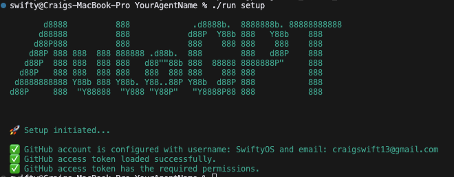
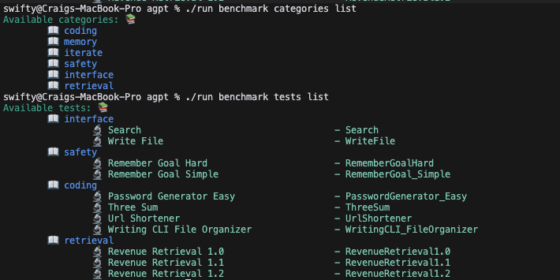

# Setting the Stage: Navigating the Forge Environment

## Introduction
Welcome to the Quickstart Guide! This tutorial is designed to walk you through the process of setting up and running your own AutoGPT agent in the Forge environment. Whether you are a seasoned AI developer or just starting out, this guide will equip you with the necessary steps to jumpstart your journey in the world of AI development with AutoGPT. 

## Section 1: Understanding the Forge

### Overview of the Forge 
The Forge serves as a comprehensive template for building your own AutoGPT agent. It not only provides the setting for setting up, creating, and running your agent, but also includes the benchmarking system and the frontend. These integrated components facilitate the development and performance evaluation of your agent.

### Importance of the Forge in AutoGPT

The Forge plays a pivotal role in the AutoGPT ecosystem, functioning as the very stem from which an agent burgeons. It is intricately designed to foster seamless integration with the agent protocol, the benchmark system, and the AutoGPT frontend, thereby forming a cohesive and robust environment for agent development. This harmonization ensures that developers adhere to a standardized framework, which significantly streamlines the development process. Consequently, it eliminates the need to construct boilerplate code, allowing developers to channel their efforts and creativity directly into crafting the "brains" of the agent. By focusing on enhancing the agent's intelligence and functionalities, developers can truly leverage the potential of AutoGPT, creating agents that are not only efficient but also innovative and advanced. The Forge, therefore, stands as a beacon of innovation and efficiency, propelling the development of AutoGPT agents to new heights.

### System Requirements: Linux, Mac, Windows Subsystem for Linux (WSL)
This project supports Linux (Debian based), Mac, and Windows Subsystem for Linux (WSL). If you are using a Windows system, you will need to install WSL. You can find the installation instructions for WSL [here](https://learn.microsoft.com/en-us/windows/wsl/).

## Section 2: Setting up the Forge Environment

### Forking the Repository
To begin, you need to fork the repository by navigating to the main page of the repository and clicking "Fork" in the top-right corner. Follow the on-screen instructions to complete the process. 


### Cloning the Repository
Next, clone the repository to your local system. Ensure you have Git installed to proceed with this step. You can download Git from [here](https://git-scm.com/downloads). Then clone the repo using the following command and the url for your repo. You can find the corect url by clicking on the green Code button on your repos main page.

```bash
# replace the url with the one for your forked repo
git clone https://github.com/Significant-Gravitas/Auto-GPT.git
```


### Setting up the Project using `./run setup`

Once you have clone the project change your directory to the newly cloned project:
```bash
# The name of the directory will match the name you gave your fork. The defualt is Auto-GPT
cd Auto-GPT
```
To set up the project, utilize the `./run setup` command in the terminal. Follow the instructions to install necessary dependencies and set up your GitHub access token.




## Section 3: Creating Your Agent

### Naming Your Agent
Choose a suitable name for your agent. It should be unique and descriptive. Examples of valid names include swiftyosgpt, SwiftyosAgent, or swiftyos_agent.

### Using `./run agent create YOUR_AGENT_NAME`
Create your agent template using the command `./run agent create YOUR_AGENT_NAME`, replacing YOUR_AGENT_NAME with the name you chose in the previous step.


### Entering the Arena with `./run arena enter YOUR_AGENT_NAME`
Officially enter the Arena by executing the command `./run arena enter YOUR_AGENT_NAME`.


## Section 4: Running Your Agent

### Starting Your Agent with `./run agent start YOUR_AGENT_NAME`
Begin by starting your agent using the command `./run agent start YOUR_AGENT_NAME`. This will initiate the agent on `http://localhost:8000/`.


### Logging in and Sending Tasks to Your Agent
Access the frontend at `http://localhost:8000/` and log in using a Google or GitHub account. You can then send tasks to your agent through the interface.


### Stopping and Restarting Your Agent
When needed, use Ctrl+C to end the session or the `./run agent stop` command to forcefully stop the agent. You can restart it using the start command.

## Section 5: Benchmarking Your Agent

### Understanding the Benchmarking System
The benchmarking system in the Forge environment allows you to test your agent's skills in various categories. Use the commands detailed in the content section to navigate through the benchmarking system.

### Using Benchmark Commands to Test Your Agent
Learn the available benchmark categories and tests using the commands `./run benchmark categories list` and `./run benchmark tests list`.



### Starting the Benchmark with `./run benchmark start YOUR_AGENT_NAME`
Initiate the benchmarking process using the command `./run benchmark start YOUR_AGENT_NAME`.

## Conclusion

In this tutorial, you have learned how to set up the project, create, run, and benchmark your AutoGPT agent. 

### Next Steps: Building and Enhancing Your Agent
With the foundation set, you are now ready to build and enhance your agent, exploring various functionalities and improving its performance.

## Additional Resources

### Links to Documentation and Community Forums
- [Windows Subsystem for Linux (WSL) Installation](https://learn.microsoft.com/en-us/windows/wsl/)
- [Git Download](https://git-scm.com/downloads)

## Appendix

### Troubleshooting Common Issues
- Ensure Git is correctly installed before cloning the repository.
- Follow the setup instructions carefully to avoid issues during project setup.
- If encountering issues during agent creation, refer to the guide for naming conventions.

### Glossary of Terms
- **Repository**: A storage space where your project resides.
- **Forking**: Creating a copy of a repository under your GitHub account.
- **Cloning**: Making a local copy of a repository on your system.
- **Agent**: The AutoGPT you will be creating and developing in this project.
- **Benchmarking**: The process of testing your agent's skills in various categories using the Forge's integrated benchmarking system.
- **Forge**: The comprehensive template for building your AutoGPT agent, including the setting for setup, creation, running, and benchmarking your agent.
- **Frontend**: The user interface where you can log in, send tasks to your agent, and view the task history.


