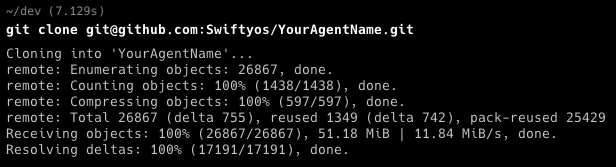
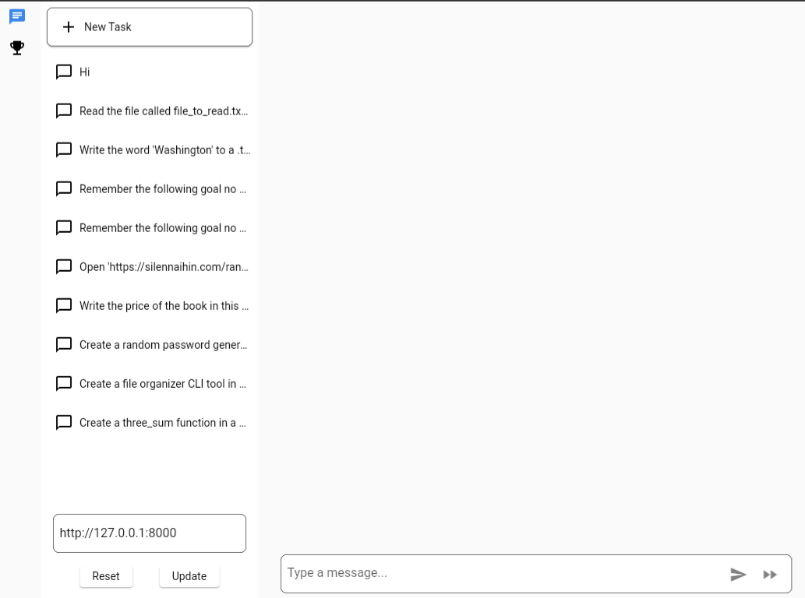

## [AutoGPT Forge: A Comprehensive Guide to Your First Steps](https://aiedge.medium.com/autogpt-forge-a-comprehensive-guide-to-your-first-steps-a1dfdf46e3b4)


Welcome to the getting started Tutorial! This tutorial is designed to walk you through the process of setting up and running your own AutoGPT agent in the Forge environment. Whether you are a seasoned AI developer or just starting out, this guide will equip you with the necessary steps to jumpstart your journey in the world of AI development with AutoGPT.

## Section 1: Understanding the Forge

The Forge serves as a comprehensive template for building your own AutoGPT agent. It not only provides the setting for setting up, creating, and running your agent, but also includes the benchmarking system and the frontend. These integrated components facilitate the development and performance evaluation of your agent.
It plays a pivotal role in the AutoGPT ecosystem, functioning as the stem from which an agent is created. It is designed to be integrated with the agent protocol, the benchmark system, and the AutoGPT frontend, thereby forming a cohesive and robust environment for agent development.

This harmonization ensures that developers adhere to a standardized framework, which significantly streamlines the development process. Consequently, it eliminates the need to construct boilerplate code, allowing developers to channel their efforts and creativity directly into crafting the “brains” of the agent. By focusing on enhancing the agent’s intelligence and functionalities, developers can truly leverage the potential of AutoGPT, creating agents that are not only efficient but also innovative and advanced. The Forge, therefore, stands as a beacon of innovation and efficiency, propelling the development of AutoGPT agents to new heights.

### System Requirements

This project supports Linux (Debian based), Mac, and Windows Subsystem for Linux (WSL). If you are using a Windows system, you will need to install WSL. You can find the installation instructions for WSL [here](https://learn.microsoft.com/en-us/windows/wsl/).

## Section 2: Setting up the Forge Environment

To begin, you need to fork the [repository](https://github.com/Significant-Gravitas/AutoGPT) by navigating to the main page of the repository and clicking "Fork" in the top-right corner. 


Follow the on-screen instructions to complete the process. 


### Cloning the Repository
Next, clone the repository to your local system. Ensure you have Git installed to proceed with this step. You can download Git from [here](https://git-scm.com/downloads). Then clone the repo using the following command and the url for your repo. You can find the corect url by clicking on the green Code button on your repos main page.

```bash
# replace the url with the one for your forked repo
git clone https://github.com/Significant-Gravitas/AutoGPT.git
```



### Setting up the Project

Once you have clone the project change your directory to the newly cloned project:
```bash
# The name of the directory will match the name you gave your fork. The default is AutoGPT
cd AutoGPT
```
To set up the project, utilize the `./run setup` command in the terminal. Follow the instructions to install necessary dependencies and set up your GitHub access token.


## Section 3: Creating Your Agent

Choose a suitable name for your agent. It should be unique and descriptive. Examples of valid names include swiftyosgpt, SwiftyosAgent, or swiftyos_agent.

Create your agent template using the command:

```bash
 ./run agent create YOUR_AGENT_NAME
 ```
 Replacing YOUR_AGENT_NAME with the name you chose in the previous step.


### Entering the Arena 
The Arena is a collection of all AutoGPT agents. It serves as a competitive environment where all agents are assessed to find the best generalist agent. Entering the Arena is a required step for participating in AutoGPT hackathons. It allows your agent to be part of a diverse and dynamic ecosystem, where it is periodically assessed by the benchmark to bre scored on the offical leaderboard.

Officially enter the Arena by executing the command:

```bash
./run arena enter YOUR_AGENT_NAME
```


## Section 4: Running Your Agent

Begin by starting your agent using the command:

```bash
./run agent start YOUR_AGENT_NAME
```
This will initiate the agent on `http://localhost:8000/`.


### Logging in and Sending Tasks to Your Agent
Access the frontend at `http://localhost:8000/` and log in using a Google or GitHub account. You can then send tasks to your agent through the interface.




### Stopping and Restarting Your Agent
When needed, use Ctrl+C to end the session or use the stop command:
```bash
./run agent stop
``` 
This command forcefully stops the agent. You can also restart it using the start command.

## Conclusion

In our exploration today, we’ve covered the essentials of working with AutoGPT projects. We began by laying out the groundwork, ensuring you have all the right tools in place. From there, we delved into the specifics of building an effective AutoGPT agent. Trust me, with the right steps, it becomes a straightforward process.

### Next Steps: Building and Enhancing Your Agent
With the foundation set, you are now ready to build and enhance your agent, exploring various functionalities and improving its performance. The next tutorial will look into the anatomy of an agent and how to add some basic functionality.

## Additional Resources

### Links to Documentation and Community Forums
- [Windows Subsystem for Linux (WSL) Installation](https://learn.microsoft.com/en-us/windows/wsl/)
- [Git Download](https://git-scm.com/downloads)

## Appendix

### Troubleshooting Common Issues
- Ensure Git is correctly installed before cloning the repository.
- Follow the setup instructions carefully to avoid issues during project setup.
- If encountering issues during agent creation, refer to the guide for naming conventions.

### Glossary of Terms
- **Repository**: A storage space where your project resides.
- **Forking**: Creating a copy of a repository under your GitHub account.
- **Cloning**: Making a local copy of a repository on your system.
- **Agent**: The AutoGPT you will be creating and developing in this project.
- **Benchmarking**: The process of testing your agent's skills in various categories using the Forge's integrated benchmarking system.
- **Forge**: The comprehensive template for building your AutoGPT agent, including the setting for setup, creation, running, and benchmarking your agent.
- **Frontend**: The user interface where you can log in, send tasks to your agent, and view the task history.


