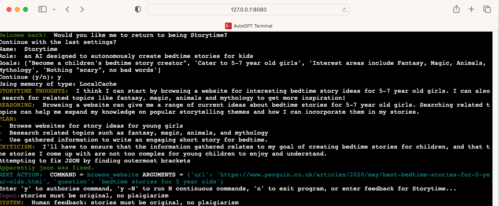

# Auto-GPT on docker with web access

Runs auto-gpt in a docker container


# Install/Run

```
cp ai_settings.sample ai_settings.yaml
docker-compose up -d --build
```

# Terminal

Creates a terminal UI via browser using [`gotty`](https://github.com/sorenisanerd/gotty)

Uses `http://127.0.0.1:8080`, or via IP.

You can use `docker logs autogpt` if you're not sure of the IP to connect to.


# TODO

* Check to see if `gotty` will pass audio from `--speak`
* Make sure that the other cache methods work (redis and pinecone)
* make sure that elevenlabs works (should be ok, I just haven't tried it yet)


