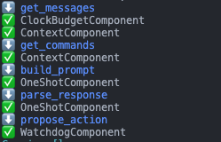

# Modular Agents

This incremental and realtively small re-architecture rebuilds `*Agent` classes so they are composed of `Components` instead of current multiple inheritance with Mixins.

>Due to technical debt the state of current codebase becomes increasingly unwieldy and is harder to implement new features. I'm aware of the failed past re-arch attempt and I took that into account when considering this change. Currently Mixins are very confusing - it's hard to track the order of execution and what's happening in the code. Also, plugins feel like additional baggage that needs to be maintained and not as a useful part of the system. ~kcze

This re-arch reuses much current code and is done in-place (not from scratch). With this fully implemented, Agent becomes a set of components, and that unifies Agent code and Plugins, now *everything* is just components.

This change directly addresses point 2 of the Roadmap [Empowering Agent Builders](https://github.com/Significant-Gravitas/AutoGPT/discussions/6970) and may also have a positive impact on others (due to ease of use and extension).

## Main goals:
- Simplify Agent and cut out redundant code
- Make it easy to create new Agents and Components (plugins)

### Extra consequences:
- Less config and env vars
- Reduce coupling

### Tasks
- [ ] Move more things into components
- [ ] Restructure `OneShotAgentPromptStrategy` into smaller components
- [ ] User interaction, such as for asking for agent id change, should take into non-interactive envs 
- [ ] Port Commands to Components
  - [x] System
  - [x] User interaction
  - [x] Context
  - [ ] File operations
  - [ ] Code execution
  - [ ] Git operations
  - [ ] Image generation
  - [ ] Web search
  - [ ] Selenium
- [ ] Move Components to forge and build AutoGPT using forge components
- [ ] Tests

## How it works
Agent is composed of *components*, and each `Component` implements a range of `Protocol`s (interfaces), each one providing a specific functionality, e.g. additional commands or messages. Each Protocol needs to be handled by BaseAgent's logic, so preferably an exhaustive set of Protocols should be provided.

Agent has methods (currently `propose_action` and `execute`) that execute *pipelines* that call methods on components in a specified order.

This system is simple, flexible, requires basically no configuration, and doesn't hide any data (anything can still be passed or accessed directly from or between components).

Example component [ported](https://github.com/kcze/AutoGPT/blob/kpczerwinski/open-440-modular-agents/autogpts/autogpt/autogpt/components/context/component.py): 

Example Protocol (i.e. interface):
```py
@runtime_checkable
class MessageProvider(Protocol):
    def get_messages(self) -> Iterator[ChatMessage]:
        ...
```
Component (i.e. plugin) that implements it:
```py
class MyComponent(Component, MessageProvider):
    def get_messages(self) -> Iterator[ChatMessage]:
        yield ChatMessage("This will be injected to prompt!")
```
Custom Agent that uses the component:
```py
class MyAgent(Agent):
    def __init__(self):
        # Optional super call to bring default components
        super().__init__(...)
        self.my_component = MyComponent()
        # Can define explicit ordering, otherwise components are sorted automatically
        # self.components = [self.my_component]
```
And that's it! Components are automatically collected from the agent using python metaclass magic and are called when needed.

Now purpose-related things will be bundled together: so `FileManagerComponent` provides file-system related commands and resources information. This should cut out a lot of code and also make system more type safe.

>Everything is plug-and-play, disabling anything = disabling a component; don't want file access? Just remove the `FileManagerComponent`, no changes to configuration, banning commands, etc... Assuming that no other components rely on it but you would know because it would have to be *explicitly* passed to the component, no more `isinstance`, `agent_implements_x`..

### Other stuff
Debugging may be easier because we can inspect the exact components that were called and where the pipeline failed (current WIP pipeline):



Also that makes it possible to call component/pipeline/function again when failed and recover.

If it's necessary to get a component in a random place, agent provides generic, type safe `get_component(type[T]) -> T | None`

## Challenges
- Ordering: previously there was really no ordering, everything was hardcoded (not sure about plugins). Components can be now ordered explicitly or automatically (each component will be sorted according to its `run_after` attribute). This can cause issues with circular dependencies.
- Efficient and type safe pipelines code
- There is some logic that can be challenging to adapt
- Pipeline logic is tricky, some Protcols return iterables, some single objects, some None

## Future possibilities
- Adding or removing components during runtime
- Parallel component execution
- Cacheable pipelines