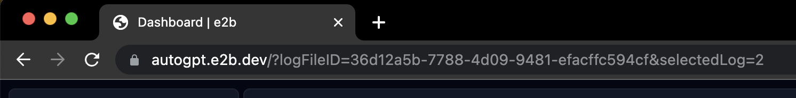
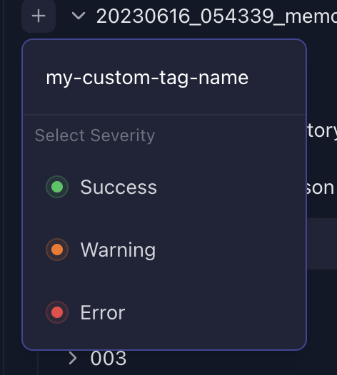

# Share your logs with us to help improve AutoGPT

Do you notice weird behavior with your agent? Do you have an interesting use case? Do you have a bug you want to report?
Follow the steps below to enable your logs and upload them. You can include these logs when making an issue report or discussing an issue with us.

## Enable Debug Logs

Activity, Error, and Debug logs are located in `./logs`

To print out debug logs:

```shell
./autogpt.sh --debug     # on Linux / macOS

.\autogpt.bat --debug    # on Windows

docker compose run --rm auto-gpt --debug    # in Docker
```

## Inspect and share logs

You can inspect and share logs via [e2b](https://e2b.dev).


1. Go to [autogpt.e2b.dev](https://autogpt.e2b.dev) and sign in.
2. You'll see logs from other members of the AutoGPT team that you can inspect.
3. Or you upload your own logs. Click on the "Upload log folder" button and select the debug logs dir that you generated. Wait a 1-2 seconds and the page reloads.
4. You can share logs via sharing the URL in your browser.


### Add tags to logs

You can add custom tags to logs for other members of your team. This is useful if you want to indicate that the agent is for example having issues with challenges.

E2b offers 3 types of severity:

- Success
- Warning
- Error

You can name your tag any way you want.

#### How to add a tag

1. Click on the "plus" button on the left from the logs folder name.

    

1. Type the name of a new tag.

1. Select the severity.

    
