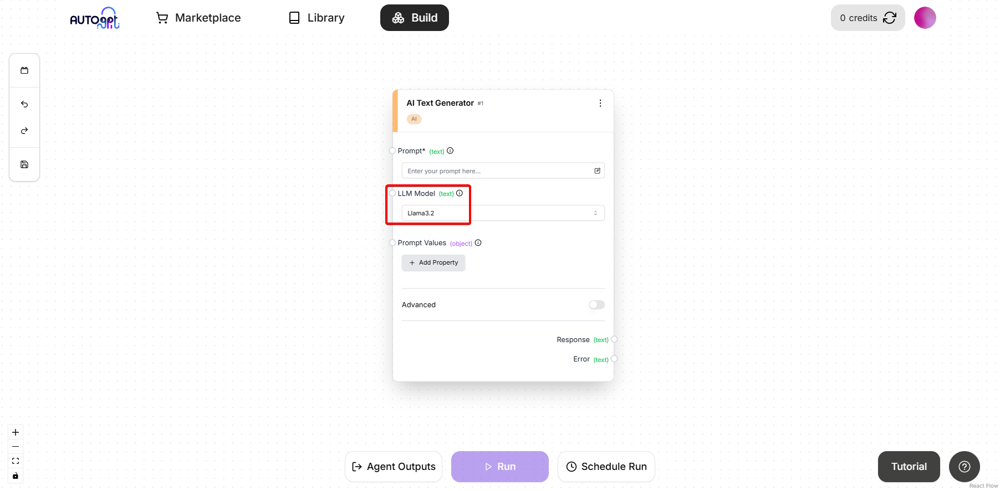

# Running Ollama with AutoGPT

> **Important**: Ollama integration is only available when self-hosting the AutoGPT platform. It cannot be used with the cloud-hosted version.

Follow these steps to set up and run Ollama with the AutoGPT platform.

## Prerequisites

1. Make sure you have gone through and completed the [AutoGPT Setup](/platform/getting-started) steps, if not please do so before continuing with this guide.
2. Before starting, ensure you have [Ollama installed](https://ollama.com/download) on your machine.

## Setup Steps

### 1. Launch Ollama
Open a new terminal and execute:
```bash
ollama run llama3.2
```

> **Note**: This will download the [llama3.2](https://ollama.com/library/llama3.2) model and start the service. Keep this terminal running in the background.

### 2. Start the Backend
Open a new terminal and navigate to the autogpt_platform directory:
```bash
cd autogpt_platform
docker compose up -d --build
```

### 3. Start the Frontend
Open a new terminal and navigate to the frontend directory:
```bash
cd autogpt_platform/frontend
npm run dev
```

Then visit [http://localhost:3000](http://localhost:3000) to see the frontend running, after registering an account/logging in, navigate to the build page at [http://localhost:3000/build](http://localhost:3000/build)

### 4. Using Ollama with AutoGPT

Now that both Ollama and the AutoGPT platform are running we can move onto using Ollama with AutoGPT:

1. Add an AI Text Generator block to your workspace (it can work with any AI LLM block but for this example will be using the AI Text Generator block):
   

2. In the "LLM Model" dropdown, select "llama3.2" (This is the model we downloaded earlier)
   

3. You will see it ask for "Ollama Credentials", simply press "Enter API key" 
    

    And you will see "Add new API key for Ollama", In the API key field you can enter anything you want as Ollama does not require an API key, I usually just enter a space, for the Name call it "Ollama" then press "Save & use this API key"
    

4. After that you will now see the block again, add your prompts then save and then run the graph:


That's it! You've successfully setup the AutoGPT platform and made a LLM call to Ollama.


### Using Ollama on a Remote Server with AutoGPT 
For running Ollama on a remote server, simply make sure the Ollama server is running and is accessible from other devices on your network/remotely through the port 11434, then you can use the same steps above but you need to add the Ollama servers IP address to the "Ollama Host" field in the block settings like so:


## Troubleshooting

If you encounter any issues, verify that:

- Ollama is properly installed and running
- All terminals remain open during operation
- Docker is running before starting the backend

For common errors:

1. **Connection Refused**: Make sure Ollama is running and the host address is correct (also make sure the port is correct, its default is 11434)
2. **Model Not Found**: Try running `ollama pull llama3.2` manually first
3. **Docker Issues**: Ensure Docker daemon is running with `docker ps`