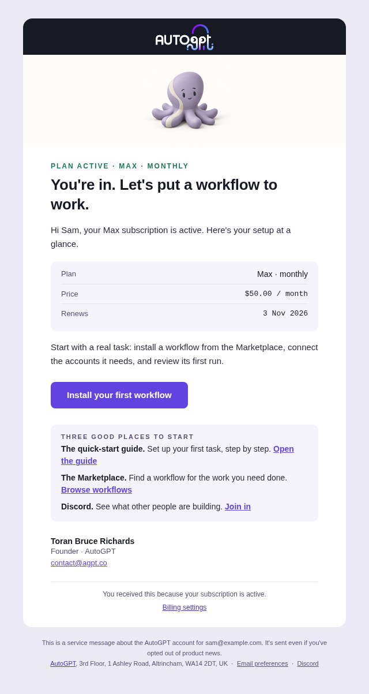
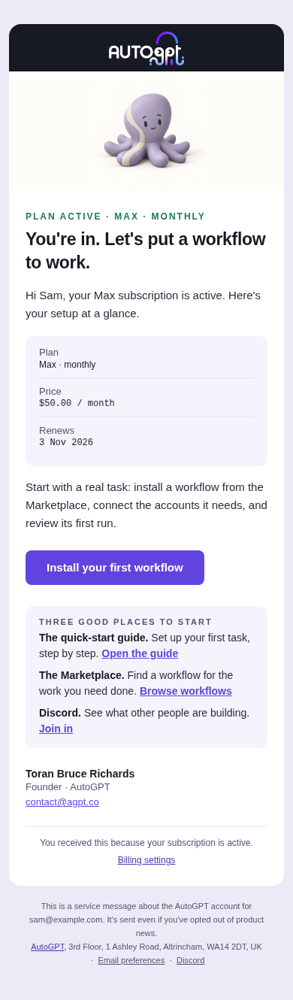
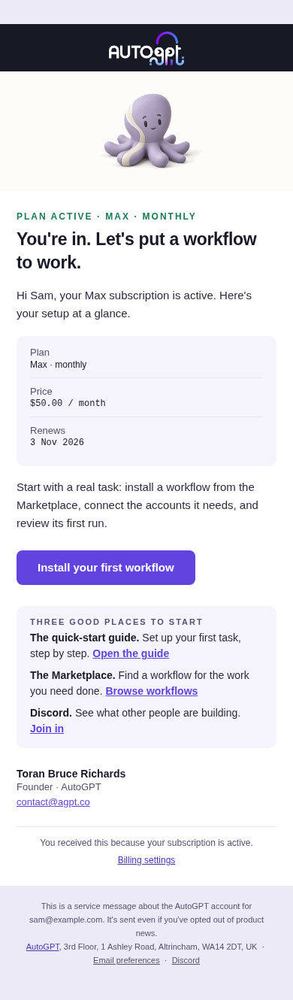
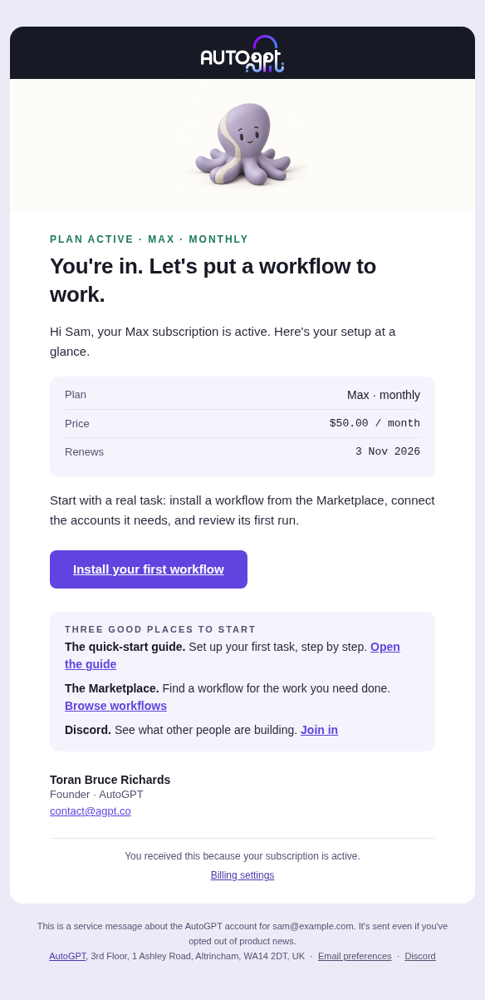
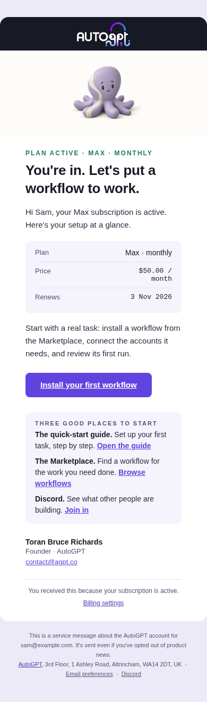

# Transactional email design

All platform-generated Postmark emails use the Edition 1 email design system
(2 October 2026). The renderer builds HTML and plain text from the same event
payload; Postmark receives those bodies rather than a hosted template ID.

## Inventory

| Family | Variants | Design and delivery |
| --- | --- | --- |
| Lifecycle | Welcome, payment failed, final notice, cancellation confirmed, cancellation reversed, ended (payment/cancellation) | Billing sender; contact reply-to; service footer; no unsubscribe |
| Trial | Started, ending, canceled, resumed, converted, payment failed, ended | Same billing rules; neutral Otto; one plan/payment action |
| Briefing | Daily, weekly, monthly; quiet/standard; attention/no attention | Product sender; hello reply-to; signed cadence links; one-click unsubscribe |
| Alert | Each cause, including coalesced alerts | Amber needs-you strip and primary attention card; secondary actions are text links |
| Verdict | Approved; changes requested with/without notes | State eyebrow; reviewer feedback preserved and escaped; one marketplace action |
| Ops | Refund request, refund processed | Internal amount band and compact Otto; admin action; no unsubscribe |
| Auth | Verify email, reset password, confirm new email | Compact layout without hero; action button and complete fallback URL; HTML and text; original subjects and origin validation |

Organization invitations have no email sender yet. SMTP/Gmail workflow blocks
send user-authored content and are not platform transactional notices. The
onboarding/changelog files remain marketing references; updating them does not
publish content or settings to MailerLite.

## Design contract

`backend/notifications/templates/_email_ui.j2` is the shared kit. It defines the
560px sheet, 48px desktop/22px phone gutters, Geist with system fallbacks, purple
`#6144DF` actions, ink `#171925`, white sheet and lavender paper. Facts stack on
phones. At 600px and below, the paper has no side padding and the sheet has
square corners; content keeps its 22px gutters. The sheet is fluid even when a
client strips the stylesheet. Inline font stacks and a table-backed button
preserve the fallback appearance in Outlook; action glyphs request text
presentation instead of emoji. Each family owns its HTML, subject/preheader,
and text templates. The preheader appears in the lede; supplied user names and
feedback stay escaped, and customer-authored punctuation is preserved.

Plan labels use a middle dot (`Pro · monthly`). Trial prices use the same
formatted amount as lifecycle emails, with a currency code retained when the
formatter has no currency symbol (`20.00 CAD / month`, `2,000 JPY / year`).

One primary button is the default. Cancellation confirmation uses a billing
text link. A Briefing without an attention item uses highlight/run-history text
links; its cadence controls are signed for that recipient. Only the welcome is
signed by a person. Its Expert CTA is selected using the recipient's
`HIRE_EXPERTS` flag; older queued messages and failed flag lookups default to
the workflow action. Secondary Marketplace copy follows the same selection.

Billing has no unsubscribe promise it cannot honor. Product emails match the
footer unsubscribe URL to both one-click headers. Auth and internal ops have no
unsubscribe. All include the registered address; auth has only the Discord
footer link and ops has no footer links.

## Images and configuration

`EMAIL_ASSET_BASE_URL` defaults to `https://platform.agpt.co/email`, containing
`logo-light.png` (790x356 served at 100x45). Otto uses the same URL origin plus
`/autogpt-characters/v1.1/otto/neutral-transparent/256.png`, served at 160x160 or
80x80 for ops. Its transparent background lets the surrounding hero band show
through when a mail client recolors the message in dark mode. The original
opaque export remains available for already-delivered messages. The 256px,
512px and 1024px transparent exports come unchanged from the approved October 6
design handoff.

The logo and transparent Otto ship in the frontend public assets. A custom
asset host must serve both paths publicly over HTTPS without cookies or
authentication. Deploy the frontend/static assets before the backend renderer
so the new image URL resolves as soon as templates start using it.

Images use hosted PNG URLs, explicit dimensions, and descriptive alt text.
There are no data URIs or inline SVGs. The same text, facts and action links
remain when an email client blocks images. Historical image files are retained
because already-delivered messages can still reference their URLs; new
transactional templates do not use the retired art.

Deployment overrides still control `POSTMARK_SENDER_EMAIL`,
`BILLING_SENDER_EMAIL`, `PRODUCT_SENDER_EMAIL`, `OPS_SENDER_EMAIL`, and
`POSTMARK_TRANSACTIONAL_STREAM`. This migration preserves those From values.
`BILLING_REPLY_TO_EMAIL` defaults to `contact@agpt.co` and
`PRODUCT_REPLY_TO_EMAIL` to `hello@agpt.co`. Configure a verified named auth
sender in deployment; the repository must not invent or activate a sender.

The auth RPC remains compatible across old and new API and notification-service
versions during deployment and rollback. The client sends named JSON fields;
an older service ignores the new `text_body` field and still sends the HTML,
while the new service accepts requests without that field. Plain text is
included when both components use the new code. The auth RPC itself does not
require a particular service deployment order.

The trial payload formatting change does require ordered rollout: deploy the
frontend/static assets first, the notification service second, and the API
producer last. The new notification service accepts both the exact old and new
plan labels/prices while still rejecting changed trial terms. An older service
would consider the new producer's formatting obsolete and drop the queued
notice. For rollback, revert the producer first and drain new-format messages
before reverting the notification service. Keep the published assets available.

## Production configuration and reminder checks

The repository's deployment workflows dispatch to the infrastructure repository;
the defaults here do not prove the effective production values. Before rollout:

- Set `POSTMARK_SENDER_EMAIL` to the existing Postmark-verified auth address with
  its approved display name. Check the effective notification-service value;
  `invalid@invalid.com` is only a repository placeholder. Do not invent a new
  sending identity as part of a template deploy.
- Set `BILLING_REPLY_TO_EMAIL=contact@agpt.co` and
  `PRODUCT_REPLY_TO_EMAIL=hello@agpt.co` explicitly in deployment, and inspect
  delivered message headers. Preserve the configured billing, product and ops
  senders and the transactional Postmark stream.
- Check that the new public Otto URL returns a PNG without authentication from
  the configured asset host before deploying the notification service.

To verify the trial-ending reminder, follow the delivery path in order:

1. In the live Stripe account, confirm the enabled platform webhook endpoint
   subscribes to `customer.subscription.trial_will_end`.
2. Check the Stripe Dashboard's **Trial ending events** setting is three days.
   Compare a recent event's creation time with its subscription's `trial_end`.
   The code only sends an ending notice inside the final three days, while the
   trial is active, the card is verified and cancellation is not scheduled.
3. Check the endpoint's delivery result and backend processing. A successful
   Stripe webhook response is not proof that an email was delivered.
4. Check PostHog for `trial_ending`, the current event name, and
   `subscription_trial_ending` for older deployments. This event records a
   successful notification enqueue, not Postmark delivery.
5. Check Postmark activity in the configured transactional stream for the
   billing sender and subject beginning `Your AutoGPT trial ends on`, then check
   the delivery result for the affected recipient.

Stripe's [trial-ending webhook setting](https://docs.stripe.com/billing/subscriptions/trials)
is separate from its [hosted reminder emails](https://docs.stripe.com/billing/subscriptions/trials/manage-trial-compliance),
which are sent seven days before trial end. Keep the hosted reminder disabled
when AutoGPT owns this message, so a seven-day trial does not receive a second
reminder at signup.

## Validation

The original migration passed 258 focused tests and a browser audit of 31
scenarios at two widths (62 renders), including images blocked, with 1,548 text
contrast checks and no failures. Those results and the screenshots below
predate the transparent Otto and email-client compatibility follow-up.

The notification design fixtures cover each lifecycle/trial branch, welcome
feature cohorts, Briefing cadences/attention, coalesced alerts, verdicts, and
refunds. Tests check frame/tokens, safe images, CTA exceptions, size, footers,
link parity and escaped feedback. Auth tests check all three actions, URL
escaping, origin restrictions, and plain-text delivery. Transport tests inspect
the actual Postmark request fields with the network client mocked.

For changes to the shared kit, render at 640px, 390px and 360px with images on
and off, with styles stripped, and with simulated dark backgrounds. Check
horizontal overflow, text and button visibility, and contrast against the
effective background.
Browser evidence is not an actual Gmail, Apple Mail or Outlook delivery test.
Before release, send staging samples to authorized test inboxes and inspect
light/dark mode, images off, plain text, button and fallback links, and signed
unsubscribe/cadence controls. Also exercise destinations signed out, with the
feature disabled, and after the relevant task is complete. No email was sent,
production configuration changed, or deployment performed by this PR.

## Review previews

The client compatibility follow-up was checked across all 31 fixture/auth
variants at 640px, 390px and 360px in five modes: normal, stylesheet removed,
images blocked, dark preference, and simulated dark backgrounds (465 layout
and asset checks). No case overflowed; the largest HTML was 16,018 bytes. The
dark simulation checks the transparent artwork against recolored backgrounds;
it does not reproduce a mail client's color algorithm or establish dark-mode
text contrast. Real inbox validation remains part of the release checklist.

The comparisons below use local checked-in assets and synthetic fixture data.
Desktop remains 560px wide. Phones now use the viewport width, and the inline
fluid layout still fits when the stylesheet is removed.

| Scenario | Before follow-up | After follow-up |
| --- | --- | --- |
| Desktop, 640px |  |  |
| Phone, 390px |  |  |
| Phone, stylesheet removed |  |  |

### Original migration

These screenshots use synthetic data and the supplied production logo/Otto
assets. The before column is the original `dev` template; after is this shared
kit. Each comparison includes desktop (640px) and phone (390px) renderings.

