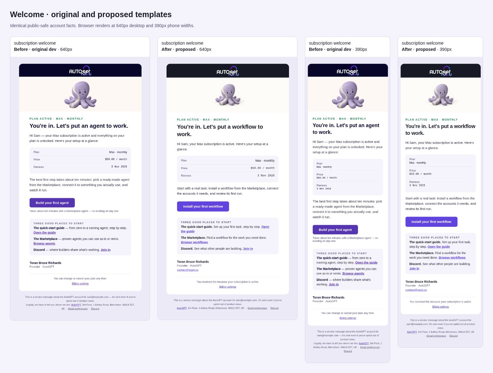
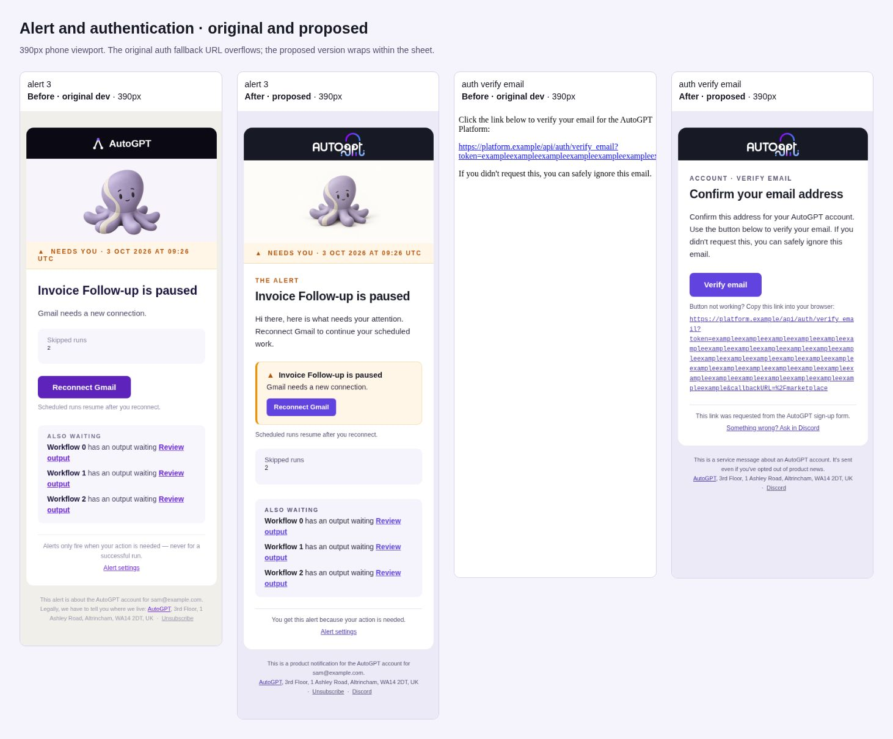

# Transactional email design

All platform-generated Postmark emails use the Edition 1 email design system
(2 October 2026). The renderer builds HTML and plain text from the same event
payload; Postmark receives those bodies rather than a hosted template ID.

## Inventory

| Family | Variants | Design and delivery |
| --- | --- | --- |
| Lifecycle | Welcome, payment failed, final notice, cancellation confirmed, cancellation reversed, ended (payment/cancellation) | Billing sender; contact reply-to; service footer; no unsubscribe |
| Trial | Started, ending, canceled, resumed, converted, payment failed, ended | Same billing rules; neutral Otto; one plan/payment action |
| Briefing | Daily, weekly, monthly; quiet/standard; attention/no attention | Product sender; hello reply-to; signed cadence links; one-click unsubscribe |
| Alert | Each cause, including coalesced alerts | Amber needs-you strip and primary attention card; secondary actions are text links |
| Verdict | Approved; changes requested with/without notes | State eyebrow; reviewer feedback preserved and escaped; one marketplace action |
| Ops | Refund request, refund processed | Internal amount band and compact Otto; admin action; no unsubscribe |
| Auth | Verify email, reset password, confirm new email | Compact layout without hero; action button and complete fallback URL; HTML and text; original subjects and origin validation |

Organization invitations have no email sender yet. SMTP/Gmail workflow blocks
send user-authored content and are not platform transactional notices. The
onboarding/changelog files remain marketing references; updating them does not
publish content or settings to MailerLite.

## Design contract

`backend/notifications/templates/_email_ui.j2` is the shared kit. It defines the
560px sheet, 48px desktop/22px phone gutters, Geist with system fallbacks, purple
`#6144DF` actions, ink `#171925`, white sheet and lavender paper. Facts stack on
phones. Each family owns its HTML, subject/preheader, and text templates. The
preheader appears in the lede; supplied user names and feedback stay escaped,
and customer-authored punctuation is preserved.

One primary button is the default. Cancellation confirmation uses a billing
text link. A Briefing without an attention item uses highlight/run-history text
links; its cadence controls are signed for that recipient. Only the welcome is
signed by a person. Its Expert CTA is selected using the recipient's
`HIRE_EXPERTS` flag; older queued messages and failed flag lookups default to
the workflow action. Secondary Marketplace copy follows the same selection.

Billing has no unsubscribe promise it cannot honor. Product emails match the
footer unsubscribe URL to both one-click headers. Auth and internal ops have no
unsubscribe. All include the registered address; auth has only the Discord
footer link and ops has no footer links.

## Images and configuration

`EMAIL_ASSET_BASE_URL` defaults to `https://platform.agpt.co/email`, containing
`logo-light.png` (790x356 served at 100x45). Otto uses the same URL origin plus
`/autogpt-characters/v1.1/otto/neutral/256.png`, served at 160x160 or 80x80 for ops.
Both files ship in the frontend public assets. A custom asset host must serve
both paths publicly over HTTPS without cookies or authentication.

Images use hosted PNG URLs, explicit dimensions, and descriptive alt text.
There are no data URIs or inline SVGs. The same text, facts and action links
remain when an email client blocks images. Historical image files are retained
because already-delivered messages can still reference their URLs; new
transactional templates do not use the retired art.

Deployment overrides still control `POSTMARK_SENDER_EMAIL`,
`BILLING_SENDER_EMAIL`, `PRODUCT_SENDER_EMAIL`, `OPS_SENDER_EMAIL`, and
`POSTMARK_TRANSACTIONAL_STREAM`. This migration preserves those From values.
`BILLING_REPLY_TO_EMAIL` defaults to `contact@agpt.co` and
`PRODUCT_REPLY_TO_EMAIL` to `hello@agpt.co`. Configure a verified named auth
sender in deployment; the repository must not invent or activate a sender.

The auth RPC remains compatible across old and new API and notification-service
versions during deployment and rollback. The client sends named JSON fields;
an older service ignores the new `text_body` field and still sends the HTML,
while the new service accepts requests without that field. Plain text is
included when both components use the new code. This change does not require
a particular service deployment order.

## Validation

Local validation: 258 focused tests pass. The browser audit covers 31 scenarios
at two widths (62 renders), including images blocked, with 1,548 text contrast
checks and no failures. Public production logo and Otto endpoints returned
HTTP 200 with PNG content without authentication.

The notification design fixtures cover each lifecycle/trial branch, welcome
feature cohorts, Briefing cadences/attention, coalesced alerts, verdicts, and
refunds. Tests check frame/tokens, safe images, CTA exceptions, size, footers,
link parity and escaped feedback. Auth tests check all three actions, URL
escaping, origin restrictions, and plain-text delivery. Transport tests inspect
the actual Postmark request fields with the network client mocked.

Browser rendering checks at 640px and 390px test image-on/image-off layout,
horizontal overflow and WCAG AA contrast against the effective background.
Browser evidence is not an actual Gmail, Apple Mail or Outlook delivery test.
Before release, send staging samples to authorized test inboxes and inspect
light/dark mode, images off, plain text, button and fallback links, and signed
unsubscribe/cadence controls. Also exercise destinations signed out, with the
feature disabled, and after the relevant task is complete. No email was sent,
production configuration changed, or deployment performed by this PR.

## Review previews

These screenshots use synthetic data and the supplied production logo/Otto
assets. The before column is the original `dev` template; after is this shared
kit. Each comparison includes desktop (640px) and phone (390px) renderings.

