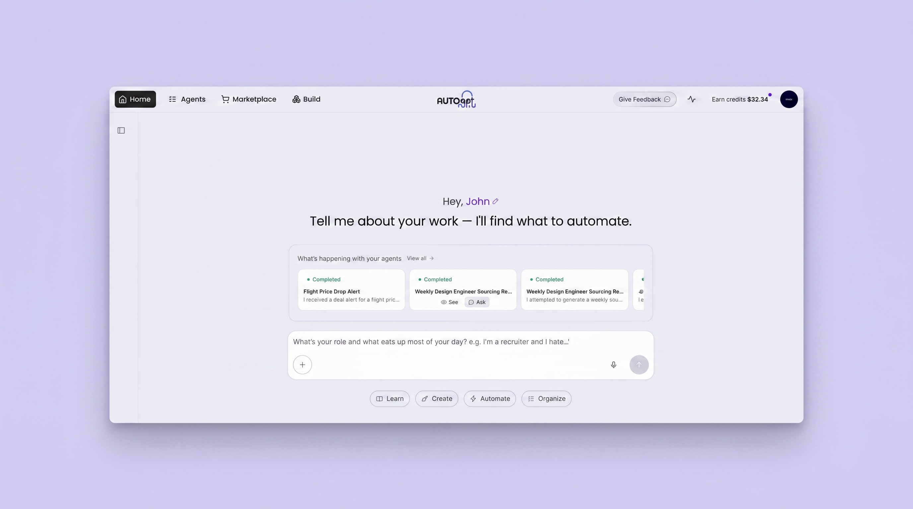

# Artifacts, Briefings, and Builder Chat

*April 10 – May 1, 2026*

**Platform versions:** `v0.6.55` · `v0.6.56` · `v0.6.57` · `v0.6.58`

## See your outputs come to life

AutoPilot now renders rich artifacts directly in a side panel — open reports as interactive documents, view charts, read PDFs, and even play games, all without leaving the conversation. First introduced quietly in v0.6.54, artifacts have been significantly refined with smoother rendering, better state management, and a more polished panel experience across v0.6.55 and v0.6.57. [↗](https://github.com/Significant-Gravitas/AutoGPT/pull/12856)

<figure><figcaption>
Rich artifacts — documents, charts, and interactive apps — rendered in the conversation side panel.
</figcaption></figure>

## Agent briefings at a glance

The Home screen and Agents tab now display live briefings for each of your agents — a short, AI-generated summary of what the agent is doing, what it last completed, and what's coming next. Scheduled agents surface their upcoming run times automatically, so you always know the state of your fleet at a glance. [↗](https://github.com/Significant-Gravitas/AutoGPT/pull/12764)

<figure><figcaption>
Live agent briefings on the Home screen keep you up to date without opening each agent.
</figcaption></figure>

<figure><figcaption>
The Agents tab shows the same briefings alongside run history and scheduling details.
</figcaption></figure>

## Chat with your builder

A new AI chat panel is now embedded directly in the flow builder. Ask questions about your graph, get help debugging a block configuration, or request changes to the workflow — all without switching context. The panel is aware of your current graph structure, making it a hands-on collaborator rather than a general assistant. [↗](https://github.com/Significant-Gravitas/AutoGPT/pull/12699)

<figure><figcaption>
The AI chat panel in the flow builder understands your graph and can suggest or apply changes inline.
</figcaption></figure>

✨ Improvements

- **Graphiti memory** — Long-term memory via Graphiti is now available as a block for persistent agent knowledge. (v0.6.55)
- **Multi-question ask** — The `ask_question` block can now present multiple questions in a single prompt, reducing back-and-forth interruptions. (v0.6.55)
- **Standard / Advanced model toggle** — Easily switch between standard and advanced AI models per agent run. (v0.6.55)
- **xAI Grok models** — Grok models from xAI are now available in the model selector. (v0.6.57)
- **Web Push notifications** — Opt in to browser push notifications so you never miss an agent completion or action request. ([#12723](https://github.com/Significant-Gravitas/AutoGPT/pull/12723)) (v0.6.58)

🎨 UI/UX Improvements

- **Message timestamps** — Conversation messages now display timestamps for easier reference. ([#12890](https://github.com/Significant-Gravitas/AutoGPT/pull/12890)) (v0.6.58)

🐛 Bug Fixes

- **Artifact panel stability** — Fixed rendering and state management issues in the artifact side panel. ([#12856](https://github.com/Significant-Gravitas/AutoGPT/pull/12856)) (v0.6.57)
- **Scheduled agents in briefings** — Scheduled agents now correctly surface their next run time in agent briefings. ([#12818](https://github.com/Significant-Gravitas/AutoGPT/pull/12818)) (v0.6.57)

