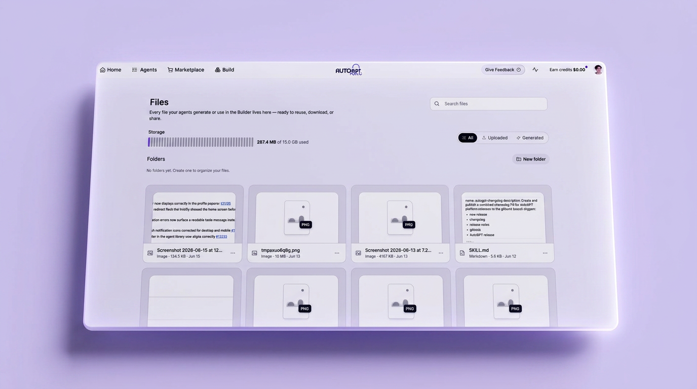
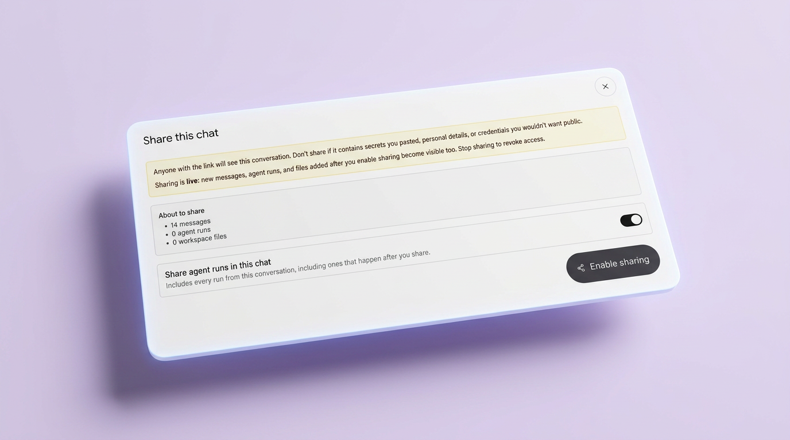
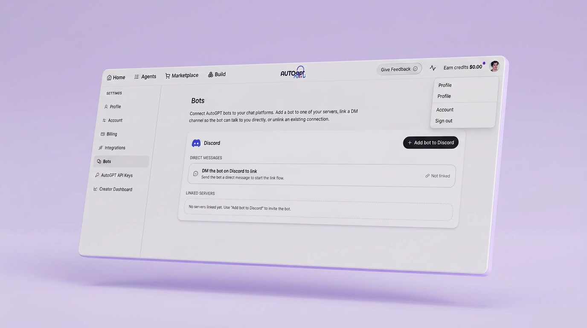

# Organize files, share your work, connect Discord

*June 18 – July 9, 2026*

**Platform versions:** `v0.6.64` · `v0.6.65` · `v0.6.66`

## A home for all your files

Every file your agents create or use now lives in one place — the Files page. Organize outputs into folders so reports, images, and data are easy to find and reuse. Search across everything instantly, and filter by uploaded vs generated files. [#13359](https://github.com/Significant-Gravitas/AutoGPT/pull/13359)

<figure><figcaption>
All your agent files in one organized workspace
</figcaption></figure>

## Share any conversation with a link

Share an AutoPilot conversation with anyone — just enable sharing and send the link. Sharing is live: new messages, agent runs, and files added after you share become visible too. Toggle it off anytime to revoke access instantly.

<figure><figcaption>
Share a live conversation link — revoke it anytime
</figcaption></figure>

## Bring AutoPilot to your Discord server

Connect AutoGPT to Discord from Settings → Bots. Add the bot to any server, link a DM channel to chat directly, upload files from Discord straight into AutoPilot, and get outputs delivered to your community in real time. [#13298](https://github.com/Significant-Gravitas/AutoGPT/pull/13298) [#13427](https://github.com/Significant-Gravitas/AutoGPT/pull/13427)

<figure><figcaption>
Connect AutoPilot to your Discord server or DM channel
</figcaption></figure>

✨ Improvements

- **Browse any agent graph** — view any public agent in the Builder without editing it, perfect for learning how automations are built. ([#13238](https://github.com/Significant-Gravitas/AutoGPT/pull/13238))
- **AutoPilot remembers where it left off** — full action history is now preserved when continuing a task across multiple sessions. ([#12673](https://github.com/Significant-Gravitas/AutoGPT/pull/12673))
- **Webhook triggers for AutoPilot** — trigger AutoPilot from external services using webhooks, with full preset lifecycle management. ([#13298](https://github.com/Significant-Gravitas/AutoGPT/pull/13298))
- **Faster builder search** — search results in the agent builder load noticeably faster. ([#13290](https://github.com/Significant-Gravitas/AutoGPT/pull/13290))
- **Reliable graph saves** — agent graphs now save atomically, with clearer error messages when credentials are missing. ([#13264](https://github.com/Significant-Gravitas/AutoGPT/pull/13264))
- **Plans default to monthly billing.** ([#13363](https://github.com/Significant-Gravitas/AutoGPT/pull/13363))

🎨 UI/UX Improvements

- **Global search polish** — loading state added and jittery animations removed. ([#13454](https://github.com/Significant-Gravitas/AutoGPT/pull/13454))
- **Schedule Run button fix** — button stays enabled while editing a schedule name. ([#13481](https://github.com/Significant-Gravitas/AutoGPT/pull/13481))
- **Builder tutorial highlight** — selected node output is now highlighted during the builder tutorial run step. ([#13483](https://github.com/Significant-Gravitas/AutoGPT/pull/13483))

🐛 Bug Fixes

- **AutoPilot responses in Discord** — fixed text blocks running together in Discord messages. ([#13424](https://github.com/Significant-Gravitas/AutoGPT/pull/13424))
- **Save-and-run uses the latest version** — fixed agents running the previous saved version instead of the one you just saved. ([#13482](https://github.com/Significant-Gravitas/AutoGPT/pull/13482))
- **AutoPilot task cancellation** — fixed chat streaming cutting off mid-message when cancelling a task. ([#13452](https://github.com/Significant-Gravitas/AutoGPT/pull/13452))
- **Agents using OpenAI extended reasoning** — fixed agents failing mid-task when OpenAI tool loops included reasoning steps. ([#13438](https://github.com/Significant-Gravitas/AutoGPT/pull/13438))
- **LLM provider stability** — fixed crashes from OpenAI and Anthropic API changes. ([#13335](https://github.com/Significant-Gravitas/AutoGPT/pull/13335), [#13342](https://github.com/Significant-Gravitas/AutoGPT/pull/13342))
- **Files page previews** — fixed code and markdown file previews not rendering correctly. ([#13304](https://github.com/Significant-Gravitas/AutoGPT/pull/13304))
- **Scheduled AutoPilot tasks** — fixed tasks not registering correctly when created. ([#13336](https://github.com/Significant-Gravitas/AutoGPT/pull/13336))

