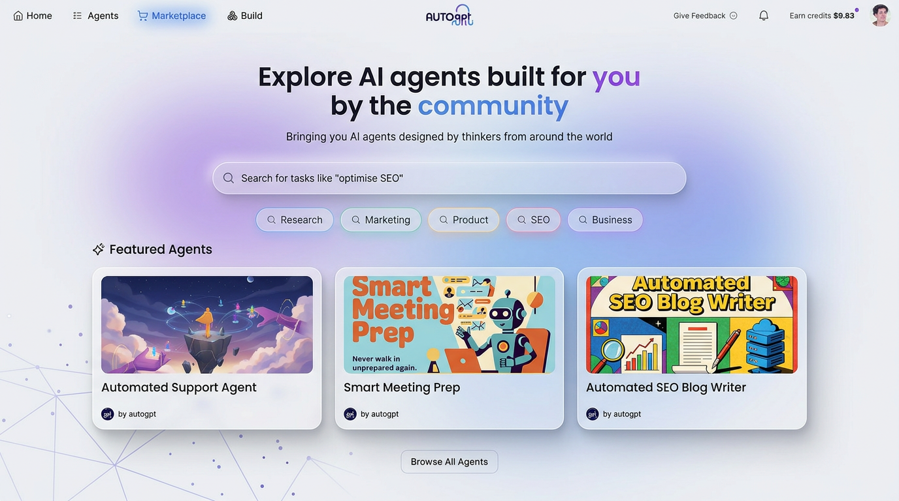
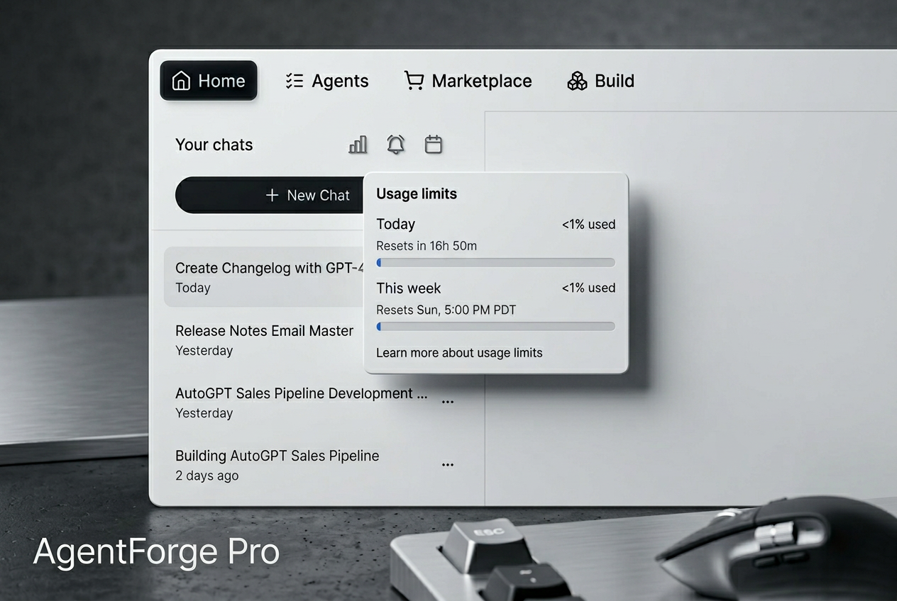
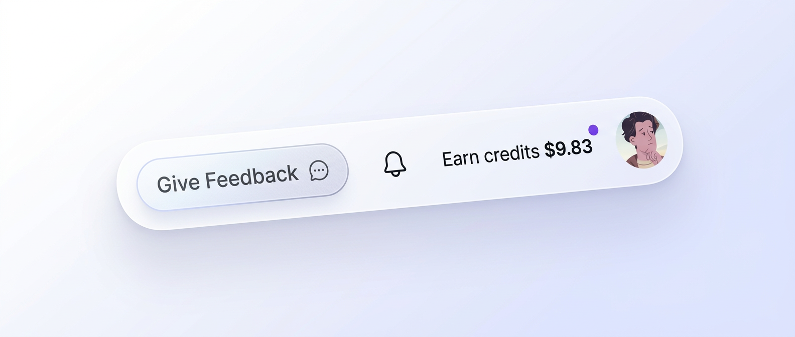

# Explore a new marketplace, track usage, and give instant feedback

*March 13 – March 20, 2026*

**Platform version:** `v0.6.52`

This week's release brings a **refreshed marketplace**, a **usage monitor** so you always know where your credits stand, a **new feedback button**, and **smarter prompt suggestions** tailored to your business.

***

## A brand-new marketplace experience

The marketplace has been **completely redesigned** with a cleaner, more professional look. Agent cards now feature subtle borders and refined spacing, the search bar matches our design system, and everything feels polished at every screen size. [↗](https://github.com/Significant-Gravitas/AutoGPT/pull/12462)

<figure><figcaption>
The redesigned marketplace — cleaner cards, better search, and a professional new look
</figcaption></figure>

***

## Track your usage at a glance

A new **usage monitor** gives you full visibility into your credit balance and token usage. You'll see daily and weekly progress bars, reset times, and a clear breakdown of how your credits are being spent — all from a simple popover in the interface. [↗](https://github.com/Significant-Gravitas/AutoGPT/pull/12385)

<figure><figcaption>
Keep tabs on your credit usage with daily and weekly breakdowns
</figcaption></figure>

***

## Give feedback from anywhere

The **feedback button** has moved to the header, making it accessible from any page. Share your thoughts, report issues, or request features without having to navigate away from what you're doing. [↗](https://github.com/Significant-Gravitas/AutoGPT/pull/12462)

<figure><figcaption>
The feedback button is now always within reach in the header
</figcaption></figure>

***

## Smarter, personalized prompt suggestions

AutoPilot now **learns about your business** and generates personalized quick-action prompts tailored to your specific needs. Instead of generic suggestions, you'll see prompts that match your industry, workflows, and goals — making it faster to get started on the tasks that matter most to you. [↗](https://github.com/Significant-Gravitas/AutoGPT/pull/12374)

<figure><figcaption>
Get prompt suggestions tailored to your business and workflows
</figcaption></figure>

***

Improvements

* **Shareable prompt links** — share an AutoPilot prompt via URL so anyone can pick up exactly where you left off [↗](https://github.com/Significant-Gravitas/AutoGPT/pull/12406)
* **"Run now" button on schedules** — manually trigger any scheduled agent run with one click [↗](https://github.com/Significant-Gravitas/AutoGPT/pull/12388)
* **"Jump Back In" on Library** — quickly resume your most recent agent right from the Library page [↗](https://github.com/Significant-Gravitas/AutoGPT/pull/12387)
* **Rich media previews in Builder** — see images, files, and other media directly in node outputs and file inputs [↗](https://github.com/Significant-Gravitas/AutoGPT/pull/12432)
* **Graph search in Builder** — find any node or block instantly in your agent graphs [↗](https://github.com/Significant-Gravitas/AutoGPT/pull/12395)
* **Themed prompt categories** — suggestion pills are now organized into themed categories for easier discovery [↗](https://github.com/Significant-Gravitas/AutoGPT/pull/12452)
* **Nano Banana 2** — the latest image generation model is now available in the image generator, customizer, and editor blocks [↗](https://github.com/Significant-Gravitas/AutoGPT/pull/12218)
* **AgentMail integration** — new blocks for managing email workflows through AgentMail [↗](https://github.com/Significant-Gravitas/AutoGPT/pull/12417)

Fixes

* Fixed sub-folders not showing when navigating inside a folder [↗](https://github.com/Significant-Gravitas/AutoGPT/pull/12316)
* Fixed image delete button on the Edit Agent form [↗](https://github.com/Significant-Gravitas/AutoGPT/pull/12362)
* Improved handling of transient API connection errors [↗](https://github.com/Significant-Gravitas/AutoGPT/pull/12445)
* Fixed tool-result file reads failing across turns [↗](https://github.com/Significant-Gravitas/AutoGPT/pull/12399)
* Fixed long filenames being truncated incorrectly [↗](https://github.com/Significant-Gravitas/AutoGPT/pull/12025)
* Allowed falsy values in list building blocks [↗](https://github.com/Significant-Gravitas/AutoGPT/pull/12028)
* Renamed "CoPilot" to "AutoPilot" on the credits page [↗](https://github.com/Significant-Gravitas/AutoGPT/pull/12481)
* Constrained markdown heading sizes in chat messages [↗](https://github.com/Significant-Gravitas/AutoGPT/pull/12463)

Under the hood

* Read-only SQL views layer with analytics schema [↗](https://github.com/Significant-Gravitas/AutoGPT/pull/12367)
* AutoPilotBlock for invoking AutoPilot from agent graphs [↗](https://github.com/Significant-Gravitas/AutoGPT/pull/12439)
* GitHub CLI support with automatic token injection [↗](https://github.com/Significant-Gravitas/AutoGPT/pull/12426)
* Improved end-to-end CI with reduced costs [↗](https://github.com/Significant-Gravitas/AutoGPT/pull/12437)
* New integration tests for Builder stores, components, and hooks [↗](https://github.com/Significant-Gravitas/AutoGPT/pull/12433)
* Builder end-to-end tests for the new Flow Editor [↗](https://github.com/Significant-Gravitas/AutoGPT/pull/12436)
* Collapsed navbar text to icons below 1280px [↗](https://github.com/Significant-Gravitas/AutoGPT/pull/12484)

