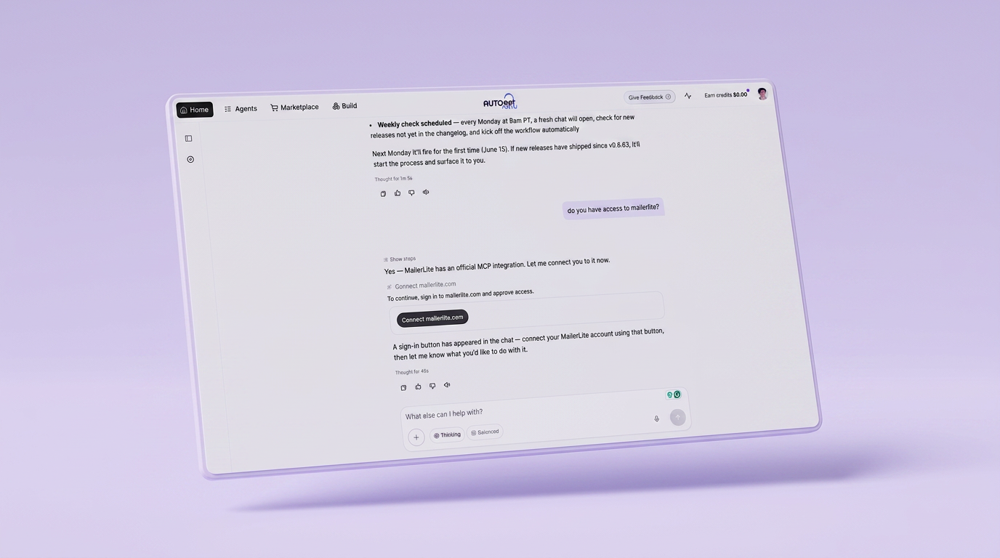
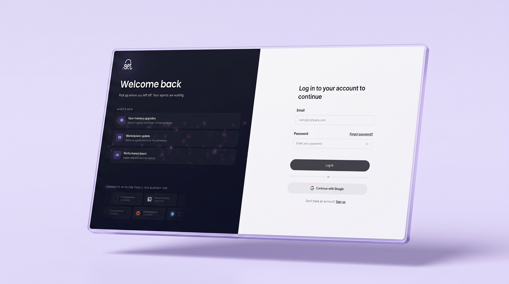
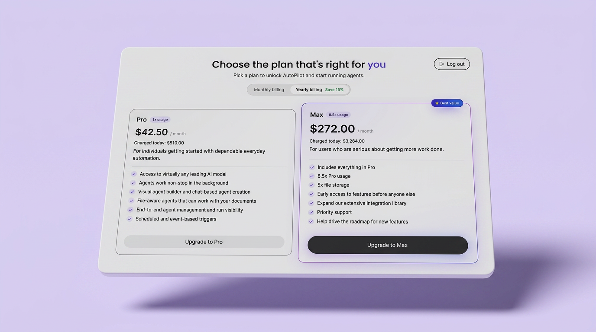
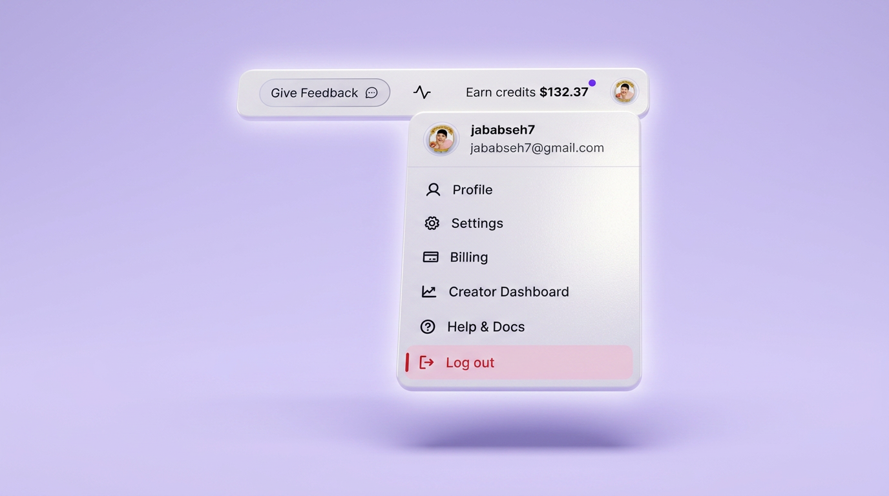
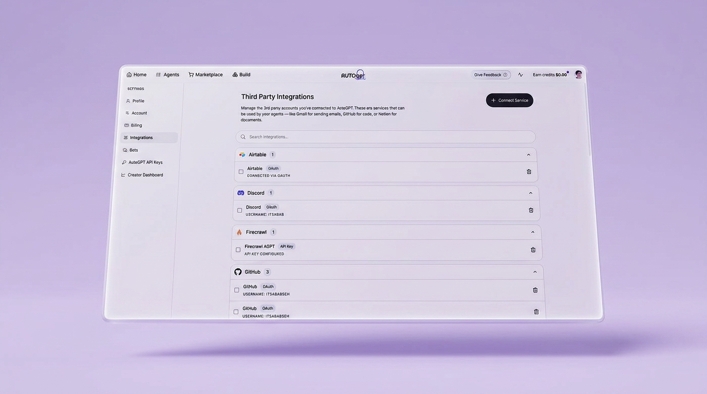

# Smarter Automation, Fresher Design, Open for Business

*May 7 – June 10, 2026*

**Platform versions:** `v0.6.59` · `v0.6.60` · `v0.6.61` · `v0.6.62` · `v0.6.63`

## AutoPilot gets a major upgrade

AutoPilot — your always-on AI co-pilot — just received its biggest set of upgrades yet.

**Native scheduling** lets you run agents on a cron schedule directly from the chat. No setup required — just say when, and AutoPilot handles the rest.

**Self-distilled skills registry** means AutoPilot now learns from its own work. After completing complex multi-step procedures, it automatically saves reusable recipes to a skills library — so it gets faster and more capable with every workflow you run together.

**Message queuing** keeps things reliable: if you send a new task while AutoPilot is mid-run, it queues gracefully and picks it up next — nothing gets dropped.

<figure><figcaption>
Native scheduling, a self-distilling skills registry, and message queuing in AutoPilot
</figcaption></figure>

## A completely new first impression

The login and signup experience has been rebuilt. An animated split-panel layout, aurora lighting, and a live integrations marquee welcome you the moment you arrive — and set the tone for everything behind it.

<figure><figcaption>
The redesigned login and signup experience
</figcaption></figure>

## Unlock everything — plans are live

Subscriptions and payments are officially live. Choose the plan that fits your team, upgrade instantly, and unlock the full platform. No more waitlists or manual provisioning.

<figure><figcaption>
Pick the plan that's right for you — billing is now fully live
</figcaption></figure>

## Settings rebuilt & a smarter profile menu

Settings has been rebuilt with a cleaner layout, faster navigation, and a dedicated integrations tab for managing all your third-party connections in one place. The profile dropdown now surfaces quick actions — feedback, billing, and sign-out — without taking you away from your current page.

<figure><figcaption>
Quick actions from your profile menu
</figcaption></figure>

<figure><figcaption>
Third-party integrations are now in one dedicated tab
</figcaption></figure>

✨ Improvements

* **Trigger On Anything** — more flexible workflow triggers let agents respond to a wider range of conditions and events [#12740](https://github.com/Significant-Gravitas/AutoGPT/pull/12740)
* **Export Chat as Markdown** — download any AutoPilot conversation as a `.md` file [#13070](https://github.com/Significant-Gravitas/AutoGPT/pull/13070)
* **Auto-open artifact panel** — the artifact panel now opens automatically when an agent produces an artifact [#12997](https://github.com/Significant-Gravitas/AutoGPT/pull/12997)
* **Slack block** — send and receive Slack messages natively from any agent [#13008](https://github.com/Significant-Gravitas/AutoGPT/pull/13008)
* **Cost breakdown in briefing panel** — see exactly what each agent run costs, right in the briefing [#13129](https://github.com/Significant-Gravitas/AutoGPT/pull/13129)
* **Session sidebar pagination** — long session histories now paginate so the sidebar stays fast [#13128](https://github.com/Significant-Gravitas/AutoGPT/pull/13128)
* **Faster first response in AutoPilot** — reduced time-to-first-token for AutoPilot conversations [#12828](https://github.com/Significant-Gravitas/AutoGPT/pull/12828)

🎨 UI/UX Improvements

* **Mobile AutoPilot parity** — full AutoPilot feature set now available on mobile [#13232](https://github.com/Significant-Gravitas/AutoGPT/pull/13232)
* **Global command palette** — search now surfaces navigate and action shortcuts directly [#13217](https://github.com/Significant-Gravitas/AutoGPT/pull/13217) [#13283](https://github.com/Significant-Gravitas/AutoGPT/pull/13283)
* **Chat source icons** — see which platform a message came from, shown beside the timestamp [#13175](https://github.com/Significant-Gravitas/AutoGPT/pull/13175) [#13303](https://github.com/Significant-Gravitas/AutoGPT/pull/13303)

🐛 Bug Fixes

* Profile avatar now displays correctly in the profile popover [#13155](https://github.com/Significant-Gravitas/AutoGPT/pull/13155)
* Fixed signup redirect flash that briefly showed the home screen before onboarding [#13154](https://github.com/Significant-Gravitas/AutoGPT/pull/13154)
* OAuth integration errors now surface a readable toast message instead of failing silently [#13282](https://github.com/Significant-Gravitas/AutoGPT/pull/13282)
* AutoPilot push notification icons corrected for desktop and mobile [#13231](https://github.com/Significant-Gravitas/AutoGPT/pull/13231) [#13245](https://github.com/Significant-Gravitas/AutoGPT/pull/13245)
* Scheduled filter in the agent library now aligns correctly [#13235](https://github.com/Significant-Gravitas/AutoGPT/pull/13235)

