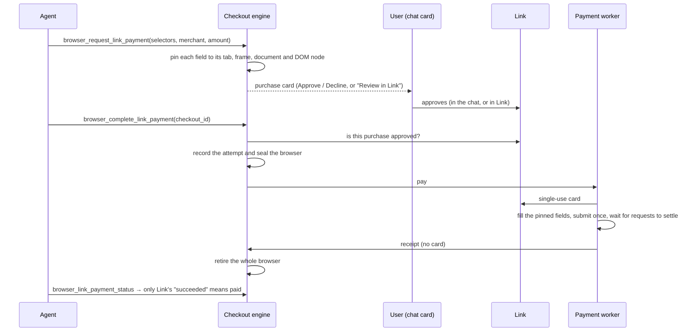

# Link private checkout

AutoPilot can pay at an ordinary card checkout with the user's [Link Agent Wallet](https://docs.stripe.com/agentic-commerce/link-agent-wallet), in the same browser tab where it signed in and built the cart. The single-use card never reaches the agent. The agent identifies the payment fields, the user approves the purchase, and a separate worker fills the card and submits once.

The feature is off unless an operator turns it on. It is built to the pattern Meta [describes for Muse](https://research.meta.ai/blog/security-and-safety-for-ai-agents-our-approach-with-muse): a browser broker outside the agent's reach, agent access paused while credentials are filled, and single-use cards bound to one merchant and amount.

Stores that take Link Pay Tokens or shared payment tokens don't need any of this; the Stripe Link blocks already pay them without a card form.

## How a purchase flows



1. The agent finishes login, cart, delivery and billing in its browser, then calls `browser_request_link_payment` with CSS selectors for the empty card fields and the pay button. It passes no script and no card data.
2. The engine binds each selector to one DOM node in one document of one tab. Each card field has to declare itself: its `autocomplete` must be `cc-number`, `cc-csc`, `cc-exp` (or `cc-exp-month` and `cc-exp-year`), and the pay control must be a button. Without that, a selector could aim the card at an address, order-note or search field. If a field is replaced or the page reloads before payment, the checkout stops before any card is retrieved.
3. The user approves (see below). `browser_complete_link_payment` takes only the checkout ID, so the merchant, amount and fields can't change.
4. The engine confirms Link approved this exact purchase, records the single attempt and seals the browser. Only then does the worker retrieve the card. A repeated or concurrent completion reconciles; it never pays twice.
5. The worker fills the pinned fields, clicks the pinned button once, waits for the page's requests to settle (bounded), and retires the browser and its profile. Once that browser is gone the chat can browse again, in a fresh, signed-out browser. If the checkout stopped before the card reached the page, its Link request is canceled and nothing more is needed.
6. A submitted form isn't proof of payment. `browser_link_payment_status` reads Link's status; only `succeeded` means paid. Another checkout in the chat waits until the attempt has a final status. If the payment browser couldn't be retired, the chat stays sealed until `browser_reset_after_payment`, which also needs a final status.

## Approval in the chat, or in Link

If the user's Link approval policy for AutoGPT covers the purchase, the card in the chat shows **Approve** and **Decline**. The policy (`GET /approval-policy`) sets a per-purchase limit per currency, optionally restricted to some payment methods.

- With this route Link shows the user nothing, so the card carries everything they approve. It reads the purchase from the server's record, not from the transcript: merchant, the site the card will be used on, total, and the agent's description of what is being bought. The Approve button names the recorded total.
- The click goes to `POST /api/chat/sessions/{session_id}/link-checkouts/{checkout_id}/approve`, which needs the user's session. No copilot tool can reach it, so the model can't approve its own purchase. The card with the buttons is drawn only for the four checkout tools' results.
- The decision is stored once, in Redis (`backend.util.link_checkout.approval`), next to the purchase exactly as the card showed it: merchant, site, description, amount, currency, test mode, expiry.
- On the next completion the engine checks that decision still names the same purchase, site included. It then asks Link for a spend request that is already approved (`POST /spend_requests/create_delegated`), with the approval's time, method (`click`) and browser user agent as `approval_details`.
- If Link refuses the delegated request, the purchase falls back to approval in Link, and nothing is paid on the chat approval alone. If Link refuses it as a duplicate of a request still open, the agent is told to wait for that one instead; asking again another way would meet the same refusal.

Anything outside the policy, or any failure to read it, uses Link's own approval page. Link's per-purchase limits apply in both routes.

## What keeps the card from the agent

| Control | Where |
| --- | --- |
| The agent passes selectors, never scripts or card values; plans reject extra fields | `CheckoutPlan` in `models.py` |
| Fields pinned to tab, frame, document and DOM node; any change stops the checkout | `cdp.py` |
| Each card field must declare its autofill role (`cc-number`, `cc-csc`, `cc-exp*`) and the pay control must be a button, checked when pinned and again before the fill | `cdp.py` |
| A live card is filled only behind the restricted egress proxy, in-process as well as in a remote broker | `config.live_payments_allowed` |
| In-chat approval shows the site and description from the server's record | `approval.py`, the `LinkCheckout` card |
| The agent's browser commands are an allowlist: no `eval`, cookie or storage export, network capture or raw CDP | `broker_commands.py` |
| The attempt is recorded and the browser sealed before the card is retrieved; a second completion only reconciles | `broker_checkout.py`, `checkout_record.py` |
| The card exists only in a worker spawned per job with a scrubbed environment, `PR_SET_DUMPABLE=0`, stderr discarded and a bounded result | `runner.py`, `worker.py` |
| The browser and its profile are deleted after the attempt; nothing from it is copied to the next browser | `runtime.retire_payment_browser` |
| No swap, no core dumps, browser state on tmpfs, all checked before anything runs | `runtime.require_runtime` |
| The raw-card Link block is disabled while the private checkout is on | `blocks/stripe_link/spend_request.py` |
| Link's wallet token never enters the code sandbox's environment | `copilot/providers.py` |

On a host that fails the runtime checks, browsing stays ordinary and the checkout tools stay hidden; nothing that touches a card runs.

## Configuration

The checkout reads its settings from the environment, because the worker and broker deliberately don't load the backend's `.env` (see `backend/util/link_checkout/config.py`).

| Variable | Effect |
| --- | --- |
| `COPILOT_LINK_PRIVATE_CHECKOUT=true` | Turns the tools on with the broker in-process (self-hosted, single host) |
| `COPILOT_LINK_LIVE_PAYMENTS=true` | Allows live spend requests. A live card is filled only where `CHECKOUT_HTTPS_PROXY` is set too; otherwise only test mode |
| `CHECKOUT_HTTPS_PROXY` | The restricted egress proxy (`egress.py`) for the payment browser and the worker's Link calls; required for live payments, in-process as well |
| `COPILOT_LINK_HOSTED_CHECKOUT=true` | Also required on a cloud deployment, with a remote broker and the registered Link client |
| `CHECKOUT_BROKER_ROUTES_FILE` | Remote brokers, one per user (below) |
| `CHECKOUT_BROKER_URL`, `_CA`, `_CLIENT_CERT`, `_CLIENT_KEY`, `_SECRET_FILE`, `_USER_ID` | A single remote broker, for the one user it was provisioned for |
| `STRIPE_LINK_CLIENT_ID`, `_CLIENT_SECRET`, `_PUBLISHABLE_KEY` | The registered confidential Link client that hosted checkout requires |

In-process, the host running the copilot executor needs `agent-browser`, Chromium, no swap (`memory.swap.max=0`, e.g. Docker `--memory-swap` equal to `--memory`), a hard core-dump limit of zero, and a tmpfs `/dev/shm`. On systemd hosts, persist `MemorySwapMax=0` for the container scope (Docker's `org.systemd.property.MemorySwapMax` annotation). Systemd can otherwise reset the kernel limit when it reapplies resource settings.

## Running a remote broker

Hosted AutoGPT runs one broker per provisioned user, on a network the agent can't reach. The controller picks the broker from an operator-managed routes file, keyed by the authenticated user ID. Nothing a tool argument names can select a route. A user without a route browses as usual and gets no checkout tools.

```json
[
  {
    "user_id": "<authenticated user id>",
    "url": "https://checkout-broker-alice:8443",
    "ca": "/run/checkout/alice/ca.crt",
    "client_cert": "/run/checkout/alice/client.crt",
    "client_key": "/run/checkout/alice/client.key",
    "secret_file": "/run/checkout/alice/controller-secret"
  }
]
```

The broker is the standard backend image with another entrypoint. It accepts one tenant, requires a client certificate at TLS and a bearer secret after it, and has no route to the Internet except an exact-host HTTPS proxy. That proxy (`egress.py`) accepts `CONNECT` to port 443 for listed names only, and rejects private, loopback, metadata and IP-literal destinations.

```yaml
services:
  checkout-broker:
    image: <backend image>
    entrypoint: [python, -B, -m, backend.util.link_checkout.broker_main]
    read_only: true
    user: "10001:10001"
    cap_drop: [ALL]
    security_opt: [no-new-privileges:true]
    pids_limit: 256
    mem_limit: 2g
    memswap_limit: 2g
    annotations:
      org.systemd.property.MemorySwapMax: "uint64 0"
    shm_size: 512m
    ulimits: { core: 0 }
    tmpfs: ["/tmp:size=32m,mode=1777"]
    environment:
      CHECKOUT_BROKER_TENANT_ID: <authenticated user id>
      CHECKOUT_BROKER_SECRET_FILE: /run/controller-secret
      CHECKOUT_BROKER_SERVER_KEY: /run/tls/server.key
      CHECKOUT_BROKER_SERVER_CERT: /run/tls/server.crt
      CHECKOUT_BROKER_CLIENT_CA: /run/tls/ca.crt
      CHECKOUT_BROKER_LEDGER_DIR: /ledger
      CHECKOUT_HTTPS_PROXY: http://checkout-egress:3128
    volumes:
      - <tls dir>:/run/tls:ro
      - <controller secret>:/run/controller-secret:ro
      - <private persistent ledger>:/ledger
    networks: [control, checkout]

  checkout-egress:
    image: <backend image>
    entrypoint: [python, -B, -m, backend.util.link_checkout.egress]
    read_only: true
    user: "10001:10001"
    cap_drop: [ALL]
    security_opt: [no-new-privileges:true]
    environment:
      CHECKOUT_EGRESS_HOSTS_FILE: /run/allowed-hosts
    volumes:
      - <exact merchant, processor and api.link.com hostnames>:/run/allowed-hosts:ro
    networks: [checkout, outside]

networks:
  control: { internal: true }
  checkout: { internal: true }
  outside: {}
```

Attach only the controller to `control`. Keep the client key with the controller and the CA's signing key out of both containers. The ledger lets a replacement broker restore an unfinished attempt, but only as sealed and status-only, never as payable again. A checkout that never reached a card is closed instead: its pinned fields died with the old browser. Don't run two brokers against one ledger.

## Limits

- One checkout per chat, at most 50,000 in the currency's smallest unit (500.00 USD), and ten minutes from request to completion. These are engineering limits, not the card's.
- Fields must be visible, empty inputs, identified by a unique selector, with an exact `frame_url` when they sit in an iframe. Closed shadow roots, ambiguous frames and custom widgets stop the checkout.
- Card fields must set `autocomplete`. Payment processors' card frames (Stripe, Braintree, Adyen, Shopify) and most merchant card forms do; a page whose card fields don't can't be paid privately.
- A remote broker reaches only the hosts on its egress allowlist: every merchant, processor, asset and redirect host a checkout needs. That makes it a curated-merchant pilot.
- After payment the browser starts signed out. A private browser's profile is also deleted after an hour without a browser step, so a chat left that long signs in again.
- An unfinished checkout that is replaced, expires or stops before the card reaches the page cancels its Link request. A reset without a final status doesn't, and that request expires on its own.
- Link's agent payments serve US and Canadian consumers.

## Before live hosted spending

Code can't settle these:

1. **The registered Link client.** Stripe issues it ([application form](https://docs.stripe.com/agentic-commerce/link-agent-wallet/oauth)). Test the whole lifecycle in test mode against it: approval in Link and in the chat, decline, expiry, `requires_action`, `submitted`, `succeeded`, `failed`, cancellation.
2. **Delegated approval for the client.** Confirm with Stripe that `create_delegated` is enabled for AutoGPT's client, and how users set the approval policy.
3. **Per-user broker provisioning** in the hosted infrastructure: routes, certificates, networks, ledgers, patched images, and swap, dump and snapshot exclusions on the hosts.
4. **A PCI scoping decision** from a qualified assessor. Card data does pass through the worker, the broker's browser and its host. AutoGPT doesn't inherit Stripe's or Meta's assessment ([PCI SSC FAQ 1312](https://www.pcisecuritystandards.org/faqs/1312/)). Short-lived, in-memory handling still has to meet [FAQ 1042](https://www.pcisecuritystandards.org/faqs/1042/). The controls above are engineering evidence, not certification. Treat the worker, broker, browser, host and the systems that manage them as in scope until an assessor says otherwise.

## Code map

- `backend/util/link_checkout/`: the engine (`engine.py`), the broker state machine (`broker_checkout.py`, with its Link calls in `broker_link.py`, its record in `checkout_record.py` and the refusals the agent may see in `refusals.py`), browser control (`cdp.py`, `runtime.py`), the worker (`runner.py`, `worker.py`, `link.py`), in-chat approval (`approval.py`, `policy.py`), the broker service (`broker_service.py`, `broker_client.py`, `broker_routing.py`) and egress (`egress.py`)
- `backend/copilot/tools/browser_checkout*.py`: the four tools
- `backend/api/features/chat/link_checkout.py`: the approve and decline routes
- `frontend/src/app/(platform)/copilot/tools/GenericTool/components/LinkCheckout/`: the purchase card
