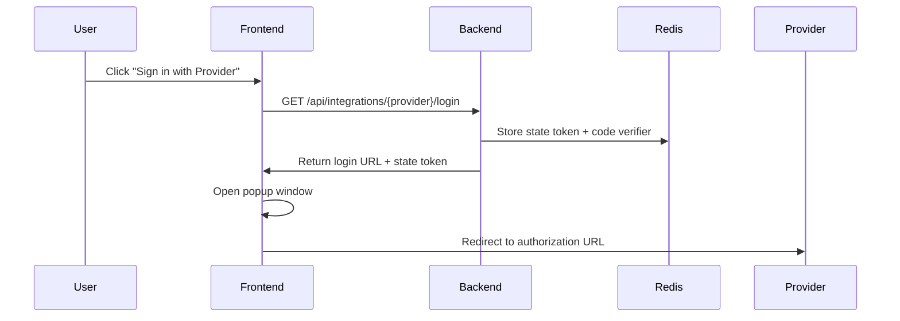
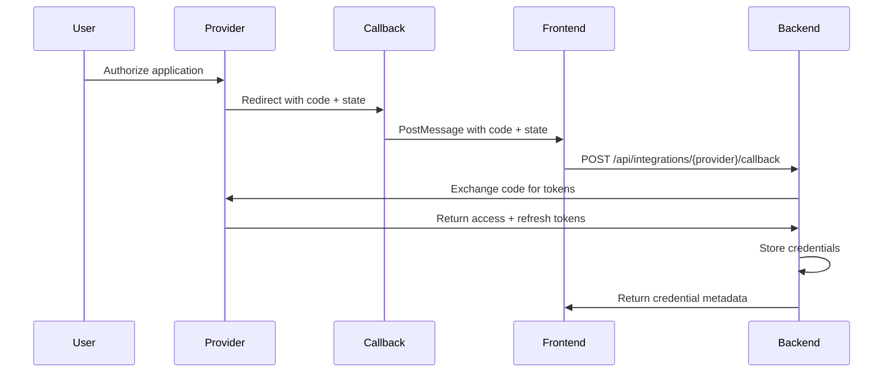
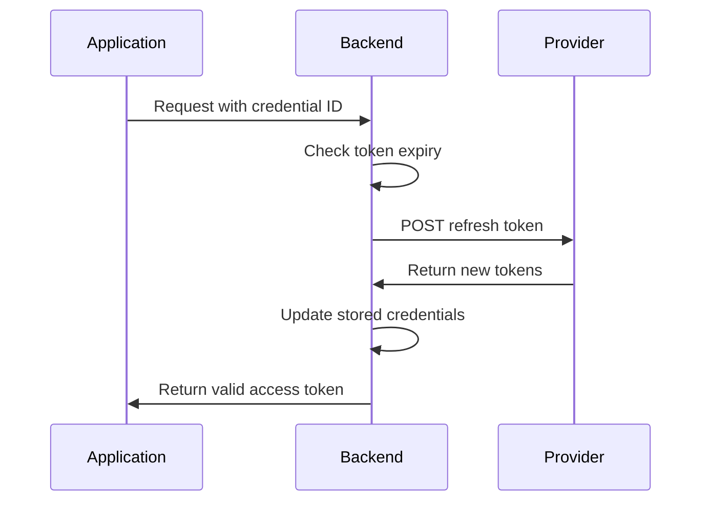
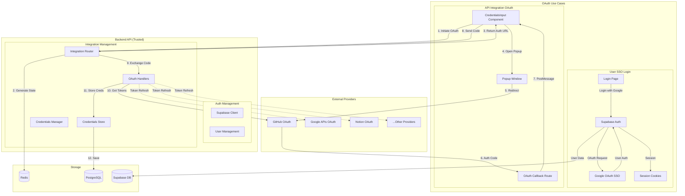
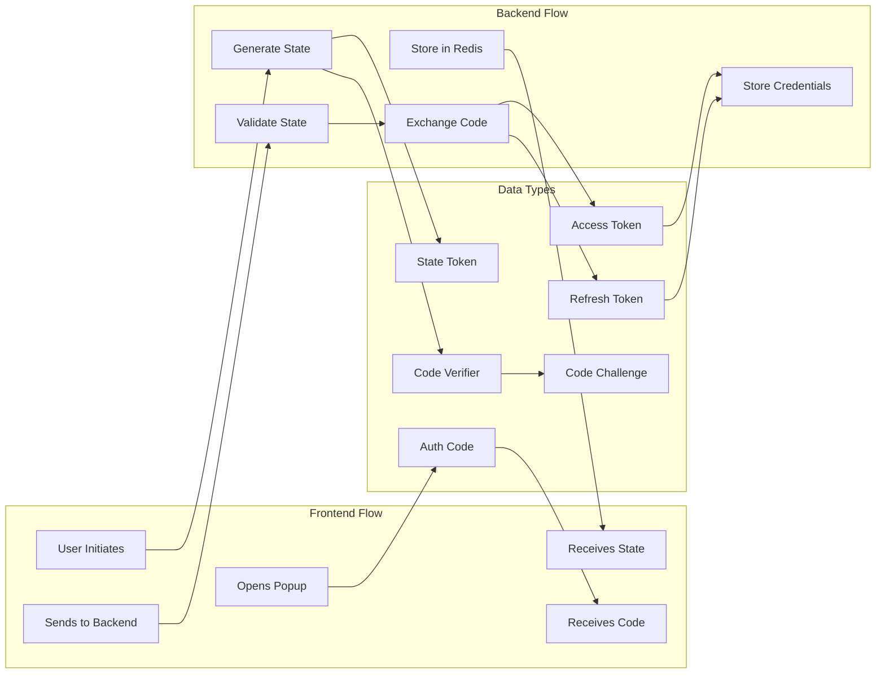
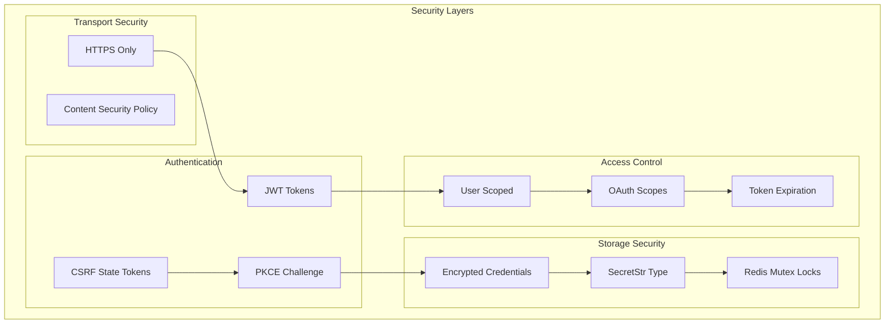
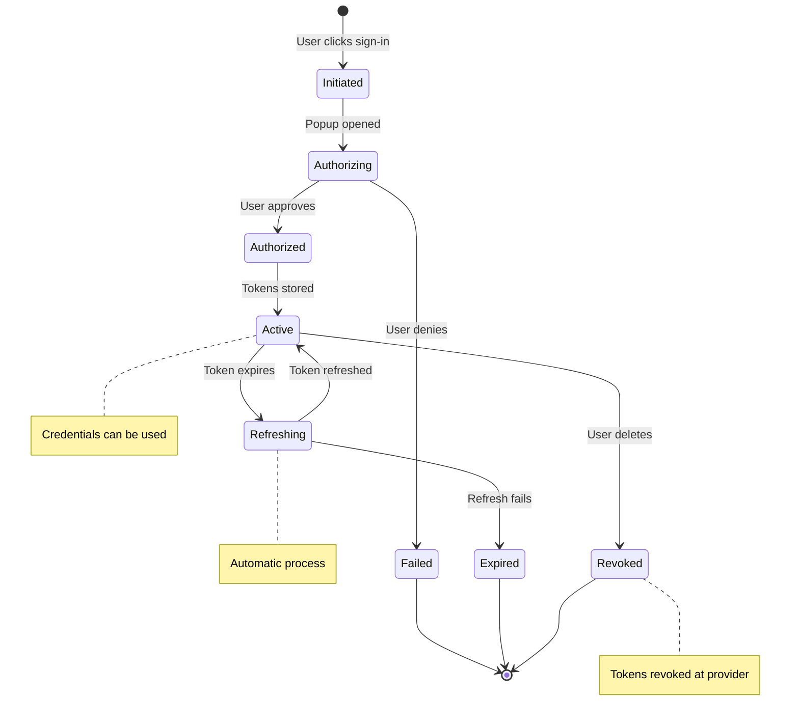

# OAuth Integration Flow Documentation

## Overview

The AutoGPT platform implements OAuth 2.0 in two distinct contexts:

1. **User Authentication (SSO)**: Handled by Supabase for platform login
2. **API Integration Credentials**: Custom OAuth implementation for third-party service access

This document focuses on the **API Integration OAuth flow** used for connecting to external services. For the list of supported providers, see `/backend/backend/integrations/providers.py`. For user authentication documentation, see the Supabase auth implementation.

## Trust Boundaries

### 1. Frontend Trust Boundary
- **Location**: Browser/Client-side application
- **Components**: 
  - `CredentialsInput` component (`/frontend/src/components/integrations/credentials-input.tsx`)
  - OAuth callback route (`/frontend/src/app/(platform)/auth/integrations/oauth_callback/route.ts`)
- **Trust Level**: Untrusted - user-controlled environment
- **Security Measures**:
  - CSRF protection via state tokens
  - Popup-based flow to prevent URL exposure
  - Message validation for cross-window communication

### 2. Backend API Trust Boundary
- **Location**: Server-side FastAPI application
- **Components**:
  - Integration router (`/backend/backend/api/features/integrations/router.py`)
  - OAuth handlers (`/backend/backend/integrations/oauth/`)
  - Credentials store (`/backend/backend/integrations/credentials_store.py`)
- **Trust Level**: Trusted - server-controlled environment
- **Security Measures**:
  - JWT-based authentication
  - Encrypted credential storage
  - Token refresh handling
  - Scope validation

### 3. External Provider Trust Boundary
- **Location**: Third-party OAuth providers
- **Components**: Provider authorization endpoints
- **Trust Level**: Semi-trusted - external services
- **Security Measures**:
  - HTTPS-only communication
  - Provider-specific security features
  - Token revocation support

## Component Architecture

### Frontend Components

#### 1. CredentialsInput Component
- **Purpose**: UI component for credential selection and OAuth initiation
- **Key Functions**:
  - Displays available credentials
  - Initiates OAuth flow via popup window
  - Handles OAuth callback messages
  - Manages credential selection state

#### 2. OAuth Callback Route
- **Path**: `/auth/integrations/oauth_callback`
- **Purpose**: Receives OAuth authorization codes from providers
- **Flow**:
  1. Receives `code` and `state` parameters from provider
  2. Posts message to parent window with results
  3. Auto-closes popup window

### Backend Components

#### 1. Integration Router
- **Base Path**: `/api/integrations`
- **Key Endpoints**:
  - `GET /{provider}/login` - Initiates OAuth flow
  - `POST /{provider}/callback` - Exchanges auth code for tokens
  - `GET /credentials` - Lists user credentials
  - `DELETE /{provider}/credentials/{id}` - Revokes credentials

#### 2. OAuth Base Handler
- **Purpose**: Abstract base class for provider-specific OAuth implementations
- **Key Methods**:
  - `get_login_url()` - Constructs provider authorization URL
  - `exchange_code_for_tokens()` - Exchanges auth code for access tokens
  - `refresh_tokens()` - Refreshes expired access tokens
  - `revoke_tokens()` - Revokes tokens at provider

#### 3. Credentials Store
- **Purpose**: Manages credential persistence and state
- **Key Features**:
  - Redis-backed mutex for concurrent access control
  - OAuth state token generation and validation
  - PKCE support with code challenge generation
  - Default system credentials injection

## OAuth Flow Sequence

### 1. Flow Initiation


### 2. Authorization


### 3. Token Refresh


## System Architecture Diagram



## Data Flow Diagram



## Security Architecture



## Credential Lifecycle



## OAuth Types Comparison

### User Authentication (SSO) via Supabase

- **Purpose**: Authenticate users to access the AutoGPT platform
- **Provider**: Supabase Auth (currently supports Google SSO)
- **Flow Path**: `/login` → Supabase OAuth → `/auth/callback`
- **Session Storage**: Supabase-managed cookies
- **Token Management**: Automatic by Supabase
- **User Experience**: Single sign-on to the platform

### API Integration Credentials

- **Purpose**: Grant AutoGPT access to user's third-party services
- **Providers**: Examples include GitHub, Google APIs, Notion, and others
  - Full list in `/backend/backend/integrations/providers.py`
  - OAuth handlers in `/backend/backend/integrations/oauth/`
- **Flow Path**: Integration settings → `/api/integrations/{provider}/login` → `/auth/integrations/oauth_callback`
- **Credential Storage**: Encrypted in PostgreSQL
- **Token Management**: Custom refresh logic with mutex locking
- **User Experience**: Connect external services to use in workflows

## Data Flow and Security

### 1. State Token Flow

- **Generation**: Random 32-byte token using `secrets.token_urlsafe()`
- **Storage**: Redis with 10-minute expiration
- **Validation**: Constant-time comparison using `secrets.compare_digest()`
- **Purpose**: CSRF protection and request correlation

### 2. PKCE Implementation

- **Code Verifier**: Random string generated using `secrets.token_urlsafe(128)` (approximately 171 characters when base64url encoded, though RFC 7636 recommends 43-128 characters)
- **Code Challenge**: SHA256 hash of verifier, base64url encoded
- **Storage**: Stored with state token in database (encrypted) with 10-minute expiration
- **Usage**: Enhanced security for public clients (currently used by Twitter provider)

### 3. Credential Storage

- **Structure**:

  ```python
  OAuth2Credentials:
    - id: UUID
    - provider: ProviderName
    - access_token: SecretStr (encrypted)
    - refresh_token: Optional[SecretStr]
    - scopes: List[str]
    - expires_at: Optional[int]
    - username: Optional[str]
  ```

- **Persistence**: PostgreSQL via Prisma ORM
- **Access Control**: User-scoped with mutex locking

### 4. Token Security

- **Storage**: Tokens stored as `SecretStr` type
- **Transport**: HTTPS-only, never logged
- **Refresh**: Automatic refresh 5 minutes before expiry
- **Revocation**: Supported for providers that implement it

## Provider Implementations

### Supported Providers

The platform supports various OAuth providers including GitHub, Google, Notion, Twitter, and others. For the complete list, see:
- `/backend/backend/integrations/providers.py` - All supported providers
- `/backend/backend/integrations/oauth/` - OAuth implementations

### Provider-Specific Security Considerations

- **GitHub**: Supports optional token expiration - tokens may be non-expiring by default
- **Linear**: Returns scopes as space-separated string, requiring special parsing
- **Google**: Requires explicit offline access scope for refresh tokens
- **Twitter**: Uses PKCE for enhanced security on public clients

Each provider handler implements the security measures defined in `BaseOAuthHandler`, ensuring consistent token management and refresh logic across all integrations.

## Security Best Practices

### 1. Frontend Security

- Use popup windows to prevent URL tampering
- Validate state tokens before processing callbacks
- Clear sensitive data from window messages
- Implement timeout for OAuth flows (5 minutes)

### 2. Backend Security

- Store client secrets in environment variables
- Use HTTPS for all OAuth endpoints
- Implement proper scope validation
- Log security events without exposing tokens
- Use database transactions for credential updates

### 3. Token Management

- Refresh tokens proactively (5 minutes before expiry)
- Revoke tokens when credentials are deleted
- Never expose tokens in logs or error messages
- Use constant-time comparison for token validation

## Error Handling

### Common Error Scenarios

1. **Invalid State Token**: 400 Bad Request
2. **Provider Configuration Missing**: 501 Not Implemented
3. **Token Exchange Failure**: 400 Bad Request with hint
4. **Webhook Conflicts**: 409 Conflict, requires confirmation
5. **Credential Not Found**: 404 Not Found

### Error Response Format

```json
{
  "detail": {
    "message": "Human-readable error description",
    "hint": "Actionable suggestion for resolution"
  }
}
```

## Testing Considerations

### Unit Testing

- Mock OAuth providers for flow testing
- Test state token generation and validation
- Verify PKCE implementation
- Test concurrent access scenarios

### Integration Testing

- Use provider sandboxes when available
- Test full OAuth flow with real providers
- Verify token refresh mechanisms
- Test error scenarios and recovery

### Logging Guidelines

- Log flow initiation and completion
- Log errors with context (no tokens)
- Track provider-specific issues
- Monitor for suspicious patterns
