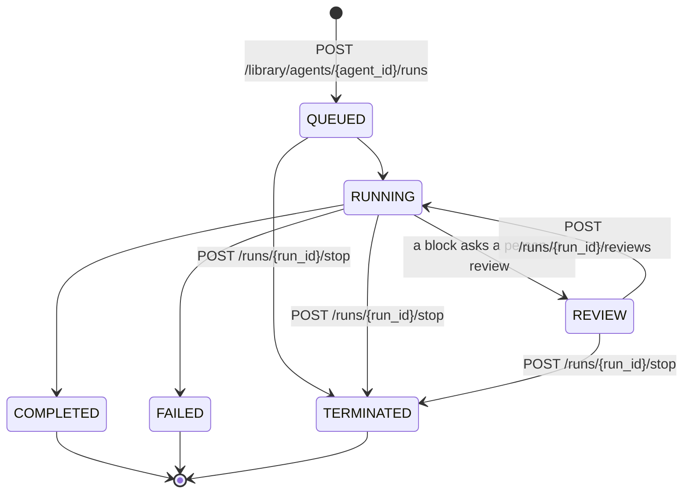

# Run agents

Everything here works with any agent in your library: ones you built in the app, ones you added from the marketplace, and ones you created with the API.

## How a run works

You start a run with `POST /library/agents/{agent_id}/runs`. The API answers `202 Accepted` at once, before the agent does anything, and the run carries on in the background. You follow it by reading `GET /runs/{run_id}` until it reaches a final status.



| `status` | Final? | Meaning | What your code should do |
| --- | --- | --- | --- |
| `INCOMPLETE` | No | Created but not handed to an executor yet. | Keep waiting. |
| `QUEUED` | No | Waiting for an executor. | Keep waiting. |
| `RUNNING` | No | Executing blocks. | Keep waiting. |
| `REVIEW` | No | Paused until a person approves or rejects something. It waits indefinitely. | [Answer the review](#human-in-the-loop-reviews), or alert someone who can. |
| `COMPLETED` | Yes | Finished. **This does not guarantee every block succeeded**; see [Check that a run succeeded](#check-that-a-run-succeeded). | Read `outputs`. |
| `FAILED` | Yes | Stopped by an error the run could not continue past. | Read the errors in `node_executions`. |
| `TERMINATED` | Yes | Stopped, by you or by the platform. | Nothing further happens. |

## Find the agent

You need the **library agent ID**, which is not the same as the graph ID. List your library (needs **Read Library**):

```bash
curl -s "$AUTOGPT_API_URL/library/agents?limit=100" -H "X-API-Key: $AUTOGPT_API_KEY"
```

Each item has the `id` to run it with, its `name`, `description`, and the `graph_id` and `graph_version` it runs. The list leaves `input_schema` and `output_schema` empty; get the full agent with `GET /library/agents/{agent_id}` to read them. If you know an agent's graph ID, `GET /graphs/{graph_id}/library-agent` returns the full library agent directly.

There is no filter by name. To find an agent by name, read every page and match on `name` yourself. Names aren't unique, so handle more than one match, and once you've found the right agent, store its `id` and use that from then on:

```python
def find_agent_by_name(name: str) -> dict:
    matches, params = [], {"limit": 100}
    while True:
        response = requests.get(f"{API_URL}/library/agents", headers=HEADERS, params=params, timeout=30)
        response.raise_for_status()
        page = response.json()
        matches += [a for a in page["items"] if a["name"].casefold() == name.casefold()]
        if not page["next_cursor"]:
            break
        params["cursor"] = page["next_cursor"]
    if len(matches) != 1:
        raise LookupError(f"{len(matches)} library agents are named {name!r}")
    response = requests.get(f"{API_URL}/library/agents/{matches[0]['id']}", headers=HEADERS, timeout=30)
    response.raise_for_status()
    return response.json()
```

Other ways to find agents:

* `GET /search?query=invoice&content_types=LIBRARY_AGENT` searches your library by meaning (needs **Read Library**). It's for discovery, not lookup: results depend on the instance's search index, which can lag behind your library or, on a new self-hosted instance, be empty.
* `GET /marketplace/agents?search_query=invoice` searches the public marketplace. Add one to your library with `POST /marketplace/agents/{username}/{agent_name}/add-to-library` (needs **Write Library**), then run the library agent it returns.

## Work out its inputs

Read the agent's `input_schema` from `GET /library/agents/{agent_id}` (the list leaves it empty). It is a JSON Schema object. Each property is one input, its key is the name you pass in `inputs`, and `required` lists the inputs without a default:

```json
{
  "type": "object",
  "properties": {
    "topic": { "title": "Topic", "advanced": false, "secret": false },
    "max_words": { "title": "Max words", "type": "integer", "default": 300, "advanced": true, "secret": false },
    "document": {
      "title": "Document",
      "anyOf": [{ "type": "string", "format": "file" }, { "type": "null" }],
      "advanced": false,
      "secret": false
    }
  },
  "required": ["topic", "document"]
}
```

So `inputs` for this agent is `{"topic": "...", "document": "..."}`, with `max_words` optional.

* `type` is present when the agent declares one. Inputs made with the general-purpose input block have none and accept any JSON value; send what the input's `title` and `description` ask for.
* `"format": "file"` marks an input that takes a [file reference](#pass-files-to-an-agent). Other formats, such as `long-text`, are hints for the app's form: send a plain string.
* An input can be `required` while its type also allows `null`, like `document` above. Send a value for it: `null` counts as missing.
* `advanced: true` marks an optional input the app tucks away under advanced settings. `secret: true` marks a value the app masks, such as a password. Neither changes how you send it.
* Starting a run or creating a schedule checks `inputs` against `input_schema`. A name the agent doesn't have, or a `required` input left out or `null`, is a [`422`](api-conventions.md#validation-errors) and nothing starts; `details.errors` has one entry per input, with `loc` `["body", "inputs", "<name>"]`.

## Supply credentials it needs

Agents that call third-party services (an AI model provider, GitHub, Google, ...) need credentials from your account. Ask which ones (needs **Read Integrations**). An agent that needs none returns an empty list:

```bash
curl -s "$AUTOGPT_API_URL/library/agents/$AGENT_ID/credentials" -H "X-API-Key: $AUTOGPT_API_KEY"
```

```json
{
  "items": [
    {
      "field_name": "openai_api_key_credentials",
      "provider": "openai",
      "supported_types": ["api_key"],
      "required_scopes": [],
      "matching_credentials": [
        {
          "id": "e60aba2b-5bd5-464c-9f13-2b6c200010e3",
          "type": "api_key",
          "provider": "openai",
          "title": "My OpenAI key",
          "username": null,
          "scopes": [],
          "expires_at": null,
          "is_managed": false
        }
      ]
    }
  ],
  "next_cursor": null,
  "total_count": 1
}
```

For each requirement, pick one of its `matching_credentials` and pass it under the requirement's `field_name`. When several match, let whoever owns the integration choose, for example by `title`, and store the choice; picking the first one silently can use the wrong account:

```json
{
  "inputs": { "question": "Say hi" },
  "credentials_inputs": {
    "openai_api_key_credentials": {
      "id": "e60aba2b-5bd5-464c-9f13-2b6c200010e3",
      "provider": "openai",
      "type": "api_key"
    }
  }
}
```

A requirement can be optional: the agent's builder may let some blocks run without their credentials. The graph's `credentials_input_schema`, from `GET /graphs/{graph_id}` (needs **Read Graph**), lists the requirements that must be filled under `required`.

If a requirement has no matching credentials, add one first:

* **API keys, passwords and custom headers:** `POST /integrations/credentials` (needs **Manage Integrations**), with `type` set to `api_key`, `user_password` or `host_scoped`:

  ```bash
  curl -s -X POST "$AUTOGPT_API_URL/integrations/credentials" \
    -H "X-API-Key: $AUTOGPT_API_KEY" -H "Content-Type: application/json" \
    -d '{"type": "api_key", "provider": "openai", "api_key": "sk-...", "title": "My OpenAI key"}'
  ```

* **OAuth providers** (Google, GitHub and the like): connect them in the app under **Settings → Integrations**. OAuth connections can't be created through the API. [OAuth apps](oauth-guide.md#integration-setup-wizard) can send their users through the integration setup wizard instead.

On AutoGPT Cloud, some providers have **platform-provided credentials** (`"is_managed": true`), such as built-in AI model access. You can pass them like your own.


A run with a missing credential is still accepted. It fails when the block that needs the credential runs, so always check the requirements before the first run. Without **Read Integrations** you can't check, so only skip this for agents you know need no credentials.


## Start the run

```bash
curl -s -X POST "$AUTOGPT_API_URL/library/agents/$AGENT_ID/runs" \
  -H "X-API-Key: $AUTOGPT_API_KEY" \
  -H "Content-Type: application/json" \
  -H "Idempotency-Key: report-2026-10-08" \
  -d '{"inputs": {"topic": "Q3 results"}, "credentials_inputs": {}}'
```

* Needs **Run Agent**. Limited to 60 run starts per minute per user.
* Returns `202` with the run (`"status": "QUEUED"`). Keep its `id`.
* Always send an `Idempotency-Key` from code that retries. A retry with the same key gets the original run back instead of a second, paid run. See [Idempotent runs](api-conventions.md#idempotent-runs).
* On AutoGPT Cloud, `402 payment_required` means the account has no active plan or its credit balance is zero.

## Wait for it to finish

Read the run until its status is `COMPLETED`, `FAILED` or `TERMINATED`. Poll every one to five seconds, back off on long runs, and keep everything inside one deadline: each request's timeout and each sleep are cut to the time that's left. (A `requests` timeout limits each wait for the server, not a whole slow response; if you need a hard limit, use a client with an overall timeout.) A run in `REVIEW` waits for a person and never finishes on its own.



```python
import time

import requests

FINAL = {"COMPLETED", "FAILED", "TERMINATED"}


def wait_for_run(run_id: str, timeout_s: float = 600) -> dict:
    deadline = time.monotonic() + timeout_s
    delay, status = 1.0, "unknown"
    while (remaining := deadline - time.monotonic()) > 0:
        response = requests.get(
            f"{API_URL}/runs/{run_id}", headers=HEADERS, timeout=min(30, remaining)
        )
        response.raise_for_status()
        run = response.json()
        status = run["status"]
        if status in FINAL:
            return run
        if status == "REVIEW":
            raise RuntimeError(f"Run {run_id} is waiting for a human review")
        time.sleep(max(0, min(delay, deadline - time.monotonic())))
        delay = min(delay * 1.5, 10)
    raise TimeoutError(f"Run {run_id} still {status} after {timeout_s}s")
```



```typescript
const FINAL = new Set(["COMPLETED", "FAILED", "TERMINATED"]);

async function waitForRun(runId: string, timeoutMs = 600_000) {
  const deadline = Date.now() + timeoutMs;
  let delay = 1000;
  let status = "unknown";
  for (let remaining = timeoutMs; remaining > 0; remaining = deadline - Date.now()) {
    const response = await fetch(`${API_URL}/runs/${runId}`, {
      headers: HEADERS,
      signal: AbortSignal.timeout(Math.min(30_000, remaining)),
    });
    if (!response.ok) throw new Error(`${response.status}: ${await response.text()}`);
    const run = await response.json();
    status = run.status;
    if (FINAL.has(status)) return run;
    if (status === "REVIEW") throw new Error(`Run ${runId} is waiting for a human review`);
    await new Promise((r) => setTimeout(r, Math.max(0, Math.min(delay, deadline - Date.now()))));
    delay = Math.min(delay * 1.5, 10_000);
  }
  throw new Error(`Run ${runId} still ${status} after ${timeoutMs} ms`);
}
```



Every poll counts toward the 200-requests-per-minute limit, which is shared by all your keys. If you follow many runs at once, list them in one request instead: `GET /runs?statuses=QUEUED&statuses=RUNNING`.

If your deadline passes and you no longer want the result, stop the run so it doesn't keep spending: `POST /runs/{run_id}/stop`.

## Read the outputs

`GET /runs/{run_id}` includes `outputs` once the run finishes. It maps the name of each of the agent's outputs (the keys of its `output_schema`) to a **list** of values, because an output can be produced more than once in one run:

```json
{
  "id": "34cc713f-7b02-4622-95c7-5c8ea1a8b213",
  "status": "COMPLETED",
  "outputs": { "greeting": ["Hello, Ada!"] },
  "cost_cents": 0,
  "duration_seconds": 0.74,
  "node_exec_count": 3,
  "node_executions": [
    {
      "node_id": "95dc9385-9f05-4c35-8a2e-8d67118afe87",
      "status": "COMPLETED",
      "inputs": { "name": "greeting", "value": "Hello, Ada!" },
      "outputs": { "output": ["Hello, Ada!"] },
      "started_at": "2026-10-08T14:29:24.883000Z",
      "ended_at": "2026-10-08T14:29:24.918000Z"
    }
  ]
}
```

While the run is going, `outputs` and `node_executions` hold what has finished so far, and can be empty. Most agents produce each output once, so read `outputs["name"][0]`, or the last element for the latest value. An output the run never produced is missing from `outputs`. Outputs that are files arrive as `workspace://` references; see [Get files back](#get-files-back).

`node_executions` lists every block that ran, with its inputs and outputs, which is what you need to debug a run. The schema allows it to be `null`; treat that as no detail being available. `cost_cents` is what the run cost.

### Check that a run succeeded

`COMPLETED` means the run reached its end. It doesn't mean every block succeeded. When a block fails it produces an `error` output instead of its normal outputs. If the agent doesn't route that error anywhere, the run still completes, just without the outputs that depended on the failed block:

```json
{
  "status": "COMPLETED",
  "outputs": {},
  "node_executions": [
    { "status": "COMPLETED", "outputs": { "result": ["Say hi"] } },
    {
      "status": "FAILED",
      "outputs": { "error": ["Error calling LLM: Error code: 401 - Incorrect API key provided"] }
    }
  ]
}
```

So treat a run as successful only when it is `COMPLETED` **and** the outputs you need are present. When they aren't, collect the errors. If there are none, check that the run got every required input:

```python
errors = [
    message
    for node in run["node_executions"] or []
    if node["status"] == "FAILED"
    for message in node["outputs"].get("error", [])
]
```

A `FAILED` run carries its errors the same way.

## Human-in-the-loop reviews

Agents can include a human-in-the-loop block that pauses the run until someone approves or rejects a piece of data. The run then has status `REVIEW` and waits until it gets an answer.

List what's waiting (needs **Read Run Review**):

```bash
curl -s "$AUTOGPT_API_URL/runs/reviews?run_id=$RUN_ID&status=WAITING" -H "X-API-Key: $AUTOGPT_API_KEY"
```

```json
{
  "items": [
    {
      "node_exec_id": "6b7c132e-ff6c-4654-8a86-3e5484fe6e65",
      "run_id": "5ff77dcc-f4c0-4ec6-afb8-a0073b56620f",
      "graph_id": "e45fade7-f015-43e5-a95f-ce90eeff7ea2",
      "graph_version": 1,
      "payload": "Ship it on Friday",
      "instructions": "Draft announcement",
      "editable": true,
      "status": "WAITING",
      "requested_at": "2026-10-08T14:34:51.245000Z",
      "reviewed_at": null,
      "processed": false,
      "reviewer_comment": null
    }
  ],
  "next_cursor": null,
  "total_count": 1
}
```

`payload` is the data under review and `instructions` says what it is. Leave out `run_id` to see waiting reviews across all your runs.

Answer **every** waiting review of the run in one request (needs **Write Run Review**). The request fails if it leaves one out.

```bash
curl -s -X POST "$AUTOGPT_API_URL/runs/$RUN_ID/reviews" \
  -H "X-API-Key: $AUTOGPT_API_KEY" -H "Content-Type: application/json" \
  -d '{
    "reviews": [
      {
        "node_exec_id": "6b7c132e-ff6c-4654-8a86-3e5484fe6e65",
        "approved": true,
        "edited_payload": "Ship it on Monday",
        "message": "Moved to Monday"
      }
    ]
  }'
```

```json
{ "run_id": "5ff77dcc-f4c0-4ec6-afb8-a0073b56620f", "approved_count": 1, "rejected_count": 0 }
```

* `approved: true` sends the data (or your `edited_payload`, when the review is `editable`) down the block's approved path, and the run continues.
* `approved: false` sends the data down the block's rejected path instead, so the steps after an approval don't run. What happens next depends on what the agent's builder connected to the rejected path.
* `auto_approve_future: true` approves this block's future reviews automatically. It only applies to an approval, and ignores `edited_payload`.

After you answer, the run moves back to `RUNNING`; keep waiting for it as usual. Reviews can also be answered in the AutoGPT app.

### When your integration can't answer reviews

A run in `REVIEW` waits until someone answers, however long that takes. Decide up front what your integration does when it sees one:

* **Hand it to a person.** Tell someone the run is waiting (the review shows up in the AutoGPT app for the account that owns the run), stop polling, and check back later. The run continues once they answer.
* **Answer it yourself**, if your product has its own approval step: show the `payload` and `instructions` to your user and send their decision with `POST /runs/{run_id}/reviews`.
* **Give up.** `POST /runs/{run_id}/stop` ends the run as `TERMINATED`.
* **Don't ask at all.** If the agent may run unattended, turn its reviews off with `PATCH /graphs/{graph_id}/settings` and `{"human_in_the_loop_safe_mode": false}`, and every review is approved automatically. See [Build agents](building-agents.md#human-in-the-loop-blocks).

## Pass files to an agent

Upload the file to your workspace (needs **Write Files**; 20 uploads per 5 minutes):

```bash
curl -s -X POST "$AUTOGPT_API_URL/files/upload" \
  -H "X-API-Key: $AUTOGPT_API_KEY" \
  -F "file=@brief.pdf"
```

```json
{
  "id": "1d458946-1b77-4e62-b13f-67fd5b1ce100",
  "name": "brief.pdf",
  "path": "/brief.pdf",
  "mime_type": "application/pdf",
  "size_bytes": 48211,
  "created_at": "2026-10-08T14:41:08.120000Z",
  "updated_at": "2026-10-08T14:41:08.120000Z",
  "file_uri": "workspace://1d458946-1b77-4e62-b13f-67fd5b1ce100#application/pdf"
}
```

Pass `file_uri` as the value of the file input:

```json
{ "inputs": { "document": "workspace://1d458946-1b77-4e62-b13f-67fd5b1ce100#application/pdf" } }
```

* Uploads are virus-scanned and count toward your storage quota.
* Uploading a file whose name is already in the workspace fails with `409 conflict`. Add `?overwrite=true` to replace it. The replacement gets a **new** `id` and `file_uri`.
* `GET /files` lists the workspace and `DELETE /files/{file_id}` removes a file (needs **Read Files** and **Write Files**).

### Get files back

An output that is a file arrives as a `workspace://<file_id>#<mime type>` reference. Download it with the ID between `workspace://` and `#` (needs **Read Files**):

```bash
curl -s "$AUTOGPT_API_URL/files/1d458946-1b77-4e62-b13f-67fd5b1ce100/download" \
  -H "X-API-Key: $AUTOGPT_API_KEY" -o result.pdf
```

## Run on a schedule

Schedules run a graph on a cron expression (needs **Write Schedule** and **Run Agent**). Note that schedules take the **graph ID**, not the library agent ID:

```bash
curl -s -X POST "$AUTOGPT_API_URL/schedules" \
  -H "X-API-Key: $AUTOGPT_API_KEY" -H "Content-Type: application/json" \
  -d '{
    "graph_id": "eb760d4c-a524-4726-9707-a46bcf75bf99",
    "name": "Daily hello",
    "cron": "0 9 * * *",
    "timezone": "Europe/London",
    "inputs": {"name": "Ada"},
    "credentials_inputs": {}
  }'
```

```json
{
  "id": "57aabad0-a2c4-43fa-8faf-36cc746e6985",
  "name": "Daily hello",
  "graph_id": "eb760d4c-a524-4726-9707-a46bcf75bf99",
  "graph_version": 1,
  "cron": "0 9 * * *",
  "timezone": "Europe/London",
  "inputs": { "name": "Ada" },
  "next_run_time": "2026-10-09T09:00:00+01:00"
}
```

* `cron` takes the standard five fields: minute, hour, day of month, month, day of week. An invalid expression fails with `400`.
* `timezone` is an IANA name. Without it, the schedule uses the account's time zone.
* `graph_version` defaults to the active version.
* `GET /schedules?graph_id=...` lists schedules and `DELETE /schedules/{schedule_id}` removes one. Each scheduled run shows up in `GET /runs` like any other run.

## Manage runs

| Task | Request | Permission |
| --- | --- | --- |
| List runs, newest first | `GET /runs?graph_id=...&statuses=FAILED&started_after=2026-10-01T00:00:00Z` | Read Run |
| Get one run with outputs | `GET /runs/{run_id}` | Read Run |
| Stop a run | `POST /runs/{run_id}/stop` waits up to about 15 seconds for the run to stop, then returns it. If it still isn't `TERMINATED`, keep polling. A run that already finished (`COMPLETED`, `FAILED` or `TERMINATED`) answers `409 conflict`. | Write Run |
| Delete a run | `DELETE /runs/{run_id}` | Write Run |
| Share a run publicly | `POST /runs/{run_id}/share` returns a `share_url` anyone with the link can open | Read Run + Share Run |
| Stop sharing | `DELETE /runs/{run_id}/share` | Read Run + Share Run |

Repeat `statuses` to match several, e.g. `?statuses=COMPLETED&statuses=FAILED`.

## Costs

Every run reports `cost_cents` once it finishes. `GET /credits` returns your balance, and `GET /credits/cost-summary` breaks spending down by agent and by day (both need **Read Credits**). Self-hosted instances don't bill: runs cost nothing and the balance is a fixed placeholder.
