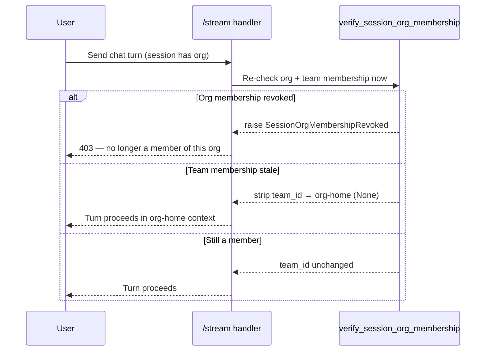

# Chats & Billing

Part of the [Org Access Model reference](org-access-model.md). Two places where
"attribution" and "access" pull in different directions: chat sessions are
**private to their owner** but attributed to an org for billing, and billing is
pooled at the org but **role-gated**.

## Chat sessions are user-owned

A `ChatSession` carries an owner plus attribution fields:

```
userId          String              # the owner
organizationId  String?             # attribution
teamId          String?             # attribution
visibility      ResourceVisibility  # default PRIVATE  (PRIVATE | TEAM | ORG)
```

- **Private by default.** Every session read/write query is scoped by
  `userId`. There is no query path that lets another org member list or fetch
  someone else's session — the `organizationId` / `teamId` are recorded for
  **attribution only** (billing, and "which org was this run charged to"), not
  to widen visibility. Chats are the one resource class that does **not** follow
  the org/team visibility union.
- The `visibility` enum exists on the row for a future team/org-visible chat
  feature, but the default and the enforced behavior today is `PRIVATE`.

### Membership is re-verified every turn

A session is membership-verified when it is created, but a membership can be
revoked while a long-lived session is still open. So org/team membership is
**re-checked on every chat turn** (`verify_session_org_membership`):



- **Org membership is a hard gate.** If the user is no longer an `ACTIVE`
  member of the session's org, the turn is rejected (`403`).
- **A stale team membership is not fatal.** It is silently stripped to org-home
  (`team_id = None`), mirroring `get_request_context`'s team fallback — the
  chat keeps working, just without the team scope.
- The same re-check runs in the **turn queue**: before a queued turn is
  promoted, membership is re-verified; on revocation the session is demoted
  (`queued → idle`) and its cache invalidated rather than dispatched under a
  revoked org.
- **Untagged legacy sessions** (`organizationId = NULL`) skip the re-check and
  fall back to the already-verified request context.

## Billing is pooled and role-gated

Runs in a shared org draw from the **org's credit pool**, and every charge is
**attributed** so spend can be broken down by team.

### Attribution

`OrgCreditTransaction` records `orgId`, `initiatedByUserId`, and a nullable
`teamId` on every usage transaction. The charge path
(`spend_org_credits`, called from the executor's billing) tags each transaction
with the `team_id` from the running execution's context:

- Execution rows (`AgentGraphExecution`) carry `organizationId` / `teamId`,
  set at creation.
- Block-usage and execution-usage charges pull `organization_id` /
  `team_id` off `ExecutionContext` and pass them through to
  `spend_org_credits`, which stamps `teamId` on the transaction.
- **Personal orgs** short-circuit to the user's own wallet, so team attribution
  only applies to shared (non-personal) orgs.

This is what lets an org see per-team cost breakdowns without any new write
path — the attribution is already on every transaction.

### Who can touch billing

Billing endpoints are gated by **`OrgAction.MANAGE_BILLING`** — **owner or
billing manager only** (see the [role matrix](org-access-model.md#org-permission-matrix)):

| Endpoint / capability | Gate |
| --- | --- |
| Top-up credits | `MANAGE_BILLING` |
| Auto-top-up config | `MANAGE_BILLING` |
| Billing portal / payment methods | `MANAGE_BILLING` |
| Transactions / refunds / invoices | `MANAGE_BILLING` |
| Org spend breakdown (`get_org_spend`) | `MANAGE_BILLING` |
| Team-level spend view | `VIEW_SPEND` (team admin / team billing manager) |

A plain member — even one who can create and run agents that spend org credits
— cannot see or manage billing. Conversely, a pure billing manager can manage
finances but cannot create resources or share agents.

## Future directions

A few fields are present in the schema ahead of enforcement. Where honest, this
reference flags them at the point of use rather than describing them as live:

- **Seat enforcement** — `seat_status` rides on `RequestContext`, but seat/
  subscription gating is owned by the paywall workstream and is not enforced
  today.
- **Shared-memory review** — held (`tentative`) team/org memories have no
  promotion path yet (see
  [Write governance](org-access-model-credentials-and-memory.md#write-governance-the-hold-buffer)).
- **Chat visibility** — the `TEAM` / `ORG` values on `ChatSession.visibility`
  are reserved; chats are `PRIVATE` in practice.

Everything else in this reference describes enforced behavior.
