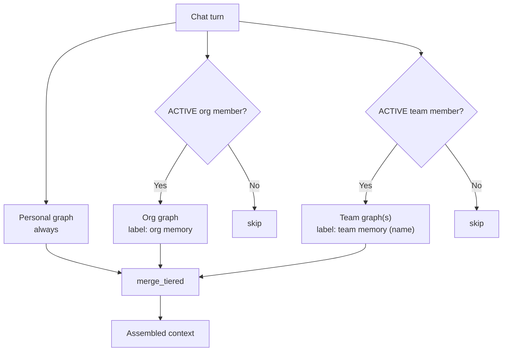

# Credentials & Memory

Part of the [Org Access Model reference](org-access-model.md). Two subsystems
that resolve *across* the tenancy tiers: integration credentials and copilot
memory.

## Credential resolution

Scoped credentials live in the `IntegrationCredential` table with an
`ownerType` of `USER`, `TEAM`, or `ORG`. The scoped store
(`backend/integrations/scoped_credentials.py`) resolves the credentials visible
in the current context as the **union** of the three scopes, in this precedence
order:

```mermaid
flowchart LR
    Q[get_scoped_credentials<br/>user, org, team?] --> U[USER<br/>ownerType=USER,<br/>ownerId=user, this org]
    Q --> T[TEAM<br/>ownerType=TEAM,<br/>ownerId=active team]
    Q --> O[ORG<br/>ownerType=ORG,<br/>ownerId=org]
    U --> R[Ordered result:<br/>USER &#8594; TEAM &#8594; ORG]
    T --> R
    O --> R
```

- The **TEAM** slice is included only when a team is active on the context.
- The **ORG** slice is available to any org member, because `organization_id`
  comes from a membership-verified `RequestContext`.

This is the newer path. During the dual-read transition, callers try the scoped
store first and fall back to the legacy `User.integrations` blob.

### Fetching one credential by id

`get_credential_by_id` enforces access **itself** rather than trusting callers,
because a decrypted read could otherwise exfiltrate another tenant's secret:

| Credential `ownerType` | Who may fetch it |
| --- | --- |
| `USER` | Only the creating user. |
| `TEAM` | Only via the matching active team — or, when the active context is a *different* team, a caller with a verified `ACTIVE` membership of the **owning** team. |
| `ORG` | Any member of the org. |

### Creating and managing team credentials

- **Creating** a credential takes `owner_type` + `owner_id`. For `TEAM`
  credentials the store enforces `team_id == owner_id` so the dedicated
  `teamId` FK is populated — that gives `onDelete: Cascade` cleanup and matches
  the shape the read path resolves on.
- **Managing** team credentials is a **team-admin** action. At the team level,
  `MANAGE_CREDENTIALS` is `team_admin` only, while `USE_CREDENTIALS` is granted
  to `team_admin` and `team_member`. In other words: members can *use* a team
  credential in a run, only admins can add or remove them.
- **Deleting** is scoped tightly:
  - `delete_team_credential` requires the credential to be `TEAM`-owned by
    *exactly* that team in that org — a team admin cannot revoke another team's
    credential by id (no cross-team escalation).
  - `delete_credential` (user/org creds) allows only the creator, unless
    `is_org_admin` is set — which callers must derive from a verified context,
    never from request input.

## Memory tiers

Copilot memory is split across **three FalkorDB graphs**, one substrate per
group:

| Tier | Group id | Visibility |
| --- | --- | --- |
| **Personal** | `user_<id>` | Private to the user. |
| **Team** | `team_<id>` | `ACTIVE` members of that team. |
| **Org** | `org_<id>` | Every org member. |

Group ids are derived by `derive_group_id` / `derive_team_group_id` /
`derive_org_group_id`, which sanitize the id and **raise** if sanitization
changed it — a tenant id can never collapse into another tenant's namespace.

### Recall fan-out

A chat reads from every tier the user is entitled to, then merges the results
under a budget. Provenance labels are attached so the model can weigh sources.

Two read paths, both membership-checked at read time (never trusted from the
session):

- **Warm context** (session-start prefetch, `resolve_warm_targets`): personal
  **always**; org **only** if the session carries an org and the user is an
  `ACTIVE` org member; the session's team **only** if the session is team-tagged
  and the user is an `ACTIVE` member of it.
- **Explicit search** (`resolve_search_targets`): a `tier` of `all` (default)
  unions personal + org + **every** `ACTIVE` team the user belongs to;
  `personal` / `org` / `team` restrict to that tier. Requesting `org` or `team`
  on a session with no org is a `TierError`.

**Budget merge** (`merge_tiered`): personal keeps at least half the total
(`total // 2`) and absorbs any budget the shared tiers don't use; the remainder
is filled by round-robin across the shared tiers so each keeps its top hits near
the front. **Labels**: personal facts stay **unlabelled** (the common case
reads cleanly); org facts are prefixed `org memory`; team facts
`team memory (<name>)`. Storage does not resolve cross-tier conflicts —
provenance labelling hands that judgement to the model.

### Write governance (the hold buffer)

Writing to a **shared** tier is governed. Whether a write lands `active`
(immediately recallable) or `tentative` (held) depends on the writer's role and
the org's hold-buffer setting:

| Tier | Who may write | Writer is admin | Writer is member, hold buffer **on** | Hold buffer **off** |
| --- | --- | --- | --- | --- |
| **Personal** | the user | `active` | `active` | `active` |
| **Team** | any `ACTIVE` team member | `active` | `tentative` | `active` |
| **Org** | any `ACTIVE` org member | `active` | `tentative` | `active` |

- "Admin" means an org admin/owner for the org tier, or a **team** admin
  (`membership.isAdmin`) for the team tier. An admin's shared write always lands
  `active`; the admin check short-circuits the hold decision.
- The **hold buffer** is `Organization.settings["memory"]["holdBuffer"]`,
  **defaulting to `true`** (and failing safe to `true` on any read error). When
  on, non-admin shared writes land `tentative`; when off, everyone's permitted
  writes land `active`.
- **Personal writes are never held** — they are always `active` and private,
  and never enter the governance branch at all.
- Any `ACTIVE` member may *write* to a shared tier — admin status only affects
  `active` vs `tentative`, not whether the write is permitted.

> **Enforcement status:** the hold buffer *holds* — a `tentative` shared memory
> is excluded from recall — but there is **no admin review/promotion path
> implemented yet** for shared tiers. As shipped in the memory-tiers branch, a
> held team/org memory stays `tentative`; the review queue and the
> `tentative → active` promotion action are future work. (The personal-tier
> "dream" ratification pipeline is explicitly scoped out of shared-tier
> promotion.) Document and build against `tentative` meaning "held, not yet
> recallable", not "pending a working review UI".

Continue to [Chats & billing](org-access-model-chats-and-billing.md).
