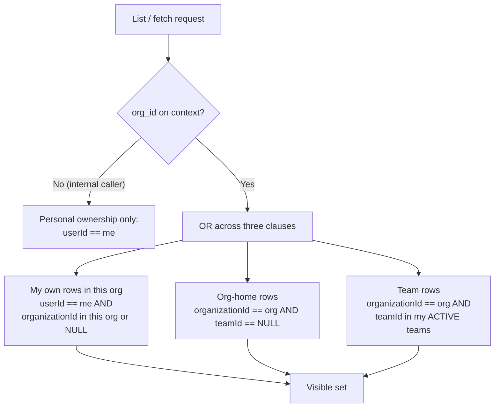
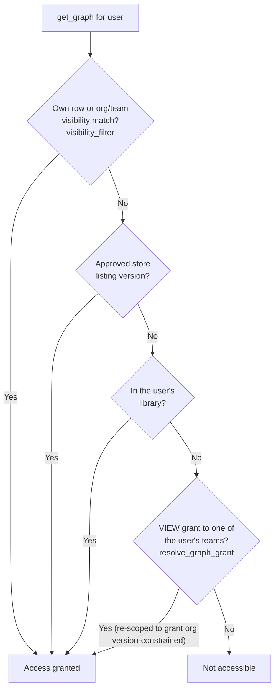

# Resources, Tenancy & Grants

Part of the [Org Access Model reference](org-access-model.md). This page covers
how resources are tenanted, the shared visibility rule every list and fetch
applies, how agents are shared with a team, and the order of checks a request
passes through to view or run a graph.

## Resource tenancy: org-home vs team rows

Every tenant-scoped row carries two fields:

- `organizationId` — which org the row belongs to.
- `teamId` — **nullable**. `NULL` means the row is an **org-home** row (owned
  by the org, not scoped to a subgroup). A non-null `teamId` scopes the row to
  that **team**.

So a resource is in exactly one of three states:

| State | `organizationId` | `teamId` | Who it is exposed to |
| --- | --- | --- | --- |
| Personal / untagged | (personal org, or NULL pre-backfill) | NULL | The owning user only |
| Org-home | set | NULL | Every member of the org |
| Team | set | set | The owner + members of that team |

### Create-time team picking

When a user creates a resource, its `teamId` is chosen with an explicit picker
that wins over the ambient context (illustrated here with `create_new_graph`):

1. **Body parameter wins** — if the create request carries an explicit
   `team_id`, it is validated (`_resolve_write_team_id`: it must be one of the
   user's `ACTIVE` teams in the org) and used. An invalid team is a `400`, not
   a silent downgrade.
2. **Otherwise the header context** — `RequestContext.team_id` (from
   `X-Team-Id`). `None` here means the resource is created as an org-home row.
3. **On update, inherit** — re-saving a graph without a team (e.g. from the
   builder, which sends none) inherits the agent's *current* team rather than
   silently moving a team agent to org-home.

`organizationId` is **always** taken from `RequestContext.org_id` — never from
request input.

## The visibility union

One predicate, `visibility_filter` (`backend/data/tenancy.py`), defines "what
can this user see in this org" so every list and fetch surface applies
identical semantics. It builds a Prisma `OR` clause:



Notes that matter when you reuse this predicate:

- The **team-id list must be the caller's `ACTIVE` memberships** in *this* org.
  `get_user_team_ids(user_id, organization_id)` provides exactly that; do not
  pass a team the user is not an active member of.
- **Untagged rows stay with their owner.** Rows created before org tagging
  (`organizationId = NULL`) remain visible to the owning user so nothing
  disappears mid-migration.
- With **no org context** the filter degrades to plain `userId == me`,
  preserving pre-org behavior for internal callers that never resolve a
  `RequestContext`.
- This module **does not re-verify membership** — `organization_id` must come
  from a membership-verified `RequestContext` or `ExecutionContext`.

## Grants (share-with-team)

A **grant** opens access to a specific agent graph for a **team**, without
moving the graph out of its owner's tenancy. Grants are the mechanism behind
"share this agent with Team B".

### What a grant is

`AgentGraphGrant` rows carry:

| Field | Meaning |
| --- | --- |
| `principalType` | Who the grant is for. **v1 enforces `TEAM` only.** |
| `principalId` | The team id. |
| `capability` | `VIEW` or `EXECUTE`. **EXECUTE implies VIEW.** |
| `agentGraphVersion` | The pinned version. |
| `followLatest` | If true, the grant tracks the graph's active version instead of a pin. |
| `credentialMode` | `CONSUMER` or `OWNER` (see below). |
| `organizationId` | The org the grant lives in. |
| `createdByUserId` | Who created the grant. |

The schema is **deliberately polymorphic** so `USER` / `PERSONA` principals can
ship later without a table migration. Until they do, a non-`TEAM` principal is
a **hard error**, never a silent skip — `resolve_graph_grant` raises
`GrantPrincipalNotSupportedError` if it ever sees one, so a row that bypassed
the API can't quietly change access semantics.

### Version pinning vs. follow-latest

- A **pinned** grant (`followLatest = false`) covers only its
  `agentGraphVersion`. Publishing a new version does not widen the grant.
- A **follow-latest** grant covers any version, but the resolver additionally
  requires the version being accessed to be the graph's **active** version
  (`grant_covers_version` plus an `isActive` / active-version constraint in
  both the view and execute paths). This prevents a follow-latest grant from
  reaching a stale or draft version.

### Credential modes

`credentialMode` records whose credentials a granted run should use:

- **`CONSUMER`** (default) — the grantee runs the agent with **their own**
  resolved credentials.
- **`OWNER`** — intended to run with the **graph owner's** credentials.

> **Enforcement status:** `credentialMode` is currently **stored but not
> enforced**. Nothing in the executor or integration layer branches on it — a
> granted run always resolves the *grantee's* credentials, so an `OWNER`-mode
> grant behaves exactly like `CONSUMER` today. Treat `OWNER` as a
> forward-declared field, not a live capability, until owner-credential
> resolution lands in the executor. (The task premise referenced an in-flight
> `feat/grant-credential-modes` branch; it is not present on origin and carries
> no enforcement diff.)

### Who can share and revoke

Sharing and revoking go through routes gated by **`OrgAction.SHARE_RESOURCES`**
(owner / admin / member) *and* a per-graph check inside `upsert_grant` /
`revoke_grant`:

- The caller must be the **graph's owner** (`graph.userId == caller`) **or an
  org admin/owner** (`sharer_is_org_admin`, derived from the context as
  `is_org_admin or is_org_owner`). Otherwise it is a `NotAuthorizedError`.
- The target team must be in the same org and **not archived**; the graph must
  be in the same org.
- **Re-sharing upserts** — the grant is keyed on
  `(agentGraphId, principalType, principalId)`, so re-sharing a graph to a team
  updates the existing row's pin / capability / mode rather than stacking a
  second grant.
- **Receiving** a grant is not privileged: any org member can list the grants
  shared with the teams they are an active member of (`/grants/received`).

## The access-check chain

To decide whether a user may **view** a graph, `get_graph`
(`backend/data/graph.py`) tries these in order and stops at the first match:



The **grant fallback is the last resort** — it only runs if ownership,
visibility, store, and library all miss. When it fires it re-scopes the lookup
to `grant.organizationId` (so a graph that later changes orgs can't ride an old
grant) and constrains to the active version for follow-latest grants or the
exact version for pins.

**Execution** is checked separately by `validate_graph_execution_permissions`,
which is an **OR** of four independent conditions:

```
user_owns_graph
  OR user_has_in_library
  OR user_has_exec_grant        # EXECUTE grant, same org, version-constrained
  OR is_graph_published_in_marketplace
```

An `EXECUTE` grant satisfies the execute path; a `VIEW` grant does not (EXECUTE
implies VIEW, not the reverse).

## Per-resource access summary

| Resource | Who can read | Who can create / edit | Who can share |
| --- | --- | --- | --- |
| **Agent graph (org-home)** | Every org member | Owner; team rules on save | Owner or org admin (`SHARE_RESOURCES`) |
| **Agent graph (team)** | Owner + that team's members | Owner; `CREATE_AGENTS` / `DELETE_AGENTS` at team level | Owner or org admin |
| **Agent graph (granted)** | Grantee team via VIEW/EXECUTE grant | Grant does not confer edit | Only the graph owner or org admin |
| **Execution** | Team members (`VIEW_EXECUTIONS`) + owner | Anyone who can execute the graph | n/a |
| **Store listing** | Public once approved | `PUBLISH_TO_STORE` (owner/admin/member) | Publishing is the share |

Continue to [Credentials & memory](org-access-model-credentials-and-memory.md).
