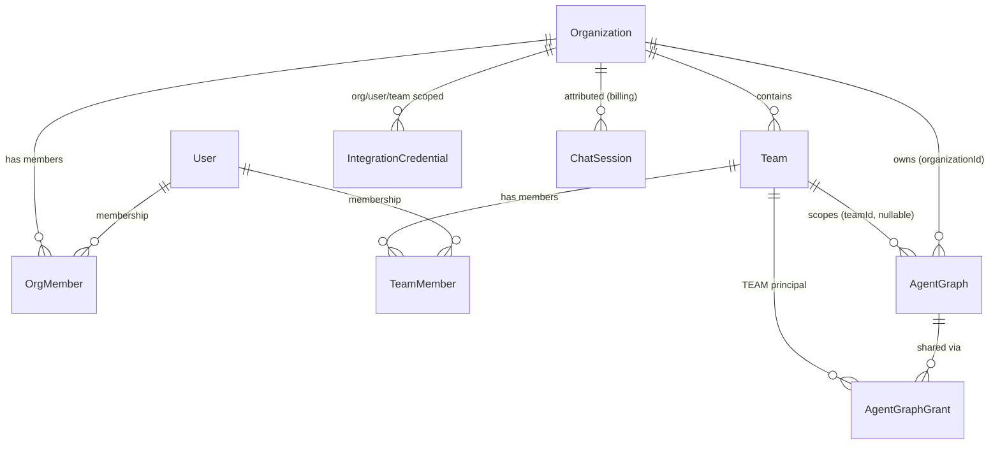

# Org Access Model — Reference

This is the engineering reference for how the AutoGPT Platform decides **who
can see and do what** once organizations and teams are in play. It is written
for people building or reviewing platform code; the language tracks the schema
and the enforcement functions rather than the product UI.

If you want the plain-language version, start with the user guide:
[Organizations & Teams](organizations/organizations-and-teams.md).

The reference is split across four pages:

1. **This page** — entities, the role ladder, permission matrices, and how a
   request's context is resolved.
2. [Resources, tenancy & grants](org-access-model-resources.md) — org-home vs
   team rows, the visibility union, sharing agents with a team, and the access
   check chain.
3. [Credentials & memory](org-access-model-credentials-and-memory.md) —
   credential resolution order and the tiered memory model.
4. [Chats & billing](org-access-model-chats-and-billing.md) — private
   user-owned sessions, org attribution, and role-gated billing.

> The org/team feature set is landing across a series of branches. Where a
> capability is stored but not yet enforced, this reference says so explicitly
> rather than describing the intended end state as if it shipped.

## Entities



- **Organization** — the top-level tenant. Every user has at least one: a
  *personal org* (`isPersonal = true`) bootstrapped at signup, plus any shared
  orgs they belong to.
- **Team** — a subgroup inside an org. In the codebase teams are sometimes
  called *workspaces* (e.g. the `MANAGE_WORKSPACES` / `CREATE_WORKSPACES` org
  actions and the `is_team_*` flags refer to the same `Team` model). This
  reference uses **team**.
- **OrgMember** — a user's membership in an org, carrying `status`
  (`ACTIVE` / …) and three role booleans: `isOwner`, `isAdmin`,
  `isBillingManager`.
- **TeamMember** — a user's membership in a team, carrying `status` and two
  role booleans: `isAdmin`, `isBillingManager`.
- **Resources** — agent graphs, executions, chat sessions, credentials, store
  listings, and API keys carry `organizationId` and (where team-scoped) a
  nullable `teamId`.

## The role ladder

Roles are booleans, not a single enum, so a member can hold more than one at
once. At the **org** level the meaningful states form this ladder:

| State | Flags set | What it means |
| --- | --- | --- |
| **Member** | *(none)* | An ordinary member of the org. |
| **Billing manager** | `isBillingManager` | Finance only — *not* a general member. |
| **Admin** | `isAdmin` | Full operational control; also counts as a member. |
| **Admin & billing** | `isAdmin` + `isBillingManager` | Admin plus finance. |
| **Owner** | `isOwner` | Exactly one per org; can do everything, incl. delete. |

Two subtleties that the enforcement code (`permissions.py`) bakes in:

- **Owner and Admin also count as "member"** — anything a member can do, they
  can do.
- **A pure Billing manager does _not_ count as a member.** Holding only
  `isBillingManager` grants the finance-related actions and nothing else — no
  creating resources, no sharing, no publishing. "Admin & billing" gets member
  capabilities because of the `isAdmin` half, not the billing half.

### Org permission matrix

Derived from `_ORG_PERMISSIONS` in
`autogpt_libs/auth/permissions.py`. Columns are the role a user holds on its
own; **Admin & billing** is simply the union of the Admin and Billing-manager
columns.

| Org action | Owner | Admin | Billing manager | Member |
| --- | :---: | :---: | :---: | :---: |
| `VIEW_ORG` | ✓ | ✓ | ✓ | ✓ |
| `CREATE_RESOURCES` | ✓ | ✓ | – | ✓ |
| `SHARE_RESOURCES` | ✓ | ✓ | – | ✓ |
| `PUBLISH_TO_STORE` | ✓ | ✓ | – | ✓ |
| `CREATE_WORKSPACES` (teams) | ✓ | ✓ | ✓ | – |
| `MANAGE_WORKSPACES` (teams) | ✓ | ✓ | – | – |
| `MANAGE_MEMBERS` | ✓ | ✓ | – | – |
| `TRANSFER_RESOURCES` | ✓ | ✓ | – | – |
| `RENAME_ORG` | ✓ | ✓ | – | – |
| `MANAGE_BILLING` | ✓ | – | ✓ | – |
| `DELETE_ORG` | ✓ | – | – | – |

### Team permission matrix

Derived from `_TEAM_PERMISSIONS`. Team checks additionally require the request
to actually carry a team (`team_id is not None`). As at the org level, a Team
admin also counts as a Team member, and a pure Team billing manager does not.

| Team action | Team admin | Team billing manager | Team member |
| --- | :---: | :---: | :---: |
| `CREATE_AGENTS` | ✓ | – | ✓ |
| `USE_CREDENTIALS` | ✓ | – | ✓ |
| `VIEW_EXECUTIONS` | ✓ | – | ✓ |
| `VIEW_SPEND` | ✓ | ✓ | – |
| `MANAGE_MEMBERS` | ✓ | – | – |
| `MANAGE_SETTINGS` | ✓ | – | – |
| `MANAGE_CREDENTIALS` | ✓ | – | – |
| `DELETE_AGENTS` | ✓ | – | – |

## Request context

Every authenticated request resolves a **`RequestContext`** — a frozen
dataclass (`autogpt_libs/auth/models.py`) that is the single source of truth
for the caller's tenancy and roles:

```python
@dataclass(frozen=True)
class RequestContext:
    user_id: str
    org_id: str
    team_id: str | None          # None = org-home context
    is_org_owner: bool
    is_org_admin: bool
    is_org_billing_manager: bool
    is_team_admin: bool
    is_team_billing_manager: bool
    seat_status: str             # ACTIVE, INACTIVE, PENDING, NONE
```

`get_request_context` (`autogpt_libs/auth/dependencies.py`) builds it per
request:

- **Org selection** — reads the `X-Org-Id` header. With no header it falls back
  to the caller's **personal org** (the org they own with `isPersonal = true`),
  self-healing by bootstrapping one if it is somehow missing.
- **Membership is verified, not trusted** — the selected org must have an
  `ACTIVE` `OrgMember` row for the user and must not be soft-deleted, or the
  request is rejected (`403`). The role flags are copied from that row.
- **Team selection** — reads the `X-Team-Id` header. If present it is validated
  (an `ACTIVE` `TeamMember` whose team belongs to the selected org). **A bad or
  stale team header is not fatal**: it is silently dropped to `team_id = None`
  (org-home context), mirroring how the rest of the system degrades to
  org-home.
- **`seat_status`** is carried on the context for the seat/subscription
  workstream. Seat *enforcement* is deliberately deferred, so today the
  resolver stamps `ACTIVE` once membership is validated.

Everything downstream — visibility filters, permission checks, credential
resolution, memory tiers — reads `org_id`, `team_id`, and the role flags off
this already-verified context. Modules like `tenancy.py` explicitly document
that they do **not** re-verify membership; they trust the `RequestContext`
(or an equally trusted `ExecutionContext`) to have done it.

## Who can see this agent?

Resource visibility follows the row's **tenancy** — whether it is an *org-home*
row (no team) or a *team* row — and grants can extend it to another team without
moving the row. The animation below walks the three states; the mechanics are
on the [resources page](org-access-model-resources.md).



## Who can access what — index

| Resource class | Tenancy | Read scope | Write / share control |
| --- | --- | --- | --- |
| **Agent graphs** | `organizationId` + nullable `teamId` | Owner, org-home → all members, team row → that team, plus [grants](org-access-model-resources.md#grants-share-with-team) | Owner or org admin shares; creator/team rules to edit |
| **Executions** | inherit graph's org/team | Team members (`VIEW_EXECUTIONS`) and owner | Runs charge the org pool with team attribution |
| **Credentials** | `USER` / `TEAM` / `ORG` scope | [Resolution order](org-access-model-credentials-and-memory.md#credential-resolution) USER → TEAM → ORG | Team admins manage team creds; creator/org-admin revoke |
| **Memory** | personal / team / org graphs | [Tier fan-out](org-access-model-credentials-and-memory.md#memory-tiers) by active membership | Governed writes; admin direct, member held |
| **Chat sessions** | user-owned, org-attributed | **Private to the owner** | Attribution only; membership re-checked per turn |
| **Store listings** | org-ownable | Approved listings are public | `PUBLISH_TO_STORE` (owner/admin/member) |
| **Billing** | org pool | `VIEW_SPEND` / `MANAGE_BILLING` | Owner / billing manager only |

Each row links to the page where its rules are spelled out precisely.
