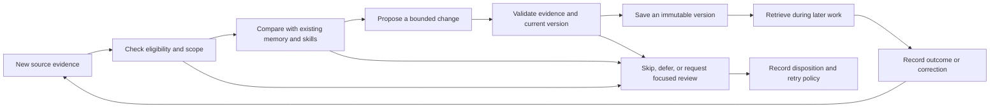

# Proposal: learning that improves the next job

Status: design proposal for discussion; no runtime behavior or configuration is changed by this PR.

AutoPilot and Experts should remember useful facts and improve reusable procedures through normal work. A user should be able to see **what changed, where it came from, where it applies, and whether it helped**. Creating a file is not evidence that the agent has become better at its job.

The recommendation is a general nightly learning stage integrated with the existing memory system. During work we collect evidence cheaply; overnight we consolidate eligible evidence into scoped memories and versioned skills. Sources with an approval lifecycle contribute only an approved revision. Ordinary conversations do not need an approval workflow to benefit.

## What already exists

Inspected against `dev` at `977d605432` on September 14, 2026:

- [Graphiti ingestion](../../../autogpt_platform/backend/backend/copilot/graphiti/ingest.py) records conversation episodes and distinguishes assistant-derived findings. [Memory namespaces](../../../autogpt_platform/backend/backend/copilot/graphiti/client.py) separate AutoPilot and Expert memory.
- [Skills](../../../autogpt_platform/backend/backend/copilot/tools/skills.py) already support discovery, reading, writing, validation, workspace persistence, and Expert ownership. [The prompt](../../../autogpt_platform/backend/backend/copilot/prompting.py) asks agents to save reusable procedures proactively.
- [The nightly pipeline](../../../autogpt_platform/backend/backend/copilot/dream/nightly_batch.py) and [schedule registration](../../../autogpt_platform/backend/backend/copilot/dream/scheduling.py) provide a place for background learning. Model routing, usage accounting, and memory administration also exist.

The missing product is a dependable learning lifecycle: deciding what is eligible, checking evidence, updating the right skill, recording the result, making it available to later work, and measuring reuse. Prompting an agent to remember occasionally is useful, but cannot be the only trigger.

## The default experience

An Expert fixes a recurring CSV import failure. Its first attempt fails; a different encoding and a validation step succeed. The conversation contains the actual tool outputs and a checked sample import.

1. The work continues normally. Recording an eligible source never blocks the reply.
2. That night, learning compares the successful method with the Expert's existing import skill. It updates that skill instead of creating another generic import guide.
3. The next morning, the Expert's existing Memory/Skills area says: **“Updated CSV import checks · Saved overnight · Worked once in the source.”** It links to a short explanation, the change, and the evidence.
4. On a later matching job, the Expert loads the relevant version. A compact **“Skill loaded: CSV import checks v3 · Updated overnight”** chip links to the change. Its application outcome is recorded separately from loading, and only a concrete check or explicit user confirmation can establish success.
5. The user can correct, restore, or stop using that version. A correction becomes evidence for the next review; it does not silently rewrite the user’s instructions.

A clean night produces no notification. A failed review is shown as a failed review, never as “nothing new to learn.”

## Memory and skills have different jobs

| Record          | What belongs in it                                                                                            | How it is used                                                                          |
| --------------- | ------------------------------------------------------------------------------------------------------------- | --------------------------------------------------------------------------------------- |
| Memory          | Explicit preferences, environment facts, project constraints, observations, tentative findings                | Retrieve a small relevant set with provenance and scope                                 |
| Skill           | A reusable method: when to use it, prerequisites, steps, verification, failure/recovery guidance              | Discover from a compact index; load the procedure when relevant                         |
| Evidence        | The immutable source span, artifact revision, tool result, correction, or accepted outcome supporting a claim | Explain and validate learning; do not inject the entire archive into every conversation |
| Learning record | What a review considered, applied, skipped, or deferred, with its reason and cost                             | Drive history, retry behavior, review controls, and measurement                         |

A skill can reference memory, but a graph fact must not become the canonical store for an ordered procedure. The existing workspace skill registry remains the content surface. The memory system links the evidence, ownership, applicability, and later outcomes.

## Eligibility: capture now, learn from the right evidence

Capture references to source changes, not an LLM-written lesson after every tool call. A nightly worker resolves a bounded set of new source revisions and checks eligibility again before applying a change.

| Source situation                                               | Default treatment                                                           |
| -------------------------------------------------------------- | --------------------------------------------------------------------------- |
| A completed procedure with recorded verification               | Eligible for a narrowly scoped skill or improvement                         |
| A failed attempt followed by an observed working recovery      | Eligible for the recovery and its limits; exclude failed instructions       |
| An explicit user preference or correction                      | Record as scoped memory; a procedural change still needs supporting context |
| A plan, an unanswered question, or an unsupported “done” claim | Do not promote it into an executable recipe                                 |
| An integration requiring review of a result                    | Wait for an approved immutable revision; exclude subsequent unapproved work |
| A repeated one-off lookup or an already covered procedure      | Record a reuse signal or skip; do not create a duplicate skill              |
| An explicit “learn this” request                               | Run the same validation immediately; label its origin as requested          |
| A deleted, excluded, or inaccessible source                    | Do not read it or recreate its learning from an older queue entry           |

**Acceptance is eligibility, not verification of every claim.** An explicit acceptance of a writing, research, or review deliverable can support the procedure that produced that artifact, labeled **“Result accepted once.”** It does not establish that the artifact's factual conclusions are true or that described actions occurred. Approval of an architecture document can support its document-production method, while never manufacturing evidence that a physical device was built or tested. Preserve stated uncertainties as skill limits.

A long conversation can contain several independent procedures. Use explicit source spans and outcomes rather than treating the whole conversation as either successful or failed. An approval-aware source defines which spans are eligible; the learner cannot infer approval from prose or from an idle session.

## Nightly review and publication

Recommended starting policy: one timezone-aware nightly job, initially at 03:00 in the owner's configured timezone (organization timezone, then UTC, as explicit fallbacks), with a capped catch-up run after downtime. Processing is fair across active Experts and bounded by source volume, model budget, and changes per night. These values are tuning defaults, not a promise to write a quota of skills.

The worker should:

1. Resolve the owner, current access, source revision, and any approval boundary.
2. Gather the minimum useful evidence and relevant existing skill bodies. Retain identifiers for material omitted by the context budget; do not claim to have reviewed it.
3. Prefer one clear improvement to an existing skill. Create a new skill only when its trigger and procedure are meaningfully distinct.
4. Check that the proposed steps are supported, prerequisites are stated, verification is concrete, and private values are replaced with appropriate inputs. An external document is evidence to assess, not an instruction to the learner. A partially reviewed source is deferred unless the reviewed span is self-contained and sufficient for the narrowly claimed procedure.
5. Apply a routine change only within the same authorized scope and when the expected prior version still matches. A concurrent human edit produces a conflict, not an overwrite.
6. Record the exact applied version, sources, origin, outcome, and usage. Advance the source cursor only after a durable disposition.

Routine supported learning should be automatic. New agent-authored skills, including those explicitly requested by a user, default to **Automatic improvements: On**. A human edit preserves that version and makes later automated changes proposals by default; the editor sees this rule and can explicitly keep automatic improvements enabled. Imported or manually authored skills default to review. No section-level provenance engine is required for the first release.

Human review otherwise handles a concrete unresolved conflict or a proposed wider audience. Keep at most one open proposal per skill; further evidence updates that proposal without losing a user's draft decision. Put open decisions in one filtered list across Experts. A decision on one skill never blocks improvements elsewhere. Offer a one-action way to re-enable automatic improvements for that skill. A proposal whose base version or eligibility expires becomes a recorded stale disposition; it is not kept as an actionable decision indefinitely. Cap unpromoted candidates per Expert, coalesce revisions of the same source, and record an honest skip when no usable procedure emerges. Uncertain methods must not fill an approval inbox merely because a reviewer model can write plausible instructions.

Learning changes knowledge. It does not change the agent's tools, credentials, permissions, or authorization to execute a procedure. Pausing learning also leaves ordinary work available.

## States that tell the truth

Keep operational state and evidence separate. Avoid a single confidence percentage or an “Expert level” score.

| User-facing state        | Meaning                                                           | Primary action                                     |
| ------------------------ | ----------------------------------------------------------------- | -------------------------------------------------- |
| Candidate                | Something may be reusable; it is not available as an active skill | See reason and source                              |
| Waiting for approval     | A source revision is not yet eligible                             | Open the source's existing review                  |
| Ready to use             | The stored procedure passed the applicable checks                 | View skill and evidence                            |
| Blocked by content check | A proposed save failed a content check                            | See pattern class and affected step; fix the input |
| Needs your decision      | A specific conflict prevents this proposed change                 | Compare and decide                                 |
| Paused                   | Future use or future learning was paused, clearly named           | Resume that behavior                               |
| Archived                 | Retained in history but excluded from ordinary retrieval          | Restore                                            |

Evidence labels are concrete: **“Worked once in the source,” “Passed checks in 3 later uses,” “Not yet reused,”** or **“Outcome unknown.”** Every outcome is attached to the exact version used. Loading a skill increments a load event, not a success count. An accepted source may display **“Source approved”** alongside its separate verification evidence.

A qualifying check is an independently inspectable result, such as passing tests, a checked import count, a verified artifact property, or an explicit user confirmation of the real-world outcome. An assistant-written “success” summary, another model agreeing, or a file existing is insufficient. Define the check and its limits for each procedure. If the system only knows the skill was selected or loaded, show that; do not claim it was followed successfully.

Origin is always visible in details: **Requested by [actor]**, **Saved during work**, **Saved overnight**, or **Edited by [actor]**. Resolve “you” only when the viewer is the actor. Imported skills keep their own provenance. A saved version is not reported as an applied improvement until persistence succeeds.

## Where people see and control learning

Extend the existing Memory and Expert skill surfaces. Avoid another top-level destination for the same knowledge.

- **Expert summary:** relevant memories and skills, plus a compact recent-change line. Zero new skills can be a good result; do not turn counts into a progress bar.
- **Memory/Skills history:** filter by Expert, project, origin, and state. Show a plain explanation such as “Added an encoding check after the previous import failed.”
- **In conversation:** a once-per-version “Skill loaded” chip shows version and origin when a skill enters the working context. This is not a success claim. Start here and in existing history; defer a separate morning digest until its value is established.
- **Skill detail:** what it does, when it applies, current version, evidence and limits, source links, and observed reuse. A source the viewer can no longer access must not leak through a title, preview, or cached diff.
- **Review:** one specific decision with the current behavior, proposed behavior, and reason. “Keep current,” “Apply change,” or an edited alternative; no generic “approve learning” button.

On mobile, tapping a learning row opens the existing full-height detail sheet. Summary comes first; Changes, Sources, and History are secondary views. Show a readable before/after change before offering the raw Markdown diff. Keep the primary action in a sticky bar, group before/after changes by procedure step, preserve scroll position and draft edits when returning from evidence or dismissing the sheet, and make all controls available by tap and keyboard. A tooltip or hover-only checkmark cannot carry required meaning.

Use separate labels for **Pause learning** (available for an Expert or a particular skill) and **Stop using this skill**. Pausing one must not silently pause the other. **Edit skill** applies the user's correction immediately; **Report an outcome** adds evidence for a later review. Make that difference explicit next to those actions.

## Ownership, freshness, and recovery

**Scope.** User preferences default to the speaking user's personal scope, not a shared Expert's instructions. Environment or procedure facts may be Expert-scoped when the source supports that scope; project-specific facts stay in their project. Record the chosen scope and its reason. Retain current Expert ownership. A lesson learned by one Expert does not automatically become an organization-wide instruction. Candidate scope cannot exceed the intersection of its source permissions. Cross-Expert reuse or promotion uses existing explicit sharing rules and names the receiving audience.

**Freshness.** Refresh the relevant index revision at each user turn and before a scheduled execution begins. Do not require a new chat to discover an overnight update. Pin the loaded version for its tool-call sequence. An ordinary update or restoration is offered at the next sequence boundary, without changing a step mid-execution. Access loss, withdrawn approval, or an explicit stop-use instruction invalidates the old version before another step; the conversation can replan using its normal authorized tools. The runtime cannot erase text already seen by the model. It must surface invalidation, prevent the next step from continuing under the invalid version, and record **“Stopped mid-use.”** Normal authorized tools remain available for replanning; no tool catalog is removed.

**Undo.** Restore the prior current version and invalidate retrieval caches. Preserve the audit event; never silently undo subsequent human edits. If intervening changes exist, offer a comparison and a new restoration version. Explain that rollback affects future use and cannot undo actions already taken.

**Deletion and exclusion.** “Exclude this source from learning” removes it from future eligibility, including queued jobs. Record the scope and actor: an Expert owner excludes a source for that Expert, while ordinary user preferences remain personal. General multi-editor exclusion policy is outside the first release; sharing a skill does not confer permission to change its owner's learning policy.

Removing a learned change needs a suppression record primarily identifying the normalized proposed behavior and its scope, with evidence fingerprints retained for audit. A paraphrase or trivially different source cannot evade suppression. Genuinely new evidence supporting the same or equivalent behavior can only create a clearly labeled proposal, never silently restore it; uncertain equivalence also requires review. User edit or suppression does not erase the factual audit of earlier use.

Every version lists its contributing source revisions. Descendant versions, including human edits, inherit their base version's dependencies until independently re-authored from permitted evidence. Revocation or erasure makes dependent versions and descendants unavailable; notify affected editors and offer a new independently supported version, not a button that simply discards provenance. When invalidating a version, restore a prior eligible version when one exists, otherwise pause with an explanation. Do not attempt unsupported per-line forgetting. Present the affected versions and independently supported alternatives before erasure. Tombstones retain only the minimum non-content identifiers needed to prevent replay; the erasure path removes source excerpts from bodies, snapshots, and cached diffs. A bespoke selective-forgetting picker is deferred.

**Protected content.** Respect each skill's explicit automatic-improvement setting and existing access controls. Automated maintenance cannot silently replace a human-controlled version. Do not automatically delete or archive a skill because it has not been used recently.

**Content checks.** Reject known credential patterns and seeded secret values before a generated version can become ready. Validate the full skill bundle, including references and snippets, rather than only its title or main body. Private environment details should usually be scoped memory references or typed configuration inputs, not values generalized into a reusable recipe. A failed check yields **“Blocked by content check”** with the pattern class and affected step, never the matched secret. Offer conversion to a typed input or an audited, scoped allowance for a legitimate non-secret false positive. The same save checks apply to immediate human edits, which otherwise take effect immediately. A model's attempted redaction alone is insufficient; use deterministic checks plus an evidence-aware review, with narrowly scoped exceptions for legitimate non-secret configuration. Keep protected source material behind its original access check.

**Retrieval invariants.** Candidate, waiting, paused, and archived versions are never returned as active procedures. Every ready version has supporting evidence that still exists and is accessible to its authorized owner. A viewer who lacks access sees **“Evidence not visible to you”** with no leaked title or snippet; that alone does not pause the skill for other authorized users. If the owner loses access or the supporting evidence ceases to exist, pause the dependent version and explain why. Version numbers are monotonic; restoration creates a new version referring to the prior content.

## Tie it into the existing memory system

Add skill distillation as an independently gated stage using the existing nightly scheduling, model routing, usage accounting, and administration patterns. Enabling skill learning should not implicitly enable every other experimental memory stage. A memory service failure must not change a foreground conversation's capabilities.

Suggested responsibilities:

| Existing area               | Responsibility                                                                                |
| --------------------------- | --------------------------------------------------------------------------------------------- |
| Chat and workflow producers | Emit immutable evidence references and explicit completion/approval updates                   |
| Memory ingestion            | Store scoped facts and evidence links, preserving asserted versus derived provenance          |
| Nightly orchestration       | Select eligible new work, enforce budget and leases, invoke review, record outcomes           |
| Skill registry              | Validate content, preserve ownership, store versions, resolve the current version             |
| Retrieval                   | Select relevant skills, respect access and exclusions, pin versions, record load/use outcomes |
| Memory and Expert UI        | Explain changes, evidence, review decisions, errors, and recovery                             |

A generic source contract should carry an owner/scope, source ID and revision, bounded evidence references, outcome and verification signals, eligibility state, and an approval checkpoint when required. The checkpoint includes the accepting actor and event ID. It also exposes a live `revalidate(source_id, revision, scope, approval_event_id)` operation returning current eligibility and its version/epoch. Publication must be conditional on that fresh eligibility precondition as well as the expected skill version; a static approved flag in a queued payload is insufficient. Revocation must also invalidate already-published dependent versions and retrieval caches. Source-specific lifecycle rules stay in their adapters. The general learner must not import an application's work-item schema or infer eligibility by searching text.

Use a durable review ledger keyed by source revision, policy version, and proposed change fingerprint. Leases prevent concurrent processing; compare-and-swap on skill versions prevents lost edits. Write completion and the processed marker need an atomic boundary or recoverable outbox. After a partial failure, retry unapplied changes rather than repeating completed writes. Provider errors, stale approval, no novel procedure, exhausted budget, and inaccessible evidence are different dispositions.

Start with the platform's normal model-routing and cost-accounting mechanisms. Choose the reviewer model through evaluation, not a hardcoded premium model. Idle accounts should incur no review-model calls. Operators can inspect cost, retry state, oldest eligible evidence, last successful run, and why a source was skipped.

## Hermes ideas to adapt

Research checked September 14, 2026. The following are documented Hermes mechanisms; the proposal above is an adaptation for a hosted multi-Expert product.

| Hermes source                                                                                         | Useful idea                                                                                                   | Adaptation                                                                                  |
| ----------------------------------------------------------------------------------------------------- | ------------------------------------------------------------------------------------------------------------- | ------------------------------------------------------------------------------------------- |
| [Memory and background review](https://hermes-agent.nousresearch.com/docs/user-guide/features/memory) | A real background review complements prompting; changes can be surfaced separately from ordinary conversation | Durable nightly processing and truthful, quiet change summaries                             |
| [Skills](https://hermes-agent.nousresearch.com/docs/user-guide/features/skills)                       | Load procedures on demand, improve existing procedures, and support change review                             | Reuse the existing registry, version updates, and scope-aware retrieval                     |
| [Curator](https://hermes-agent.nousresearch.com/docs/user-guide/features/curator)                     | Keep maintenance history, restoration, and usage information                                                  | Auditable recovery and measured reuse; no automatic age-based deletion in the first release |

Keep AutoGPT's existing memory/skill ownership and permissions. Hermes's local profile, filesystem, and CLI interaction model is not the product model to transplant.

## A trustworthy first release

Ship one complete vertical slice: a verified procedure from an eligible conversation becomes an evidence-linked skill update, is discovered by the correct Expert in a later conversation, and can be inspected and restored by the user.

Include durable nightly scheduling; ordinary-chat eligibility and explicit learning requests; the generic approval-aware source contract with contract tests; Expert scope; create/update/skip decisions; version history; source links; the conversation chip and existing detail sheet; current-chat freshness; pause/exclusion/restore; and usage/cost instrumentation. Additional source adapters can ship independently.

Defer a separate morning digest, a review-every-change setting, per-section edit protection, selective forget cascades, automatic sharing between Experts, broad skill merges or renames, age-based archiving, speculative proactive work, gamified learning scores, and unattended execution of newly written recipes solely to try them out. Following a relevant skill during work the user already authorized remains normal behavior. Introduce them only after the basic loop demonstrates better outcomes.

## Acceptance scenarios and release evidence

| Scenario                                                 | Required result                                                                          |
| -------------------------------------------------------- | ---------------------------------------------------------------------------------------- |
| A verified procedure is repeated                         | Improve or reuse the existing skill; no duplicate                                        |
| A result awaits approval                                 | No skill is promoted from that revision                                                  |
| A source is accepted, then revised                       | Only the approved snapshot is eligible                                                   |
| An accepted document describes an unbuilt system         | No invented evidence of building or testing                                              |
| A user corrects one project-specific preference          | Correct that scope; do not globalize it                                                  |
| A source is excluded while its review is running         | Apply rechecks eligibility and refuses the stale proposal                                |
| Two reviews or a human edit race                         | No lost update; history shows the conflict or reuse                                      |
| A worker crashes after one successful write              | Retry completes remaining work without duplicating the first                             |
| A provider fails or the budget is exhausted              | Foreground work continues; the learning run has an honest status                         |
| A skill is loaded but never followed                     | No successful-use event is claimed                                                       |
| An existing conversation starts new work after an update | It discovers the relevant current version                                                |
| A source becomes inaccessible                            | No content or source title leaks through history or retrieval                            |
| A change is undone and the next nightly job runs         | The same unwanted change is not silently reapplied                                       |
| A mobile user opens evidence and returns                 | Their place, selection, and unsent review edits remain intact                            |
| Approval is withdrawn after publication                  | Dependent versions become unavailable; retries cannot promote them again                 |
| A tool output contains a seeded credential               | No value appears in the skill, references, logs, or previews                             |
| A user edits a skill                                     | The edit is immediate and later automated updates honor the visible improvement setting  |
| A version is undone during another run                   | Its current step is stable; subsequent use respects restoration and revocation semantics |
| A user opens skill detail from chat                      | The chip, detail, and outcome all refer to the exact loaded version                      |
| The app returns after several missed nights              | Catch-up is capped, timezone-aware, and does not apply stale proposals                   |
| A keyboard user reviews a change                         | Every control and source view is reachable without hover or pointer input                |
| A pending decision receives new evidence                 | One proposal is updated; unsent user edits remain intact                                 |
| No new eligible work exists                              | No model call and no notification                                                        |

Validate on a fixed corpus of successful work, failed attempts, plans, corrections, and ambiguous outcomes. Then use held-out procedures with deterministic checks where possible, and explicit human adjudication where necessary, to compare later runs with and without the learned version: task success, repeated corrections, tool failures, unsupported steps, duplicate creation, cost, and user reversions. A skill count or an LLM confidence score is not a launch criterion. Release requires demonstrated useful reuse and no approval/scope violations in the regression corpus.

## Additional edge cases to verify

- A source is withdrawn after a human has edited a derived skill: both dependent versions become unavailable; an older independent version can be restored.
- A benign high-entropy identifier triggers a content check: remediation is understandable and the diagnostic never reveals a real seeded secret.
- A recipient accepts a research memo: the artifact-production method can become eligible, while the memo's unverified conclusions do not become verified facts.
- A user with several Experts sees one list of open decisions; unrelated automatic learning continues.
- A user loses access to an evidence link but the skill's authorized owner retains it: the UI hides the evidence without incorrectly pausing the skill globally.
- A near-identical behavior is proposed from a newly coalesced source after undo: it requires explicit review rather than silently reappearing.

## Decisions for design review

Confirm the proposed automatic-improvement default, procedure-specific evidence checks, and the detail-sheet interactions with users. The first implementation should prove the full capture-to-reuse-to-restore path on a small corpus before choosing broader sharing or maintenance features.
