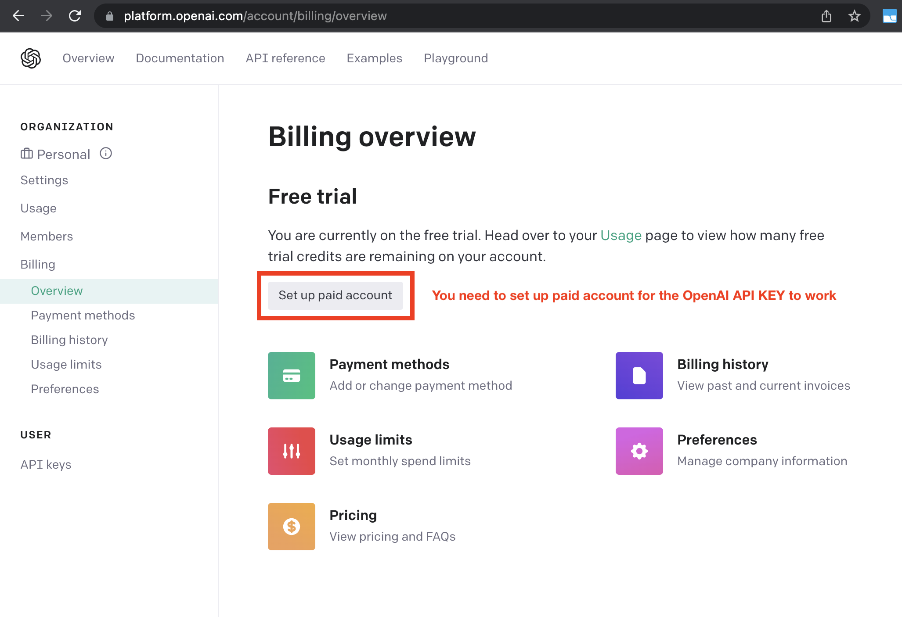

# Setting up Auto-GPT

## 📋 Requirements

Choose an environment to run Auto-GPT in (pick one):

  - [Docker](https://docs.docker.com/get-docker/) (*recommended*)
  - Python 3.10 or later (instructions: [for Windows](https://www.tutorialspoint.com/how-to-install-python-in-windows))
  - [VSCode + devcontainer](https://marketplace.visualstudio.com/items?itemName=ms-vscode-remote.remote-containers)


## 🗝️ Getting an API key

Get your OpenAI API key from: [https://platform.openai.com/account/api-keys](https://platform.openai.com/account/api-keys).

!!! attention
    To use the OpenAI API with Auto-GPT, we strongly recommend **setting up billing**
    (AKA paid account). Free accounts are [limited][openai/api limits] to 3 API calls per
    minute, which can cause the application to crash.

    You can set up a paid account at [Manage account > Billing > Overview](https://platform.openai.com/account/billing/overview).

[openai/api limits]: https://platform.openai.com/docs/guides/rate-limits/overview#:~:text=Free%20trial%20users,RPM%0A40%2C000%20TPM

!!! important
    It's highly recommended that you keep track of your API costs on [the Usage page](https://platform.openai.com/account/usage).
    You can also set limits on how much you spend on [the Usage limits page](https://platform.openai.com/account/billing/limits).




## Setting up Auto-GPT

### Set up with Docker

1. Make sure you have Docker installed, see [requirements](#requirements)
2. Pull the latest image from [Docker Hub]

        :::shell
        docker pull significantgravitas/auto-gpt

3. Create a folder for Auto-GPT
4. In the folder, create a file called `docker-compose.yml` with the following contents:

        :::yaml
        version: "3.9"
        services:
          auto-gpt:
            image: significantgravitas/auto-gpt
            depends_on:
              - redis
            env_file:
              - .env
            environment:
              MEMORY_BACKEND: ${MEMORY_BACKEND:-redis}
              REDIS_HOST: ${REDIS_HOST:-redis}
            profiles: ["exclude-from-up"]
            volumes:
              - ./auto_gpt_workspace:/app/autogpt/auto_gpt_workspace
              - ./data:/app/data
              ## allow auto-gpt to write logs to disk
              - ./logs:/app/logs
              ## uncomment following lines if you have / want to make use of these files
              #- ./azure.yaml:/app/azure.yaml
              #- ./ai_settings.yaml:/app/ai_settings.yaml
          redis:
            image: "redis/redis-stack-server:latest"

5. Create the necessary [configuration](#configuration) files. If needed, you can find
    templates in the [repository].
6. Continue to [Run with Docker](#run-with-docker)

!!! note "Docker only supports headless browsing"
    Auto-GPT uses a browser in headless mode by default: `HEADLESS_BROWSER=True`.
    Please do not change this setting in combination with Docker, or Auto-GPT will crash.

[Docker Hub]: https://hub.docker.com/r/significantgravitas/auto-gpt
[repository]: https://github.com/Significant-Gravitas/Auto-GPT


### Set up with Git

!!! important
    Make sure you have [Git](https://git-scm.com/downloads) installed for your OS.

!!! info "Executing commands"
    To execute the given commands, open a CMD, Bash, or Powershell window.  
    On Windows: press ++win+x++ and pick *Terminal*, or ++win+r++ and enter `cmd`

1. Clone the repository

        :::shell
        git clone -b stable https://github.com/Significant-Gravitas/Auto-GPT.git

2. Navigate to the directory where you downloaded the repository

        :::shell
        cd Auto-GPT


### Set up without Git/Docker

!!! warning
    We recommend to use Git or Docker, to make updating easier.

1. Download `Source code (zip)` from the [latest stable release](https://github.com/Significant-Gravitas/Auto-GPT/releases/latest)
2. Extract the zip-file into a folder


### Configuration

1. Find the file named `.env.template` in the main `Auto-GPT` folder. This file may
    be hidden by default in some operating systems due to the dot prefix. To reveal
    hidden files, follow the instructions for your specific operating system:
    [Windows][show hidden files/Windows], [macOS][show hidden files/macOS].
2. Create a copy of `.env.template` and call it `.env`;
    if you're already in a command prompt/terminal window: `cp .env.template .env`.
3. Open the `.env` file in a text editor.
4. Find the line that says `OPENAI_API_KEY=`.
5. After the `=`, enter your unique OpenAI API Key *without any quotes or spaces*.
6. Enter any other API keys or tokens for services you would like to use.

    !!! note
        To activate and adjust a setting, remove the `# ` prefix.

7. Save and close the `.env` file.

!!! info "Using a GPT Azure-instance"
    If you want to use GPT on an Azure instance, set `USE_AZURE` to `True` and
    make an Azure configuration file:

    - Rename `azure.yaml.template` to `azure.yaml` and provide the relevant `azure_api_base`, `azure_api_version` and all the deployment IDs for the relevant models in the `azure_model_map` section:
        - `fast_llm_model_deployment_id`: your gpt-3.5-turbo or gpt-4 deployment ID
        - `smart_llm_model_deployment_id`: your gpt-4 deployment ID
        - `embedding_model_deployment_id`: your text-embedding-ada-002 v2 deployment ID

    Example:

        :::yaml
        # Please specify all of these values as double-quoted strings
        # Replace string in angled brackets (<>) to your own ID
        azure_model_map:
            fast_llm_model_deployment_id: "<my-fast-llm-deployment-id>"
                ...

    Details can be found in the [openai-python docs], and in the [Azure OpenAI docs] for the embedding model.
    If you're on Windows you may need to install an [MSVC library](https://learn.microsoft.com/en-us/cpp/windows/latest-supported-vc-redist?view=msvc-170).

[show hidden files/Windows]: https://support.microsoft.com/en-us/windows/view-hidden-files-and-folders-in-windows-97fbc472-c603-9d90-91d0-1166d1d9f4b5
[show hidden files/macOS]: https://www.pcmag.com/how-to/how-to-access-your-macs-hidden-files
[openai-python docs]: https://github.com/openai/openai-python#microsoft-azure-endpoints
[Azure OpenAI docs]: https://learn.microsoft.com/en-us/azure/cognitive-services/openai/tutorials/embeddings?tabs=command-line


## Running Auto-GPT

### Run with Docker

Easiest is to use `docker-compose`. 

Important: Docker Compose version 1.29.0 or later is required to use version 3.9 of the Compose file format.
You can check the version of Docker Compose installed on your system by running the following command:

	docker-compose version

This will display the version of Docker Compose that is currently installed on your system.

If you need to upgrade Docker Compose to a newer version, you can follow the installation instructions in the Docker documentation: https://docs.docker.com/compose/install/

Once you have a recent version of docker-compose, run the commands below in your Auto-GPT folder.

1. Build the image. If you have pulled the image from Docker Hub, skip this step.

        :::shell
        docker-compose build auto-gpt

2. Run Auto-GPT

        :::shell
        docker-compose run --rm auto-gpt

    By default, this will also start and attach a Redis memory backend. If you do not
    want this, comment or remove the `depends: - redis` and `redis:` sections from
    `docker-compose.yml`.

    For related settings, see [Memory > Redis setup](./configuration/memory.md#redis-setup).

You can pass extra arguments, e.g. running with `--gpt3only` and `--continuous`:
``` shell
docker-compose run --rm auto-gpt --gpt3only --continuous
```

If you dare, you can also build and run it with "vanilla" docker commands:
``` shell
docker build -t auto-gpt .
docker run -it --env-file=.env -v $PWD:/app auto-gpt
docker run -it --env-file=.env -v $PWD:/app --rm auto-gpt --gpt3only --continuous
```

[docker-compose file]: https://github.com/Significant-Gravitas/Auto-GPT/blob/stable/docker-compose.yml


### Run with Dev Container

1. Install the [Remote - Containers](https://marketplace.visualstudio.com/items?itemName=ms-vscode-remote.remote-containers) extension in VS Code.

2. Open command palette with ++f1++ and type `Dev Containers: Open Folder in Container`.

3. Run `./run.sh`.


### Run without Docker

Simply run the startup script in your terminal. This will install any necessary Python
packages and launch Auto-GPT.

- On Linux/MacOS:

        :::shell
        ./run.sh

- On Windows:

        :::shell
        .\run.bat

If this gives errors, make sure you have a compatible Python version installed. See also
the [requirements](./installation.md#requirements).
